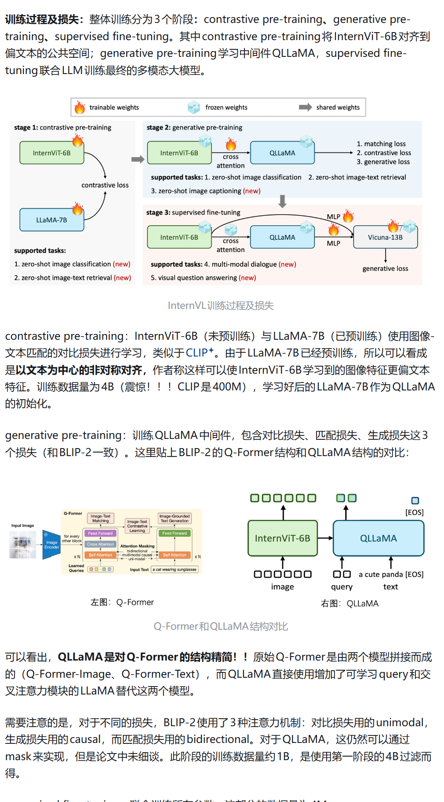
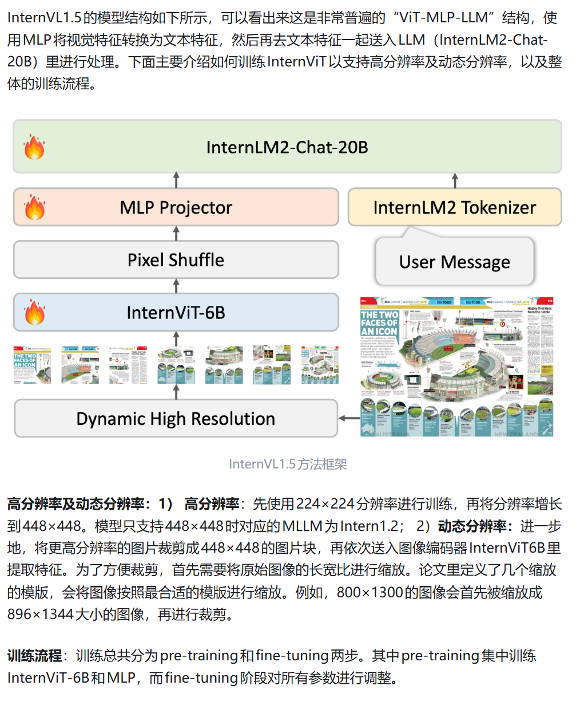
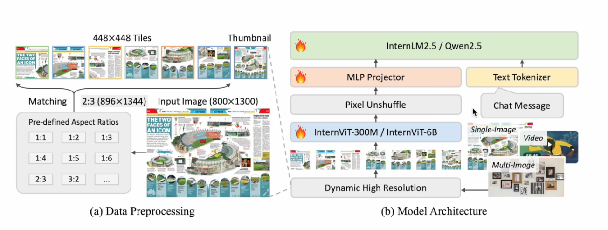
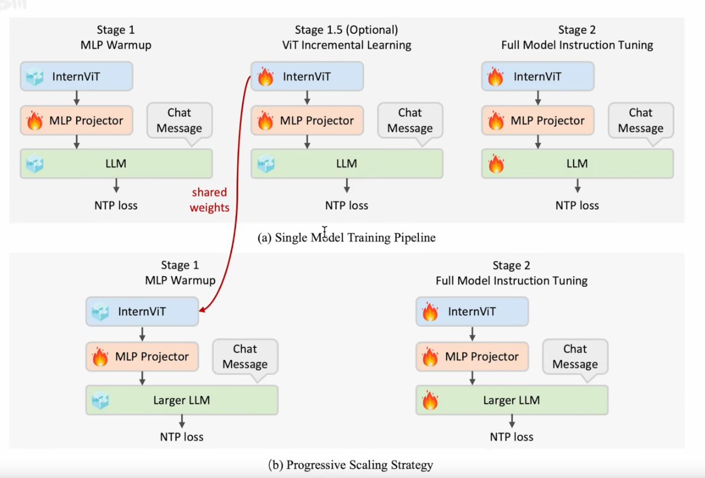
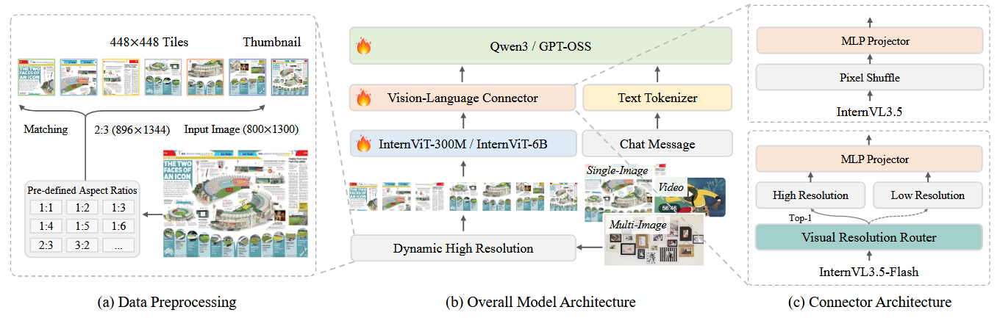
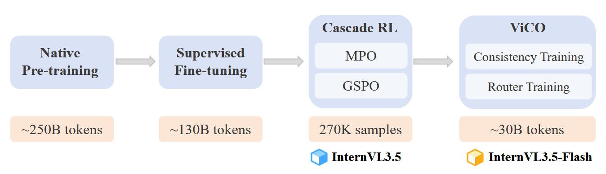

[(17 条消息) InternVL系列——InternVL、InternVL1.5、InternVL2、InternVL2.5 - 知乎](https://zhuanlan.zhihu.com/p/1893292536803612320)

[(17 条消息) InternVL 3.5重磅发布：推理性能提升16%，速度提升4倍 - 知乎](https://zhuanlan.zhihu.com/p/1943650328923837463)

# InternVL

# Intervl 1.5

### InternVL1.5 中的 pixel shuffle 是干嘛的

在 InternVL 1.5 中，**Pixel Shuffle**（准确来说是它的逆操作 **Pixel Unshuffle**，也叫 Space-to-Depth）的核心作用是 **视觉 Token 压缩**。

简单来说，它的目的是在保留高分辨率图像信息的同时，大幅减少进入大语言模型（LLM）的视觉 Token 数量，从而在“看得清”和“算得快”之间取得平衡。

------

### 1. 为什么需要它？

InternVL 1.5 支持**动态高分辨率**（最高支持 4K 图像输入）。

- 如果不进行压缩，一张 $448 \times 448$ 的图像经过视觉编码器（ViT）后会产生 **1024 个 Token**。
- 如果处理 4K 图像（切割成几十个切片），Token 数量会轻松突破 4 万个。
- 这会导致 LLM 的显存占用和计算延迟呈平方级增长，普通显卡根本跑不动。

### 2. 它是如何工作的？

Pixel Shuffle 操作会将相邻的 $2 \times 2$ 视觉标记（Token）“捏合”在一起：

- **空间维度减少**：将 $H \times W$ 的特征图在长和宽方向各缩小一倍（变为 $\frac{H}{2} \times \frac{W}{2}$）。
- **通道维度增加**：将原本分布在空间的 4 个像素的信息，叠放到通道维度（Channel）上。

**数据变化示例：**

1. **输入**：$32 \times 32$ 窗口的视觉特征（共 1024 个 Token）。
2. **操作**：执行 Pixel Unshuffle（步长为 2）。
3. **输出**：$16 \times 16$ 窗口的视觉特征（共 **256 个 Token**）。
4. **结果**：Token 数量减少到了原来的 **1/4**，但每个 Token 包含的信息量（特征维度）变成了原来的 4 倍。

### 3. InternVL 1.5 带来的收益

- **极高的压缩率**：将每个 $448 \times 448$ 切片的 Token 从 1024 减至 256。
- **保留细粒度特征**：相比于直接丢弃像素或进行池化（Pooling），Pixel Shuffle 是一种无损的重组方式，它只是改变了信息的排布，确保了 LLM 依然能感知到高分辨率下的细节（如文字、小物体）。
- **提升推理效率**：由于 Token 数量大幅减少，InternVL 1.5 可以在有限的显存内处理多达 40 个图像切片，实现真正的 4K 级理解。

------

**总结：**

InternVL 1.5 里的 Pixel Shuffle 就像是一个“压缩包生成器”，它把原本铺得很开的视觉信号浓缩成了更少、更精炼的 Token，让 LLM 能够高效地处理超高分辨率的图片。

您是在尝试基于 InternVL 1.5 进行部署优化，还是在研究其论文中的架构设计？我可以根据您的需求提供更具体的代码实现或参数配置建议。

### 我没明白的是，通道维度不就变成4倍了吗？这哪里压缩了

你观察得非常敏锐！这确实是很多人第一眼看 **Pixel Unshuffle**（Space-to-Depth）时最直观的疑惑：**“总的元素个数（$H \times W \times C$）没变，只是换了个位置，这怎么能叫压缩呢？”**

这里的“压缩”其实是指 **LLM（大语言模型）计算负担的压缩**。我们需要从两个维度来拆解这个“障眼法”：

------

### 1. 核心矛盾：Token 数量 vs. 特征长度

在 Transformer 架构中，计算量的分布是不均匀的：

- **Attention 机制的平方律**：计算量与 **Token 数量（序列长度 $N$）** 的平方成正比（$O(N^2)$）。
- **线性映射（MLP）的线性律**：计算量与 **通道维度（$D$）** 基本成线性关系。

**我们算一笔账：**

假设原始有 1024 个 Token，每个维度 1024。

- **如果不压缩**：Attention 计算量 $\approx 1024^2 = 1,048,576$ 单位。
- **通过 Pixel Unshuffle 压缩后**：Token 变成 256 个，维度变成 4096。
  - Attention 计算量 $\approx 256^2 = 65,536$ 单位。
  - **计算量直接减少了 16 倍！**

> **总结**：对于 LLM 来说，**“Token 多”比“Token 胖”要致命得多**。Pixel Shuffle 的本质是“牺牲通道宽度，换取序列长度的极速缩短”，从而让模型能吞下更多的图像切片。

------

### 2. 隐藏的“瘦身”步骤：线性投影（Linear Projection）

在 InternVL 的实际架构中，Pixel Unshuffle 并不是孤立存在的。它的背后通常紧跟着一个**线性层（Linear Layer/MLP）**。

1. **第一步（Unshuffle）**：把 $2 \times 2$ 的区域拼起来，通道从 $C$ 变成 $4C$。
2. **第二步（Projection）**：用一个线性层把 $4C$ 的维度重新投影回 LLM 的隐藏层维度 $D_{LLM}$（比如从 4096 压回到 1024 或 2048）。

**这时候，真正的“数据压缩”才发生：**

- **输入**：$1024 \text{ tokens} \times 1024 \text{ dims}$
- **输出**：$256 \text{ tokens} \times 1024 \text{ dims}$
- **结果**：总数据量真正减少到了原来的 **1/4**。

------

### 3. 为什么不直接用池化（Pooling）？

你可能会问：既然嫌 Token 太长，我直接用 Average Pooling 把 $2 \times 2$ 变成 $1 \times 1$ 不就行了吗？

- **Pooling 是有损的**：它会把四个像素的信息强行取平均，丢掉细节。
- **Pixel Unshuffle 是无损重排**：它把空间上的 4 个像素排排坐，放进通道里。信息一个没丢，只是换了个姿势。**这保证了 LLM 如果想看细节，可以通过权重从那 $4 \times C$ 的维度里精准地把信息提取出来。**

------

### 总结对比

| **特性**          | **原始 Token** | **Pixel Unshuffle 后的 Token** | **收益**                              |
| ----------------- | -------------- | ------------------------------ | ------------------------------------- |
| **空间分辨率**    | $H \times W$   | $(H/2) \times (W/2)$           | 序列变短，显存压力锐减                |
| **Token 数量**    | $N$            | $N/4$                          | **Attention 计算快 16 倍**            |
| **通道信息量**    | $C$            | $4C$                           | 保留了原始的所有细节                  |
| **KV Cache 占用** | 高             | **低**                         | 同样的显存能支持更长的上下文/更多图片 |

所以，这是一种**“用空间（通道）换时间（计算速度）”**的精妙权衡。

你是想在自己的模型里实现类似的 Token 压缩方案，还是在排查 InternVL 推理时的显存占用问题？我可以帮你写一段 PyTorch 的实现代码。

# Internvl 2.5

InternVL2.5在训练流程上分为3个阶段，

Stage1训练MLP：对齐vit和大语言模型

Stage1.5训练InternViT+MLP：让vit提取更精细的特征，使用next token predicting损失

Stage2训练所有参数：sft全参指令微调

另外，InternVL2.5使用CoT进行了test time scaling，该方法简单有效，能明显提升模型的性能：

渐进式训练：现在小的llm上训vit，之后直接移到大的llm上

这两张图片出自 **InternVL 2.5** 的技术报告。这一章节（3.4 节）主要分享了为了让模型更“耐造”（鲁棒性）以及在不同长度回答中表现更平衡，他们在训练中使用的两个“独门小技巧”。

以下是详细的翻译与深度解读：

------

## 3.4 训练增强 (Training Enhancements)

为了提升模型对真实世界场景的适应能力和整体表现，文中引入了两项核心技术：**随机 JPEG 压缩** 和 **损失重加权**。

### 1. 随机 JPEG 压缩 (Random JPEG Compression)

- **翻译：** 为了避免训练过程中的过拟合，并增强模型的实战表现，我们采用了一种能保留空间信息的增强技术：JPEG 压缩。具体而言，我们会随机对图像应用质量等级在 75 到 100 之间的 JPEG 压缩，以模拟互联网图片中常见的画质降级。
- **解读：** * **为什么要这么做？** 实验室里的基准测试集通常都是高清图，但用户实际上传的图片往往经过了多次压缩，满是噪点。
  - **核心逻辑：** 通过这种数据增强，模型学会了“穿透噪点看本质”，不再因为画质的一点点劣化就产生幻觉，提高了模型在处理低质量、高压缩比图片时的稳定性。

------

### 2. 损失重加权 (Loss Reweighting) —— 关键部分

这是为了解决 **“回复长度”** 带来的偏差问题。

#### A. 两种传统策略的优缺点

对于下个 Token 预测（NTP）任务，业界通常有两种加权方案（见公式 5）：

1. **Token 平均 (Token Averaging, $w_i = \frac{1}{x^0} = 1$)：**
   - **做法：** 每一个 Token 贡献的损失权重是一样的。
   - **问题：** 梯度会偏向**长回复**。因为长回复包含的 Token 多，总损失就大，模型会过度学习长回复的风格。这会导致模型在基准测试（Benchmark）中表现下降，因为它变得啰嗦但重点不突出。
2. **样本平均 (Sample Averaging, $w_i = \frac{1}{x^1} = \frac{1}{x}$)：**
   - **做法：** 无论回复多长，每个样本（Sample）的总权重是一样的。
   - **问题：** 梯度会偏向**短回复**。因为短回复的每个 Token 拿到的权重（$1/x$）比长回复高得多。这会导致模型倾向于给出简短、敷衍的回答，用户体验（User Experience）变差。

#### B. 论文的创新点：平方根平均 (Square Averaging)

**公式参照图片 2：**

为了平衡长短回复的贡献，作者提出了一种“折中”方案：

$$w_i = \frac{1}{x^{0.5}} = \frac{1}{\sqrt{x}}$$

- **翻译：** 这种被称为“平方根平均”的方法，平衡了不同长度回复对模型的贡献度。
- **解读（为什么这很聪明）：**
  - 它处于 $x^0$（不降权）和 $x^1$（全降权）之间。
  - **数学直觉：** 如果一个回复长度翻了 4 倍，在 $x^{0.5}$ 策略下，它的总权重只会翻 2 倍（$4 \times \frac{1}{\sqrt{4}}$），而不是翻 4 倍或保持不变。
  - **结果：** 既保证了模型在 Benchmark 上的高分（不过度倾向长文），又保住了用户体验（不至于只说短句）。

这是一个非常深刻的问题，触及了深度学习中**损失函数归一化（Loss Normalization）**的底层逻辑。

你说的“平均到 Token 上”通常是指我们在代码里常用的 `reduction='mean'`。但问题的核心在于：**这个“平均”是针对整个 Batch（批次）的，还是针对单个 Sample（样本）的？**

让我们通过一个简单的例子拆解一下，你就明白为什么“Token 平均”会导致梯度偏向长回复了。

------

### 1. 场景设定

假设一个训练 Batch 里只有两个样本：

- **样本 A（长回复）：** 100 个 Token。
- **样本 B（短回复）：** 10 个 Token。
- **总 Token 数：** 110 个。

### 2. 策略一：Token Averaging（Token 平均）

这是绝大多数深度学习框架（如 PyTorch 的 `CrossEntropyLoss`）的默认行为。

- **计算逻辑：** 把 Batch 里所有 Token 的 Loss 加起来，然后除以总数（110）。
- **总损失公式：** $L = \frac{\sum Loss_A + \sum Loss_B}{110}$
- **权重占比：**
  - 样本 A 贡献了 **100/110 (约 91%)** 的梯度。
  - 样本 B 只贡献了 **10/110 (约 9%)** 的梯度。

**结果：** 在这次参数更新中，模型有 91% 的动力是在学习如何预测样本 A。如果样本 A 风格很啰嗦，模型就会产生强烈的“长回复”偏向。

------

### 3. 策略二：Sample Averaging（样本平均）

为了公平，我们让每个样本在 Batch 里的权重一样。

- **计算逻辑：** 先分别计算 A 和 B 的平均 Loss，再把这两个平均值加起来除以 2。
- **总损失公式：** $L = \frac{1}{2} \left( \frac{\sum Loss_A}{100} + \frac{\sum Loss_B}{10} \right)$
- **权重占比：** 样本 A 和样本 B 各占 **50%**。

**隐藏的问题：**

虽然样本公平了，但**样本 B 的每一个 Token** 的权重（1/20）是**样本 A 每一个 Token** 权重（1/200）的 **10 倍**！

这会导致模型对短样本里的每一个字极其敏感，容易被短样本里的噪点干扰，产生所谓的“模型变懒”或倾向于给出极简回答。

------

### 4. 策略三：InternVL 2.5 的 Square Averaging（平方根平均）

作者提出的 $w_i = 1/\sqrt{x}$ 实际上是在做一个**非线性的平衡**。

我们再看 A (100 tokens) 和 B (10 tokens)：

- **样本 A 的总权重：** $100 \times \frac{1}{\sqrt{100}} = 100 \times 0.1 = 10$
- **样本 B 的总权重：** $10 \times \frac{1}{\sqrt{10}} \approx 10 \times 0.316 \approx 3.16$

**对比效果：**

- **Token 平均：** 比例是 **10 : 1**（长样本完全主导）。
- **样本平均：** 比例是 **1 : 1**（短样本的单个 Token 权重过高）。
- **平方根平均：** 比例是 **3.16 : 1**。

**总结结论：**

平方根平均承认**“长回复包含的信息量确实更多，应该多占一点权重”**，但它**“通过开方抑制了长回复权重的线性膨胀”**。

------

### 为什么说“模型会过度学习长回复的风格”？

因为在第一种（默认）模式下，长回复对梯度的贡献是压倒性的。

模型在优化过程中非常聪明，它发现：**“既然 90% 的 Loss 都来自那个长样本，我只要学会把句子写长、写得像那个长样本的语气，Loss 就能下降得最快。”** 这就是为什么很多模型微调后变得废话连篇（Verbosity Bias）的根本数学原因。

**这个解释能解开你的疑惑吗？你之前在研究的 GRPO 实际上是在一个更高维度（一组采样回复）做平均，它其实也面临类似的“长度偏差”挑战。**

## InternVL3

根据图片 4.1 节的内容，MPO（Mixed Preference Optimization）并不是单一的奖励，而是由**三个损失函数**加权组合而成的复合目标。它的核心公式（Equation 3）定义如下：

$$\mathcal{L} = w_p\mathcal{L}_p + w_q\mathcal{L}_q + w_g\mathcal{L}_g$$

这三个部分分别解决不同的问题，我结合图片中的公式为你拆解：

------

### 1. 偏好损失 (Preference Loss) —— $\mathcal{L}_p$

**公式参照图中的 (4)：** 这是标准的 **DPO** 损失。

- **它的作用：** 学习**相对偏好**。
- **逻辑：** 它通过对比“被选中的回答 $y_c$”和“被拒绝的回答 $y_r$”的概率比值，让模型学会“哪个更好”。
- **解决的问题：** 建立模型最基本的判别标准。

### 2. 质量损失 (Quality Loss) —— $\mathcal{L}_q$

**公式参照图中的 (5)(6)(7)：** 作者采用了 **BCO (Binary Classifier Optimization)**。

这是 MPO 里的一个亮点，它和 DPO 不同，它是**独立计算** $y_c$ 和 $y_r$ 的：

- **它的作用：** 学习**绝对质量**。
- **关键变量 $\delta$：** 你在图片 2 能看到，$\delta$ 是之前奖励的移动平均值（reward shift）。
- **逻辑：** 它把模型变成一个二分类器。公式 (6) 让 $y_c$ 尽量向 1 靠近，公式 (7) 让 $y_r$ 尽量向 0 靠近。
- **解决的问题：** 很多时候 DPO 只知道 A 比 B 好，但不知道 A 其实也很烂。$\mathcal{L}_q$ 强制模型理解每一个回答的绝对好坏。

### 3. 生成损失 (Generation Loss) —— $\mathcal{L}_g$

**公式参照图中的 (8)：** 这实际上就是 **SFT（监督微调）损失**。

- **它的作用：** 约束**生成过程**。
- **逻辑：** 对被选中的优质回答 $y_c$ 计算负对数似然（经过长度 $|y_c|$ 归一化）。
- **解决的问题：** 论文开头提到，只用 DPO 训练模型容易导致“重复输出”或“推理逻辑崩坏”（repetitive responses / fail to generate reasonable rationales）。加入 $\mathcal{L}_g$ 能稳住模型的生成能力，确保它输出人话。

------

### 总结：为什么要“Mixed”这三个东西？

这张图里的逻辑非常清晰：

1. **DPO ($\mathcal{L}_p$)** 负责**排序**（A > B）。
2. **BCO ($\mathcal{L}_q$)** 负责**定性**（A 是好的，B 是坏的）。
3. **SFT ($\mathcal{L}_g$)** 负责**保底**（说话要有逻辑，别复读）。

通过 Equation (3) 的加权求和，MPO 实现了在提升多模态推理能力的同时，有效抑制了模型在偏好对齐中容易出现的“退化”和“幻觉”问题。

**你看图片里的那个 $\delta$ 参数（Equation 7 之后），它在稳定训练中起到了关键作用，需要我再结合 BCO 的原理帮你深入解释一下这个“奖励漂移”吗？**

## V2PE

这篇文章《V2PE: Improving Multimodal Long-Context Capability of Vision-Language Models with Variable Visual Position Encoding》（ICCV 2025）非常有意思，它精准地切中了当前多模态大模型（VLM）的一个“隐疾”：**视觉 Token 太占位置了，导致模型在长文本下很快就“断片”了。**

如果你之前关注过如何给长文本 LLM 扩容（比如插值法、NTK-aware RoPE），那么 V2PE 的逻辑你会觉得非常直观且高级。

------

## 1. 核心痛点：视觉 Token 的“位置通胀”

目前的 VLM（如 InternVL、LLaVA）通常把图像切成成百上千个 Token，然后像排队一样和文本 Token 混在一起。

- **问题：** 默认情况下，每个 Token 的位置索引（Position Index）都是 **+1** 递增的。
- **后果：** 如果你放 10 张高分图像，视觉 Token 瞬间就能把位置索引推到数万。对于一个只在 32k 长度训练过的模型来说，位置索引一旦“爆表”（超出训练窗口），注意力机制就会失效，模型开始胡言乱语。

**V2PE 的洞察：** 视觉像素具有**连续性**和**冗余性**。相邻的两个图像 Token 包含的信息密度远低于两个相邻的单词。因此，给每个视觉 Token 分配一个完整的 $+1$ 位置增量，实在是太奢侈且没必要了。

------

## 2. V2PE 是怎么做的？（核心机制）

V2PE 提出了**可变视觉位置编码（Variable Visual Position Encoding）**。其核心逻辑可以用一个简单的递推公式表示：

设第 $i$ 个 Token 的位置索引为 $pos_i$，增量为 $\Delta_i$：

$$pos_i = pos_{i-1} + \Delta_i$$

在 V2PE 中，这个 $\Delta_i$ 不再恒等于 1，而是取决于 Token 的模态：

- **如果是文本 Token：** $\Delta_i = 1$ （保持语言逻辑的严密性）。
- **如果是视觉 Token：** $\Delta_i = \delta$，其中 **$0 < \delta \le 1$**。

### 为什么叫 "Variable" (可变)？

在训练阶段，作者并不是固定死一个 $\delta$（比如 0.5），而是**动态随机采样**不同的 $\delta$。

这样训练出来的模型就像学会了“缩骨功”，能够适应不同密度的视觉位置信息。在推理阶段，它可以根据输入的总长度，灵活调整 $\delta$ 的大小，从而把百万级别的序列“压缩”到模型能处理的位置范围内。

------

## 3. 这篇文章的三个关键贡献

### A. 突破 1M Token 的处理能力

通过这种“位置压缩”策略，研究团队在 **256k** 长度的数据上微调 InternVL2-2B，结果模型在推理时竟然能稳健地处理 **1M（一百万）** Token 的多模态输入。这在处理超长视频或海量文档图片时非常强大。

### B. 缓解“大海捞针”中的注意力弥散

在多模态大海捞针（MM-NIAH）实验中，传统的 DPO 或线性插值在超长距离下表现堪忧。V2PE 通过减小视觉增量，让模型即便在序列末尾，也能精准地把注意力锚定在对应的图像特征上，而不是因为位置索引太离谱而“迷失”在注意力矩阵里。

### C. 保持短文本性能

很多做长文本优化的方法（如单纯的插值）会损伤模型在短文本上的灵敏度。由于 V2PE 采用了**变量训练**，模型在短上下文（$\delta=1$）和长上下文（$\delta<1$）之间切换得非常顺滑，实现了“既要又要”。

------

## 4. 总结与思考

| **维度**         | **传统 VLM 位置处理**    | **V2PE 处理方式**         |
| ---------------- | ------------------------ | ------------------------- |
| **位置增量**     | 恒定为 1                 | 文本 = 1, 视觉 = $\delta$ |
| **位置索引增长** | 极快（随图像数线性飙升） | 缓慢且受控                |
| **长文本泛化**   | 严重依赖外推技术，易崩溃 | 具备天然的“位置压缩”能力  |
| **视觉冗余利用** | 未利用                   | 深度利用视觉像素的连续性  |

**一句话总结：** V2PE 给视觉 Token 买了张“打折票”，让同样的位置空间能挤下更多的图像。

**由于你之前在做林火监测和无人机系统，这个技术其实非常实用——比如你需要模型同时处理几十架无人机传回的长时间序列巡检画面时，V2PE 这种能抗住超长视觉上下文的方案会是首选。你想了解它是如何具体实现这种“动态采样 $\delta$”的训练细节吗？**

非常精准的问题。直接给出结论：**InternVL 系列（包括最新的 InternVL 2/2.5）默认使用的并不是 M-RoPE，它依然沿用的是最基础的 1D RoPE（旋转位置编码）。**

**M-RoPE** 是 **Qwen2-VL** 的招牌创新，而 InternVL 处理多模态位置的方式走的是另一条技术路线。

我们可以从以下两个层面拆解 InternVL 的位置编码逻辑：

------

### 1. Vision Encoder 层面：绝对位置编码

InternVL 的视觉核心是 **InternViT-6B**。

- 在视觉特征提取阶段，它使用的是**传统的 2D 绝对位置编码（Absolute PE）**。
- 因为它采用了 **Dynamic Resolution（动态分辨率）** 方案，会将一张大图切成多个 $448 \times 448$ 的小方块（Tiles）。每一个小方块内部，Token 都有自己的 2D 坐标。

### 2. LLM 层面：1D RoPE + 线性平铺

当视觉 Token 经过 MLP 投影层进入 LLM（如 InternLM2 或 Qwen2）时，InternVL 的处理非常“粗暴”且直接：

- **顺序排列：** 它直接将这些动态切片的视觉 Token 按照从左到右、从上到下的顺序，像文本单词一样**排成一队**。
- **1D RoPE：** 既然排成了一队，LLM 就直接给它们套用标准的 **1D RoPE**。每一个视觉 Token 占用一个连续的整数位置索引（$pos=1, 2, 3, \dots$）。

> **这就解释了为什么会有 V2PE 这篇论文：**
>
> 正因为 InternVL 这种“线性平铺”的方式让位置索引增加得太快（一张图可能占 1024 个位置索引），导致它很难处理超长图或多图序列。V2PE 就是针对 InternVL 这种 **1D 线性分配** 的缺陷进行的改进。

------

### 3. InternVL vs. Qwen2-VL (M-RoPE) 的区别

| **特性**           | **InternVL (2 / 2.5)**                      | **Qwen2-VL**                                            |
| ------------------ | ------------------------------------------- | ------------------------------------------------------- |
| **位置编码类型**   | **1D RoPE** (来自 LLM 基座)                 | **M-RoPE** (多维旋转位置编码)                           |
| **位置感知的逻辑** | 靠视觉 Token 的**排列顺序**。               | 靠 **(t, h, w)** 三个维度的明确坐标。                   |
| **处理图像的方式** | 动态切片（Dynamic Tiling）。                | 原始纵横比（Naive Dynamic Resolution）。                |
| **长文本压力**     | **大**。视觉 Token 消耗了大量线性位置额度。 | **小**。M-RoPE 通过多维坐标极大节省了 1D 位置索引空间。 |

------

### 4. 总结

InternVL 并没有使用 M-RoPE 那种复杂的 3D 坐标分解，它依然是把多模态信息看作一个**长长的、一维的字符串**。

- **InternVL 的优势：** 架构非常简洁，能够直接白嫖 LLM 基座（如 InternLM2）强大的长文本预训练能力，而不需要为了适配 3D 位置编码去大幅修改模型结构。
- **InternVL 的劣势：** 位置索引“通胀”严重，这也是为什么你看到的 **V2PE** 论文要通过调整 $\Delta$（步长）来给视觉 Token 瘦身的原因。

**如果你在做自动驾驶的 3D 重建或视频分析（这正是你之前的研究方向），M-RoPE 的空间感知力其实更强；但如果你需要处理海量的文档图片，InternVL 这种基于 1D 扩容（结合 V2PE 改进）的方案在工程上往往更稳定。你想看下 InternVL 源码里是怎么拼接这些位置 ID 的吗？**

## InternVL3.5

InternVL3.5  采用了与之前版本相同的“ViT–MLP–LLM”范式。基于InternVL3.5，我们进一步引入InternVL3.5-Flash，该系统**增加了额外的视觉分辨率路由器（ViR）**，可**动态选择每个图像补丁的合适压缩率**（例如1/4或1/16）。与仅从图像宽度和高度角度分割图像补丁的动态高分辨率不同，我们提出的 ViR 进一步**从语义内容角度引入了适应性**。

（1）原生预训练以实现视觉语言对齐，（2）监督微调以适应下游任务，（3）级联强化学习以提升推理能力。InternVL3.5-Flash是InternVL3.5的高效版本，通过一致性训练和路由器训练进一步集成了视觉分辨率路由器（ViR）

我们在InternVL3.5中提出了三项创新设计，包括级联强化学习（Cascade RL）、视觉分辨率路由器（ViR）动态选择视觉token的最低分辨率，从而实现更好的推理效率，和解耦视觉语言部署（DvD）。这些技术显著提升了InternVL3.5的能力和效率，为社区提供了实用建议。

三阶段后训练：

1、监督式微调（SFT），保持与预训练相同的训练目标，但利用更高质量的对话数据进一步增强模型的能力。

2、级联强化学习（Cascade RL），结合离线和在线强化学习方法的优势，促进推理能力。

offline-RL:MPO

online-RL:GSPO

3、视觉一致性学习（ViCO）旨在将视觉分辨率路由器（ViR）集成到InternVL3.5中，通过最小化不同视觉压缩率的输出差异来构建InternVL3.5-Flash。

这张图片展示的是 **InternVL 3.5-Flash** 的核心改进技术：**视觉一致性学习 (Visual Consistency Learning, ViCO)**。

它的核心目标是：**在不损失性能的前提下，通过减少视觉 Token 的数量（减少 50%）来大幅降低推理成本。**

为了实现这个目标，作者设计了一个名为 **ViR (Visual Resolution Router)** 的路由机制，让模型学会**自适应地选择图像块的分辨率**。整个过程分为两个阶段：

------

### 第一阶段：一致性训练 (Consistency Training) —— 练“内功”

**目标：让模型对“模糊”的图片（压缩后的 Token）也有同样的理解力。**

- **逻辑：** 引入一个额外的参考模型（Frozen Reference Model），它总是看最高清的图（每个图像块 256 个 Token）。
- **公式 (7)：** 这是一个 **KL 散度损失函数**。
  - 它让正在训练的模型（$\pi_{\theta_{policy}}$）去模仿参考模型（$\pi_{\theta_{ref}}$）的输出分布。
  - 训练时，会对图像块进行随机压缩（$\xi$ 采样自 1/4 或 1/16）。
  - **通俗解释：** 强制模型练习：无论我给你看的是高清图（256 Token）还是缩略图（64 Token），你给我的回答概率分布必须是一致的。这保证了模型在低分辨率下也不会“乱说话”。

------

### 第二阶段：路由训练 (Router Training) —— 练“眼力”

**目标：训练一个“路由器”（ViR），让它决定哪些图块可以压缩，哪些必须高清。**

在这个阶段，主模型（ViT 和 LLM）是冻结的，只训练 **ViR**（一个二分类器）。

- **损失比率计算 (公式 8)：** 计算同一个图块在“压缩后”与“压缩前”的损失比值 $r_i$。

  $$r_i = \frac{\mathcal{L}_{ViCO}(y_i | I_{\frac{1}{16}})}{\mathcal{L}_{ViCO}(y_i | I_{\frac{1}{4}})}$$

  - 这个比值衡量了**压缩对信息量的损害程度**。如果 $r_i$ 很大，说明压缩后模型“变蠢”了，这个图块很重要。

- **生成标签 (公式 9)：**

  - 如果 $r_i < \tau$：说明压缩对理解几乎没影响，标签设为 **0**（可以用 64 Token）。
  - 如果 $r_i \geq \tau$：说明压缩导致理解能力大幅下降，标签设为 **1**（必须用 256 Token）。
  - **动态阈值 $\tau$：** 它不是死板的数字，而是根据历史数据的分位数动态计算的，确保正负样本平衡。

------

### 总结：ViCO 为什么厉害？

1. **省钱省时间：** 它成功减少了 **50% 的视觉 Token**，这意味着推理速度变快，显存占用变低。
2. **几乎无损：** 如图末尾所说，它在维持了原始模型近 **100% 性能** 的同时实现了减负。
3. **聪明分配：** 它不是盲目地对全图降采样，而是把“预算”花在刀刃上。比如：
   - 对于大面积的背景（草地、天空），路由器会选择 **64 Token**（压缩）。
   - 对于关键的文字、人脸或细小物体，路由器会选择 **256 Token**（保持高清）。

**这个逻辑其实和你之前关注的 V2PE（变步长位置编码）有异曲同工之妙，都是在想办法“节省”视觉位置额度。你想了解这个 ViR 路由在实际推理时是怎么动态生效的吗？**