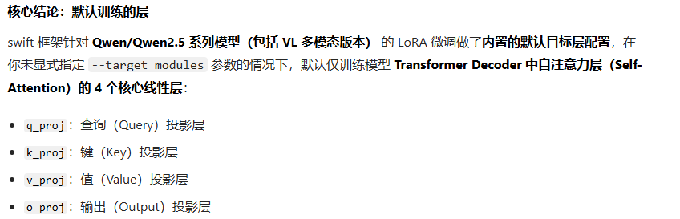

# LoRA 核心参数调优：从原理到实战

### **通过低秩分解来模拟参数的改变量，从而以极小的参数量来实现大模型的间接训练**

你想了解 LoRA（Low-Rank Adaptation，低秩适配）微调中的核心参数，包括每个参数的含义、合理取值范围，以及这些参数如何影响大模型微调的效果和效率——这是大模型轻量化微调中最关键的部分，我会结合实际应用场景（如 Transformer 类大模型）把每个参数讲透。

## 一、先铺垫：LoRA 核心原理（理解参数的基础）

LoRA 的核心是**冻结原模型所有参数**，仅在指定层（如注意力层的 Q/K/V 投影层）插入一对低秩矩阵  $A$ （维度  $d \times r$ ）和  $B$ （维度  $r \times d$ ），训练时只更新这两个矩阵。最终输出为：

 $h = W_{\text{pre}}x + BAx \cdot \frac{\alpha}{r}$ 

其中  $W_{\text{pre}}$  是原模型的预训练权重， $r$  是低秩矩阵的秩， $\alpha$  是缩放系数。所有参数都是围绕“低秩矩阵的训练”和“适配原模型”设计的。

## 二、LoRA 核心参数（必配，决定微调效果）

### 1. `r`（rank，秩）—— 最核心的参数

- **含义**：低秩矩阵  $A/B$  的秩，决定 LoRA 可学习的“容量”（r 越小，参数越少，拟合能力越弱；r 越大，参数越多，拟合能力越强）。

- **作用**：控制 LoRA 模块的表达能力，是平衡“微调效果”和“参数规模”的核心。

- **取值建议**：

    - 轻量微调（如小数据集、简单任务：分类、短文本生成）： $r=4, 8$ （参数极少，不易过拟合）；

    - 中等复杂度任务（如摘要、翻译）： $r=16$ （性价比最高）；

    - 复杂任务（如长文本生成、多轮对话）： $r=32, 64$ （需更大容量，但参数会显著增加）。

- **注意**： $r$  不宜超过 64，否则 LoRA 失去“低秩”优势，参数规模接近全量微调。

### 2. `alpha`（缩放系数）—— 平衡更新幅度

- **含义**：对 LoRA 模块的输出  $BAx$  进行缩放，公式中  $\frac{\alpha}{r}$  是为了让  $\alpha$  与  $r$  解耦（调整 r 时无需同步调整 alpha）。

- **作用**：控制 LoRA 模块对原模型输出的“贡献度”——alpha 越大，LoRA 调整的幅度越大。

- **取值建议**：

    - 通常设为与  $r$  相等（如  $r=8$  则  $\alpha=8$ ， $r=16$  则  $\alpha=16$ ），这是行业通用默认值；

    - 若微调后效果过拟合，可适当减小 alpha（如  $\alpha=r/2$ ）；若效果不足，可增大（如  $\alpha=2r$ ）。

### 3. `dropout`（LoRA Dropout）—— 防止过拟合

- **含义**：对输入到 LoRA 矩阵  $A$  的特征进行随机丢弃的概率。

- **作用**：减少过拟合，尤其在小数据集微调时效果显著。

- **取值建议**：

    - 小数据集（<1 万条）： $0.1 \sim 0.2$ ；

    - 中等数据集（1~10 万条）： $0.05 \sim 0.1$ ；

    - 大数据集（>10 万条）： $0.0$ （无需 dropout）。

### 4. `target_modules`（目标模块）—— 指定微调层

- **含义**：指定对原模型的哪些层插入 LoRA 模块，是影响微调效果的关键（不同模块的微调收益差异极大）。

- **作用**：聚焦模型的核心决策层，避免无意义的参数训练。

- **取值建议**（Transformer 大模型通用）：

|    模型类型|    推荐 target_modules|    原因|
|---|---|---|
|    Llama/LLaMA2|    ["q_proj", "k_proj", "v_proj"]|    注意力层的 Q/K/V 投影层是语义理解的核心，微调收益最高|
|    GPT 系列|    ["c_attn"]（包含 Q/K/V）|    GPT 注意力层的统一命名|
|    复杂任务进阶|    ["q_proj", "k_proj", "v_proj", "o_proj", "gate_proj"]|    加入输出层（o_proj）和 MLP 层（gate_proj），效果更好但参数稍多|
- **注意**：避免全量模块（如所有线性层），否则 LoRA 失去轻量化优势。

## 三、LoRA 进阶参数（可选，适配不同任务）

### 1. `bias`（偏置项训练）

- **含义**：指定是否训练模型的偏置项（bias）。

- **取值选项**：

    - `"none"`（默认）：不训练任何偏置项，参数最少，推荐；

    - `"all"`：训练所有层的偏置项，参数略有增加；

    - `"lora_only"`：仅训练 LoRA 模块相关的偏置项（极少用）。

- **建议**：99% 场景选 `"none"`，仅当微调后效果极差时尝试 `"all"`。

### 2. `task_type`（任务类型）

- **含义**：指定微调的任务类型，PEFT 库（主流 LoRA 实现）会根据该参数自动适配输出层和损失函数。

- **核心取值**：

    - `"CAUSAL_LM"`：因果语言模型（如文本生成、对话，最常用）；

    - `"SEQ2SEQ_LM"`：序列到序列模型（如翻译、摘要）；

    - `"SEQ_CLS"`：序列分类（如情感分析、文本分类）；

    - `"TOKEN_CLS"`：Token 分类（如命名实体识别）。

### 3. `modules_to_save`（额外保存的模块）

- **含义**：指定除 LoRA 模块外，需要微调的额外模块（通常是任务专属层）。

- **使用场景**：

    - 分类任务：保存分类头（如 `"classifier"`）；

    - 多模态任务：保存视觉-文本融合层。

- **示例**：`modules_to_save=["score"]`（微调评分任务的评分层）。

### 4. `rank_pattern`（分模块指定秩）

- **含义**：为不同的 target_modules 指定不同的  $r$ ，精细化控制。

- **示例**：`rank_pattern={"q_proj": 16, "k_proj": 8, "v_proj": 8}`（Q 层用更大的秩，K/V 层用小秩）。

- **适用场景**：对微调效果要求极高的定制化场景。

## 四、实战代码示例（PEFT + HuggingFace，可直接运行）

用主流的 PEFT 库（HuggingFace 官方 LoRA 实现）演示核心参数配置，以 Llama2-7B 微调为例：

```Python

```

## 五、参数调优建议（新手必看）

1. **先固定核心参数**：新手先设  $r=8$ 、 $\alpha=8$ 、dropout=0.1、target_modules=["q_proj", "k_proj", "v_proj"]，跑通基线；

2. **调优顺序**：先调  $r$ （4→8→16）→ 再调 alpha（与 r 匹配）→ 最后调 dropout 和 target_modules；

3. **避免过度调优**： $r$  超过 32 后，效果提升边际递减，但训练时间/显存会显著增加；

4. **数据集适配**：小数据集（<1 万）用小 r（4/8）+ 高 dropout（0.1~0.2）；大数据集用 r=16 + dropout=0.0。

---

### 总结

1. **核心参数**： $r$ （秩）决定 LoRA 容量， $\alpha$ （缩放）平衡更新幅度，`target_modules` 指定微调层，这三个是决定 LoRA 效果的关键；

2. **通用配置**：轻量任务用  $r=8$ 、 $\alpha=8$ 、dropout=0.1、target_modules=Q/K/V，是性价比最高的默认值；

3. **调优原则**：以最小的  $r$  达到满意效果，优先保证轻量化，再逐步增大 r 提升效果。

如果需要针对具体任务（如文本分类、多轮对话）的 LoRA 参数配置清单，我可以进一步细化。


## swift框架默认训练什么层



训练261G，batch=1   推理90G，batch=2