# OpenClaw

Gateway 是 OpenClaw 的心脏，负责所有消息的接入、调度和状态管理。

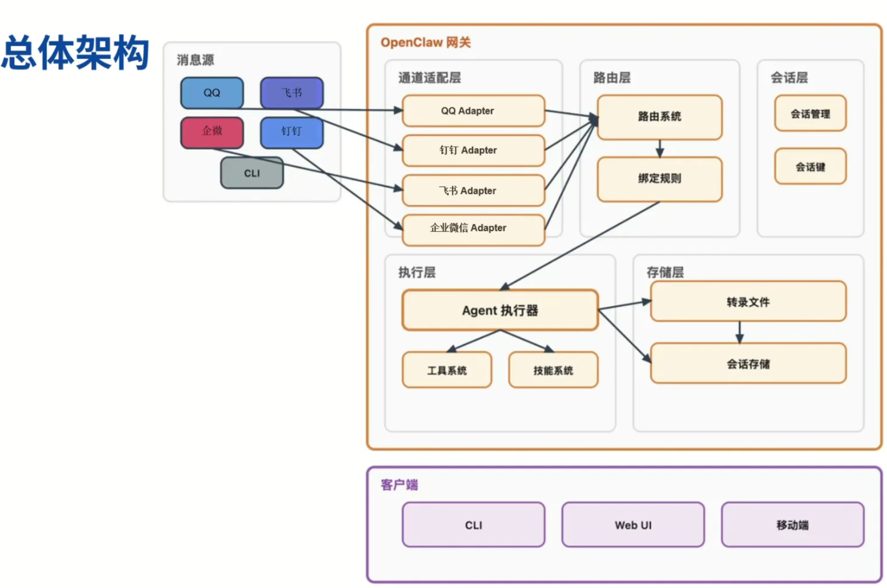


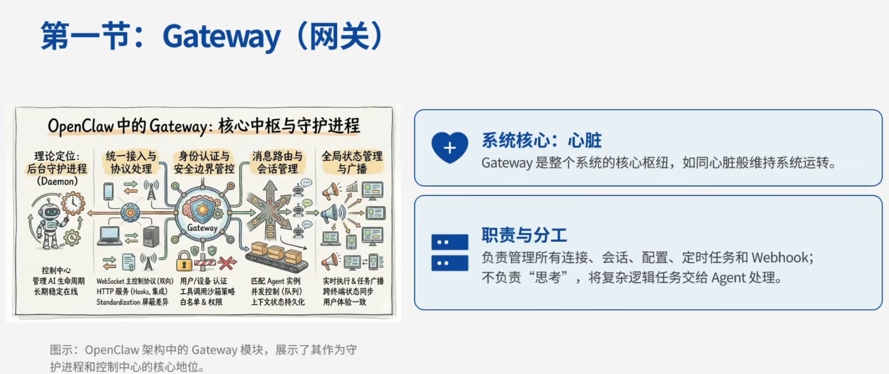

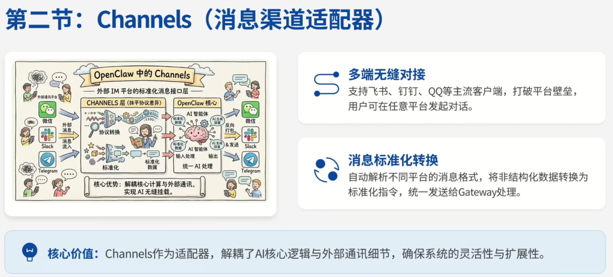

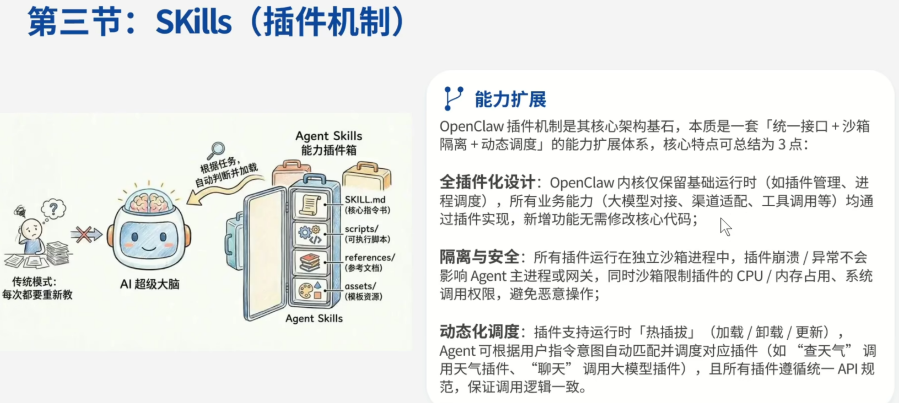

```text
<!-- SKILL.md -->
---
name: web_search
description: 在互联网上搜索信息
version: 1.0.0
author: community
---

# 网页搜索技能

## 使用说明

当用户要求搜索信息时，使用此技能。

## 工具

### search

搜索互联网获取最新信息。

参数：
- query: 搜索关键词
- limit: 返回结果数量（默认 5）

## 示例

用户：帮我搜索一下 React 19 的新特性
Agent：使用 search 工具，query = "React 19 new features"
```

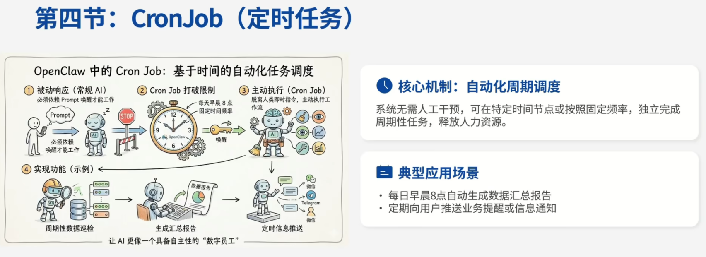

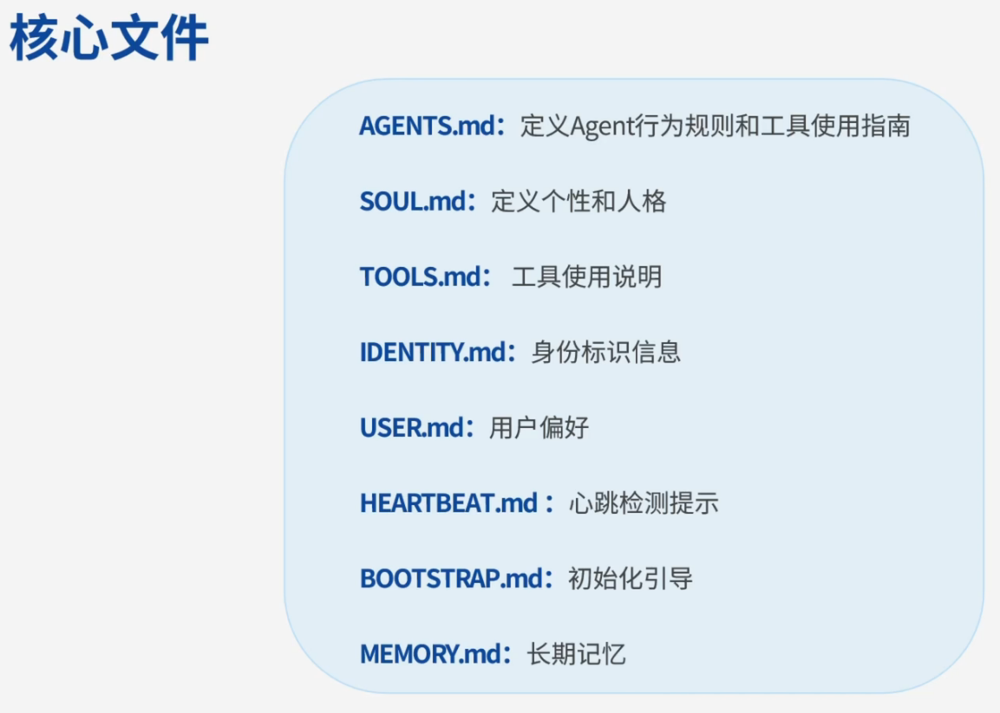

## 一、会话管理

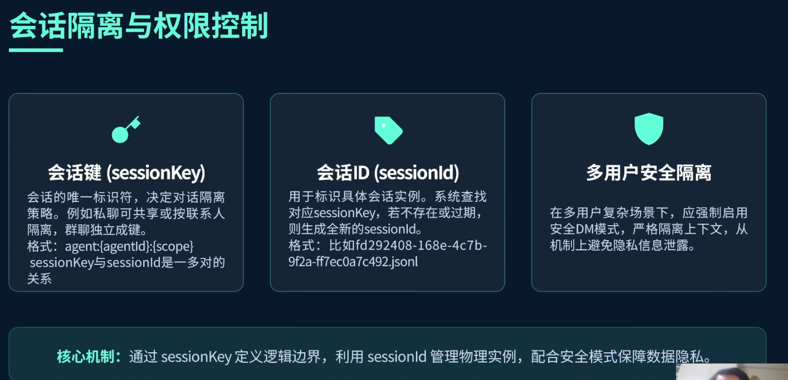

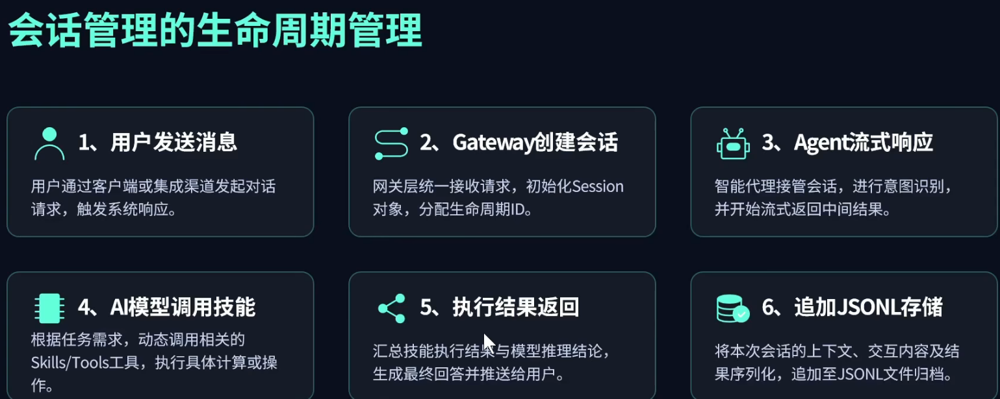

## 二、记忆系统

```text
 短期记忆（Session Memory）
 长期记忆（Long-term Memory）
```

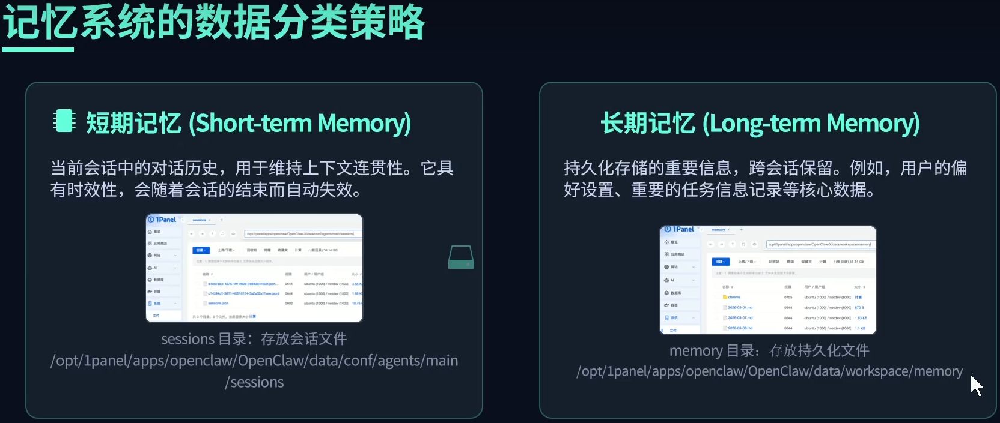

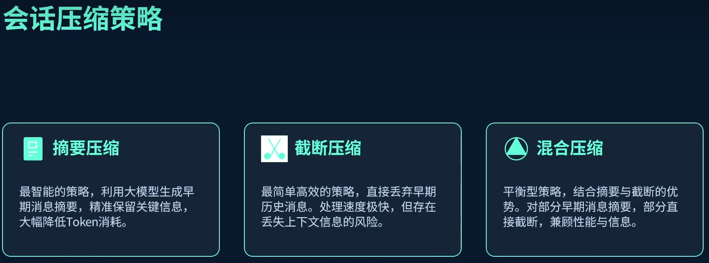

**较早期的摘要压缩，特别早期的直接截断**

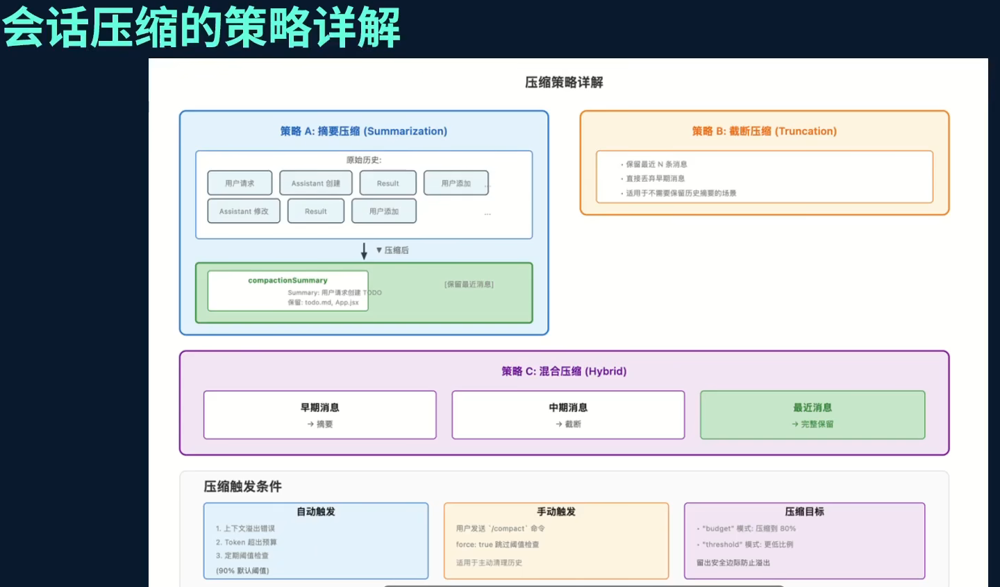

## 三、记忆系统

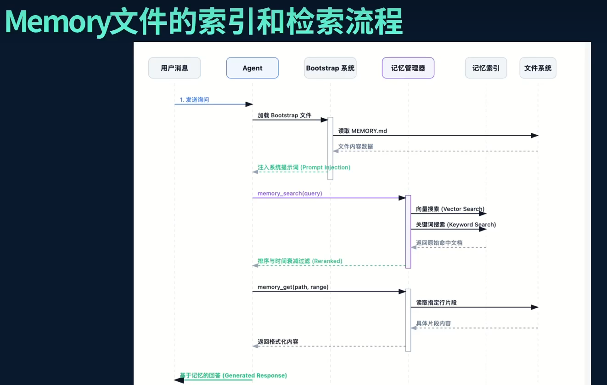

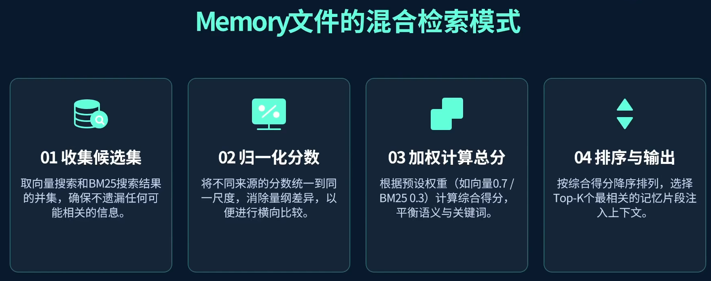

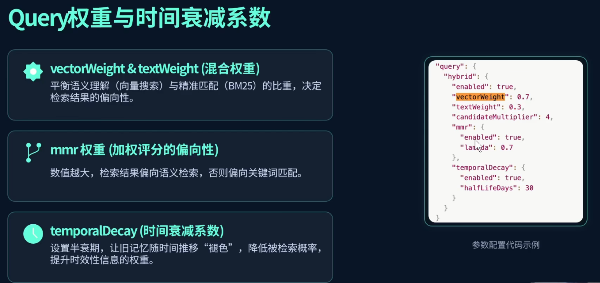