# RAG优化方法全面总结

## 目录
1. [概述](#概述)
2. [优化方法分类体系](#优化方法分类体系)
3. [详细技术解析](#详细技术解析)
4. [技术组合方案](#技术组合方案)
5. [应用场景指南](#应用场景指南)
6. [实施路线图](#实施路线图)

---

## 概述

检索增强生成(RAG)技术通过整合外部知识库与大语言模型(LLM),显著提升了AI回答的准确性和可靠性。本文档总结了34+种RAG优化方法,覆盖从基础到高级的全方位优化策略。

### 核心优化目标
- **提升检索准确性**: 找到最相关的文档
- **增强上下文理解**: 提供完整的语义信息
- **优化生成质量**: 基于检索内容生成准确答案
- **提高系统效率**: 平衡性能与成本
- **增强可解释性**: 让检索决策透明化

---

## 优化方法分类体系

### 📊 一、数据预处理优化 (5种)

#### 1.1 分块优化 (Chunking Optimization)

- ### 固定大小分块

- ### 基于句子的分块

- ### 基于段落的分块

- ### 语义分块

- ### 递归分割

  具体做法是先尝试按标题切分。如果某个章节还是太长，就按段落切。段落还不够就按句子。句子仍然超限，最后才按字符兜底。这样得到的分块既保有语义完整性，尺寸也在可控范围内

  ### 层次化分块

---

### 🔍 二、查询优化 (4种)

#### 2.1 查询转换

**6. 查询转换 (Query Transformations)**

- **查询重写**: 优化模糊查询表述
- **查询扩展**: 添加同义词、相关概念
- **查询拆分**: 将复杂问题分解为子查询
- **实现**: 使用LLM进行智能转换

#### 2.2 假设性嵌入

**7. HyDE (Hypothetical Document Embeddings)**
- **核心思想**: 将短查询转换为假设性答案文档
- **流程**:
  ```
  用户查询: "怎么解决机器学习模型的过拟合?"
  → LLM生成假设答案: "过拟合的解决方法包括: 1.增大训练数据集 2.使用L1/L2正则化..."
  → 用假设答案向量检索真实文档
  ```
- **优势**: 解决短查询与长文档的"语义形态不匹配"
- **适用**: 学术检索、长文档库、复杂查询
- **成本**: 中等(每次查询需额外LLM调用)

**8. HyPE (Hypothetical Prompt Embeddings)**
- **核心思想**: 为文档生成假设性问题
- **与HyDE区别**:
  | 维度 | HyDE | HyPE |
  |------|------|------|
  | 生成内容 | 为查询生成假设文档 | 为文档生成假设问题 |
  | 检索逻辑 | 假设文档→真实文档 | 用户问题→假设问题→真实文档 |
  | 适用场景 | 短查询→长文档 | 多样化查询风格 |
- **优势**: **解决查询与文档的"表述风格不匹配**"

---

### 🎯 三、检索策略优化 (8种)

#### 3.1 混合检索

**9. 融合检索 (Fusion Retrieval)**
- **核心思想**: 结合向量检索(语义)与BM25(关键词)
- **评分公式**:
  ```
  最终分数 = α × 向量相似度 + (1-α) × BM25分数
  ```
- **参数调整**:
  - α=0.7: 侧重语义(学术研究)
  - α=0.3: 侧重精准关键词(法律检索)
- **效果**: 检索召回率提升20-40%
- **实现**: LangChain/LlamaIndex均有内置支持

**10. 集成检索 (Ensemble Retrieval)**
- **核心思想**: 结合多种检索模型(稀疏+稠密+重排序)
- **组合方式**:
  - BM25 + Dense Vector
  - Multiple Embedding Models
  - Sparse + Dense + Hybrid

#### 3.2 分层检索

**11. 分层索引 (Hierarchical Indices)**
- **核心思想**: 两级检索 - 摘要级(粗筛) + 细节级(精筛)
- **流程**:
  ```
  1. 构建两个向量库:
     - 摘要向量库(文档级摘要)
     - 细节向量库(具体文本片段)
  2. 检索时:
     第一级: 用查询匹配摘要 → 定位相关章节
     第二级: 在相关章节内检索细节 → 获取精准内容
  ```
- **优势**:
  - 效率提升60倍以上(减少检索范围)
  - 保留上下文关联
- **适用**: 大型文档(100页+)、文档库(1000+文档)
- **成本**: 高(需生成文档摘要,需异步处理)

#### 3.3 高级筛选

**12. 智能重排序 (Intelligent Reranking)**
- **核心思想**: 初步检索后使用更精确模型重排序
- **方法**:
  - Cross-encoder重排序
  - Cohere Rerank API
  - BGE Reranker
- **效果**: Top-5准确率提升15-25%
- **成本**: 中等(增加重排序计算开销)

---

### 📝 四、上下文优化 (4种)

#### 4.1 上下文增强

**16. 上下文增强窗口 (Context Enrichment Window)**
- **核心思想**: 为检索到的文本块补充相邻内容
- **实现**:
  ```
  检索到第5块
  → 返回: 第3块 + 第4块 + 第5块 + 第6块 + 第7块
  → 拼接去重(处理重叠部分)
  ```
- **窗口大小**: 可配置(前后各1-3块)
- **效果**: 解决"断章取义"问题
- **成本**: 低(仅增加拼接逻辑)

**17. 上下文压缩 (Contextual Compression)**
- **核心思想**: 从检索文档中提取最相关部分
- **流程**:
  ```
  基础检索 → 获取10个候选文档
  → LLM提取器: 精炼每个文档的相关信息
  → 输出: 浓缩的核心内容(减少50-70% tokens)
  ```
- **优势**:
  - 降低LLM输入成本
  - 提升响应速度
  - 减少无关信息干扰
- **实现**: LangChain的ContextualCompressionRetriever

#### 4.2 对比说明

| 技术 | 处理阶段 | 核心作用 | 类比 |
|------|----------|----------|------|
| CCH | 嵌入前 | 添加文档-章节标签 | 给文件贴标签 |
| 上下文增强窗口 | 检索时 | 补充相邻内容 | 拿前后几页 |
| 上下文压缩 | 检索后 | 提炼核心信息 | 总结关键点 |

三者是**互补关系**,可组合使用!

---

### 🧠 五、高级架构 (6种)

#### 5.1 自适应系统

**18. 自适应RAG (Adaptive RAG)**
- **核心思想**: 根据查询类型动态调整检索策略
- **查询分类**:
  - **事实型**: 优化查询 + 精准检索 + 严格排序
  - **分析型**: 拆分子查询 + 多维度检索
  - **观点型**: 识别观点维度 + 收集多元立场
  - **上下文型**: 融入用户背景 + 个性化检索
- **实现**:
  1. 查询分类器(判定查询类型)
  2. 策略路由器(匹配检索策略)
  3. 结果整合器(生成定制化答案)
- **效果**: 不同查询类型的准确率提升20-40%

#### 5.2 纠正型系统

**19. 纠正型RAG (Corrective RAG, CRAG)**
- **核心思想**: 动态评估并修正检索质量
- **流程**:
  ```
  1. 本地向量检索 → 获取候选文档
  2. 相关性评估:
     - 高相关(>0.7): 直接使用
     - 低相关(<0.3): 触发网页搜索
     - 中等相关(0.3-0.7): 本地+网页混合
  3. 知识提炼 → 去除冗余
  4. 生成回答(标注来源)
  ```
- **优势**:
  - 补充最新信息
  - 应对知识库不足
  - 提升信息时效性
- **适用**: 动态知识库、新闻资讯、科研辅助

**20. 迭代检索 (Iterative Retrieval)**
- **核心思想**: 多轮检索逐步深化
- **流程**:
  ```
  第1轮: 基础检索 → 初步答案
  第2轮: 识别不足 → 补充检索
  第3轮: 整合信息 → 完整答案
  ```
- **场景**: 复杂问题、多步骤推理

**21. 自检索 (Self-RAG)**
- **核心思想**: RAG系统自我反思与修正
- **机制**:
  - 检索后评估结果相关性
  - 生成后检查答案质量
  - 发现问题时自动修正
- **论文**: [Self-RAG: Learning to Retrieve, Generate, and Critique through Self-Reflection](https://arxiv.org/abs/2310.11511)

**22. 反馈循环检索 (Retrieval with Feedback Loops)**
- **核心思想**: 学习用户反馈优化检索
- **反馈来源**:
  - 用户点赞/点踩
  - 答案采纳率
  - 查询成功率
- **优化方向**:
  - 调整检索参数
  - 更新文档权重
  - 优化查询转换

#### 5.3 图增强

**23. Graph RAG (知识图谱增强RAG)**

- **核心思想**: 利用知识图谱关联分散信息

- **Microsoft GraphRAG流程**:
  ```
  1. 文本分块 → 提取实体与关系
  2. 构建知识图谱: 实体(节点) + 关系(边)
  3. 社区检测: 识别关联紧密的实体集群
  4. 集群总结: 为每个集群生成摘要
  5. 查询处理:
     - 局部回答: 基于集群总结
     - 全局合成: 整合多个集群
  ```
  
  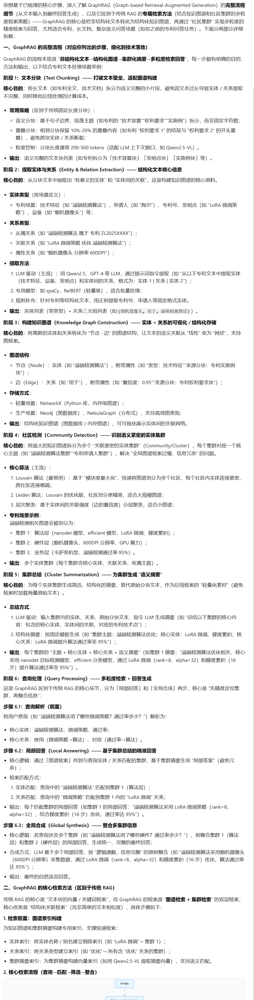
  
- **核心优势**:
  
  
  
  - 串联分散信息
  - 理解复杂关系
  - 提供"全局感知"能力
  
- **适用场景**:
  - 复杂语义分析(因果链、跨文档关联)
  - 海量文档洞察提取
  - 多事件综合分析
  
- **官方文档**: [microsoft.github.io/graphrag](https://microsoft.github.io/graphrag/)


---

### 📊 六、评估与优化 (3种)

**25. DeepEval评估**
- **评估维度**:
  - Faithfulness(忠实度): 答案是否基于检索内容
  - Answer Relevance(答案相关性): 答案是否回答问题
  - Context Precision(上下文精准度): 检索内容相关性
  - Context Recall(上下文召回率): 是否检索到必要信息
- **实现**: [DeepEval框架](https://github.com/confident-ai/deepeval)

**26. GroUSE评估**
- **核心**: 基于上下文的 groundedness 评估
- **方法**: 评估生成内容与检索证据的一致性

**27. 分块大小优化 (Optimizing Chunk Sizes)**
- **系统性方法**:
  1. 定义测试查询集
  2. 测试不同chunk size
  3. 评估检索+生成质量
  4. 选择最优参数

---

## 详细技术解析

### 融合检索深度解析

**技术原理**
```python
# 伪代码
def fusion_retrieval(query, alpha=0.5):
    # 向量检索
    vector_scores = vector_search(query)  # 返回归一化分数

    # BM25检索
    bm25_scores = bm25_search(query)  # 返回归一化分数

    # 分数融合
    final_scores = {}
    for doc in all_docs:
        final_scores[doc] = (
            alpha * vector_scores[doc] +
            (1 - alpha) * bm25_scores[doc]
        )

    # 返回Top-k
    return sorted(final_scores, key=lambda x: x[1], reverse=True)[:k]
```

**参数调优指南**
- α=0.3-0.4: 关键词密集场景(法律、技术文档)
- α=0.5-0.6: 平衡场景(通用知识库)
- α=0.7-0.8: 语义重要场景(学术研究、创意内容)

### Graph RAG vs 传统RAG对比

| 维度 | 传统RAG | Graph RAG |
|------|---------|-----------|
| 检索方式 | 向量相似性 | 知识图谱遍历 |
| 信息关联 | 单个文档块 | 跨文档实体关联 |
| 复杂查询 | 需要多次检索 | 一次查询串联多源信息 |
| 上下文理解 | 局部语义 | 全局语义图谱 |
| 构建成本 | 低 | 中-高(需图谱构建) |
| 查询效率 | 高 | 中(需图谱遍历) |
| 适用场景 | 简单问答 | 复杂分析、跨文档推理 |

### HyDE vs HyPE对比

```
场景: 用户查询"如何提升Python代码性能?"

HyDE流程:
用户查询
→ LLM生成假设答案:"使用列表推导式、多线程、生成器等..."
→ 假设答案嵌入 → 检索真实文档
→ 结果: 找到详细的技术文档

HyPE流程:
用户查询
→ 匹配文档生成的假设问题:
  - "Python代码优化的方法?"
  - "如何加速Python程序?"
  - "Python性能瓶颈在哪里?"
→ 检索匹配的文档
→ 结果: 找到包含这些问题的文档
```

**选择建议**:
- **HyDE**: 复杂查询、长文档、学术检索
- **HyPE**: 多样化查询风格、客服知识库、教育材料

---

## 技术组合方案

### 🎯 组合策略1: 基础优化套餐(推荐新手)

**适用场景**: 小型文档库(<1000文档),预算有限
**实施成本**: 低
**预期提升**: 检索准确率+20-30%

```yaml
核心组合:
  - CCH(上下文块标题)
  - 融合检索(向量+BM25, α=0.5)
  - 上下文增强窗口(前后各1块)
  - 智能重排序(轻量级reranker)

可选增强:
  - 查询转换(简单重写)
  - 分块优化(测试chunk size 500/1000/1500)
```

### 🚀 组合策略2: 性能优化套餐(推荐中型项目)

**适用场景**: 中型文档库(1000-10000文档),追求性能
**实施成本**: 中
**预期提升**: 检索准确率+40-60%,响应速度+30%

```yaml
核心组合:
  - 分层索引(摘要+细节两级)
  - Dartboard检索(相关性+多样性平衡)
  - HyDE(假设性文档嵌入)
  - 上下文压缩(精炼检索内容)
  - 可解释检索(生成相关性解释)

可选增强:
  - 文档增强(问题生成)
  - 多面过滤(元数据过滤)
```

### 💎 组合策略3: 高级架构套餐(推荐大型项目)

**适用场景**: 大型文档库(10000+文档),复杂查询需求
**实施成本**: 高
**预期提升**: 检索准确率+60-80%,复杂问题处理能力+100%

```yaml
核心组合:
  - 自适应RAG(查询类型分类+策略路由)
  - Graph RAG(知识图谱增强)
  - 纠正型RAG(动态评估+网页搜索)
  - RAPTOR(层次化树结构)
  - DeepEval评估(持续优化)

可选增强:
  - 多模态RAG(图像+文本)
  - 反馈循环(用户反馈学习)
  - 查询重写与扩展
```

### 🔬 组合策略4: 垂直领域套餐

**法律领域**:
```yaml
核心:
  - CCH(法规标题+条款编号)
  - 融合检索(α=0.3,侧重关键词)
  - 多面过滤(时间、法院、案由)
  - 可解释检索(引用具体条款)

特色:
  - 分层索引(法典>编>章>条)
  - 上下文增强窗口(完整条款链)
```

**医疗领域**:
```yaml
核心:
  - CCH(疾病分类+治疗指南)
  - 融合检索(α=0.6,侧重语义)
  - 多模态RAG(医学影像+文本)
  - 可解释检索(证据来源)

特色:
  - 纠正型RAG(补充最新研究)
  - 分层索引(指南>章节>具体方案)
```

**客服领域**:
```yaml
核心:
  - 文档增强(生成用户问题)
  - HyPE(假设性问题匹配)
  - 查询转换(口语化转正式)
  - 融合检索(α=0.5,平衡)

特色:
  - 自适应RAG(问题类型分类)
  - 反馈循环(学习用户反馈)
```

---

## 应用场景指南

### 📋 场景决策矩阵

| 场景 | 文档数量 | 查询类型 | 推荐方案 | 核心技术 |
|------|----------|----------|----------|----------|
| 个人知识库 | <1000 | 简单查询 | 基础套餐 | CCH+融合检索 |
| 企业wiki | 1000-5000 | 混合查询 | 性能套餐 | 分层索引+Dartboard |
| 法律检索 | 5000+ | 精准查询 | 垂直方案 | 多面过滤+可解释 |
| 学术研究 | 10000+ | 复杂分析 | 高级套餐 | Graph RAG+自适应 |
| 客服系统 | <5000 | 口语化 | 垂直方案 | 文档增强+HyPE |
| 医疗诊断 | <3000 | 专业查询 | 垂直方案 | 多模态+可解释 |
| 新闻资讯 | 实时更新 | 时效查询 | 纠正型 | CRAG+网页搜索 |

### 🎯 按需选择指南

**问题: 我的查询和文档表述风格不同**
→ 解决方案: **HyPE + 文档增强**

**问题: 查询经常是短句,文档很长**
→ 解决方案: **HyDE + 分层索引**

**问题: 检索结果经常重复**
→ 解决方案: **Dartboard检索 + 多样性权重**

**问题: 需要跨文档关联信息**
→ 解决方案: **Graph RAG + 知识图谱**

**问题: 文档块经常缺少上下文**
→ 解决方案: **CCH + 上下文增强窗口**

**问题: 知识库信息过时**
→ 解决方案: **纠正型RAG + 网页搜索**

**问题: 不同类型查询需要不同策略**
→ 解决方案: **自适应RAG + 查询分类**

**问题: 需要解释为什么检索这个文档**
→ 解决方案: **可解释检索 + LLM解释生成**

---

## 实施路线图

### 阶段1: 基础建设(1-2周)

**目标**: 搭建基础RAG系统,达到可用状态

```yaml
任务清单:
  ☑ 数据准备: 文档清洗、格式统一
  ☑ 基础分块: 测试chunk size,确定最优值
  ☑ 向量数据库: 选择向量库(FAISS/Chroma/Pinecone)
  ☑ 嵌入模型: 选择嵌入模型(OpenAI/BGE/Cohere)
  ☑ 基础检索: 实现向量相似性检索
  ☑ 评估系统: 建立基础评估指标

验收标准:
  - 能够回答简单事实性问题
  - 检索召回率 > 60%
  - 响应时间 < 3秒
```

### 阶段2: 优化提升(2-4周)

**目标**: 系统性优化,提升检索质量

```yaml
核心优化:
  ☑ CCH: 添加上下文块标题
  ☑ 融合检索: 实现向量+BM25
  ☑ 参数调优: 测试不同α值
  ☑ 上下文增强: 实现增强窗口
  ☑ 智能重排序: 集成reranker

评估指标:
  - 检索召回率 > 75%
  - Top-5准确率 > 70%
  - 用户满意度 > 80%
```

### 阶段3: 高级特性(4-8周)

**目标**: 根据业务需求,添加高级特性

```yaml
技术选型(按需选择):
  ☑ 分层索引: 大型文档库必选
  ☑ HyDE/HyPE: 查询-文档不匹配时
  ☑ 自适应RAG: 多样化查询场景
  ☑ Graph RAG: 复杂关联查询
  ☑ 纠正型RAG: 时效性要求高

验收标准:
  - 复杂查询准确率 > 70%
  - 系统可解释性(提供检索依据)
  - A/B测试显示显著提升
```

### 阶段4: 持续优化(持续)

**目标**: 基于用户反馈,持续迭代

```yaml
优化循环:
  1. 收集用户反馈
  2. DeepEval评估
  3. 识别问题点
  4. 实施优化
  5. A/B测试
  6. 发布上线
  → 回到步骤1

关键指标:
  - 用户留存率
  - 查询成功率
  - 平均响应时间
  - 系统稳定性
```

---

## 技术实施建议

### 💡 最佳实践

**1. 分步实施,渐进优化**
- 不要一次性实施所有技术
- 每次实施1-2个技术,充分测试
- 建立A/B测试机制,验证效果

**2. 监控关键指标**
```python
核心指标:
  - 检索召回率(Recall)
  - 检索精准率(Precision)
  - 平均响应时间
  - Token使用成本
  - 用户满意度(CSAT)
```

**3. 成本控制策略**
- 使用较小的模型进行嵌入(BGE-small vs OpenAI)
- 缓存常见查询结果
- 批量处理API调用
- 优化上下文长度

**4. 质量保证**
- 建立黄金数据集(测试查询集)
- 定期执行DeepEval评估
- 设置质量阈值告警
- 进行用户反馈分析

### ⚠️ 常见陷阱

**1. 过度优化单一指标**
- 问题: 只追求召回率,导致结果冗余
- 解决: 平衡召回率、精准率、多样性

**2. 忽视数据质量**
- 问题: 垃圾进,垃圾出
- 解决: 投入足够时间进行数据清洗

**3. 缺乏可解释性**
- 问题: 黑箱检索,用户不信任
- 解决: 实施可解释检索,提供依据

**4. 忽视用户反馈**
- 问题: 系统指标好,但用户不满意
- 解决: 建立用户反馈循环

**5. 技术选型不当**
- 问题: 用复杂技术解决简单问题
- 解决: 根据场景选择合适技术

---

## 成本效益分析

### 技术成本对比

| 技术 | 开发成本 | 运行成本 | 维护成本 | 提升效果 | ROI |
|------|----------|----------|----------|----------|-----|
| CCH | 低 | 低 | 低 | +20% | ⭐⭐⭐⭐⭐ |
| 融合检索 | 中 | 低 | 低 | +30% | ⭐⭐⭐⭐⭐ |
| 上下文增强窗口 | 低 | 低 | 低 | +15% | ⭐⭐⭐⭐ |
| 上下文压缩 | 中 | 中 | 低 | +25% | ⭐⭐⭐⭐ |
| 智能重排序 | 中 | 中 | 中 | +20% | ⭐⭐⭐⭐ |
| 文档增强 | 中 | 高 | 中 | +25% | ⭐⭐⭐ |
| HyDE | 中 | 高 | 低 | +30% | ⭐⭐⭐ |
| HyPE | 中 | 高 | 中 | +25% | ⭐⭐⭐ |
| 分层索引 | 高 | 中 | 中 | +40% | ⭐⭐⭐⭐ |
| Dartboard检索 | 中 | 低 | 低 | +20% | ⭐⭐⭐⭐ |
| 自适应RAG | 高 | 高 | 高 | +50% | ⭐⭐⭐ |
| Graph RAG | 很高 | 中 | 高 | +60% | ⭐⭐⭐ |
| 纠正型RAG | 高 | 高 | 中 | +40% | ⭐⭐⭐ |

**ROI评估标准**:
- ⭐⭐⭐⭐⭐: 强烈推荐(成本<收益)
- ⭐⭐⭐⭐: 推荐用于生产环境
- ⭐⭐⭐: 适合特定场景
- ⭐⭐: 谨慎使用
- ⭐: 实验性技术

---

## 工具与框架推荐

### 向量数据库
- **FAISS**: 开源,高性能,适合小规模
- **Chroma**: 轻量级,易集成
- **Pinecone**: 全托管,可扩展
- **Weaviate**: 支持多模态
- **Milvus**: 开源,高性能,适合大规模

### LLM框架
- **LangChain**: 功能全面,生态丰富
- **LlamaIndex**: 专注RAG,易用性强
- **Haystack**: 深度定制,企业级

### 嵌入模型
- **OpenAI Embeddings**: 质量高,成本中
- **BGE (BAAI General Embedding)**: 开源,性能优
- **Cohere Embeddings**: 多语言支持好
- **Voyage AI**: 专用领域优化

### 评估工具
- **DeepEval**: 全面RAG评估
- **RAGAS**: 开源评估框架
- ** TruEra**: 可观测性平台

### 重排序模型
- **Cohere Rerank**: 商业API,效果好
- **BGE Reranker**: 开源,性能好
- **Cohere Rerank (v3)**: 最新版本

---

## 未来趋势

### 1. 多模态RAG普及
- 图像、视频、音频统一检索
- 跨模态语义理解
- ColPali等视觉模型成熟

### 2. 自优化系统
- 自动调整检索策略
- 基于用户反馈自我学习
- A/B测试自动化

### 3. 边缘RAG
- 本地部署保护隐私
- 离线RAG系统
- 混合云端+边缘架构

### 4. 实时RAG
- 流式数据处理
- 实时知识更新
- 增量索引构建

### 5. 可解释RAG
- 检索路径可视化
- 注意力机制透明化
- 证据溯源系统

---

## 总结与建议

### 🎯 核心要点

1. **没有银弹**: 不同场景需要不同技术组合
2. **渐进式优化**: 从基础到高级,逐步实施
3. **数据为王**: 高质量数据比复杂算法更重要
4. **用户为中心**: 关注用户体验,而非仅技术指标
5. **持续迭代**: 建立反馈循环,持续优化

### 📈 实施优先级

**第一优先级**(立即实施):
- CCH(上下文块标题)
- 融合检索(向量+BM25)
- 分块优化

**第二优先级**(短期实施):
- 上下文增强窗口
- 智能重排序
- 文档增强/HyPE

**第三优先级**(中期实施):
- 分层索引
- 自适应RAG
- 可解释检索

**第四优先级**(长期考虑):
- Graph RAG
- 纠正型RAG
- 多模态RAG

### 🚀 快速起步

1. **评估现状**: 了解当前系统的瓶颈
2. **选择套餐**: 根据场景选择组合方案
3. **分步实施**: 按路线图逐步推进
4. **持续优化**: 基于数据和反馈持续改进


#### 近似最近邻

牺牲部分的准确度，提高更快的检索性能。通过构建高效的数据结构，减少需要比较的数据点数量，从而实现快速检索。

提前计算向量之间的相似度，**将相似度高的先组织在一起**，便于以后更快的找到相似的对象，这个过程叫做vcetor indexing  建立向量索引

预先对数据进行聚类，不同类型数据组织成不同的簇

基于树的索引

基于哈希的索引

基于聚类的索引

基于图的索引 HNSW ,**构建多层图结构**，其中每一层都是由相互连接的节点组成的**可导航小世界网络**，高层级的图由较少的节点组成，能支持快速的大范围跳跃搜索，从而迅速缩小搜索空间。较低层的图包含多节点，实现更细致的搜索，最底层的则包括所有的数据点。平衡搜索速度与准确性

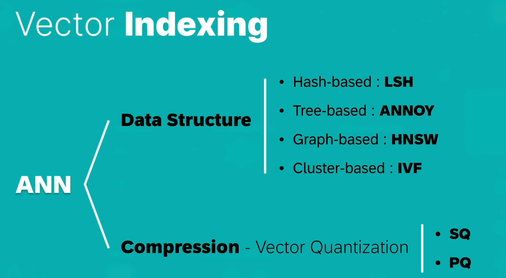

### RAG评估

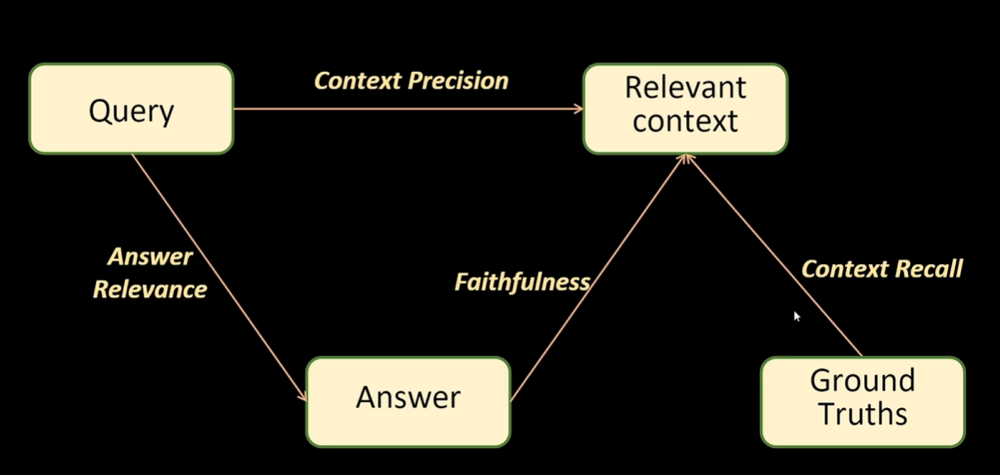

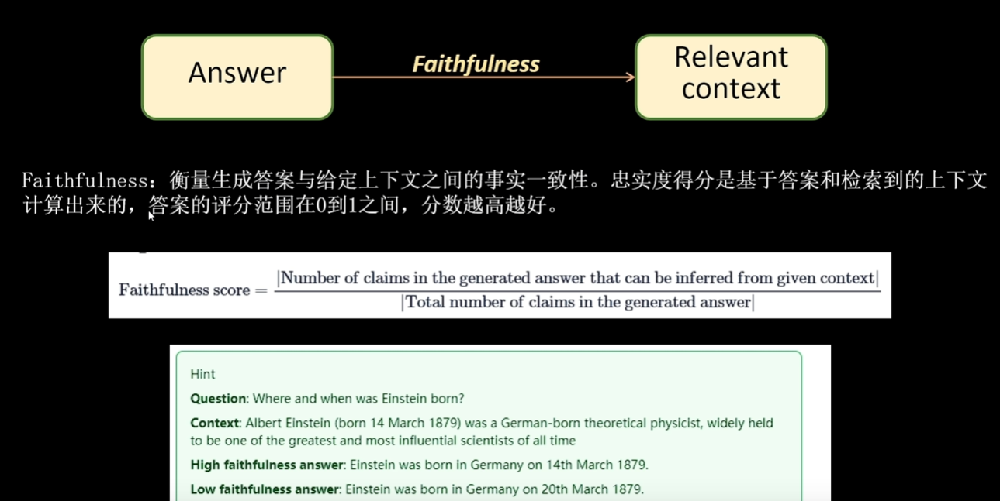

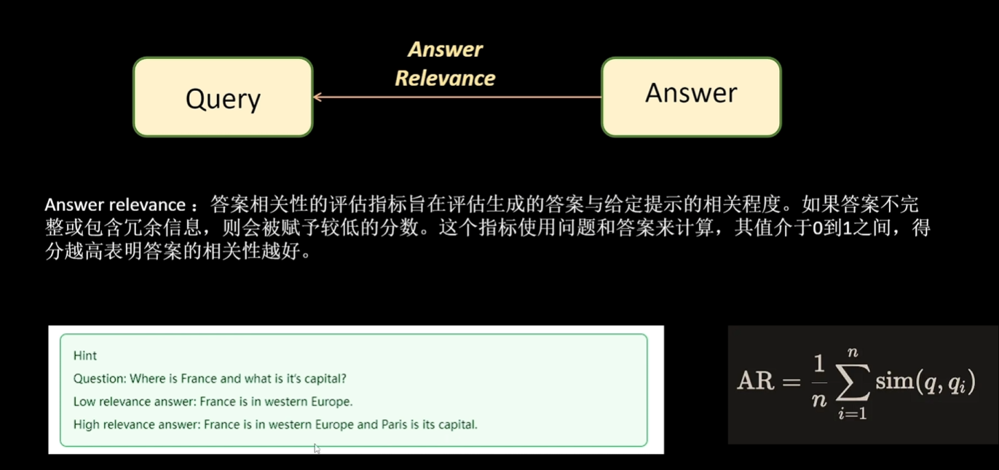

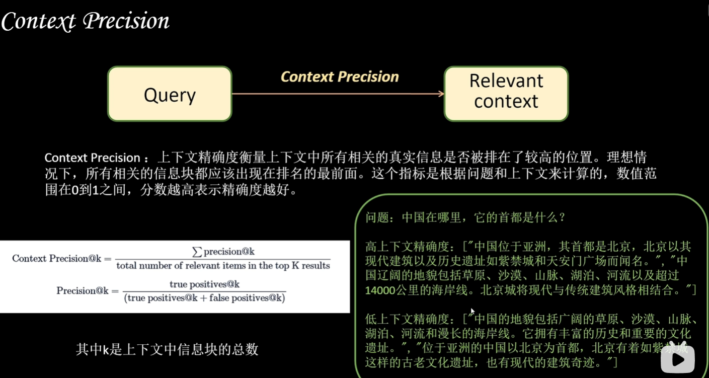

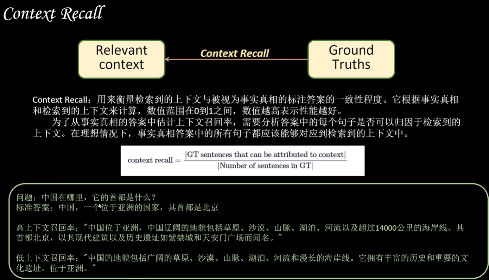

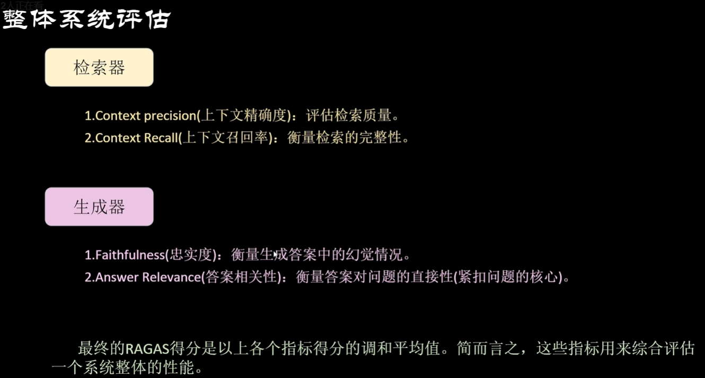

## FAISS

[Faiss库_faiss数据库-CSDN博客](https://blog.csdn.net/2501_91906624/article/details/149341760?ops_request_misc=elastic_search_misc&request_id=64e4d61f9f4ca9051ca1b7fb8b7bf005&biz_id=0&utm_medium=distribute.pc_search_result.none-task-blog-2~all~top_click~default-2-149341760-null-null.142^v102^pc_search_result_base4&utm_term=Faiss&spm=1018.2226.3001.4187)

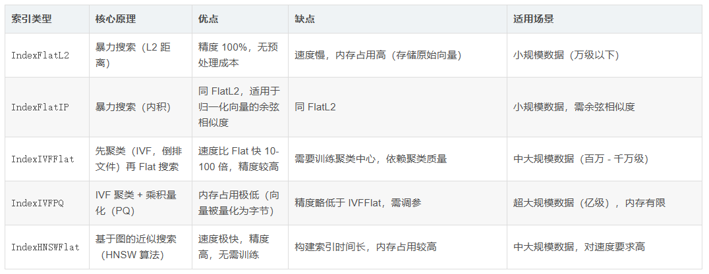

## IndexIVFFlat

先根据簇的相关性，选出n个簇，然后去选出的簇中进行暴力搜索

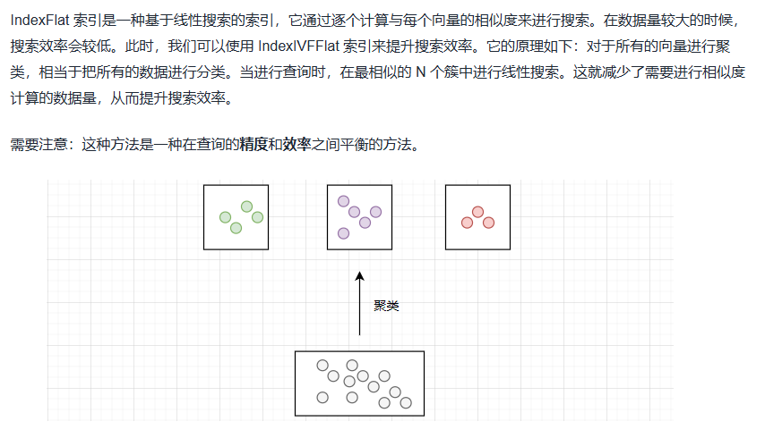

## Product Quantization（PQ）

[Product Quantization（PQ） - 一亩三分地](https://mengbaoliang.cn/archives/71152/)

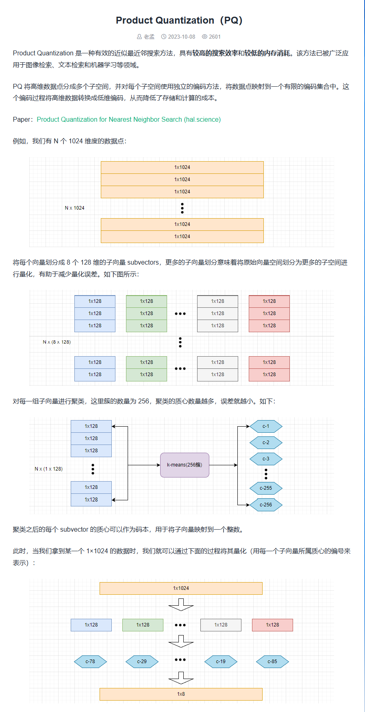
