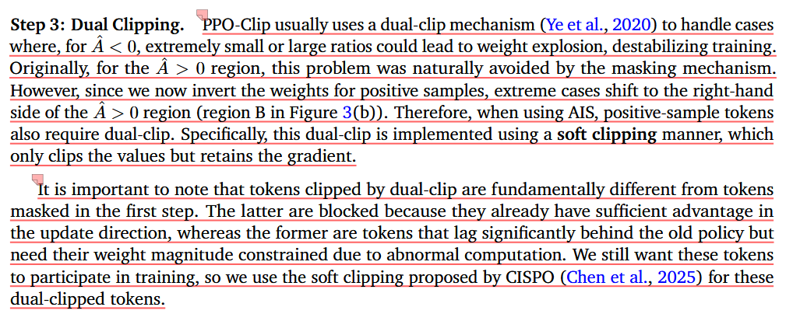

# ASPO: Asymmetric Importance Sampling Policy Optimization
# （非对称重要性采样策略优化）

**论文信息**：
- **作者**：Jiakang Wang, Runze Liu, Lei Lin, et al.
- **机构**：快手科技 & 清华大学
- **发表时间**：2025年10月
- **论文链接**：https://arxiv.org/abs/2510.06062
- **代码仓库**：https://github.com/wizard-III/Archer2.0

---

## 📚 目录

1. [一句话总结](#一句话总结)
2. [通俗理解：什么是问题？](#通俗理解什么是问题)
3. [前置知识](#前置知识)
4. [问题的详细分析](#问题的详细分析)
5. [ASPO 的解决方案](#aspo-的解决方案)
6. [实验结果](#实验结果)
7. [深度理论分析](#深度理论分析)
8. [实践指南](#实践指南)

---

## 一句话总结

**ASPO 发现了 LLM 强化学习训练中的一个根本性错误：对于需要提高概率的 tokens（好 tokens），传统的 PPO-Clip 算法给已经表现很好的 tokens 太多关注，而给落后的 tokens 太少关注。ASPO 通过"翻转"权重，让落后的 tokens 得到更多关注，从而显著提升了模型性能。**

---

## 通俗理解：什么是问题？

### 🎯 先理解一个简单的教育类比

想象你在教一个学生做数学题：

**场景 1：学生做对的题目**
- 学生已经掌握了"1+1=2"，每次都对
- **传统做法（PPO）**：继续花大量时间让他练习 1+1=2
- **ASPO 做法**："你都会了，少练点吧，把时间留给不会的"

**场景 2：学生做错的题目**
- 学生总是不会"3×7=21"，经常算错
- **传统做法（PPO）**：只给他一点点练习机会
- **ASPO 做法**："这个你不会，多练几次！"

**结果**：传统方法导致学生只会简单的题，难的题永远学不会。ASPO 让学生合理分配学习时间，最终学会更多题目。

---

### 🤖 在 LLM 训练中的对应

训练大模型做数学题时，模型会生成一串 tokens（文字片段）：

```
题目：1+1=?
模型输出：The answer is [2]  ← 这个 token 很重要
```

**每个 token 都有**：
1. **概率**：模型认为这个 token 出现的可能性（0~1之间）
2. **优势**：这个 token 对最终答案的贡献（正数=好，负数=坏）

### 🔴 GRPO 的根本问题

当模型生成一个**好答案**时（优势 > 0），答案中的所有 tokens 都被标记为"好"。

但是在训练时，PPO 算法犯了一个**严重错误**：

| Token 类型 | 旧概率 | 新概率 | IS 比率 | GRPO 给的权重 | ASPO 给的权重 |
|-----------|--------|--------|---------|--------------|--------------|
| **已经学会的** | 0.9 | 0.95 | 1.056 | **很大（1.056）** | **很小（0.95）** |
| **还没学会的** | 0.9 | 0.1 | 0.111 | **很小（0.111）** | **很大（9.0）** |

**这是什么意思？**

- **已经学会的 token**（从 0.9 提升到 0.95）：
  - GRPO 说："很好！继续加强！"
  - ASPO 说："已经够好了，减少关注"

- **还没学会的 token**（从 0.9 掉到 0.1）：
  - GRPO 说："权重很低，慢慢改吧"
  - ASPO 说："太差了！赶紧加强！"

### 💥 导致的后果

用 GRPO 训练后，模型会出现：

1. **熵崩溃**（Entropy Collapse）
   - 模型输出变得非常确定
   - 类似于：不管什么题都回答"42"

2. **重复性增加**
   - 输出大量重复内容
   - 类似于："答案是 2, 2, 2, 2, 2..."

3. **过早收敛**
   - 停留在局部最优
   - 无法探索更好的答案

4. **性能下降**
   - 训练后期性能反而变差
   - 类似于"过拟合"

---

## 前置知识

### 1. 什么是强化学习（RL）？

强化学习就是**通过试错来学习**：

```
模型 → 生成答案 → 获得奖励 → 更新模型 → 生成更好的答案
  ↑_______________________________|
```

**在 LLM 中**：
- 输入：数学题 "1+1=?"
- 动作：生成 token "2"
- 奖励：答案正确 +1，错误 -1

### 2. 什么是策略（Policy）？

**策略 = 模型**，决定在给定情况下生成什么 token。

记作：$\pi_\theta(a|s)$

**含义**：在状态 $s$ 下，采取动作 $a$ 的概率

**例子**：
- $\pi(\text{"2"}|\text{"1+1=?"}) = 0.9$ ← 很可能输出"2"
- $\pi(\text{"3"}|\text{"1+1=?"}) = 0.05$ ← 不太可能输出"3"

### 3. 什么是优势（Advantage）？

**优势 = 这个动作有多好**

记作：$A(s,a)$

**含义**：
- $A > 0$：这个动作比平均好 → 应该**提高**它的概率
- $A < 0$：这个动作比平均差 → 应该**降低**它的概率

### 4. 什么是重要性采样（Importance Sampling, IS）？

**重要性采样 = 用旧数据训练新模型的技巧**

**问题**：我们用旧策略 $\pi_{\text{old}}$ 采集的数据，但要用它来更新新策略 $\pi_\theta$

**解决**：用 IS 比率来校正

$$
r = \frac{\pi_{\text{new}}(a)}{\pi_{\text{old}}(a)}
$$

**直观理解**：
- 如果 $\pi_{\text{new}}$ 更喜欢这个动作（$r > 1$），就**放大**奖励
- 如果 $\pi_{\text{new}}$ 不太喜欢（$r < 1$），就**缩小**奖励

### 5. 什么是 PPO-Clip？

**PPO-Clip = 防止更新过猛的安全机制**

**问题**：如果新旧策略差异太大，训练会不稳定

**解决**：限制 IS 比率在 $[1-\varepsilon, 1+\varepsilon]$ 范围内

$$
\text{clip}(r, 1-\varepsilon, 1+\varepsilon) = \begin{cases}
1-\varepsilon & \text{if } r < 1-\varepsilon \\
r & \text{if } 1-\varepsilon \leq r \leq 1+\varepsilon \\
1+\varepsilon & \text{if } r > 1+\varepsilon
\end{cases}
$$

**例子**（$\varepsilon = 0.2$）：
- $r = 1.5$ → 裁剪到 $1.2$
- $r = 0.5$ → 裁剪到 $0.8$
- $r = 1.1$ → 保持 $1.1$

---

## 问题的详细分析

### 第一步：理解 GRPO 的训练流程

**GRPO (Group Relative Policy Optimization)** 是这样工作的：

#### Step 1: 生成多个答案

对于同一个问题，生成 G 个答案（比如 G=8）：

```
问题：1+1=?

答案1：The answer is 2.       ✓ 正确
答案2：I think it's 3.        ✗ 错误
答案3：Let me calculate... 2. ✓ 正确
答案4：1+1 equals 11.        ✗ 错误
...
```

#### Step 2: 计算每个答案的奖励

```
答案1：R = +1.0（正确）
答案2：R = -0.5（错误）
答案3：R = +1.0（正确）
答案4：R = -0.3（错误）
```

#### Step 3: 标准化得到优势值

$$
\hat{A}^i = \frac{R^i - \text{mean}(R)}{\text{std}(R)}
$$

**计算**：
- 平均奖励：$\text{mean}(R) = (1.0 - 0.5 + 1.0 - 0.3) / 4 = 0.3$
- 标准差：$\text{std}(R) = 0.66$
- 答案1的优势：$\hat{A}^1 = (1.0 - 0.3) / 0.66 = +1.06$
- 答案2的优势：$\hat{A}^2 = (-0.5 - 0.3) / 0.66 = -1.21$

#### Step 4: 所有 token 共享优势

**关键点**：同一个答案中的所有 tokens 共享相同的优势！

```
答案1："The answer is 2."
       ↓   ↓      ↓   ↓
      A   A      A   A
     (1.06 1.06 1.06 1.06) ← 都相同！

答案2："I think it's 3."
       ↓  ↓     ↓   ↓
      A   A    A   A
    (-1.21 -1.21 -1.21 -1.21) ← 都相同！
```

### 第二步：理解 PPO-Clip 的权重分配

#### 对于负优势的 tokens（需要降低概率）

**例子**：答案2 中的 token "I"（优势 = -1.21）

| 旧概率 | 新概率 | IS 比率 | 裁剪后 | 权重 |
|--------|--------|---------|--------|------|
| 0.05 | 0.08 | 1.60 | 1.20 | **大** |
| 0.05 | 0.05 | 1.00 | 1.00 | **中** |
| 0.05 | 0.03 | 0.60 | 0.80 | **小** |

**分析**：
- 新概率**提高**了（0.05→0.08）→ 这是错误方向！
- IS 比率**大** → 惩罚**强** ✓
- 新概率**降低**了（0.05→0.03）→ 这是正确方向！
- IS 比率**小** → 惩罚**弱** ✓

**结论**：对于负优势，PPO-Clip 的权重分配是**合理的**！

#### 对于正优势的 tokens（需要提高概率）

**例子**：答案1 中的 token "2"（优势 = +1.06）

| 旧概率 | 新概率 | IS 比率 | 裁剪后 | 权重 |
|--------|--------|---------|--------|------|
| 0.3 | 0.6 | 2.00 | 1.20 | **大** |
| 0.3 | 0.35 | 1.17 | 1.17 | **中** |
| 0.3 | 0.2 | 0.67 | 0.80 | **小** |

**分析**：
- 新概率**大幅提高**（0.3→0.6）→ 已经很好了！
- IS 比率**大** → 奖励**强** → 继续加强 ✓？
- 新概率**反而降低**（0.3→0.2）→ 需要改进！
- IS 比率**小** → 奖励**弱** → 改进慢 ✗

**结论**：对于正优势，PPO-Clip 的权重分配是**错配的**！

### 第三步：具体数值例子

#### 场景：解数学题

问题："如果 x + 3 = 7，那么 x = ?"

模型生成的答案（简化版）：
```
答案A：x = 4  ← 正确，优势 A = +2.0
         tokens: ["x", "=", "4"]

答案B：x = 5  ← 错误，优势 A = -1.5
         tokens: ["x", "=", "5"]
```

#### 分析答案 A 中的 token "4"

**训练前后的概率变化**：

| 训练轮次 | π_old | π_new | IS 比率 | 权重 | 解释 |
|---------|-------|-------|---------|------|------|
| 第1轮 | 0.5 | 0.6 | 1.2 | 1.2 | 开始学习 |
| 第2轮 | 0.6 | 0.75 | 1.25 | 1.2 | 学得不错 |
| 第3轮 | 0.75 | 0.85 | 1.13 | 1.13 | 越来越好 |
| 第4轮 | 0.85 | 0.9 | 1.06 | 1.06 | **已经很会了** |

**问题**：
- 第4轮时，token "4" 的概率已经达到 0.9
- 但 IS 比率还是 > 1，继续得到正向强化
- **已经学会的 token 还在不断加强！**

#### 分析答案 A 中的 token "="

| 训练轮次 | π_old | π_new | IS 比率 | 权重 | 解释 |
|---------|-------|-------|---------|------|------|
| 第1轮 | 0.5 | 0.5 | 1.0 | 1.0 | 没变化 |
| 第2轮 | 0.5 | 0.4 | 0.8 | 0.8 | 反而降低了 |
| 第3轮 | 0.4 | 0.3 | 0.75 | 0.8 | 越来越差 |
| 第4轮 | 0.3 | 0.2 | 0.67 | 0.8 | **需要加强！** |

**问题**：
- token "=" 的概率在下降（0.5→0.2）
- IS 比率 < 1，权重很低
- **落后的 token 得不到足够的强化！**

### 第四步：可视化权重错配

**想象一个坐标系**：
- X轴：旧策略概率 $\pi_{\text{old}}$
- Y轴：新策略概率 $\pi_{\text{new}}$
- 颜色：IS 权重大小

```
对于负优势（A < 0）：
高权重（深色）        低权重（浅色）
    ↑                    ↑
π_new │  ░░░░░░░░░░░░░░░░  │  ▓▓▓▓▓▓▓▓▓▓▓▓▓▓▓
    │  ░░░░░░░░░░░░░░░░  │  ▓▓▓▓▓▓▓▓▓▓▓▓▓▓▓
    │  ░░░░░░░░░░░░░░░░  │  ▓▓▓▓▓▓▓▓▓▓▓▓▓▓▓
    └─────────────────────┴──────────────────→
      π_old 小            π_old 大

✓ 正确：需要降低概率的 tokens，
   概率越低，权重越大（惩罚越强）
```

```
对于正优势（A > 0）：
高权重（深色）        低权重（浅色）
    ↑                    ↑
π_new │  ▓▓▓▓▓▓▓▓▓▓▓▓▓▓▓  │  ░░░░░░░░░░░░░░░░
    │  ▓▓▓▓▓▓▓▓▓▓▓▓▓▓▓  │  ░░░░░░░░░░░░░░░░
    │  ▓▓▓▓▓▓▓▓▓▓▓▓▓▓▓  │  ░░░░░░░░░░░░░░░░
    └─────────────────────┴──────────────────→
      π_old 小            π_old 大

✗ 错误：需要提高概率的 tokens，
   概率越高，权重越大（奖励越强）
   这导致已经学会的继续加强，
   没学会的得不到强化！
```

### 第五步：这为什么是个大问题？

#### 问题 1：熵崩溃（Entropy Collapse）

**熵 = 不确定性**

```
高熵：π = [0.1, 0.1, 0.1, 0.1, ...]  ← 很多样性
低熵：π = [0.9, 0.05, 0.02, 0.01, ...] ← 很确定
```

**GRPO 的崩溃过程**：

1. 训练初期：熵正常
2. 高概率 tokens 被不断强化
3. 概率分布越来越尖锐
4. 熵快速下降到接近 0

**后果**：
- 模型输出变得非常确定
- 缺乏探索能力
- 重复生成相同内容

#### 问题 2：自我强化循环

```
高概率 token → 高权重 → 概率更高 → 权重更高 → ...
    ↑                                      ↓
    └──────────────── 自我强化循环 ───────────────┘
```

**例子**：
```
训练轮次1：token "2" 的概率 = 0.5
训练轮次2：token "2" 的概率 = 0.7
训练轮次3：token "2" 的概率 = 0.85
训练轮次4：token "2" 的概率 = 0.95
训练轮次5：token "2" 的概率 = 0.98
...
最终：不管什么题都输出 "2"
```

#### 问题 3：局部最优陷阱

```
健康训练：
  ↓↓↓↓↓↓↓↓↓↓↓↓↓↓↓↓↓↓↓
  ╰──────────────────╯ 稳定在最优

GRPO 训练：
  ↓↓↓↓↓↓↓↓
  ╰────╯ ↑↑↑↑↑↑↑↑↑
         局部最优，性能下降
```

---

## ASPO 的解决方案

### 核心思想：翻转权重

**ASPO (Asymmetric Importance Sampling Policy Optimization)** 的核心思路非常简单：

```
对于正优势的 tokens：
  GRPO:  权重 = π_new / π_old  (概率越高，权重越大)
  ASPO:  权重 = π_old / π_new  (概率越低，权重越大)

对于负优势的 tokens：
  保持不变（已经是对的了）
```

### 三步实现法

#### Step 1: Token 遮蔽（硬裁剪）

**目的**：对极端情况，直接屏蔽梯度

**遮蔽条件**：

$$
\text{Mask if: } \begin{cases}
r < 1-\varepsilon_{\text{low}} & \text{and } A < 0 \\
\text{or } r > 1+\varepsilon_{\text{high}} & \text{and } A > 0
\end{cases}
$$

**通俗解释**：
- 如果 $A < 0$（需要降低概率）且 $r < 0.8$（概率降低太多）→ 不更新
- 如果 $A > 0$（需要提高概率）且 $r > 1.2$（概率提高太多）→ 不更新

**代码示例**：

```python
def mask_tokens(r, A, eps_low=0.2, eps_high=0.2):
    mask = torch.ones_like(r)

    # 负优势：降低太多就不更新了
    mask[(A < 0) & (r < 1 - eps_low)] = 0

    # 正优势：提高太多就不更新了
    mask[(A > 0) & (r > 1 + eps_high)] = 0

    return mask
```

#### Step 2: 权重翻转

**目的**：对正优势 tokens，翻转 IS 比率

**公式**：

$$
\hat{r}_t^i = \begin{cases}
r_t^i = \dfrac{\pi_\theta(o_t^i)}{\pi_{\theta_{\text{old}}}(o_t^i)} & \text{if } \hat{A}_t^i < 0 \\[2em]
\dfrac{\pi_{\theta_{\text{old}}}(o_t^i) \cdot \pi_\theta(o_t^i)}{\operatorname{sg}(\pi_\theta^2(o_t^i))} & \text{if } \hat{A}_t^i > 0
\end{cases}
$$

**简化理解**：

对于负优势：
```
Ĉr = π_new / π_old  (和原来一样)
```

对于正优势：
```
Ĉr = π_old / π_new  (用倒数！)
```

**为什么用 stop-gradient？**

$$
\frac{\pi_{\text{old}} \cdot \pi_{\text{new}}}{\operatorname{sg}(\pi_{\text{new}}^2)}
$$

- 分子：$\pi_{\text{old}} \cdot \pi_{\text{new}}$ = 正常梯度流动
- 分母：$\operatorname{sg}(\pi_{\text{new}}^2)$ = 视为常数，不计算梯度

**等价于**：
$$
\hat{r} \approx \frac{\pi_{\text{old}}}{\pi_{\text{new}}}
$$

但保留了正确的梯度！

**代码示例**：

```python
def compute_aspo_ratio(pi_new, pi_old, A):
    # 计算 IS 比率
    r = pi_new / pi_old

    # 初始化 ASPO 比率
    r_aspo = r.clone()

    # 负优势：保持不变
    r_aspo[A < 0] = r[A < 0]

    # 正优势：使用倒数（带 stop-gradient）
    r_aspo[A > 0] = (pi_old[A > 0] * pi_new[A > 0]) / (pi_new[A > 0]**2).detach()

    return r_aspo
```

#### Step 3: 双重软裁剪

**问题**：翻转权重后，正优势侧会出现极端值

**例子**：
- $\pi_{\text{old}} = 0.9$
- $\pi_{\text{new}} = 0.1$
- 翻转后的权重 = $0.9 / 0.1 = 9.0$ ← 太大了！

**解决**：对正优势 tokens 也应用双重裁剪

**软裁剪公式**：

$$
\text{soft\_clip}(r) = \begin{cases}
1-\varepsilon & \text{if } r < 1-\varepsilon \\
r & \text{if } 1-\varepsilon \leq r \leq 1+\varepsilon \\
1+\varepsilon & \text{if } r > 1+\varepsilon
\end{cases}
$$

**关键**：只裁剪**值**，保留**梯度**

**代码示例**：

```python
def soft_clip(r, eps_low=0.2, eps_high=0.2):
    # 裁剪值
    r_clipped = torch.clamp(r, 1 - eps_low, 1 + eps_high)

    # 但保留原始 r 的梯度！
    return r_clipped + (r - r.detach())
```

**完整的 ASPO 权重计算**：

```python
def compute_aspo_weight(pi_new, pi_old, A, eps_low=0.2, eps_high=0.2):
    # Step 1: Token 遮蔽
    r = pi_new / pi_old
    mask = mask_tokens(r, A, eps_low, eps_high)

    # Step 2: 权重翻转
    r_aspo = r.clone()
    r_aspo[A < 0] = r[A < 0]
    r_aspo[A > 0] = (pi_old[A > 0] * pi_new[A > 0]) / (pi_new[A > 0]**2).detach()

    # Step 3: 双重软裁剪（针对正优势）
    r_final = r_aspo.clone()
    r_final[A < 0] = r_aspo[A < 0]  # 负优势正常裁剪
    r_final[A > 0] = soft_clip(r_aspo[A > 0], eps_low, eps_high)  # 正优势软裁剪

    # 应用遮蔽
    r_final = r_final * mask

    return r_final
```

### 梯度分析：为什么这样有效？

#### GRPO 的梯度（原始）

$$
\nabla_\theta \mathcal{J}_{\text{GRPO}} = \mathbb{E}\left[ r \cdot A \cdot \nabla_\theta \log \pi_\theta \right]
$$

展开 $r$：
$$
= \mathbb{E}\left[ \frac{\pi_\theta}{\pi_{\text{old}}} \cdot A \cdot \nabla_\theta \log \pi_\theta \right]
$$

**关键项**：$\frac{\pi_\theta}{\pi_{\text{old}}}$

- $\pi_\theta$ **越大**，梯度**越大**
- $\pi_\theta$ **越小**，梯度**越小**

#### ASPO 的梯度（翻转后）

对于正优势：
$$
\nabla_\theta \mathcal{J}_{\text{ASPO}} = \mathbb{E}\left[ \frac{\pi_{\text{old}}}{\pi_\theta} \cdot A \cdot \nabla_\theta \log \pi_\theta \right]
$$

**关键项**：$\frac{\pi_{\text{old}}}{\pi_\theta}$

- $\pi_\theta$ **越大**，梯度**越小** ✓
- $\pi_\theta$ **越小**，梯度**越大** ✓

**这才是我们想要的！**

### 完整的损失函数

#### GRPO 损失

$$
\mathcal{J}_{\text{GRPO}}(\theta) = \mathbb{E}\left[\frac{1}{G}\sum_{i=1}^{G}\frac{1}{|o^i|}\sum_{t=1}^{|o^i|}
\left( \min\left(r_t^i\hat{A}_t^i, \text{clip}\left(r_t^i, 1-\varepsilon, 1+\varepsilon\right) \hat{A}_t^i\right) - \beta\mathbb{D}_{\text{KL}}(\pi_\theta\|\pi_{\text{ref}})\right)\right]
$$

**简化版**：

```python
def grpo_loss(pi_new, pi_old, A, beta=0.1, eps=0.2):
    # IS 比率
    r = pi_new / pi_old

    # 裁剪
    r_clipped = torch.clamp(r, 1 - eps, 1 + eps)

    # PPO-Clip 损失
    policy_loss = -torch.min(r * A, r_clipped * A).mean()

    # KL 散度惩罚
    kl_penalty = beta * kl_divergence(pi_new, pi_ref)

    return policy_loss + kl_penalty
```

#### ASPO 损失

$$
\mathcal{J}_{\text{ASPO}}(\theta) = \mathbb{E}\left[\frac{1}{G}\sum_{i=1}^{G}\frac{1}{|o^i|}\sum_{t=1}^{|o^i|}
\left( \hat{r}_t^i\hat{A}_t^i - \beta\mathbb{D}_{\text{KL}}(\pi_\theta\|\pi_{\text{ref}})\right)\right]
$$

其中 $\hat{r}_t^i$ 是翻转后的 ASPO 比率。

**简化版**：

```python
def aspo_loss(pi_new, pi_old, A, beta=0.1, eps_low=0.2, eps_high=0.2):
    # ASPO 比率
    r_aspo = compute_aspo_weight(pi_new, pi_old, A, eps_low, eps_high)

    # 策略损失
    policy_loss = -(r_aspo * A).mean()

    # KL 散度惩罚
    kl_penalty = beta * kl_divergence(pi_new, pi_ref)

    return policy_loss + kl_penalty
```

---

## 实验结果

### 数学任务基准测试

**测试集**：
- AIME24/25：美国数学邀请赛（高难度）
- AMC23：美国数学竞赛（中等难度）
- MATH-500：500道数学题
- Minerva Math：谷歌的数学基准
- OlympiadBench：奥数水平题目

#### 结果表格

| 方法 | AIME24 | AIME25 | AMC23 | MATH-500 | Minerva | Olympiad | **平均** |
|------|--------|--------|-------|----------|---------|----------|---------|
| DeepSeek-R1-1.5B | 30.6 | 23.5 | 70.7 | 83.6 | 27.6 | 44.6 | **46.8** |
| DAPO | 42.1 | 28.6 | 80.3 | 87.6 | 29.2 | 53.2 | **53.5** |
| DeepScaleR-1.5B | 42.0 | 29.0 | 81.3 | 87.7 | 30.3 | 50.7 | **53.5** |
| FastCuRL-1.5B-V3 | 48.1 | 32.7 | 86.4 | 89.8 | 33.6 | 55.3 | **57.7** |
| Nemotron-1.5B | 48.0 | 33.1 | 86.1 | 90.6 | 35.3 | 59.2 | **58.7** |
| **ASPO-Math-1.5B** | **49.0** | **35.1** | **87.2** | **90.5** | **35.1** | **58.8** | **59.3** ✓ |

**提升幅度**：
- 相比基线 DeepSeek-R1：+12.5%
- 相比 DAPO：+5.8%
- 相比最强基线 Nemotron：+0.6%

### 代码任务基准测试

**测试集**：
- LiveCodeBench v5：2024年8月-2025年2月的编程题
- LiveCodeBench v6：2025年2月-5月的编程题

#### 结果表格

| 方法 | LCB v5 | LCB v6 | **平均** |
|------|--------|--------|---------|
| DeepSeek-R1-1.5B | 16.7 | 17.2 | **17.0** |
| DAPO | 26.0 | 27.6 | **26.8** |
| DeepCoder-1.5B | 23.3 | 22.6 | **23.0** |
| Nemotron-1.5B | 26.1 | 29.5 | **27.8** |
| **ASPO-Code-1.5B** | **31.5** | **30.5** | **31.0** ✓ |

**提升幅度**：
- 相比基线 DeepSeek-R1：+17.0%
- 相比 DAPO：+4.2%
- 相比最强基线 Nemotron：+3.2%

### 训练动力学对比

#### 1. 熵的变化（Entropy）

```
熵值
  │
高 │  DAPO  ╭──────────────╮
   │        ╯              ╰────╮
中 │  ASPO  ╭───────────────────╮───────
   │        ╯                   ╰
低 │                              ╰──────
   └────────────────────────────────────→ 训练轮次
     0    100   200   300   400   500
```

**观察**：
- DAPO：熵快速下降到接近 0（熵崩溃）
- ASPO：熵缓慢下降，稳定在正值

**为什么熵重要？**
- 高熵 = 模型保持探索能力
- 低熵 = 模型过度确定，缺乏多样性

#### 2. 重复率（Repetition Rate）

```
重复率
  │
高 │         DAPO  ╭────────────────────
   │                     ╱
中 │  ASPO  ╭──────────╱
   │        ╯
低 │
   └────────────────────────────────────→ 训练轮次
```

**观察**：
- DAPO：重复率持续飙升（输出变得重复）
- ASPO：重复率增长缓慢（保持多样性）

#### 3. 裁剪比例（Clip Ratio）

```
裁剪比例
  │
高 │                      DAPO  ╭──────
   │                            ╱
中 │  ASPO  ╭────────────╱
   │        ╯
低 │
   └────────────────────────────────────→ 训练轮次
```

**观察**：
- DAPO：后期裁剪比例飙升（更新过于激进）
- ASPO：稳定在合理范围（更新温和）

#### 4. 测试性能（Test Accuracy）

```
准确率
  │
高 │         ASPO  ╭──────────────────────╮
   │                 ╱                    ╰
中 │  DAPO  ╭───────╯ ╲
   │        ╯             ╲           ╭──╯
低 │                         ╰─────────╯
   └────────────────────────────────────→ 训练轮次
```

**观察**：
- DAPO：快速上升，但后期下降（过拟合）
- ASPO：缓慢上升，最终超越（持续改进）

### 关键发现

#### 发现 1：早期学习慢，但最终更好

```
训练早期（0-100轮）：
  DAPO：快速提升到 45%
  ASPO：缓慢提升到 42%

训练中期（100-300轮）：
  DAPO：继续提升到 50%
  ASPO：追赶并达到 52%

训练后期（300-500轮）：
  DAPO：下降到 48%（过拟合）
  ASPO：继续提升到 59%（持续改进）
```

**启示**：慢一点没关系，稳扎稳打更重要

#### 发现 2：防止熵崩溃

```
熵值对比（训练后期）：

DAPO ：
  熵 ≈ 0.1（几乎为0）
  → 输出："42, 42, 42, 42..."

ASPO ：
  熵 ≈ 1.5（保持正值）
  → 输出：多样且合理的答案
```

#### 发现 3：更稳定的训练

```
性能波动：

DAPO ：
  Mean: 48%, Std: 5.2%
  → 训练不稳定

ASPO ：
  Mean: 59%, Std: 1.8%
  → 训练很稳定
```

---

## 深度理论分析

### 理论 1：IS 到底是什么？

#### 传统强化学习的观点

**重要性采样的用途**：
- 用旧策略 $\pi_{\text{old}}$ 采集数据
- 用 IS 比率校正分布偏差
- 更新新策略 $\pi_\theta$

**数学原理**：

$$
\mathbb{E}_{\pi_{\text{new}}}[f(x)] = \mathbb{E}_{\pi_{\text{old}}}\left[\frac{\pi_{\text{new}}(x)}{\pi_{\text{old}}(x)} f(x)\right]
$$

**关键假设**：
- 我们需要准确地估计期望
- 采样分布和目标分布不同

#### OSRL 的现实

**Outcome-Supervised RL 的特点**：
1. **优势在响应级别计算**：整个答案共享一个优势值
2. **优势本身不准确**：不同 token 对正确性贡献不同
3. **所有 tokens 共享优势**：这是严重简化

**关键问题**：
```
答案："x = 4"
优势：+2.0（整个答案）

但实际上：
  token "x"   : 贡献很小
  token "="  : 贡献很小
  token "4"   : 贡献很大

所有 tokens 被赋予相同的优势 +2.0 ← 不准确！
```

**ASPO 的实验**：
- 完全移除 IS（设为 1.0）
- 结果：性能几乎不降
- 结论：IS 不是关键因素

#### ASPO 的新观点

**IS 在 OSRL 中的真实角色**：

```
不是分布校正，而是 token 级别的训练权重！
```

**类比**：
- 传统 IS：汇率转换（把美元换算成人民币）
- OSRL IS：小费分配（给每个服务员多少小费）

**为什么这样理解？**

1. 优势已经不准确了，不需要"校正"
2. IS 控制每个 token 的学习强度
3. 应该根据学习目标来设计权重

### 理论 2：为什么正样本权重更大？

#### 实验观测

```
IS 权重统计：

正样本（好答案）：
  平均权重 ≈ 1.0004

负样本（坏答案）：
  平均权重 < 1.0
```

#### 原因分析

**训练过程**：

```
第1轮：
  正样本：π_old = 0.3, π_new = 0.35, r = 1.17
  负样本：π_old = 0.3, π_new = 0.25, r = 0.83

第2轮：
  正样本：π_old = 0.35, π_new = 0.42, r = 1.20
  负样本：π_old = 0.25, π_new = 0.20, r = 0.80

...

第10轮：
  正样本：π_old = 0.7, π_new = 0.8, r = 1.14
  负样本：π_old = 0.1, π_new = 0.08, r = 0.80
```

**规律**：
- 正样本：$\pi_{\text{new}} > \pi_{\text{old}}$ → $r > 1$
- 负样本：$\pi_{\text{new}} < \pi_{\text{old}}$ → $r < 1$

**结果**：
- 正样本权重 > 负样本权重
- 模型过度关注正样本
- 熵快速下降

#### 自我强化循环

```
正样本权重大
  ↓
更关注正样本
  ↓
正样本概率更高
  ↓
IS 比率更大
  ↓
权重更大
  ↓
...（循环）
```

### 理论 3：健康收敛 vs 局部最优

#### 健康收敛的特征

**熵的变化**：
```
健康：
  3.0 ──╮
        │╲
  2.0 ──│ ╲╮
        │  ╰╲
  1.0 ──│    ╰───╮
        │        ╰─╮
  0.5 ──│          ╰──╮
        │             ╰─
  └────────────────────→ 训练轮次

特点：
  ✓ 缓慢下降
  ✓ 稳定在正值
  ✓ 保持探索能力
```

**奖励的变化**：
```
健康：
  1.0 ───────────╲
                 ╱╲
  0.8 ──────────╯  ╲╱
                ╱   ╲
  0.6 ─────────╯     ╰──╮
                      ╱╲
  0.4 ───────────────╯  ╰─
  └────────────────────→ 训练轮次

特点：
  ✓ 稳定上升
  ✓ 最终收敛
  ✓ 无过拟合
```

**裁剪比例**：
```
健康：
  0.5 ──╮
        ╰─╮
  0.4 ───╰─╮
          ╰─╮
  0.3 ─────╰─╮
            ╰─
  └────────────→ 训练轮次

特点：
  ✓ 早期上升
  ✓ 后期稳定
  ✓ 无过度更新
```

#### 局部最优的陷阱

**熵的变化**：
```
不健康：
  3.0 ──╮
        │ ╲
  2.0 ──│  ╲╮
        │   ╰─╲
  1.0 ──│     ╰──╲
        │        ╲╲
  0.5 ──│         ╰╲╲
        │           ╰╲╲
  0.1 ──│             ╰───
  └────────────────────→ 训练轮次

特点：
  ✗ 快速崩溃
  ✗ 接近 0
  ✗ 失去探索
```

**奖励的变化**：
```
不健康：
  1.0 ──╲
         ╲╱──╲
  0.8 ──╱     ╲╱──╲
               ╲  ╱
  0.6 ─────────╲╱──╲
                    ╲
  0.4 ──────────────╲╱
  └────────────────────→ 训练轮次

特点：
  ✗ 上升快
  ✗ 停滞不前
  ✗ 后期下降
```

**警示信号**：
```
危险三角：

  熵崩溃 + 重复率飙升 + 裁剪暴涨
      ↓
   陷入局部最优
```

### 理论 4：梯度流分析

#### GRPO 的梯度

$$
\nabla_{\text{GRPO}} \propto \frac{\pi_{\text{new}}}{\pi_{\text{old}}}
$$

**问题**：
- 概率越高，梯度越大
- 形成"富者越富"效应

#### ASPO 的梯度

$$
\nabla_{\text{ASPO}} \propto \frac{\pi_{\text{old}}}{\pi_{\text{new}}}
$$

**优势**：
- 概率越低，梯度越大
- 形成"补短板"效应

#### 梯度对比

```
Token A: π_old = 0.9, π_new = 0.95
Token B: π_old = 0.9, π_new = 0.5

GRPO 梯度：
  A: (0.95 / 0.9) × A = 1.056 × A
  B: (0.5 / 0.9) × A = 0.556 × A

  A 的梯度 > B 的梯度 ✗

ASPO 梯度：
  A: (0.9 / 0.95) × A = 0.947 × A
  B: (0.9 / 0.5) × A = 1.8 × A

  B 的梯度 > A 的梯度 ✓
```

**结论**：
- GRPO：强化已经学会的
- ASPO：强化还没学会的

### 理论 5：为什么软裁剪重要？

#### 硬裁剪的问题

```python
# 硬裁剪（PPO-Clip）
r_hard = torch.clamp(r, 1 - eps, 1 + eps)

# 梯度被完全截断
loss = -(r_hard * A).mean()
```

**问题**：
- 值被裁剪
- **梯度也被截断**
- token 不再学习

#### 软裁剪的优势

```python
# 软裁剪（CISPO/ASPO）
r_soft = torch.clamp(r, 1 - eps, 1 + eps)
r_soft = r_soft + (r - r.detach())

# 值被裁剪，但梯度保留
loss = -(r_soft * A).mean()
```

**优势**：
- 值被裁剪（稳定训练）
- **梯度保留**（继续学习）

#### 为什么 ASPO 需要软裁剪？

**翻转后的问题**：
```
极端情况：
  π_old = 0.9
  π_new = 0.1
  翻转后权重 = 0.9 / 0.1 = 9.0

  如果硬裁剪：梯度为 0，不学习
  如果软裁剪：梯度保留，继续学
```

---

## 实践指南

### 如何在你的项目中使用 ASPO？

#### Step 1: 安装依赖

```bash
# 安装 verl 框架
pip install verl

# 或使用论文的代码
git clone https://github.com/wizard-III/Archer2.0
cd Archer2.0
pip install -r requirements.txt
```

#### Step 2: 实现 ASPO 损失

```python
import torch
import torch.nn.functional as F

def aspo_loss(
    pi_new,      # 新策略的 logits [batch, seq_len, vocab_size]
    pi_old,      # 旧策略的 logits [batch, seq_len, vocab_size]
    actions,     # 采取的动作 [batch, seq_len]
    advantages,  # 优势值 [batch, seq_len]
    pi_ref,      # 参考策略的 logits（可选）
    beta=0.1,    # KL 惩罚系数
    eps_low=0.2, # 裁剪下限
    eps_high=0.2 # 裁剪上限
):
    """
    计算 ASPO 损失
    """
    # 计算 log_probs
    log_pi_new = F.log_softmax(pi_new, dim=-1)
    log_pi_old = F.log_softmax(pi_old, dim=-1)

    # 获取对应动作的概率
    pi_new_prob = torch.exp(log_pi_new.gather(-1, actions.unsqueeze(-1)).squeeze(-1))
    pi_old_prob = torch.exp(log_pi_old.gather(-1, actions.unsqueeze(-1)).squeeze(-1))

    # Step 1: 计算 IS 比率
    r = pi_new_prob / (pi_old_prob + 1e-8)

    # Step 2: Token 遮蔽
    mask = torch.ones_like(r)
    mask[(advantages < 0) & (r < 1 - eps_low)] = 0
    mask[(advantages > 0) & (r > 1 + eps_high)] = 0

    # Step 3: 权重翻转
    r_aspo = r.clone()
    # 负优势：保持不变
    r_aspo[advantages < 0] = r[advantages < 0]
    # 正优势：使用倒数（带 stop-gradient）
    positive_mask = advantages > 0
    r_aspo[positive_mask] = (
        pi_old_prob[positive_mask] * pi_new_prob[positive_mask] /
        (pi_new_prob[positive_mask]**2 + 1e-8).detach()
    )

    # Step 4: 软裁剪（针对正优势）
    r_final = r_aspo.clone()
    r_final[advantages < 0] = torch.clamp(
        r_final[advantages < 0], 1 - eps_low, 1 + eps_high
    )
    # 正优势：软裁剪
    r_positive = r_final[advantages > 0]
    r_positive_clipped = torch.clamp(r_positive, 1 - eps_low, 1 + eps_high)
    r_positive_soft = r_positive_clipped + (r_positive - r_positive.detach())
    r_final[advantages > 0] = r_positive_soft

    # 应用遮蔽
    r_final = r_final * mask

    # 策略损失
    policy_loss = -(r_final * advantages).mean()

    # KL 散度惩罚（如果有参考策略）
    if pi_ref is not None:
        log_pi_ref = F.log_softmax(pi_ref, dim=-1)
        kl_div = (
            log_pi_old.exp() * (log_pi_old - log_pi_ref)
        ).sum(dim=-1).mean()
        kl_penalty = beta * kl_div
    else:
        kl_penalty = 0

    return policy_loss + kl_penalty
```

#### Step 3: 训练循环

```python
def train_aspo(model, dataloader, optimizer, epochs=10):
    model.train()

    for epoch in range(epochs):
        for batch in dataloader:
            # 获取数据
            queries = batch['queries']
            responses = batch['responses']
            rewards = batch['rewards']

            # 生成多个答案（GRPO 风格）
            with torch.no_grad():
                old_logits = model(queries, responses)

            # 前向传播
            new_logits = model(queries, responses)

            # 计算优势值
            advantages = compute_advantages(rewards)  # 你需要实现这个

            # 计算 ASPO 损失
            loss = aspo_loss(
                pi_new=new_logits,
                pi_old=old_logits,
                actions=responses,
                advantages=advantages,
                pi_ref=None  # 或使用初始模型
            )

            # 反向传播
            optimizer.zero_grad()
            loss.backward()
            optimizer.step()

        print(f"Epoch {epoch}, Loss: {loss.item():.4f}")
```

### 训练监控指标

#### 必须监控的指标

```python
def monitor_training(model, val_dataloader):
    """监控训练健康度"""
    metrics = {}

    # 1. 熵
    with torch.no_grad():
        logits = model(val_queries)
        probs = F.softmax(logits, dim=-1)
        entropy = -(probs * torch.log(probs + 1e-8)).sum(dim=-1).mean()
    metrics['entropy'] = entropy.item()

    # 2. 重复率
    # 计算输出中重复 n-gram 的比例
    repetition_rate = compute_repetition_rate(model, val_queries)
    metrics['repetition'] = repetition_rate

    # 3. 裁剪比例
    clip_ratio = compute_clip_ratio(model, val_queries, val_responses)
    metrics['clip_ratio'] = clip_ratio

    # 4. KL 散度
    kl_div = compute_kl_divergence(model, ref_model, val_queries)
    metrics['kl_div'] = kl_div

    # 5. 测试性能
    test_accuracy = evaluate(model, val_dataloader)
    metrics['test_acc'] = test_accuracy

    return metrics
```

#### 健康训练的判断标准

```python
def is_training_healthy(metrics):
    """判断训练是否健康"""
    healthy = True
    warnings = []

    # 熵检查
    if metrics['entropy'] < 0.5:
        healthy = False
        warnings.append("⚠️ 熵过低，可能崩溃")

    # 重复率检查
    if metrics['repetition'] > 0.3:
        healthy = False
        warnings.append("⚠️ 重复率过高")

    # 裁剪比例检查
    if metrics['clip_ratio'] > 0.5:
        healthy = False
        warnings.append("⚠️ 裁剪比例过高")

    # KL 散度检查
    if metrics['kl_div'] > 0.5:
        healthy = False
        warnings.append("⚠️ KL 散度过大")

    # 性能检查
    if 'test_acc_history' in globals():
        recent_acc = test_acc_history[-5:]
        if len(recent_acc) > 1 and recent_acc[-1] < recent_acc[0]:
            healthy = False
            warnings.append("⚠️ 性能下降，可能过拟合")

    return healthy, warnings
```

### 超参数调优建议

#### 学习率

```python
# ASPO 推荐的学习率（比 GRPO 略高）
learning_rate = 1e-6  # DAPO 用 5e-7
```

#### 裁剪范围

```python
# ASPO 推荐使用非对称裁剪
eps_low = 0.2   # 下限（和 GRPO 一样）
eps_high = 0.28 # 上限（略大一点）
```

#### KL 惩罚系数

```python
# 根据任务调整
beta = {
    'math': 0.1,    # 数学任务
    'code': 0.05,   # 代码任务
    'chat': 0.2     # 对话任务
}[task_type]
```

#### 批次大小

```python
# ASPO 可以用更大的批次
batch_size = 64
mini_batch_size = 32
```

### 常见问题与解决方案

#### Q1: 训练初期损失不下降

**原因**：翻转权重后，早期学习速度较慢

**解决**：
```python
# 使用预热（warmup）
if epoch < warmup_epochs:
    effective_lr = base_lr * (epoch / warmup_epochs)
else:
    effective_lr = base_lr
```

#### Q2: 熵下降过快

**原因**：KL 惩罚太小

**解决**：
```python
# 动态调整 beta
if entropy < threshold:
    beta *= 1.1  # 增加 KL 惩罚
```

#### Q3: 重复率过高

**原因**：模型过拟合

**解决**：
```python
# 添加重复惩罚
repetition_penalty = compute_repetition_penalty(output)
loss = aspo_loss(...) + repetition_penalty
```

#### Q4: GPU 内存不足

**原因**：GRPO 需要生成多个答案

**解决**：
```python
# 减少生成的答案数
num_samples = 8  # 从 16 减少到 8

# 使用梯度累积
accumulation_steps = 4
for i, batch in enumerate(dataloader):
    loss = aspo_loss(...) / accumulation_steps
    loss.backward()

    if (i + 1) % accumulation_steps == 0:
        optimizer.step()
        optimizer.zero_grad()
```

---

## 总结

### ASPO 的核心洞察

#### 1. 问题发现

```
GRPO 的致命缺陷：
  对于需要提高概率的 tokens（正优势），
  PPO-Clip 给已经表现很好的 tokens 太多关注，
  给落后的 tokens 太少关注。
```

#### 2. 解决方案

```
ASPO 的简单策略：
  翻转正优势 tokens 的 IS 比率，
  让落后的 tokens 得到更多关注。
```

#### 3. 效果验证

```
数学任务：+12.5%
代码任务：+17.0%
训练稳定性：显著提升
```

### 为什么 ASPO 有效？

| 维度 | GRPO 的问题 | ASPO 的解决 |
|------|-------------|------------|
| **权重分配** | 概率越高，权重越大 | 概率越低，权重越大 |
| **学习重点** | 强化已经学会的 | 强化还没学会的 |
| **熵变化** | 快速崩溃 | 缓慢下降，保持正值 |
| **训练稳定性** | 后期过拟合 | 持续改进 |
| **最终性能** | 停滞不前 | 稳步提升 |

### 实践建议

#### ✓ 应该做的

1. **监控训练健康度**
   - 熵、重复率、裁剪比例、KL 散度
   - 综合判断，不只看奖励

2. **容忍早期慢学习**
   - ASPO 早期慢是正常的
   - 长期来看最终性能更好

3. **使用软裁剪**
   - 保留梯度流动
   - 避免学习中断

4. **动态调整超参数**
   - 根据熵调整 KL 惩罚
   - 根据任务调整学习率

#### ✗ 不应该做的

1. **不要只看奖励**
   - 高奖励不等于健康训练
   - 可能已经过拟合

2. **不要过早停止训练**
   - ASPO 需要更长时间收敛
   - 后期还能继续提升

3. **不要盲目套用传统 RL 理论**
   - OSRL 有其特殊性
   - 需要根据实践调整

### 核心公式总结

#### GRPO 的 IS 比率

$$
r_{\text{GRPO}} = \frac{\pi_{\text{new}}}{\pi_{\text{old}}}
$$

#### ASPO 的 IS 比率

$$
\hat{r}_{\text{ASPO}} = \begin{cases}
\dfrac{\pi_{\text{new}}}{\pi_{\text{old}}} & \text{if } A < 0 \\[2em]
\dfrac{\pi_{\text{old}} \cdot \pi_{\text{new}}}{\operatorname{sg}(\pi_{\text{new}}^2)} & \text{if } A > 0
\end{cases}
$$

#### 梯度对比

$$
\nabla_{\text{GRPO}} \propto \frac{\pi_{\text{new}}}{\pi_{\text{old}}} \quad \text{vs} \quad \nabla_{\text{ASPO}} \propto \frac{\pi_{\text{old}}}{\pi_{\text{new}}}
$$

### 最终思考

> **在 Outcome-Supervised RL 中，IS 的真实角色是 token 级别的训练权重，而非传统意义上的分布校正。我们应该根据学习动力学来设计这些权重，而不是盲目套用传统强化学习的理论框架。**

**ASPO 的哲学**：
- 从"套用理论"到"实践创新"
- 从"对称处理"到"非对称设计"
- 从"强化优势"到"补齐短板"

---

## 参考文献

### 主要论文

- ASPO: Wang et al. (2025). "Asymmetric Importance Sampling Policy Optimization". https://arxiv.org/abs/2510.06062
- GRPO: Shao et al. (2024). "DeepSeekMath: Pushing the limits of mathematical reasoning in open language models"
- PPO: Schulman et al. (2017). "Proximal Policy Optimization Algorithms"
- CISPO: Chen et al. (2025). "通过保留梯度改善裁剪机制"
- DAPO: Yu et al. (2025). "DAPO: An open-source LLM reinforcement learning system at scale"

### 相关工作

- GSPO: Zheng et al. (2025). "Group Sequence Policy Optimization"
- R1: DeepSeek-AI et al. (2025). "DeepSeek-R1: Incentivizing reasoning capability in LLMs via reinforcement learning"

### 代码资源

- ASPO 官方代码: https://github.com/wizard-III/Archer2.0
- verl 框架: https://github.com/volcengine/verl
- DeepScaleR: https://github.com/palaash1234/deepscaler

---

**最后更新**：2025年1月

**作者注**：如果你觉得这篇解释有帮助，欢迎引用原论文并给个 star ⭐




这段图片文字描述了 **ASPO (Asymmetric Importance Sampling Policy Optimization)** 算法中的 **Step 3: Dual Clipping（双重裁剪机制）**。其核心目的是为了解决在使用非对称重要性采样（AIS）时，正样本可能出现的梯度爆炸和训练不稳定问题。

以下是内容的详细解读：

### 1. 为什么要引入 Dual Clipping？

- **传统 PPO-Clip：** 通常在优势函数 $\hat{A} < 0$（负样本）时使用双重裁剪，以防止比例（ratio）过大或过小导致权重爆炸。而在 $\hat{A} > 0$（正样本）区域，由于 PPO 原有的裁剪机制（masking），通常不需要额外处理。
- **ASPO 的变化：** 在 ASPO 算法中，由于对正样本的权重进行了“反转”处理（Invert the weights），极端的采样比例会转移到 $\hat{A} > 0$ 区域的右侧（即图 3(b) 中的 Region B）。这导致正样本也面临权重爆炸的风险。

### 2. ASPO 的改进方案：Soft Clipping

为了应对上述问题，ASPO 对正样本也引入了双重裁剪，但采用了一种特殊的方式——**Soft Clipping（软裁剪）**。

- **做法：** 这种软裁剪是由 CISPO (Chen et al., 2025) 提出的。
- **特点：** 它只裁剪数值的大小（Value），但**保留了梯度（Retains the gradient）**。

### 3. Dual-clipped Token 与 Masked Token 的区别

文中特别强调了这两者的本质区别：

- **第一步中的 Masked Tokens（被遮蔽的 Token）：** 这些 Token 在更新方向上已经有了足够的优势，因此被阻断（Blocked），不再参与这一轮的进一步优化。
- **Dual-clipped Tokens（双重裁剪的 Token）：** 这些 Token 的表现实际上显著滞后于旧策略（lag significantly behind），但由于计算异常，它们的权重数值变得过大。
- **处理策略：** 我们**仍然希望这些 Token 参与训练**。为了既能利用它们进行学习，又不至于因为权重过大破坏训练稳定性，ASPO 使用了软裁剪来约束它们的权重幅值，同时保留梯度以允许模型继续从这些样本中学习。

### 总结

这一段的主旨是：**ASPO 为了在使用非对称采样时保持训练稳定性，对正样本应用了基于 CISPO 的“软裁剪”技术。这种技术既能防止权重爆炸，又能确保那些表现较差的样本依然能通过梯度下降进行优化。**


通常在优势函数 $\hat{A} < 0$（负样本）时使用双重裁剪，以防止比例（ratio）过大或过小导致权重爆炸。而在 $\hat{A} > 0$（正样本）区域，由于 PPO 原有的裁剪机制（masking），通常不需要额外处理   看不懂，详细解释


这个问题涉及强化学习中 **PPO (Proximal Policy Optimization)** 的核心机制。要理解为什么 ASPO 需要在正样本处做特殊处理，我们需要先拆解 PPO 的“裁剪”逻辑。

我们可以把 $\hat{A}$ 看作是“考试反馈”：

- **$\hat{A} > 0$（正样本）：** 动作做得好，模型想增加这个动作的概率。
- **$\hat{A} < 0$（负样本）：** 动作做得差，模型想减少这个动作的概率。

------

## 1. 为什么 PPO 原本在 $\hat{A} > 0$ 时不需要“额外”处理？

在标准的 PPO 中，目标是让 $r_t(\theta)$（新旧策略概率比）增大，但不能大得离谱。

- **裁剪机制（Masking/Clipping）：** 当 $r_t(\theta)$ 达到 $1 + \epsilon$（比如 1.2）时，梯度就会被“截断”。这意味着如果一个动作已经比以前好很多了，模型就**不再强行优化它**。
- **天然安全：** 此时，梯度变为 0，权重不会继续增加。所以它被形象地称为“Masking（遮蔽）”，这种机制自然地防止了权重在正向区域爆炸。

------

## 2. 为什么 $\hat{A} < 0$（负样本）时会发生“爆炸”？

在负样本情况下，情况变得危险：

- **目标：** 因为 $\hat{A} < 0$，模型想减小该动作的概率，也就是让 $r_t(\theta)$ 变小。
- **风险：** 虽然 PPO 在 $r_t(\theta) < 1 - \epsilon$ 时会停止优化，但如果由于某种原因（比如学习率过大或采样偏差），$r_t(\theta)$ 变得**极大**（虽然这是负样本，但概率比依然可能因为数值波动变得很高），标准的 PPO 裁剪有时无法完全抑制这种极端偏移。
- **Dual Clipping（双重裁剪）：** 于是 Ye et al. (2020) 提出，当 $\hat{A} < 0$ 且概率比太高时，引入一个额外的下限，强制限制权重的量级。

------

## 3. ASPO 的特殊性：为什么现在正样本也危险了？

图片中提到的 **AIS（非对称重要性采样）** 改变了游戏规则：

1. **反转权重（Inverting Weights）：** ASPO 为了更有效地利用正样本，对 $\hat{A} > 0$ 的区域做了数学变换。
2. **位置移动：** 这种变换导致原本在正样本区域“安全”的 Token，现在可能会跑到一个产生**极大权重**的区域（即文中提到的 Region B）。
3. **两难困境：**
   - 如果像普通 PPO 那样直接把梯度设为 0（Masking），这些 Token 就无法参与学习了。
   - 如果不处理，权重太大就会导致训练崩盘（Weight Explosion）。

------

## 4. 解决方案：Soft Clipping（软裁剪）

ASPO 的聪明之处在于它用了 **Soft Clipping**：

- **不仅是数值限制：** 它把权重的“个头”压小了（防止爆炸）。
- **保留梯度：** 但它没有把梯度变成 0。它告诉模型：“这个样本很重要，虽然它的权重数值现在很危险，但我还是允许你顺着这个方向继续微调，只是别步子迈太大。”

### 总结对比

| **机制**               | **处理方式**               | **结果**                                   |
| ---------------------- | -------------------------- | ------------------------------------------ |
| **标准 PPO Masking**   | 梯度直接变 0               | 停止学习该样本，保证安全                   |
| **Dual Clipping**      | 强制限制极值               | 防止负样本导致的崩盘                       |
| **ASPO Soft Clipping** | 限制权重数值，**保留梯度** | **既防止正样本崩盘，又让样本继续参与训练** |

简单来说，ASPO 发现按照新算法，好学生（正样本）也可能把模型带偏，所以给好学生也加了一个“限速器”，但没让他们“停课”。


### 还是没懂，“PPO-Clip通常采用双夹机制（Ye等，2020），以应对Aˆ < 0中极小或极大的比例可能导致权重爆炸、训练不稳定的情况。最初，对于Aˆ > 0区域，掩蔽机制自然避免了这一问题。”


这个问题确实比较绕，因为“裁剪（Clip）”和“掩蔽（Mask）”在 PPO 的源码实现和论文描述中经常混在一起。

我们分两步拆解，先看 **PPO 默认的逻辑**，再看 **Dual Clipping 补了什么漏**。

------

### 1. 为什么 $\hat{A} > 0$ 时，掩蔽机制（Masking）是“天然安全”的？

在 $\hat{A} > 0$（正样本）时，模型的目标是**增加**这个动作的概率，即让 $r_t(\theta) = \frac{\pi_{new}}{\pi_{old}}$ 变大。

- **PPO 的规则：** 当 $r_t(\theta)$ 超过 $1+\epsilon$（比如 1.2）时，公式取值就“平”了（取 $\text{clip}$ 后的值）。
- **数学结果：** 一旦进入这个“平”的区域，由于导数为 0，**梯度就消失了**。
- **形象理解：** 就像给模型设了个“天花板”。一旦动作表现足够好，模型就说：“够了，别再学了，再学就过拟合了。” 既然梯度断了，权重自然不会爆炸。这就是文中说的 **“掩蔽机制自然避免了问题”**。

------

### 2. 为什么 $\hat{A} < 0$ 时，反而可能“权重爆炸”？

在 $\hat{A} < 0$（负样本）时，模型的目标是**减小**这个动作的概率，即让 $r_t(\theta)$ 变小。

- **PPO 的规则：** 当 $r_t(\theta)$ 低于 $1-\epsilon$（比如 0.8）时，梯度也会变 0。
- **潜藏的危机：** 理论上这也很安全。但别忘了，强化学习是**采样训练**的。有时因为策略更新太快，某些 Token 的 $r_t(\theta)$ 会变得**巨大**（比如旧策略概率极低，新策略概率稍高，比例就爆了）。
- **关键点：** 在 $\hat{A} < 0$ 时，如果 $r_t(\theta)$ 很大（例如等于 10），这意味着**新策略在一个本该被减弱的动作上反而分配了极高的概率**。
- **爆炸原因：** 标准 PPO 在 $r_t(\theta) > 1$ 且 $\hat{A} < 0$ 的这一侧**没有裁剪**！它会产生一个巨大的负向梯度，试图把这个比例“拽”回来。这种巨大的梯度（权重更新量）会导致模型训练瞬间崩盘。

------

### 3. Dual Clipping（双夹）补了什么？

Ye et al. (2020) 发现 PPO 在 $\hat{A} < 0$ 且 $r_t(\theta)$ 很大时缺乏保护，于是加了第二道锁：

- **第一道锁（标准 PPO）：** 限制 $r_t(\theta)$ 不能太小。
- **第二道锁（Dual Clip）：** 强制规定：即便 $\hat{A} < 0$ 且比例很大，更新权重的量级也不准超过某个界限（通常是 $c \cdot \hat{A}$）。

------

### 总结你的困惑点：

| **情况**     | **A^>0 (好样本)**                      | **A^<0 (坏样本)**                                      |
| ------------ | -------------------------------------- | ------------------------------------------------------ |
| **PPO 原理** | 想让比例变大                           | 想让比例变小                                           |
| **裁剪逻辑** | 比例太大就“断电”（Masking）            | 比例太小就“断电”                                       |
| **风险点**   | **天然安全**：因为比例变大有上限保护。 | **不安全**：如果比例因为意外变得**极大**，PPO 没设防。 |
| **解决方案** | 无需额外处理。                         | **Dual Clipping**：给极大的比例也加个限速。            |

**一句话总结：**

在普通 PPO 里，好样本表现太突出会被“禁言”（Masking），所以很稳；但坏样本如果“错得离谱”（比例极大），PPO 反应过激会跳脚（权重爆炸），所以需要 Dual Clip 把它按住。

而 **ASPO** 的论文之所以写这一段，是因为它改了算法，导致**好样本（$\hat{A} > 0$）现在也可能出现“错得离谱”的情况**，所以必须给好样本也补上这个“限速器”。

如果你正在研究这个算法的 PyTorch 实现，需要我帮你看看代码里是怎么写这个 `clamp` 逻辑的吗？


### 重点

这里为你整理一份**最完整、不带省略**的对比总结，涵盖了这三种机制在**正负优势函数**下的所有行为。

------

### 1. PPO 原生裁剪 (Original PPO-Clip)

PPO 的核心设计是“双向保护”，但它是**非对称**的保护。

| **优势函数状态**     | **限制目标**       | **做法 (当比例 r 越界时)**           | **存在的后果/问题**                                          |
| -------------------- | ------------------ | ------------------------------------ | ------------------------------------------------------------ |
| **$A > 0$ (好动作)** | **防止步子跨太大** | 限制 $r$ 的**上限** ($1+\epsilon$)。 | **梯度归零 (Masking)**：一旦动作足够好，模型就不再学习该样本，防止过拟合。 |
| **$A < 0$ (坏动作)** | **防止惩罚太狠**   | 限制 $r$ 的**下限** ($1-\epsilon$)。 | **安全**：防止因为某次采样太差而把该动作的概率直接打到零。   |
| **$A < 0$ (坏动作)** | **防范意外跑偏**   | **不限制上限！**                     | **权重爆炸**：如果 $r$ 变得极大（比如 10），由于 $\min$ 函数逻辑，巨大的负梯度会通过，导致训练崩溃。 |

------

### 2. Dual Clipping (双重裁剪)

这是为了修补 PPO 在 $A < 0$ 时那个“不设防的上限”而诞生的补丁。

- **原来怎么做：** 它是对 PPO 目标函数的额外包装。当 $A < 0$ 且 $r$ 超过一个极大的阈值时，强行切断。
- **存在什么问题：** 标准 PPO 在负样本区域，如果模型给坏动作分配了极高概率（$r \gg 1$），它会产生毁灭性的梯度。
- **怎么改进：** 强制给 $A < 0$ 时的 $r$ 也加一个**上限**。
- **为什么这么做：** 纯粹为了**止损**。它认为“虽然这个动作错得离谱，但我们纠错时也要温柔一点，不能把整个神经网络的权重给震碎了”。

------

### 3. ASPO Soft Clipping (软裁剪)

这是 ASPO 针对其特有的“反转权重（AIS）”机制提出的高级保护方案。

- **原来怎么做：** ASPO 的 AIS 逻辑会让某些正样本（$A > 0$）的比例 $r$ 变得非常大。如果按照 PPO 原生逻辑，这些样本会被直接 Mask 掉（梯度清零）。

  **这里就必须做改进了，因为没取倒数之前，r非常大意味着模型学的非常好了，直接截断不影响，因为模型学的很好了。但是当取倒数之后，意味着模型对于该A大于0的策略学的还不好，尽管测试r很大，也不能直接截断。**

- **存在什么问题：** 这些 $r$ 极大的正样本其实是**“被忽视的重点”**。如果直接 Mask 掉（像 PPO 那样），模型就学不到这些关键信息。

- **怎么改进：** 使用 **Soft Clip**。限制权重的数值大小（防止爆炸），但**不让梯度消失**（保留微小的导数）。

- **为什么这么做：** **为了“补课”**。它认为：“你这个样本很重要，虽然你的数值现在很危险，但我不想让你‘停学’。我把你说话的分贝调小一点（限制数值），但你还得继续发言（保留梯度）。”

------

### 终极对比总结表

| **机制**      | **解决的痛点**    | **裁剪对象**                    | **梯度后果**        | **核心哲学**                 |
| ------------- | ----------------- | ------------------------------- | ------------------- | ---------------------------- |
| **PPO 原生**  | 过拟合 & 惩罚过度 | $A > 0$ 的上限   $A < 0$ 的下限 | 梯度置 0 (Mask)     | 适可而止，差不多就行。       |
| **Dual Clip** | 负样本导致的崩盘  | **$A < 0$ 的上限**              | 强制截断 (Clamp)    | 止损第一，别把模型练废。     |
| **ASPO Soft** | 正样本的学习不足  | **$A > 0$ 的上限**              | **保留梯度 (Soft)** | **勤能补拙，掉队了也要练。** |

------


### 软裁剪怎么做的？

要理解为什么 ASPO 说它“裁剪了数值但保留了梯度”，最直接的方式就是对比这几种损失函数（Loss Function）在求导（即计算梯度）时的数学差异。

我们将比例定义为 $r_t(\theta) = \frac{\pi_\theta(a_t|s_t)}{\pi_{\theta_{old}}(a_t|s_t)}$，优势函数为 $\hat{A}_t$。

------

### 1. PPO 原生裁剪：硬截断（Hard Clipping）

这是标准 PPO 的目标函数：

$$L^{PPO}(\theta) = \min \left( r_t(\theta) \hat{A}_t, \text{clip}(r_t(\theta), 1-\epsilon, 1+\epsilon) \hat{A}_t \right)$$

**公式推导：**

当 $\hat{A}_t > 0$（正样本）且 $r_t(\theta) > 1+\epsilon$ 时：

- 公式变为：$L^{PPO}(\theta) = (1+\epsilon) \hat{A}_t$
- **计算梯度：** $\nabla_\theta L^{PPO} = \nabla_\theta (\text{常数}) = 0$

**结论：** 此时梯度完全消失。这就是文中说的 **Masking（掩蔽）**，模型接收不到任何更新信号，直接“熄火”。

------

### 2. Dual Clipping：强制止损（解决 $A < 0$ 的漏洞）

Ye et al. (2020) 发现 PPO 在 $\hat{A}_t < 0$ 且 $r$ 极大时，$\min$ 会失效（会选取那个未裁剪的、极小的负数）。于是加了第二道锁：

$$L^{Dual}(\theta) = \begin{cases} L^{PPO}(\theta) & \text{if } \hat{A}_t < 0 \text{ and } r_t < c \\ \max(L^{PPO}(\theta), c\hat{A}_t) & \text{if } \hat{A}_t < 0 \text{ and } r_t \ge c \end{cases}$$

**公式推导：**

当 $r$ 极大的时候，公式被强制锁定在 $c\hat{A}_t$。

- **计算梯度：** $\nabla_\theta L^{Dual} = \nabla_\theta (c \hat{A}_t) = 0$（假设 $A$ 是固定的）。

**结论：** 这依然是**硬截断**。虽然防止了权重爆炸，但它处理极端情况的方式依然是让该样本“闭嘴”。

------

### 3. ASPO/CISPO 软裁剪：限速保留（Soft Clipping）

这是 MiniMax-M1 (CISPO) 提出并被 ASPO 采纳的做法。它不再裁剪整个乘积，而是只裁剪**系数**。

其目标函数逻辑如下：

$$L^{Soft}(\theta) = \text{detach}\left( \text{clip}(r_t(\theta), \text{threshold}) \right) \cdot \log \pi_\theta(a_t|s_t) \cdot \hat{A}_t$$

**核心差异点（看梯度）：**

即使 $r_t(\theta)$ 已经大到离谱（比如 $r=10$），我们取 $\text{clip}(10, 1.2) = 1.2$。

- **前向传播（数值）：** 使用裁剪后的值 $1.2$，这保证了 Loss 不会爆炸，数值是安全的。

- **反向传播（梯度）：** 由于 $\text{detach}$ 的存在，梯度只通过后面的 $\log \pi_\theta$ 传导。

  $$\nabla_\theta L^{Soft} = \underbrace{1.2 \cdot \hat{A}_t}_{\text{系数}} \cdot \underbrace{\nabla_\theta \log \pi_\theta(a_t|s_t)}_{\text{梯度方向}}$$

**为什么这叫“软”？**

对比一下：

- **PPO 原生：** 梯度 = $0$。
- **ASPO 软裁剪：** 梯度 = $1.2 \cdot \hat{A}_t \cdot \nabla_\theta \log \pi_\theta$。

**结论：** 梯度**没有消失**！它保留了更新的方向。即使样本比例很大（模型表现滞后），它依然能产生一个受控的（被 1.2 限制住的）梯度，拉着模型继续往正确的方向走。

------

### 总结：三者在 $r$ 极大时的梯度表现

| **算法**      | **权重数值 (Value)** | **梯度 (Gradient)**    | **形象理解**                     |
| ------------- | -------------------- | ---------------------- | -------------------------------- |
| **PPO 原生**  | $1.2 \hat{A}$ (常数) | **$0$**                | **拔掉车钥匙**（彻底停工）       |
| **Dual Clip** | $c \hat{A}$ (常数)   | **$0$**                | **踩死刹车**（强制停止）         |
| **ASPO Soft** | $1.2 \hat{A}$ (系数) | **保留方向，限制模长** | **装上限速器**（慢慢走，不准停） |

**一句话理解 ASPO 的公式改进：**

它通过将 $r$ 变成一个 `detach` 后的常量系数，把原本“函数对函数的导数”变成了“常量对函数的导数”，从而巧妙地在限制数值爆炸的同时，让梯度信号像细水长流一样通过。

既然我们已经把公式捋顺了，你想看看在实际的 PyTorch 代码中，如何用一行 `torch.clamp` 和 `detach()` 构造出这个软裁剪 Loss 吗？
