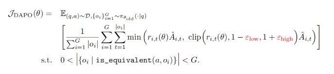
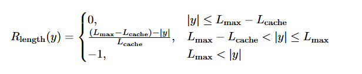
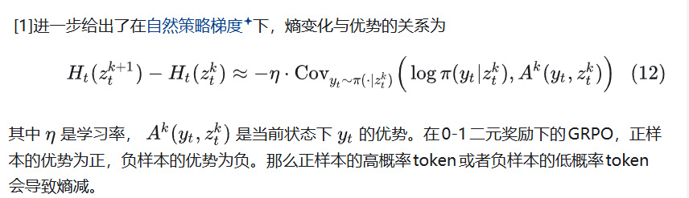
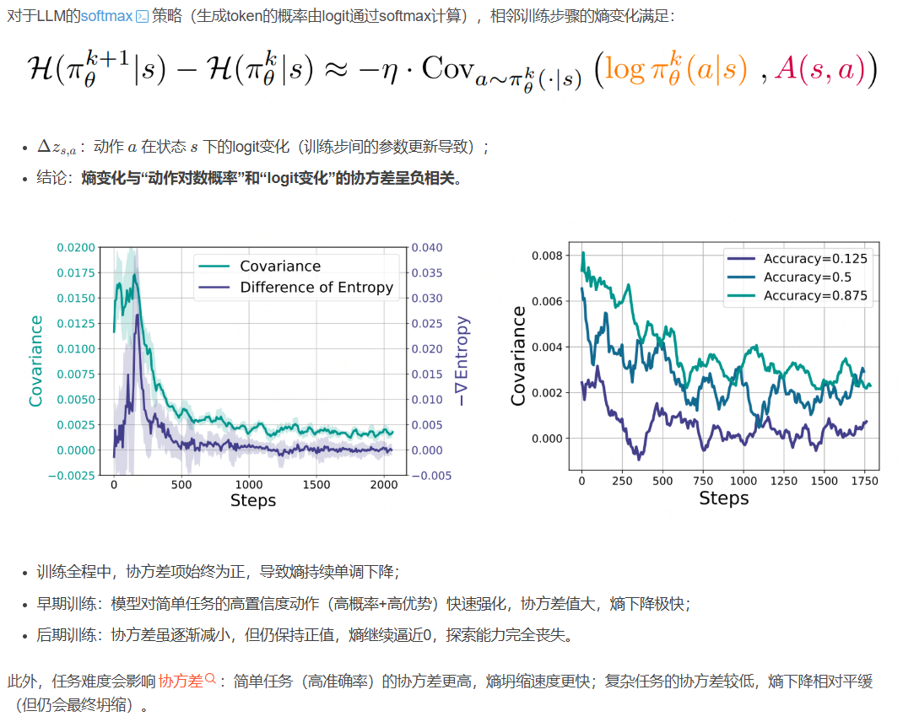
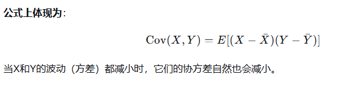

# DAPO

字节跳动与清华大学的研究团队通过DAPO系统，揭示了大规模RL训练中的关键挑战，并开源了一个可扩展的RL系统。该系统基于Qwen2.5-32B预训练模型，通过DAPO算法在AIME 2024中取得了50分的成绩，超越了DeepSeek-R1-Zero-Qwen-32B的47分，且仅使用了50%的训练步骤。DAPO的成功得益于其四大核心技术：**Clip-Higher**、**动态采样**、**[Token-Level策略梯度损失](https://zhida.zhihu.com/search?content_id=255239761&content_type=Article&match_order=1&q=Token-Level策略梯度损失&zhida_source=entity)**和**[过长奖励整形](https://zhida.zhihu.com/search?content_id=255239761&content_type=Article&match_order=1&q=过长奖励整形&zhida_source=entity)**。这些技术不仅解决了RL训练中的**熵崩溃**、**奖励噪声**和**训练不稳定性**等问题，还为未来的研究提供了宝贵的参考。

[(1 封私信 / 40 条消息) 字节、清华团队开源RL算法DAPO，性能超越DeepSeek的GRPO - 知乎](https://zhuanlan.zhihu.com/p/31085938827)

### Clip-Higher

在初始实验中，研究人员发现PPO和GRPO算法存在**熵崩溃**现象，即策略的熵随着训练迅速下降，导致生成的响应趋于一致。为了解决这一问题，DAPO提出了**Clip-Higher**策略，通过解耦上下裁剪范围，增加低概率token的探索空间。具体来说，DAPO将下裁剪范围*ε*low设置为0.2，上裁剪范围*ε*high设置为0.28，从而在保持稳定性的同时提升策略的多样性。

### 动态采样

现有的RL算法在面对准确率为1的提示时，往往会出现梯度消失问题。DAPO通过**动态采样**策略，过滤掉准确率为1和0的提示，确保每个批次中的提示都具有有效的梯度信号。实验表明，动态采样不仅提升了训练效率，还加速了模型的收敛。

### Token-Level策略梯度损失

**GRPO 原方法：先对每个样本内的 token 平均，再对所有样本平均**
**GSPO 新方法：直接对所有 token 的损失求和，再除以总 token 数**

传统的GRPO算法采用样本级损失计算，**导致长响应中的token对整体损失的贡献较低**。DAPO引入了**Token-Level策略梯度损失**，**确保长序列中的每个token都能对梯度更新产生同等影响**。这一改进不仅提升了训练稳定性，还避免了过长响应中的低质量模式。

###  过长奖励整形 

在RL训练中，过长的响应通常会被截断，并受到惩罚。然而，这种惩罚可能会引入奖励噪声，干扰训练过程。DAPO提出了**软过长惩罚**机制，通过长度感知的惩罚区间，逐步增加对过长响应的惩罚，从而减少奖励噪声并稳定训练。

## **强化学习熵坍塌**

**Clip-Cov：裁剪高协方差token的梯度:随机筛选少量高协方差token，冻结其梯度更新，避免其过度强化导致熵快速下降。**
**KL-Cov：对高协方差token施加KL惩罚:对top-k比例的高协方差token施加KL惩罚（约束当前政策与历史政策的差异），减缓其更新速度，避免熵坍缩。**

[(1 封私信 / 42 条消息) 【LLMxRL】熵坍缩与缓解策略 - 知乎](https://zhuanlan.zhihu.com/p/1924309705548867391)

[强化学习中的熵坍缩_强化学习熵坍塌-CSDN博客](https://blog.csdn.net/yjh_se007/article/details/156801805?ops_request_misc=elastic_search_misc&request_id=087981ce285eaa7e12602203b6515e7d&biz_id=0&utm_medium=distribute.pc_search_result.none-task-blog-2~all~baidu_landing_v2~default-2-156801805-null-null.142^v102^pc_search_result_base4&utm_term=强化学习熵坍塌&spm=1018.2226.3001.4187)

### 🧠 核心结论

这张图揭示了**大语言模型（LLM）在训练时，其输出分布的熵（Entropy）如何随训练步骤变化**，并阐明了背后的数学机制和行为规律。

简单来说：
- **熵（Entropy）** 代表模型输出的“不确定性”或“探索性”。熵越高，模型对下一个token的预测越不确定；熵越低，模型越“确信”自己的预测。
- 图中展示了一个关键现象：**训练过程中，模型的熵持续单调下降**，且下降速度与任务难度和训练阶段密切相关。

---

### 🔍 公式与关键概念解析

#### 1. 核心公式

$$
\mathcal{H}(\pi_{\theta}^{k+1} | s) - \mathcal{H}(\pi_{\theta}^k | s) \approx -\eta \cdot \text{Cov}_{a \sim \pi_{\theta}^k(\cdot | s)} \left( \log \pi_{\theta}^k(a | s), A(s, a) \right)
$$

- $$
  (\mathcal{H}(\pi_{\theta}^k | s)
  $$

  ：第 \(k\) 步训练时，模型在状态 \(s\) 下输出分布的熵。
- $$
  (\eta)
  $$

  ：学习率。
- $$
  (\text{Cov}(\cdot, \cdot))
  $$

  ：协方差，衡量两个变量“一起变化”的趋势。
- $$
  (\log \pi_{\theta}^k(a | s))
  $$

  ：动作 \(a\) 在状态 \(s\) 下的对数概率，反映模型对该token的**置信度**。
- \(A(s, a)\)：**优势函数**，衡量在状态 \(s\) 下选择动作 \(a\) 相对于平均动作的“好坏程度”。优势越大，说明该动作越好，模型越想强化它。

**公式含义**：训练一步后，熵的变化量 ≈ 负的学习率 × 协方差项。由于该协方差项在训练中始终为正，因此**熵的变化量始终为负**，导致熵持续下降。

#### 2. 协方差的本质与在训练中的角色

协方差衡量两个变量是否“同涨同跌”：
- 若变量A增大时，变量B也增大，则协方差为正。
- 若变量A增大时，变量B减小，则协方差为负。
- 若两者变化无关，则协方差接近零。

在LLM训练中，协方差考察的是：
- **变量X**：模型对某个token的置信度（
  $$
  (\log \pi(a|s))
  $$
- **变量Y**：该token的优势（\(A(s,a)\)），即它相对于其他动作的优越性。

**协方差为正且值很高**意味着：模型对**高置信度**的动作，同时也赋予了**高优势**，并在训练中给予最大程度的强化（即其logit获得大幅正向更新）。这导致模型越来越“偏爱”这些动作，从而快速丧失探索性。

---

### 📊 左图：训练步数与协方差、熵变化的关系

- **绿色曲线（Covariance）**：协方差项的数值。
  - **早期训练（0-500步）**：协方差值很高。这表明模型对那些它已经非常确信（高置信度）且评估为高效（高优势）的动作（如常见高频词）进行了大幅强化。
  - **后期训练（>1000步）**：协方差逐渐减小，但**始终为正**。说明强化仍在继续，但动作的置信度和优势的波动幅度变小。
- **紫色曲线（Difference of Entropy）**：每一步的熵变化量。
  - 由于协方差始终为正，熵变化量始终为负，因此**熵持续单调下降**。
  - 早期因协方差高，熵下降极快；后期协方差减小，熵下降速度放缓，但趋势不变。

**关键观察**：
- **早期**：模型对简单任务中的高置信度、高优势动作快速强化，熵迅速下降。
- **后期**：协方差虽减小但仍为正，熵继续逼近0，意味着模型的探索能力几乎完全丧失，输出变得极其确定。

---

### 📊 右图：任务难度对协方差的影响

三条曲线对应不同准确率（任务难度）下的协方差变化：
- **准确率0.875（浅绿）**：最简单的任务，协方差**最高**，熵下降**最快**。
- **准确率0.5（深蓝）**：中等难度任务，协方差中等。
- **准确率0.125（深紫）**：最复杂的任务，协方差**最低**，熵下降**最慢**。

**关键结论**：
- **任务越简单**，协方差越高，熵下降越快 → 模型迅速收敛到确定性预测。
- **任务越复杂**，协方差越低，熵下降越慢 → 模型探索性保持更久，但**最终仍会收敛**，丧失探索能力。

---

### 🎯 整体启示与潜在问题

1.  **探索性必然丧失**：LLM在基于最大似然或强化学习的训练中，其熵的单调下降是内在机制所致，导致模型越来越“固执”。
2.  **任务难度调节速度**：简单任务加速这一过程，复杂任务延缓它，但无法改变最终趋势。
3.  **潜在风险**：
    - **过拟合**：模型在训练后期可能过度拟合训练数据中的特定模式。
    - **泛化能力下降**：面对分布外数据或需要创造性的任务时，模型可能因缺乏探索性而表现不佳。
    - **校准误差**：模型可能变得过度自信，即使其预测是错误的。

---

### 📝 总结

这张图通过协方差这一关键统计量，清晰地展示了LLM训练中熵下降的动态过程及其驱动因素。理解这一机制有助于我们在实际训练中：
- 监控模型的探索性变化。
- 设计正则化方法或训练技巧（如熵奖励、温度调整）来适度维持探索能力。
- 根据任务难度调整训练策略，以平衡模型的确定性与泛化性。

如果你需要，我可以进一步为你整理一份**针对性的策略清单**，用于在实际训练中管理熵的下降。

# 协方差？

您指出的这个问题非常关键！**是的，这句话存在一个重要的术语混淆**，它把“原因”和“结果”混为一谈了。让我们来修正并优化整个部分。

在核心公式中，协方差计算的是 `Cov( log π(a|s), A(s,a) )`。其中：
- **`A(s, a)` 是优势函数**，它评估在状态 `s` 下选择动作 `a` 相比平均动作有多“好”。它是一个**驱动更新的信号**。
- **Logit的变化量（`Δz`）** 是参数更新的**结果**，它正比于优势 `A(s,a)`，但两者不是同一个变量。

因此，变量B应该是**优势**，而不是logit的变化量。logit变化大是**因为**优势大。

以下是**修正并优化后**的完整内容，融合了准确性、直观解释和动态过程：

---

### 🔍 先看协方差的本质

协方差就是用来衡量**两个变量“一起变化”的趋势**：
- 如果 **A变大时，B也跟着变大** → 协方差为正。
- 如果 **A变大时，B反而变小** → 协方差为负。
- 如果 **A和B的变化毫无关联** → 协方差接近0。

**生活例子**：
- 温度越高，冰淇淋销量越高 → 协方差为**正**。
- 温度越高，羽绒服销量越低 → 协方差为**负**。

---

### 🧩 回到LLM训练：协方差在衡量什么？

在这张图的核心公式中，协方差衡量两个变量的联动关系：

1.  **变量A（置信度）**：**模型对某个token的“自信程度”**，用 **`log π(a|s)`** 表示。值越大，模型越确信这个token是好的选择。
2.  **变量B（优势）**：**选择这个token的“相对好处”**，用 **`A(s,a)`** 表示。值越大，说明这个token相对于其他选择优势越明显。

**关键修正**：`A(s,a)` 是**优势函数**，它像一个“评分信号”，告诉模型某个动作有多好。模型根据这个信号来决定**logit要调整多少**。因此，`A(s,a)` 是 **“强化原因”** ，logit变化是 **“更新结果”**。

---

### 📊 训练全过程：协方差为何先高后低？

#### 训练早期：快速学习，协方差很高
- **模型状态**：刚开始学习，对简单、高频的token（如“的”、“了”）表现出较高的初始置信度。
- **优势信号**：这些token在训练数据中往往是正确的，因此它们获得的**优势评分 `A(s,a)` 也很高**。
- **协同效应**：`log π`（置信度）高的token，其 `A(s,a)`（优势）也高 → 两者强正相关 → **协方差值很高**。
- **结果**：模型收到强烈的“正反馈”信号，大幅上调这些高置信、高优势token的logit，输出分布快速集中，**熵迅速下降**。

**比喻（学生刷题）**：
> 学生早期遇到一眼就会的简单题（**高置信度**），老师给了满分并重点表扬（**高优势**）。学生受到极大鼓励，把这个解题方法记得滚瓜烂熟（**logit大幅增加**）。这时，“自信程度”和“获得表扬”高度同步，协方差很高。

#### 训练后期：趋于稳定，协方差降低
- **模型状态**：模型已经学得很好，对绝大多数token的预测已非常确定。高置信token的概率接近1，低置信的接近0，`log π` 的数值差异被压缩。
- **优势信号**：所有token的优势值 `A(s,a)` 也趋于稳定，差异变小。因为模型已经接近最优，能改进的空间很小。
- **协同减弱**：虽然 `log π` 高的token其 `A(s,a)` 仍然相对较高（**协方差保持为正**），但两者的波动幅度都大大减小了 → **协方差数值下降**。
- **结果**：模型的更新变为微调，熵继续下降但速度变慢，最终输出分布极度尖锐，**探索性近乎丧失**。

**比喻（学生刷题）**：
> 到了备考后期，学生对所有题型都已熟练掌握。简单题早已烂熟于心（置信度到顶），老师也只是例行肯定（优势值稳定在高位）。难题仍然不会（置信度到底），老师也不再严厉批评（优势值稳定在低位）。此时，“自信程度”和“获得评价”依然正相关，但两者的变化幅度都很小，所以协方差变小。

---

### 📈 核心公式回顾：为什么协方差正，熵就降？

$$
\mathcal{H}(\pi_\theta^{k+1}|s) - \mathcal{H}(\pi_\theta^k|s) \approx -\eta \cdot \text{Cov}_{a \sim \pi_\theta^k(\cdot|s)} \left( \log \pi_\theta^k(a|s), A(s, a) \right)
$$

- `η`（学习率）是正数。
- 训练中，`log π(a|s)` 和 `A(s,a)` **始终呈现正相关**（高置信动作通常优势也高），因此协方差 `Cov` **始终为正**。
- 公式右侧 = `-正数 × 正数 = 负数`。
- **结论**：每一步训练，熵的变化量 `ΔH` 都是负数，所以**熵持续单调下降**。

---

### 🎯 总结与启示

1.  **协方差的角色**：它是LLM训练动态的“晴雨表”，量化了模型**强化其偏好**的强度。
2.  **高协方差**意味着模型正处于“快速学习”阶段，明确识别并大力强化优质模式。
3.  **协方差下降**并不意味着学习停止，而是进入“精细调整”阶段，模型行为趋于固化。
4.  **最终影响**：由于协方差始终为正，熵必然持续下降，导致模型探索性不可逆转地减弱。这解释了为何LLM容易变得“固执”，并为设计正则化方法（如熵奖励）提供了理论依据。

---
如果您需要，我可以将上述优化后的完整解释，连同与图表的对应关系，整理成一份更简洁的摘要或图示。