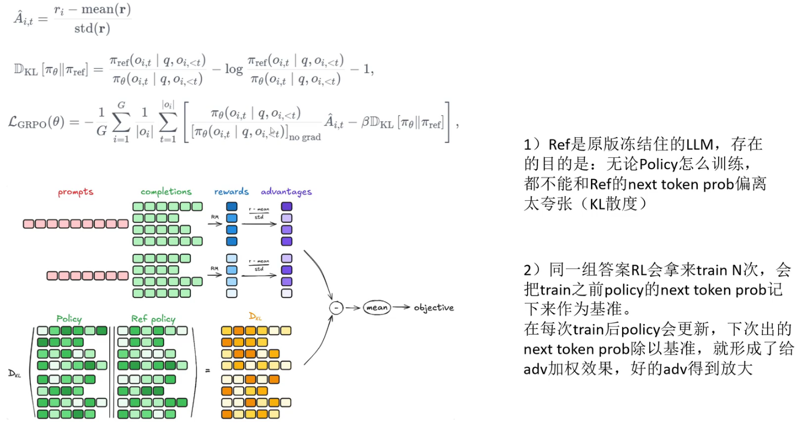
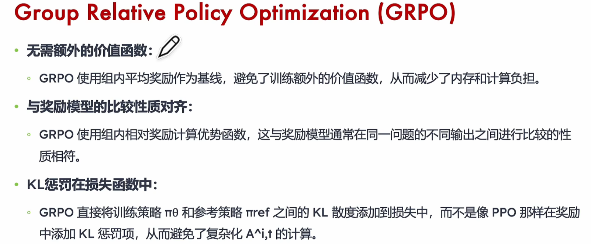
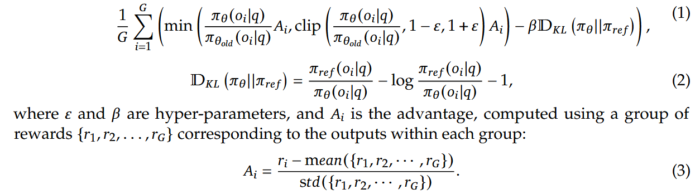

## GRPO

#### 论文公式：

**1、先使用old模型对于一个问题采样得到多个回答**

**2、使用要训练的策略网络得到(1)中采样回答里各个token的概率，根据old模型以及要训练的策略模型得到(1)中每个回答里各个token的概率，这样就可以计算DKL了。**

**3、使用奖励模型计算奖励，再计算组内相对优势**

**4、使用公式(1) 优化策略网络**

**5、在(1)中得到的数据可以迭代多轮，多轮迭代过程中，old模型对各个回答token的概率实际上是不需要计算的，只需要重新计算(1)中各个回答里token在要训练的策略网络的概率就好了**

## 一、完整GRPO训练流程（豆包回答的，和我总结的一样）

1. **旧策略采样生成候选回答**：使用固定的old模型（通常是上一轮训练完成的策略模型，或SFT预热后的基准模型），对单个输入问题q进行采样，生成G个不同的回答组成候选组{A₁, A₂, ..., A_G}（G为组大小，随任务复杂度自适应调整，如数学推理任务G=8，通用任务G=4）。此步骤的核心是依托old模型获取多样化的候选输出，为后续“组内相对评估”提供基础。
2. **双模型概率计算与DKL求解**：首先计算两个关键概率：① old模型对候选组中每个回答的逐token生成概率（记为P_old）；② 待训练的策略网络对同一批候选回答的逐token生成概率（记为P_θ）。随后基于这两组概率，通过GRPO专属的KL散度公式计算策略偏离度：DKL(π_θ ∥ π_old) = (P_old / P_θ) - log(P_old / P_θ) - 1。这一步的目的是量化新策略与基准策略的差异，为后续稳定更新提供约束。
3. **奖励计算与组内相对优势求解**：将候选组的所有回答输入奖励模型，得到每个回答的原始奖励值{r₁, r₂, ..., r_G}（奖励维度包括回答准确性、格式规范性、语言一致性等）。**基于原始奖励计算组内相对优势：A_i = [r_i - mean(r₁~r_G)] / std(r₁~r_G)**，通过归一化消除组间奖励尺度差异，精准衡量单个回答在组内的相对优劣。
4. **基于公式（1）优化策略网络**：将步骤2得到的概率比（P_θ/P_old）、DKL值，以及步骤3得到的相对优势A_i，代入GRPO核心目标函数（公式1），通过梯度上升最大化目标函数，完成策略网络的一次参数更新。目标函数核心逻辑为：min(概率比×A_i, clip(概率比, 1-ε, 1+ε)×A_i) - β×DKL，既强化优质回答的生成概率，又限制策略突变。
5. **同一批数据的多轮迭代优化**：将步骤1采样得到的候选组数据复用，进行多轮策略更新。此过程中，仅需重复计算策略网络对候选回答的逐token概率（P_θ），old模型对这些回答的token概率（P_old）无需重新计算，始终沿用步骤s2的初始计算结果。

#### **Outcome-Supervised RL**（OSRL，结果监督强化学习）是一种 RL 范式，智能体仅在**轨迹 / 序列结束时获取单一整体奖励**（如 “成功 / 失败”“得分”），而非每步即时奖励，核心挑战是把末端结果的奖励合理分配到每步动作（信用分配），广泛用于 LLM 对齐、机器人控制、临床试验等真实场景。例如：GRPO

#### **“过程监督强化学习（Process-Supervised RL，PSRL）”**，也常被称作 “每步监督 RL” 或 “即时奖励 RL”。例如：PPO

# RLVR：可验证奖励强化学习（Reinforcement Learning with Verifiable Rewards）

RLVR 是一种**以客观、可程序化验证的奖励信号**驱动的强化学习范式，核心是用确定性验证函数替代主观人类反馈或黑盒奖励模型，让训练信号直接锚定 “可验证真理”，尤其适合提升大模型推理能力。

#### RLHF（人类反馈 RL） 

奖励信号：主观、人类标注、偏好排序  标注成本：高（持续人工标注） 核心挑战：人类偏好一致性、对齐税  适用场景：自然语言生成、对话（偏好导向）

grpo->gspo->dapo->aspo->sapo

这几篇论文（再加上 GRPO）代表了 **LLM Post-training（特别是 RLHF/RLAIF）** 领域最前沿的几个优化方向。它们的核心脉络是：**如何摆脱传统 PPO 的复杂性（Actor-Critic），并让模型在“Group（组）”级别进行更稳定、更高效的自我进化。**

为了让你不仅能读懂，还能建立起知识体系，我建议按照**“核心范式 -> 结构演进 -> 工程实战 -> 数学精修”**的逻辑顺序来阅读：

------

### 建议阅读顺序

#### 1. GRPO (Group Relative Policy Optimization)

- **来源：** DeepSeek (DeepSeekMath / DeepSeek-V3 相关技术)
- **为什么先读：** 这是**地基**。
  - 目前这批论文（包括你图中的 ASPO、GSPO）几乎都是在 GRPO 的基础上进行修补或反思。
  - **核心考点：** 搞懂它如何**去掉了 Critic 模型**（只用 Group Normalization），以及它如何通过采样一组输出（Group）来计算 Advantage。不读懂它，后面的论文你不知道它们在优化什么。

#### 2. GSPO (Group Sequence Policy Optimization) - *图中高亮论文*

- **作者：** Zheng 等 (Qwen/Alibaba 相关团队)
- **为什么第二个读：** 这是对 GRPO 的**“机制级”反思**。
  - GRPO 虽然按组采样，但计算 Loss 时还是基于 Token 级别的。GSPO 提出一个尖锐的观点：**Token 级别的权重是充满噪声的**。
  - 它主张应该在**Sequence（序列）级别**进行优化。这篇论文会让你对“到底该奖励 Token 还是奖励整个句子”有更深的理解，是对 GRPO 范式的一个重要修正。

#### 3. DAPO (An Open-Source LLM Reinforcement Learning System at Scale)

- **作者：** Yu 等
- **为什么第三个读：** 这是**“工程与实战”的集大成者**。
  - 读完前两篇全是数学推导，这篇能让你落地。DAPO 不仅提出了算法（**Decoupled Clip & Dynamic Sampling）**，更重要的是它发布了一个**开源系统**。
  - 它讲了很多**“使得 RL 能跑起来”**的 Tricks，比如动态采样（Dynamic Sampling）来解决数据效率问题。如果你想自己复现或训练，这篇最重要。

#### 4. ASPO (Asymmetric Importance Sampling Policy Optimization)

- **作者：** Wang 等
- **为什么第四个读：** 这是**“数学细节”的精修**。
  - 它深入到了 PPO/GRPO 的核心公式——**重要性采样（Importance Sampling, IS）**。
  - 它发现了一个问题：**我们对“好样本”和“坏样本”的更新力度是不对称、不公平的**。**ASPO 通过翻转这一比例来稳定训练**。属于“魔鬼在细节中”的论文，适合在理解大框架后去钻研如何提升稳定性。

#### 5. Soft Adaptive Policy Optimization (SAPO)

- **作者：** Gao 等
- **为什么最后读：** 同样是**“数学细节”的精修**。
  - GRPO 和 PPO 都使用“Hard Clip”（硬截断）来防止模型更新太快。SAPO 认为这种硬截断丢失了太多信息，提出了一种“Soft”的自适应机制。
  - 可以把它和 ASPO 放在一起看，都是针对 Loss 函数中具体某一项的改进。

------

### 总结：你的知识构建路径

1. **入门 (GRPO)：** 还没看过 DeepSeekMath 论文的话，先去搜 GRPO 的部分，理解“Group Normalization”是把双刃剑。
2. **进阶 (GSPO)：** 你的高亮论文。关注它如何论证“Token-level 也是一种噪声”，以及它是如何处理 MoE 模型训练稳定性的（这是它的一个大卖点）。
3. **实战 (DAPO)：** 关注它的 System Design 和 Dynamic Sampling 策略。
4. **钻研 (ASPO/SAPO)：** 关注 Loss 函数的导数和梯度裁剪细节。

**下一步建议：**

你可以先快速浏览 **GSPO** 的 Introduction 部分，特别是它批评 GRPO "Token-level importance ratios are ill-posed"（Token 级重要性比率定义不当）的那一段，这能帮你迅速抓住这批论文争论的核心焦点。