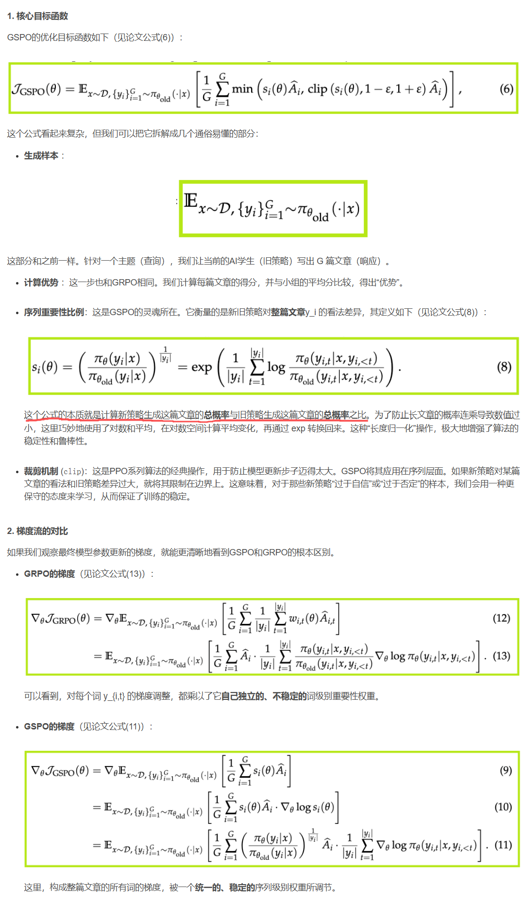
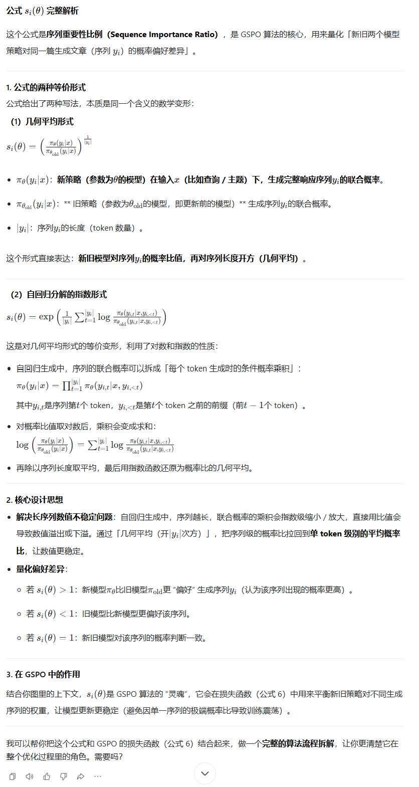

# GSPO

[GSPO算法保姆级教程（超详细）从零基础入门到精通，阿里Qwen团队手把手教你稳定大模型强化学习，看这一篇就够了！-CSDN博客](https://blog.csdn.net/2401_85375298/article/details/150518933)

GRPO等算法的问题就出在学习与更新这一步。它们的核心机制是重要性采样，这是一种在统计学中修正分布偏差的方法。通俗地说，就是AI学生在更新时需要思考：“对于我写的每一个词，新的写作思路和旧的写作思路有多大差别？”这个差别，就是重要性权重。

GRPO的做法是，**它会把80分这个整体奖励，试图分配给文章中的每一个词。它会逐字分析：“‘浩瀚’这个词用得不错，应该多给点奖励；‘然后’这个词用得一般，奖励就少点。”**

听起来似乎合理**，但这里存在一个致命的理论缺陷。奖励是针对“宇宙”这篇文章这个完整序列给出的，而GRPO却试图在单个词（Token）这个层级上进行归因和校正**。这就像一个团队项目拿了年度大奖，老板却不去分析成功的项目管理和团队协作，反而拿着放大镜去研究每个成员每分钟的工作效率，并以此作为奖励依据。

这种“张冠李戴”式的操作会带来灾难性后果：

**高方差噪声**：对单个词的归因极其困难且不稳定。一个词用得好不好，往往取决于上下文。强行在词级别计算重要性权重，会引入巨大的、毫无意义的随机波动，也就是“高方差噪声”。

**误差累积**：对于一篇千字长文，这种噪声会逐字累积。一个微小的扰动，经过上千次累积和放大，足以让整个学习过程偏离正轨，最终导致模型崩溃。

**MoE模型的噩梦**：对于混合专家（MoE）模型，问题会变得更糟。MoE模型在生成每个词时，会动态选择不同的“专家”子网络。模型稍微更新，专家选择的路径就可能天差地别，导致单个词的生成概率剧烈波动。这使得GRPO词级别的权重计算变得更加不可靠，训练几乎无法收敛。为了解决这个问题，研究者不得不设计出“路由重放（Routing Replay）”这样复杂且昂贵的“补丁”。

