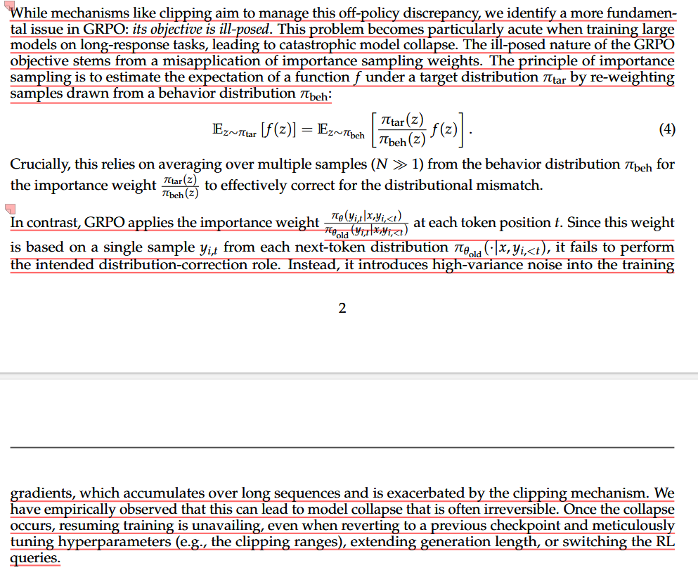
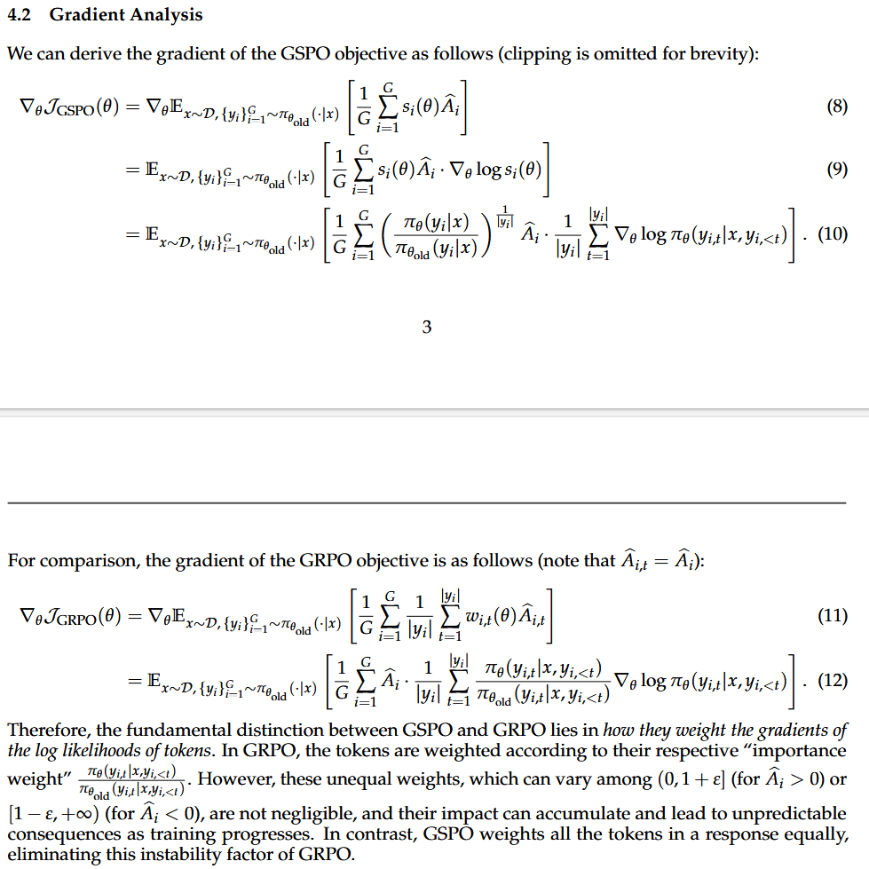
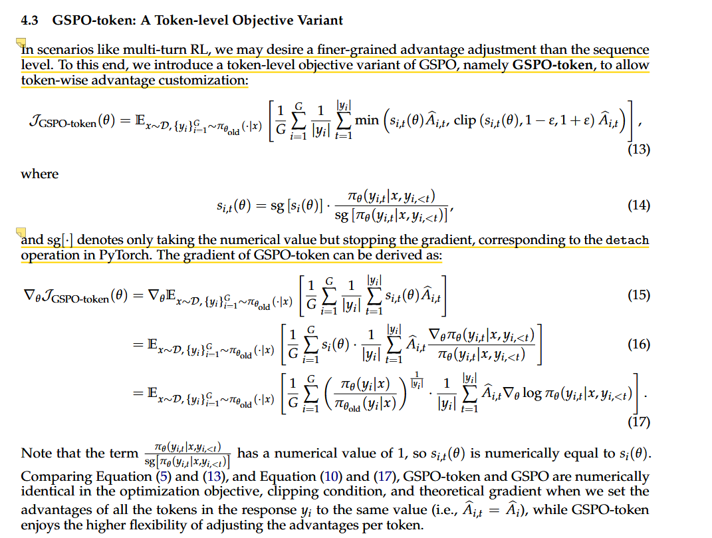

# GSPO

[详解Qwen3-GSPO和DeepSeek-GRPO两大强化学习算法的区别 - 知乎](https://zhuanlan.zhihu.com/p/1932791271363154917)

[GSPO算法保姆级教程（超详细）从零基础入门到精通，阿里Qwen团队手把手教你稳定大模型强化学习，看这一篇就够了！-CSDN博客](https://blog.csdn.net/2401_85375298/article/details/150518933)

GRPO等算法的问题就出在学习与更新这一步。它们的核心机制是重要性采样，这是一种在统计学中修正分布偏差的方法。通俗地说，就是AI学生在更新时需要思考：“对于我写的每一个词，新的写作思路和旧的写作思路有多大差别？”这个差别，就是重要性权重。

GRPO的做法是，**它会把80分这个整体奖励，试图分配给文章中的每一个词。它会逐字分析：“‘浩瀚’这个词用得不错，应该多给点奖励；‘然后’这个词用得一般，奖励就少点。”**

听起来似乎合理**，但这里存在一个致命的理论缺陷。奖励是针对“宇宙”这篇文章这个完整序列给出的，而GRPO却试图在单个词（Token）这个层级上进行归因和校正**。这就像一个团队项目拿了年度大奖，老板却不去分析成功的项目管理和团队协作，反而拿着放大镜去研究每个成员每分钟的工作效率，并以此作为奖励依据。

这种“张冠李戴”式的操作会带来灾难性后果：

#### **高方差噪声**：对单个词的归因极其困难且不稳定。一个词用得好不好，往往取决于上下文。强行在词级别计算重要性权重，会引入巨大的、毫无意义的随机波动，也就是“高方差噪声”。

#### **误差累积**：对于一篇千字长文，这种噪声会逐字累积。一个微小的扰动，经过上千次累积和放大，足以让整个学习过程偏离正轨，最终导致模型崩溃。

#### **MoE模型的噩梦**：对于混合专家（MoE）模型，问题会变得更糟。MoE模型在生成每个词时，会动态选择不同的“专家”子网络。模型稍微更新，专家选择的路径就可能天差地别，导致单个词的生成概率剧烈波动。这使得GRPO词级别的权重计算变得更加不可靠，训练几乎无法收敛。为了解决这个问题，研究者不得不设计出“路由重放（Routing Replay）”这样复杂且昂贵的“补丁”。

这段话是对 **GRPO (Group Relative Policy Optimization)** 算法的一个非常尖锐的理论批评。作者认为 GRPO 的数学根基（Objective Function）是**“定义不当” (ill-posed)** 的，这直接导致了模型在大模型、长文本任务训练中容易出现“雪崩” (Collapse)。

为了让你听懂，我把这段话拆解成三个逻辑层级：**“原本的数学原理”** vs **“GRPO 的错误做法”** vs **“导致的灾难后果”**。

### 1. 核心论点：重要性采样的误用

这段话的核心在于**“重要性采样” (Importance Sampling, IS)** 这个概念。

- **原本的原理 (Equation 4)：**

  在强化学习（PPO/GRPO）中，我们通常用旧策略（Behavior Policy, $\pi_{beh}$）产生数据，来估算新策略（Target Policy, $\pi_{tar}$）的效果。

  为了纠正新旧策略的差异，我们需要乘上一个**权重 (Weight)**： $\frac{\pi_{tar}}{\pi_{beh}}$。

  **关键点来了：** 这种估算方法有一个前提——**你需要采样很多次（$N \gg 1$）取平均**，这个概率分布的修正才是准确的。

- **GRPO 的做法 (The "Misapplication")：**

  作者指出，GRPO 在计算这个权重时，是在**每一个 Token 的位置 ($t$)** 上单独计算的。

  也就是说，对于每一个 token 的生成概率，它只根据**当前这一个采样 ($y_{i,t}$)** 来计算权重。

  - **通俗理解：** 这相当于做民意调查。原本的数学原理要求你“调查 1000 个人然后取平均”才能代表民意；但 GRPO 的做法相当于“只调查了 1 个人”，就直接断定这就代表了全体民意。

### 2. 造成的后果：高方差噪声 (High-Variance Noise)

因为 GRPO 在每个 Token 上只用“单样本”来计算权重，这个权重极其不稳定。

- **噪声引入：** 这种单样本计算无法真正起到“修正分布”的作用，反而引入了巨大的**方差 (Variance)**。
- **长序列累积：** 如果你只是生成一句话还好，但如果是长思维链（Long-response tasks），这种噪声会在每一个 Token 步骤上不断累积。
- **梯度爆炸/消失：** 这种累积的噪声会导致更新模型的**梯度 (Gradients)** 变得毫无意义（乱指方向）。

### 3. 最终结局：灾难性坍塌 (Catastrophic Model Collapse)

这是这段话里最严重的警告。

- **模型坍塌：** 由于梯度充满了噪声，模型会被训练坏，彻底丧失生成能力（比如开始输出乱码或无限重复）。
- **不可逆 (Irreversible)：** 作者强调，一旦发生这种坍塌，**神仙难救**。
  - 回滚存档 (Revert Checkpoint) 没用。
  - 调参 (Tuning Hyperparameters) 没用。
  - 缩短生成长度也没用。

------

### 总结一下（说人话版）：

这篇论文（GSPO）在指着 GRPO 的鼻子骂：

> “你 GRPO 的数学公式根本就是错的！重要性采样（Importance Sampling）明明要求多样本取平均才能算得准，你却在每一个 Token 上只用一个样本硬算。这导致你的计算充满了随机噪声。在做长文本任务时，这些噪声越积越多，直接把模型脑子训坏了，而且坏了就修不好！”

**这也就是为什么这篇论文（GSPO）后来提出要按“Group Sequence”（整个序列组）来优化，而不是按 Token 来优化，目的就是为了解决这个“样本量太少导致方差太大”的问题。**

这两张图（结合之前的上下文，应该是来自 GSPO 论文）从**数学推导**和**直观原理**两个角度，解释了为什么 DeepSeek 原版的 GRPO 在训练长文本时容易“崩盘”，以及 GSPO 是如何修复这个问题的。

简单来说，这是一个关于**“该奖励整个句子，还是奖励每个单词？”**的争论。

我把你提供的两张图拆解成三个关键点来解释：

### 1. 核心矛盾：GRPO 错在哪里？（图1解释）

图1 指出了 GRPO 犯了一个统计学上的忌讳：**滥用重要性采样（Importance Sampling）**。

- **理论要求：** 重要性采样（也就是公式里的那个 $\frac{\pi_{new}}{\pi_{old}}$ 比率）是为了修正概率分布的差异。为了算得准，数学上要求必须基于**大量样本（$N \gg 1$）** 取平均。
- **GRPO 的做法：** 它在**每一个 Token（单词）** 的位置上，都去单独计算这个比率。但问题是，对于特定的某一个 token，你只采样了一次（$y_{i,t}$ 是 Single Sample）。
- **后果：**
  - 因为样本量不够（只有1个），算出来的这个“比率”波动极极大。
  - 这引入了**高方差噪声（High-variance noise）**。在长文本任务中，这种噪声会随着序列长度不断累积，最终导致**模型坍塌（Model Collapse）**，而且这种崩盘通常是不可逆的。

### 2. 数学上的实锤：权重的位置不同（图2解释）

图2 展示了 GSPO 和 GRPO 在计算**梯度（Gradient）**时的本质区别。请看公式里的求和符号 $\sum$ 和权重的位置：

- **GRPO 的公式 (Eq 12)：**

  $$\dots \sum_{t=1}^{|y_i|} \frac{\pi_\theta(y_{i,t}|...)}{\pi_{\theta_{old}}(y_{i,t}|...)} \nabla_\theta \log \pi_\theta ...$$

  **注意看：** 那个分数（重要性权重）是在求和符号 $\sum$ **里面**的。

  **这意味着：** GRPO 认为一句话里的**每一个词**重要性都不一样。有的词可能权重是 0.1，有的词权重是 100。这种剧烈的波动会让模型感到非常困惑，导致训练不稳定。

- **GSPO 的公式 (Eq 10)：**

  $$\dots \left( \frac{\pi_\theta(y_i|x)}{\pi_{\theta_{old}}(y_i|x)} \right)^{\frac{1}{|y_i|}} \sum_{t=1}^{|y_i|} \nabla_\theta \log \pi_\theta ...$$

  **注意看：** 那个权重（整体概率比率）被提到了求和符号 $\sum$ 的**外面**。

  **这意味着：** GSPO 认为，**只要这整个句子是好的，那么这句话里的每一个词都应该被平等地对待**。它给整个序列计算一个统一的权重，然后应用到所有 token 上。

### 3. 通俗类比

想象你在批改一篇学生作文（长文本生成）：

- **GRPO 的做法（微观管理）：** 你拿着放大镜看。
  - 看到第 5 个词写得很好，你大喊：“这个词给 100 倍奖励！”
  - 看到第 6 个词用得一般，你大喊：“这个词只给 0.1 倍奖励！”
  - **结果：** 学生被你搞晕了，不知道到底该怎么写，心态崩了（模型坍塌）。
- **GSPO 的做法（宏观把控）：** 你通读全文。
  - 觉得这篇文章写得不错，你决定：“这篇文章整体质量很高，所以文章里的每一个词，我都给它 1.2 倍的稳健奖励。”
  - **结果：** 信号非常稳定，学生知道整体方向是对的，能平稳进步。

### 总结

这两张图在说：**GRPO 试图在 Token 级别做过于精细的调整，结果引入了数学上无法消除的噪声；而 GSPO 通过退回到 Sequence（序列）级别来计算权重，消除了这种不稳定性。**

这部分内容确实容易让人晕，因为它乍一看像是作者在“打自己的脸”：刚才还在图 1、图 2 里把 GRPO 的“Token 级优化”骂得一无是处，怎么到了图 3 (Section 4.3) 又搞出来一个 `GSPO-token`（Token 级变体）？

别急，这是一个非常精妙的“回马枪”。简单来说，这是为了**解决特殊场景下的灵活度问题，同时保留 GSPO 的稳定性**。

我把它拆解成三个逻辑层来解释：

### 1. 为什么需要这个变体？（痛点）

作者虽然证明了“给整个序列统一打分（GSPO）”更稳定，但在现实世界里，有时候我们**不得不**给某些 Token 单独打分。

- **场景举例：** 多轮对话（Multi-turn RL）。
  - 比如模型说了一大段话，前半段是对的，后半段开始胡说八道。
  - 如果用标准的 GSPO，你只能给这一整段话打一个分（要么全好，要么全坏），这显然不公平，也浪费了数据。
  - 我们需要一种机制，既能像 GRPO 那样精确到 Token 级别给分（Advantage Adjustment），又不会像 GRPO 那样因为数学定义错误而崩盘。

### 2. 它是怎么做到的？（核心魔法：Stop Gradient）

GSPO-token 的核心在于公式 (14) 里的那个 `sg`（Stop Gradient，在 PyTorch 里就是 `.detach()`）。

$$s_{i,t}(\theta) = \text{sg}[s_i(\theta)] \cdot \frac{\pi_\theta(y_{i,t}|...)}{\text{sg}[\pi_\theta(y_{i,t}|...)]}$$

这是作者玩的一个数学魔术：

- **第一步（保留稳定性）：** 它先算出那个**稳定的、基于全序列的权重** $s_i(\theta)$（就是图2里 GSPO 用的那个）。
- **第二步（上锁）：** 用 `sg` 把这个权重“锁住”。意思就是告诉 PyTorch：“这个数只是个常数（数值），计算梯度时**不要**对它求导，不要更新它背后的参数。”。
- **第三步（借尸还魂）：** 把这个锁住的数值，乘到当前的 Token 概率上。

**效果：** 这样一来，梯度的**方向**依然是由那个稳定的序列权重 $s_i$ 指导的（不乱跑），但是梯度的**力度**可以根据每个 Token 的 Advantage ($\hat{A}_{i,t}$) 进行微调。

### 3. 结论：由于“锁”的存在，它是安全的

最下面那段话揭示了本质：

> "GSPO-token and GSPO are numerically identical... when we set the advantages... to the same value"

作者证明了：如果你给每个 Token 的奖励是一样的，那么这个 `GSPO-token` 算出来的梯度，跟标准的 `GSPO` **完全一模一样**。

**总结一下：**

- **GRPO 的 Token 级：** 是“真乱动”。因为它把不稳定的权重放进了求导链条里，导致梯度乱指方向。
- **GSPO-token 的 Token 级：** 是“假乱动”。它虽然允许你给不同 Token 不同的奖励分数（Advantage），但它控制方向的核心罗盘（Importance Weight）依然是被“锁”在序列级别的。

所以，这一节是在说：**“如果你非要精确控制每个 Token 的奖励，请用我这个 GSPO-token 公式，千万别回去用 GRPO 那个错误的公式。”**