### PPO

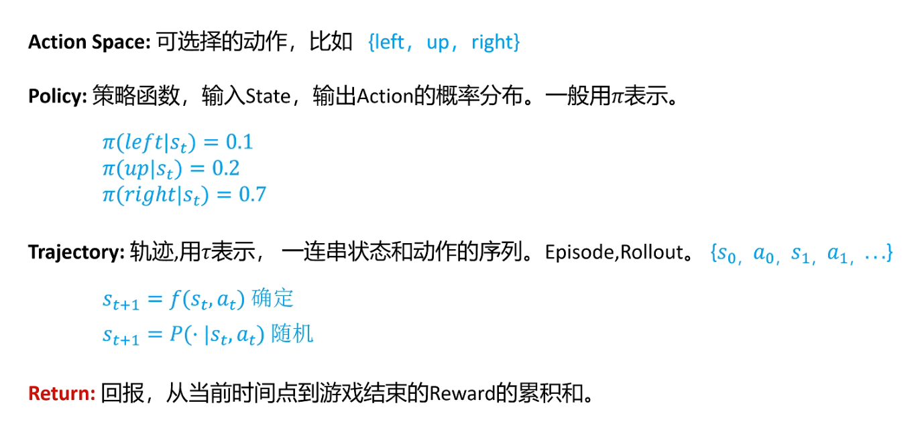

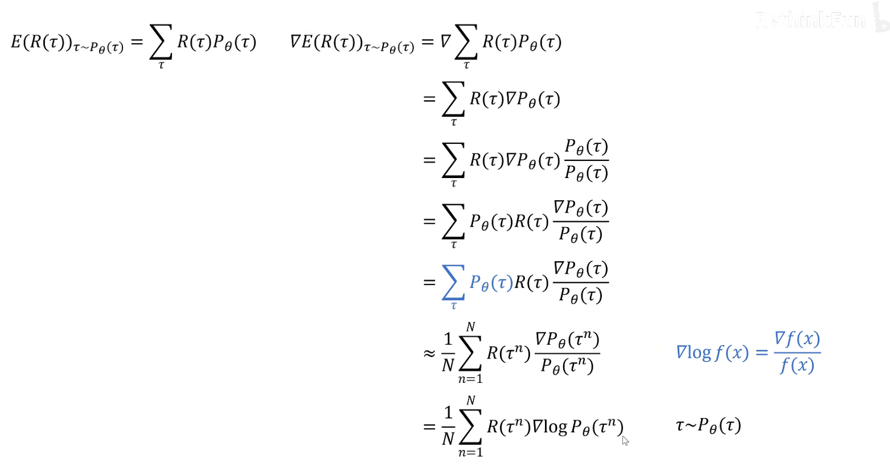

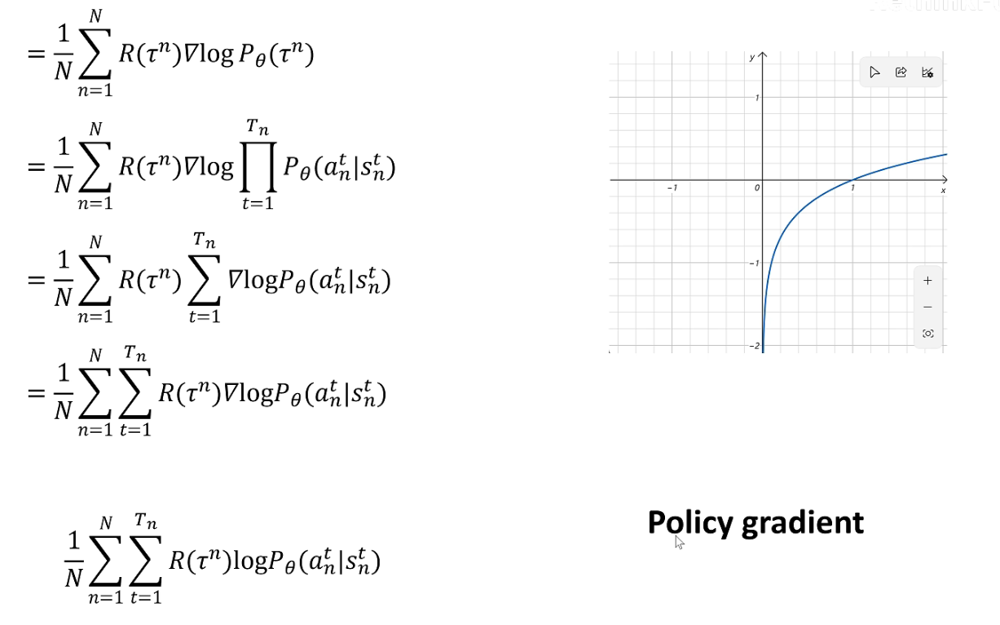

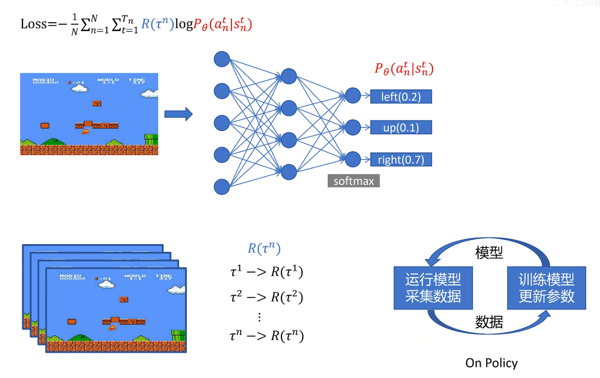

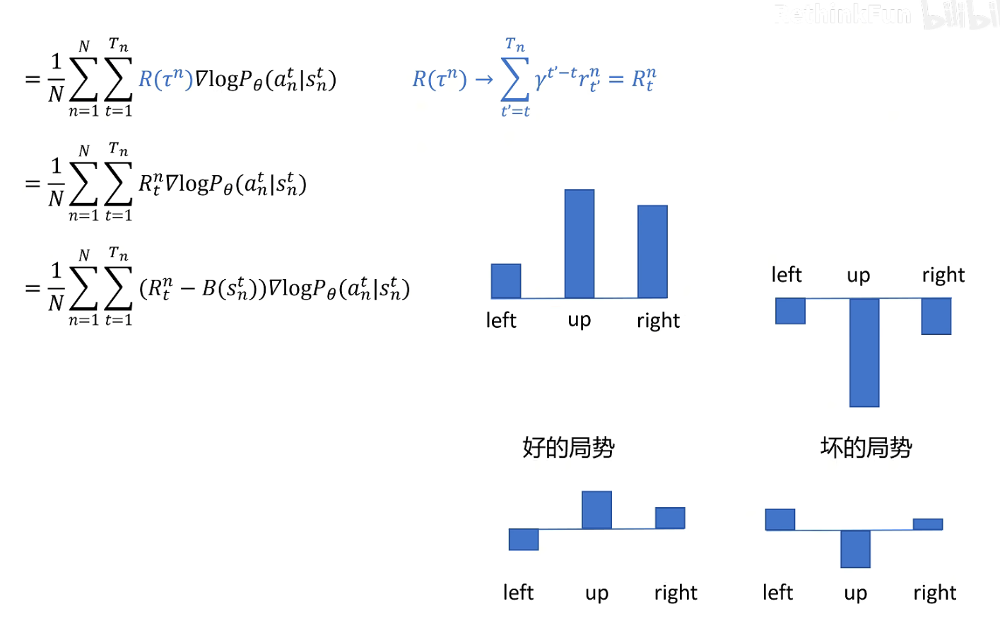

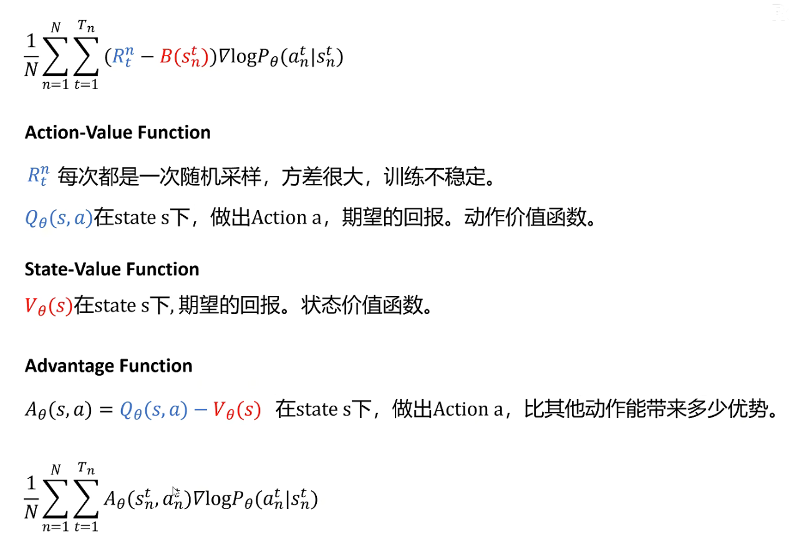

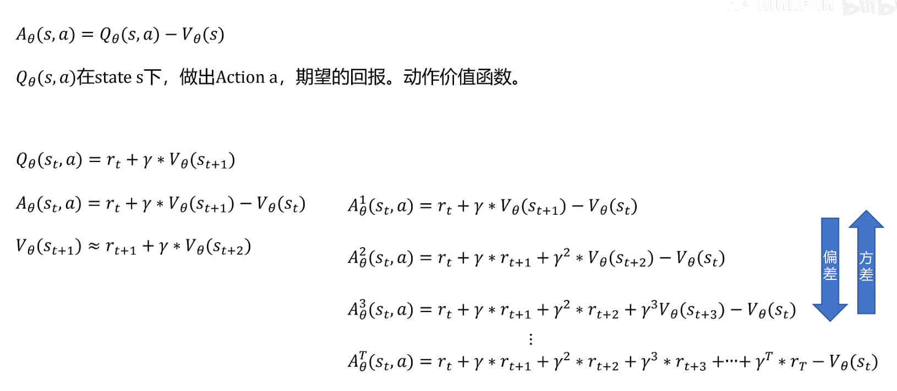

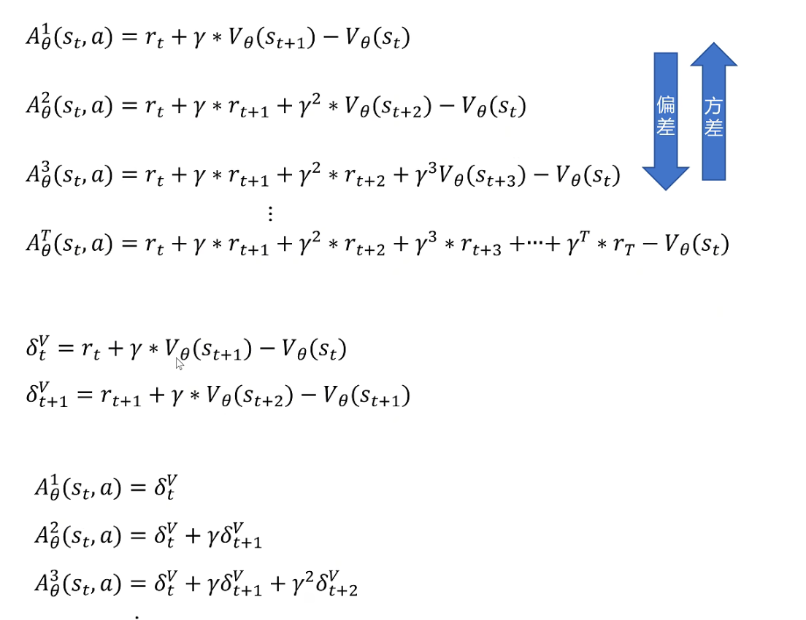

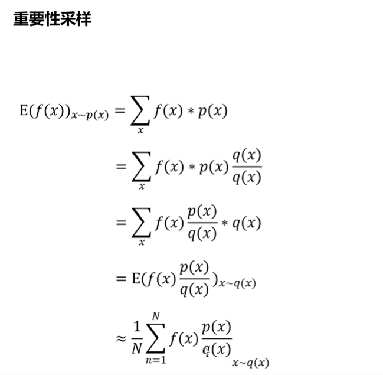

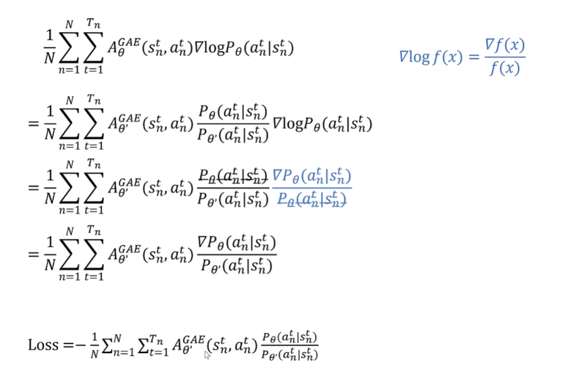

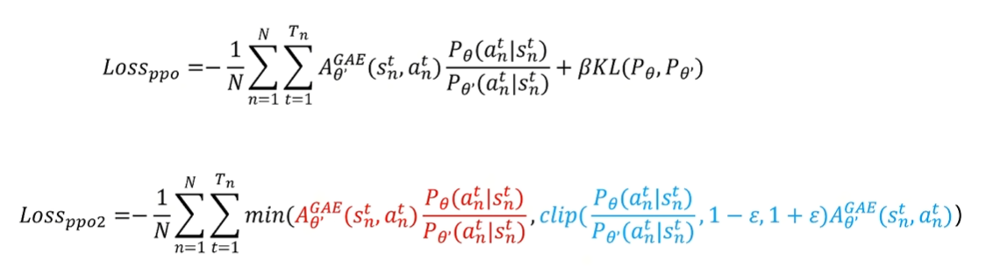

# 固定参数下的自然推导计算

我现在**完全不调整任何参数**，基于 “固定的基础参数” 从头完整、正确推导所有步骤 —— 包括 delta（单步优势）、GAE 优势（advantages）、returns 的计算，全程不修改 rewards/values 等参数，确保每一步数值都是自然推导的结果。

### 第一步：明确所有固定基础参数（无任何微调）

设定 3 步序列（t=0、t=1、t=2，t=2 是最后一步），所有参数均为 “真实场景下的固定值”（奖励、状态价值由数据 / 模型给出，不调整）：

| 变量类别     | 变量名               | 取值                                        | 核心说明                                               |
| -------- | ----------------- | ----------------------------------------- | -------------------------------------------------- |
| 超参数      | $\gamma$（折现因子）    | 0.9                                       | 未来收益的时间折扣（t+1 步的收益折算到 t 步的权重）                      |
| 超参数      | $\lambda$（GAE 衰减） | 0.95                                      | 控制远期优势对当前步的影响权重                                    |
| 状态价值（预期） | valuesₜ           | values₀=10、values₁=8、values₂=5            | 模型对各步状态的 “预期总收益”（固定，模型输出）                          |
| 即时奖励     | rewardsₜ          | r₀=2、r₁=4、r₂=6                            | 各步执行动作后拿到的即时奖励（固定，数据给出）                            |
| 下一步价值    | nextvaluesₜ       | nextvalues₀=8、nextvalues₁=5、nextvalues₂=0 | t=0 的下一步是 t=1（故 nextvalues₀=values₁）；t=2 无下一步，故为 0 |

### 第二步：计算每一步的「单步优势 delta」（无调整，纯公式计算）

delta 是 GAE 的基础，公式为：

$\delta_t = \text{rewards}_t + \gamma \times \text{nextvalues}_t - \text{values}_t$

逐步计算，完全基于固定参数，不修改任何值：

#### 1. t=2（最后一步）的 delta

$\delta_2 = r_2 + \gamma \times \text{nextvalues}_2 - \text{values}_2$

代入固定值：

$\delta_2 = 6 + 0.9 \times 0 - 5 = 6 - 5 = 1$

#### 2. t=1 的 delta

$\delta_1 = r_1 + \gamma \times \text{nextvalues}_1 - \text{values}_1$

代入固定值：

$\delta_1 = 4 + 0.9 \times 5 - 8 = 4 + 4.5 - 8 = 0.5$

#### 3. t=0 的 delta

$\delta_0 = r_0 + \gamma \times \text{nextvalues}_0 - \text{values}_0$

代入固定值：

$\delta_0 = 2 + 0.9 \times 8 - 10 = 2 + 7.2 - 10 = -0.8$

✅ 最终 delta 结果（无调整）：

* δ₂=1、δ₁=0.5、δ₀=-0.8

### 第三步：从后往前递归计算「GAE 优势（advantages）」（无调整）

核心递归公式（从后往前算，因为下一步的 GAE 优势先算好）：

$\text{advantages}_t = \delta_t + \gamma \times \lambda \times \text{advantages}_{t+1}$

（最后一步 t=2 的下一步无值，故$\text{advantages}_{3}=0$）

#### 步骤 1：计算 t=2 的 GAE 优势（advantages₂）

t=2 是最后一步，无后续步骤，因此：

$\text{advantages}_2 = \delta_2 + \gamma \times \lambda \times \text{advantages}_3$

代入值：

$\text{advantages}_2 = 1 + 0.9 \times 0.95 \times 0 = 1$

#### 步骤 2：计算 t=1 的 GAE 优势（advantages₁）

t=1 的下一步是 t=2，已算出$\text{advantages}_2=1$，因此：

$\text{advantages}_1 = \delta_1 + \gamma \times \lambda \times \text{advantages}_2$

先算$\gamma \times \lambda = 0.9 \times 0.95 = 0.855$，再代入：

$\text{advantages}_1 = 0.5 + 0.855 \times 1 = 1.355$

#### 步骤 3：计算 t=0 的 GAE 优势（advantages₀）

t=0 的下一步是 t=1，已算出$\text{advantages}_1=1.355$，因此：

$\text{advantages}_0 = \delta_0 + \gamma \times \lambda \times \text{advantages}_1$

代入值：

$\text{advantages}_0 = -0.8 + 0.855 \times 1.355$

先算乘法：$0.855 \times 1.355 ≈ 1.1585$，再求和：

$\text{advantages}_0 ≈ -0.8 + 1.1585 = 0.3585$

✅ 最终 GAE 优势结果（纯自然推导，无调整）：

* t=0：advantages₀≈0.3585

* t=1：advantages₁=1.355

* t=2：advantages₂=1

### 第四步：计算「returns（实际折现总收益）」（无调整）

核心公式（优势定义的直接变形）：

$\text{returns}_t = \text{advantages}_t + \text{values}_t$

逐步计算：

#### 1. t=2 的 returns

$\text{returns}_2 = \text{advantages}_2 + \text{values}_2 = 1 + 5 = 6$

#### 2. t=1 的 returns

$\text{returns}_1 = \text{advantages}_1 + \text{values}_1 = 1.355 + 8 = 9.355$

#### 3. t=0 的 returns

$\text{returns}_0 = \text{advantages}_0 + \text{values}_0 ≈ 0.3585 + 10 = 10.3585$

✅ 最终 returns 结果（无调整）：

* t=0：returns₀≈10.3585

* t=1：returns₁=9.355

* t=2：returns₂=6

### 关键补充：解释之前的 “参数微调”

之前我调整 rewards 是为了**匹配示例中给出的 advantages 数值（5、7.275、7.22）**，方便你理解逻辑；但真实训练中，**所有参数（rewards、values）都是固定的**——rewards 由环境 / 数据给出，values 由模型输出，delta 和 GAE 优势都是基于这些固定值自然计算的，不会人为调整。

核心逻辑永远不变：

1. delta 是 “单步实际收益 - 单步预期收益”（带折现）；

2. GAE 优势是 “从后往前递归，把多步 delta 加权累积”；

3. returns = advantages + values 是 “实际总收益 = 超出预期的部分 + 预期收益” 的变形。

### 下一步迭代建议

需要我把这套 “固定参数 + 自然推导” 的计算过程写成可运行的 Python 代码，你可以直接运行并修改参数（比如改 γ/λ/rewards），实时看到 delta、advantages、returns 的变化吗？

> （注：文档部分内容可能由 AI 生成）