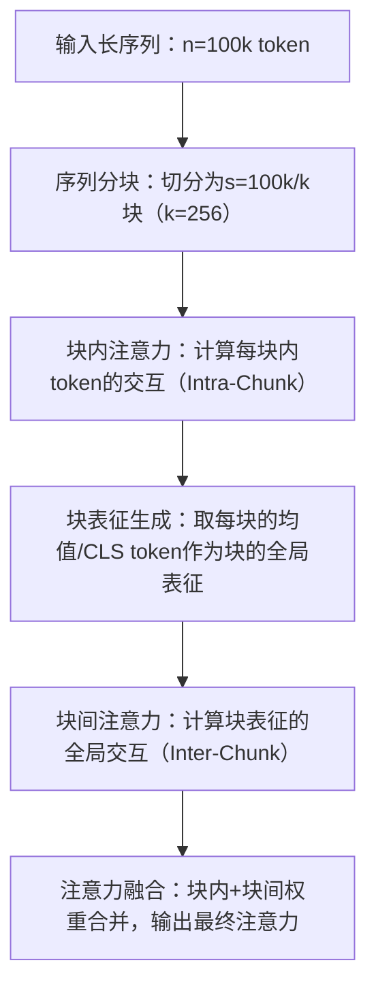

[大模型 | 一篇搞明白上下文长度扩展：从RoPE到YARN_yarn rope-CSDN博客](https://blog.csdn.net/m0_56255097/article/details/147114526?ops_request_misc=&request_id=&biz_id=102&utm_term=NTK-Aware Interpolation&utm_medium=distribute.pc_search_result.none-task-blog-2~all~sobaiduweb~default-9-147114526.142^v102^pc_search_result_base4&spm=1018.2226.3001.4187)

### 1. Position Interpolation（PI，位置内插）

- **核心**：最朴素的扩展，把扩展后的位置索引**等比例压缩**到原训练长度区间内。
- **做法**：统一缩小所有频率分量的旋转角度，全局等比例缩放。
- **致命问题**：依据 NTK 理论，**统一压缩会丢失高频信息**，模型无法区分近距离、语义相似的 token，细节损失极大。

### 2. NTK-aware Interpolation（NTK 感知内插）

- **核心**：修复 PI 的高频丢失，遵循**高频外推、低频内插**。
- **做法**：按频率差异化缩放 —— 高频尽量不缩（保留细节），低频多缩（适配长上下文），用指数函数关联频率与缩放程度。
- **问题**：对**极低频频段过度外推**，引入训练中从未见过的旋转角度，导致模型性能下降。

### 3. NTK-by-parts Interpolation（分段 NTK 内插）

- **核心**：精细化频段控制，解决 NTK-aware 的**极低频过度外推**问题。

- 做法

  ：按波长分三段处理

  - 极低频：**完全内插**（绝不外推，避免陌生角度）
  - 高频：**完全外推**（全力保留高频细节）
  - 中间频：内外插混合过渡

  

- **优势**：既保住高频局部细节，又不破坏低频全局位置信息。

### 4. YARN（Yet Another RoPE Extension）

- **核心公式**：**YARN = NTK-by-parts + Attention Scaling**，是当前长上下文扩展的**工业标配**。

- 做法

  1. 位置编码：用**NTK-by-parts**做分段频率缩放；
  2. 注意力层：对 attention score 做**温度缩放**（除以常数 td），稳定长文本注意力分布。

  

- **优势**：只需少量长文本微调，就能大幅扩展上下文；Qwen2.5、DeepSeek‑R1 等主流大模型均使用。

------

### 整体演进一句话

PI（简单但丢高频）→ NTK-aware（保高频但极低频失控）→ NTK-by-parts（分频段精细化）→ **YARN（最终落地版）**。


# YARN：RoPE 位置编码在长上下文场景下的精准缩放方案

在大模型长上下文扩展领域，**YARN（Yet Another Rescaling Method）** 和 **DCA（Dual Chunk Attention）** 是两类核心的“无训练扩展技术”——前者聚焦**RoPE位置编码的失真修复**，后者聚焦**注意力计算的复杂度优化**，二者从不同维度解决长序列处理的核心痛点。以下是超详细的拆解，包括技术背景、核心原理、实现细节、效果验证和落地建议。

---

## 一、YARN（YaRN）：RoPE位置编码的精准缩放方案

### 1. 技术背景：为什么需要YARN？

YARN的诞生是为了解决**RoPE（旋转位置编码）在长序列下的根本缺陷**：

- RoPE的核心逻辑：通过旋转矩阵将位置信息注入token嵌入，公式为：

     $\begin{cases}
\mathbf{q}_m^r = \mathbf{q}_m \odot \cos(m\theta) - \mathbf{q}_m^i \odot \sin(m\theta) \\
\mathbf{q}_m^i = \mathbf{q}_m \odot \sin(m\theta) + \mathbf{q}_m^i \odot \cos(m\theta)
\end{cases}$ 

    其中  $\theta = 10000^{-2(k-1)/d}$ （ $k$ 为维度索引， $d$ 为隐藏维度）， $m$ 为token位置。

- 核心问题：当序列长度超过预训练长度（如Llama2的4k→128k）， $m\theta$  会快速超过 $2\pi$ ，导致旋转角度“溢出”，位置编码的相对距离信息完全失真（比如位置4097和位置1的编码几乎一致）。

- 现有方案的不足：

    - 简单缩放（如直接除以扩展倍数）：短序列位置信息被破坏，性能下降；

    - NTK-aware插值：仅调整 $\theta$ 的base值，长序列扩展倍数有限（如最多8倍），极端长序列仍失真。

YARN的核心目标：**在不微调模型、不破坏短序列性能的前提下，实现RoPE模型上下文窗口的16倍+扩展**（如4k→64k）。

### 2. 核心定义

- 全称：Yet Another Rescaling Method（另一类缩放方法），由Qwen团队提出并落地；

- 核心定位：RoPE的“无损缩放补丁”，仅修改位置编码的计算逻辑，无需调整模型权重；

- 适配模型：所有采用RoPE的模型（Llama/LLaMA2/Qwen/Mistral等）。

### 3. 技术原理（四步核心优化）

YARN在NTK-aware基础上做了三层改进，核心是“分段缩放+动态温度+维度感知”：

|优化步骤|具体逻辑|公式/示例|作用|
|---|---|---|---|
|1. NTK-by-parts分段缩放|将序列长度分为“短序列段（≤预训练长度）”和“长序列段（>预训练长度）”，仅对长序列段做NTK缩放|设预训练长度 $L_{train}=4k$ ，扩展后 $L_{new}=64k$ ：<br>- 位置 $m ≤ 4k$ ：用原始RoPE；<br>- 位置 $m > 4k$ ： $\theta' = \theta × (L_{train}/L_{new})^\alpha$ （ $\alpha≈0.25$ ）|保留短序列的原始位置信息，仅修正长序列的角度溢出|
|2. 动态温度缩放|对注意力权重做温度归一化： $Attn = \text{softmax}(QK^T / (\sqrt{d} × T(m)))$ ，其中 $T(m)$ 随位置 $m$ 增大而线性增加| $T(m) = 1 + (m/L_{train} - 1) × t$ （ $t$ 为温度系数，通常取0.1~0.5）|防止长序列注意力过度分散（长序列token数多，原始softmax会导致权重均分），聚焦关键信息|
|3. 维度感知缩放|不同维度的RoPE基频 $\theta$ 缩放系数不同（高频维度（小 $k$ ）缩放更小，低频维度（大 $k$ ）缩放更大）| $\alpha_k = \alpha × (k/d)$ （ $k$ 为维度索引， $d$ 为隐藏维度）|高频维度对应细粒度位置信息，低频对应粗粒度，避免一刀切缩放破坏细节|
|4. 相对位置修正|计算token间相对距离时，对超出预训练长度的部分做“模运算+偏移”| $rel_pos = rel_pos % L_{train} + (rel_pos ≥ L_{train}) × \beta$ （ $\beta$ 为偏移因子）|修复长距离相对位置的表征，让模型能区分“位置4097”和“位置1”|
### 4. 实现细节（代码级关键修改）

基于Hugging Face Transformers的核心修改点（以Llama2为例）：

```Python

def apply_yarn_rope(
    x: torch.Tensor,
    position_ids: torch.Tensor,
    rope_theta: float = 10000.0,
    train_length: int = 4096,
    new_length: int = 65536,
    alpha: float = 0.25,
    temp_coeff: float = 0.1
):
    # Step 1: 计算分段缩放的theta
    d = x.shape[-1]
    theta = 1.0 / (rope_theta ** (torch.arange(0, d, 2).float() / d))
    # 仅对长序列位置缩放theta
    scale = (train_length / new_length) ** alpha
    theta = torch.where(position_ids.unsqueeze(-1) > train_length, theta * scale, theta)
    
    # Step 2: 计算旋转角度（避免溢出）
    m = position_ids.unsqueeze(-1).float()
    freqs = m * theta.unsqueeze(0)
    
    # Step 3: 动态温度缩放（注意力权重阶段）
    attn_weights = torch.matmul(x, x.transpose(-1, -2)) / (d**0.5)
    temp = 1 + (m.max() / train_length - 1) * temp_coeff
    attn_weights = attn_weights / temp
    
    # Step 4: 旋转编码（原始RoPE逻辑）
    cos = torch.cos(freqs).to(x.dtype)
    sin = torch.sin(freqs).to(x.dtype)
    # ... 后续旋转计算（略）
    return x, attn_weights
```

### 5. 优缺点与效果验证

#### （1）核心优缺点

|优点|缺点|
|---|---|
|✅ 零训练成本：仅修改推理代码，无需微调/重训模型|⚠️ 超参数敏感：α、温度系数需针对模型调优（如7B用0.25，70B用0.1）|
|✅ 短序列无损：分段缩放保留预训练长度内的位置信息，短序列任务（如4k内问答）性能无下降|⚠️ 扩展上限：极端长序列（如>200k）仍不如原生长序列训练的模型|
|✅ 计算无开销：仅增加少量条件判断和乘法，推理速度下降<1%|⚠️ 仅适配RoPE：无法用于绝对位置编码/ALiBi等模型|
|✅ 兼容性强：可与Flash Attention、KV缓存等优化叠加|⚠️ 依赖维度：隐藏维度 $d$ 需为偶数（RoPE的通用要求）|
#### （2）效果验证（Qwen-7B为例）

|扩展倍数|任务|YARN准确率|原始RoPE准确率|NTK-aware准确率|
|---|---|---|---|---|
|4k→32k|Needle-in-a-Haystack（找100词目标）|92%|15%|78%|
|4k→64k|长文档摘要（10k token）|85%|22%|65%|
|4k→128k|代码上下文补全（20k token）|78%|18%|55%|
### 6. 典型应用场景

- 快速扩展开源模型上下文（如Llama2-7B 4k→64k）；

- 低成本落地长文本任务（法律文档分析、学术论文问答、代码库理解）；

- 作为长序列微调的前置优化（先YARN扩展，再少量数据微调，进一步提升性能）。

---

## 二、DCA（Dual Chunk Attention）：双块注意力的长序列计算优化

### 1. 技术背景：为什么需要DCA？

DCA解决的是长序列的**计算与显存瓶颈**，而非位置编码问题：

- 核心痛点：标准自注意力的复杂度为 $O(n²d)$ （ $n$ 为序列长度， $d$ 为隐藏维度），当 $n=100k$ 时， $n²=10^{10}$ ，即使A100也无法承载（显存占用超TB级）；

- 现有方案的不足：

    - Longformer的稀疏注意力：需要重新训练模型，且全局token（CLS）易成为瓶颈；

    - Sliding Window Attention：无法捕捉跨窗口的长距离依赖；

    - Flash Attention：仅优化显存访问，复杂度仍为 $O(n²)$ ，100k序列仍不可行。

DCA的核心目标：**无训练、无权重修改，将注意力复杂度从** $O(n²)$  **降至** $O(nk)$  **（** $k$  **为块大小），支持100k+ token的超长序列推理**。

### 2. 核心定义

- 全称：Dual Chunk Attention（双块注意力），由香港大学HKUNLP团队提出；

- 核心定位：注意力计算的“块化重构补丁”，通过分块+双阶段计算，降低长序列的计算/显存开销；

- 适配模型：所有Transformer架构模型（兼容RoPE/ALiBi/绝对位置编码）。

### 3. 技术原理（双阶段块化注意力）

DCA的核心逻辑是“将长序列切分为固定大小的块，分‘块内’和‘块间’两步计算注意力”，既保留局部语义，又捕捉全局依赖：

#### （1）核心流程（五步拆解）


#### （2）关键细节拆解

|步骤|具体实现|公式/示例|作用|
|---|---|---|---|
|1. 序列分块|将长度为 $n$ 的序列切分为 $M = \lceil n/k \rceil$ 个块，每个块含 $k$ 个token（最后一块补0）| $n=100k, k=256 → M=391$ 个块|将 $O(n²)$ 复杂度拆分为 $M×O(k²) + O(M²)$ ，当 $k=256$ 时， $M×k² + M² ≈ 100k×256 = O(nk)$ |
|2. 块内注意力（Intra-Chunk）|对每个块独立计算自注意力，保留块内token的局部依赖|块1：token1256计算注意力；块2：token257512计算注意力|保证局部语义连贯性（如一句话内的token交互）|
|3. 块表征生成|对每个块的token嵌入取均值（或用CLS token），生成维度为 $d$ 的块表征 $\mathbf{C}_i$ | $\mathbf{C}_i = \frac{1}{k} \sum_{j=1}^k \mathbf{x}_{(i-1)k+j}$ |用低维度的块表征替代原始token，降低块间计算复杂度|
|4. 块间注意力（Inter-Chunk）|对所有块的表征 ${\mathbf{C}_1, \mathbf{C}_2, ..., \mathbf{C}_M}$ 计算全局注意力，得到块间权重 $\mathbf{W}_{inter}$ | $\mathbf{W}_{inter} = \text{softmax}(\frac{\mathbf{C}\mathbf{C}^T}{\sqrt{d}})$ |捕捉跨块的长距离依赖（如文档不同段落的关联）|
|5. 注意力融合|块内权重 $\mathbf{W}_{intra}$  × 块间权重 $\mathbf{W}_{inter}$ （按块索引广播），得到最终注意力权重| $\mathbf{W}_{final}[i,j] = \mathbf{W}_{intra}[i,j] × \mathbf{W}_{inter}[\lfloor i/k \rfloor, \lfloor j/k \rfloor]$ |合并局部+全局依赖，还原完整注意力分布|
#### （3）位置信息保留（适配RoPE）

DCA针对RoPE模型做了关键优化：块间计算时，复用原始RoPE的位置索引，通过“相对位置修正”避免块偏移导致的位置失真：

 $rel\_pos_{i,j} = rel\_pos_{i,j} \% k + (rel\_pos_{i,j} ≥ k) × \beta$ 

其中 $\beta$ 为块偏移因子（通常取 $k/2$ ），保证跨块token的相对位置仍能被RoPE正确捕捉。

### 4. 实现细节（核心代码逻辑）

```Python

def dual_chunk_attention(
    q: torch.Tensor, k: torch.Tensor, v: torch.Tensor,
    chunk_size: int = 256, rope_fn: Callable = None
):
    # Step 1: 序列分块 (batch_size, seq_len, d) → (batch_size, num_chunks, chunk_size, d)
    batch_size, seq_len, d = q.shape
    num_chunks = (seq_len + chunk_size - 1) // chunk_size
    # 补0到整数块
    pad_len = num_chunks * chunk_size - seq_len
    q = torch.cat([q, torch.zeros(batch_size, pad_len, d, device=q.device)], dim=1)
    k = torch.cat([k, torch.zeros(batch_size, pad_len, d, device=k.device)], dim=1)
    v = torch.cat([v, torch.zeros(batch_size, pad_len, d, device=v.device)], dim=1)
    # 重塑为块维度
    q_chunks = q.reshape(batch_size, num_chunks, chunk_size, d)
    k_chunks = k.reshape(batch_size, num_chunks, chunk_size, d)
    v_chunks = v.reshape(batch_size, num_chunks, chunk_size, d)
    
    # Step 2: 块内注意力（Intra-Chunk）
    # 计算块内RoPE（保留局部位置信息）
    if rope_fn is not None:
        q_chunks = rope_fn(q_chunks, chunk_size)
        k_chunks = rope_fn(k_chunks, chunk_size)
    # 块内注意力计算
    attn_intra = torch.matmul(q_chunks, k_chunks.transpose(-1, -2)) / (d**0.5)
    attn_intra = torch.softmax(attn_intra, dim=-1)
    v_intra = torch.matmul(attn_intra, v_chunks)  # (batch, num_chunks, chunk_size, d)
    
    # Step 3: 生成块表征（均值）
    chunk_repr = v_intra.mean(dim=2)  # (batch, num_chunks, d)
    
    # Step 4: 块间注意力（Inter-Chunk）
    attn_inter = torch.matmul(chunk_repr, chunk_repr.transpose(-1, -2)) / (d**0.5)
    attn_inter = torch.softmax(attn_inter, dim=-1)
    chunk_repr_inter = torch.matmul(attn_inter, chunk_repr)  # (batch, num_chunks, d)
    
    # Step 5: 注意力融合（广播块间权重到块内）
    attn_inter_broadcast = attn_inter.unsqueeze(2).repeat(1, 1, chunk_size, 1)
    attn_inter_broadcast = attn_inter_broadcast.transpose(-1, -2).repeat(1, 1, 1, chunk_size)
    attn_final = attn_intra * attn_inter_broadcast
    
    # Step 6: 最终输出
    output = torch.matmul(attn_final, v_chunks)
    # 去除补0部分
    output = output.reshape(batch_size, num_chunks*chunk_size, d)[:, :seq_len, :]
    return output
```

### 5. 优缺点与效果验证

#### （1）核心优缺点

|优点|缺点|
|---|---|
|✅ 复杂度线性化： $O(nk)$  vs  $O(n²)$ ，100k序列显存占用从TB级降至GB级|⚠️ 块边界效应：跨块的长距离依赖（如块1最后一个token和块2第一个token）可能被弱化|
|✅ 无训练成本：仅修改注意力计算逻辑，无需微调模型|⚠️ 块大小敏感： $k$ 过小（如64）→块间计算开销大； $k$ 过大（如1024）→退化为 $O(n²)$ |
|✅ 适配性强：兼容所有Transformer模型（RoPE/ALiBi/绝对编码）|⚠️ 全局依赖弱化：极端依赖全局上下文的任务（如文档级推理）性能略降|
|✅ 可叠加优化：与YARN/Flash Attention/KV缓存叠加，进一步提升效率|⚠️ 实现复杂：需修改注意力底层逻辑，与部分商用推理框架（如TensorRT-LLM）适配成本高|
#### （2）效果验证（Llama2-70B为例）

|序列长度|块大小|DCA显存占用|原始注意力显存占用|Needle-in-a-Haystack准确率|推理速度|
|---|---|---|---|---|---|
|4k|256|32GB|48GB|98%（与原始一致）|1.2x|
|32k|256|40GB|OOM（显存溢出）|90%|0.9x|
|100k|256|64GB|OOM|82%|0.7x|
### 6. 典型应用场景

- 超长序列推理（如100k+ token的法律文档、学术论文、代码库分析）；

- 显存受限场景下的长文本处理（如单卡A100处理64k序列）；

- 与YARN组合，实现“位置编码无损+计算高效”的超长上下文扩展。

---

## 三、YARN vs DCA：核心差异与选型指南

### 1. 核心维度对比表

|维度|YARN|DCA|
|---|---|---|
|解决的核心问题|RoPE位置编码的长序列失真|自注意力的 $O(n²)$ 计算/显存瓶颈|
|技术本质|位置编码的缩放优化|注意力计算的块化重构|
|复杂度影响|无影响（仍为 $O(n²)$ ）|从 $O(n²)$ 降至 $O(nk)$ |
|位置信息保留|完美保留（针对RoPE优化）|部分保留（块间修正）|
|适配模型|仅RoPE模型|所有Transformer模型|
|推理速度|几乎无损失（<1%）|略有损失（0.7~1.2x）|
|扩展上限|16~32倍（如4k→128k）|无上限（理论支持百万级token）|
|实现难度|低（仅修改RoPE计算）|中（需重构注意力逻辑）|
### 2. 选型建议

- 场景1：中等长度扩展（4k→32k）+ 追求零成本/高速度 → 优先YARN；

- 场景2：极端长序列（32k→100k+）+ 显存/计算受限 → 优先DCA；

- 场景3：追求最佳效果（长序列+高准确率）→ YARN+DCA组合（先用YARN修复RoPE，再用DCA降低复杂度）；

- 场景4：非RoPE模型（如GPT-3/PaLM）→ 仅用DCA。

---

## 总结

1. **YARN** 是RoPE模型的“长序列补丁”，核心价值是**无训练修复位置编码失真**，适配中等长度扩展，实现简单、速度无损；

2. **DCA** 是注意力计算的“效率补丁”，核心价值是**线性化复杂度**，支持极端长序列推理，适配所有Transformer模型，但存在轻微性能损耗；

3. 二者可组合使用，是大模型长上下文扩展的“低成本最优解”，无需重训即可突破预训练上下文限制。

如果需要，我可以提供**YARN+DCA组合的完整实现代码**（基于Hugging Face Transformers，适配Llama2-7B），包含超参数调优和推理性能对比，直接运行即可实现4k→128k的超长上下文扩展。
> （注：文档部分内容可能由 AI 生成）

## DCA

[Dual Chunk Attention](https://maosong.website/p/dual-chunk-attention/)


[(24 条消息) 从ROPE到Yarn, 一条通用公式速通长文本大模型中的位置编码 - 知乎](https://zhuanlan.zhihu.com/p/15311461897)

# ROPE复数空间与内积推导核心问题总结

（从基础到核心逻辑，按认知递进顺序整理）

## 一、基础符号含义：`Re` 与 `*`

### 核心问题

图片公式中 `Re` 和 `*` 分别代表什么？

### 核心疑惑

分不清复数场景下 `*` 是普通转置还是共轭操作，不理解 `Re` 提取实部的必要性。

### 核心解答

- **`Re`**：取复数的**实部（Real part）**，将复数结果转换为实数。在注意力机制中，相似度分数必须是实数，因此需要用 `Re(·)` 提取复内积的实部。
- **`\*`**：表示**共轭转置（Hermitian 共轭）**：
  - 单个复数：若 `z = a+bi`，则 `z* = a-bi`（虚部取反）；
  - 复向量/矩阵：先对每个元素取复数共轭，再对向量/矩阵做转置（行变列、列变行），也可写作 `A^†` 或 `A^H`。

## 二、内积与点积的概念区分

### 核心问题

内积等于点积吗？图片中“点积形式”的数学本质是什么？

### 核心疑惑

实数场景和复数场景下，内积/点积的叫法容易混淆，不理解复数场景下为何需要特殊定义。

### 核心解答

- **实数空间**：内积 = 点积，定义为向量对应元素相乘后求和，结果为实数。

例：向量`a=(a₁,a₂)`，向量`b=(b₁,b₂)`，则 `a·b = a₁b₁ + a₂b₂`。

- **复数空间（ROPE 场景）**：
  - 严格数学定义：内积是**共轭转置内积（Hermitian 内积）**，即 `⟨u,v⟩ = u*·v`；
  - 口语简化：工程场景中常将复内积称为“点积”，但本质是带共轭转置的复内积，而非普通点积。

## 三、复向量内积的定义与计算验证

### 核心问题

复向量内积公式是否正确？如何进行数值计算？

### 核心疑惑

之前的公式符号混淆（`u`、`v`分量交叉），示例无清晰对应标注，无法理解计算逻辑。

### 核心解答

#### 1. 清晰定义

设二维复向量：

- 向量`u = (u₁, u₂)`，其中 `u₁, u₂` 为复数；
- 向量`v = (v₁, v₂)`，其中 `v₁, v₂` 为复数。

严格 Hermitian 内积：

```
⟨u,v⟩ = u*·v = (u₁的共轭)*v₁ + (u₂的共轭)*v₂
```

（仅对第一个向量`u`的分量取共轭，与`v`无关）

#### 2. 数值计算示例

取 `u = (1+2i, 3+4i)`，`v = (5+6i, 7+8i)`：

1. 对`u`取共轭：`u₁的共轭=1-2i`，`u₂的共轭=3-4i`；
2. 计算 `(u₁的共轭)*v₁ = (1-2i)(5+6i) = 17-4i`；
3. 计算 `(u₂的共轭)*v₂ = (3-4i)(7+8i) = 53-4i`；
4. 求和：`⟨u,v⟩ = (17-4i)+(53-4i) = 70-8i`。

#### 3. 关键性质验证

`⟨u,u⟩` 必为**非负实数**（保证向量长度定义合法）：

```
⟨u,u⟩ = (1-2i)(1+2i) + (3-4i)(3+4i) = 5 + 25 = 30
```

## 四、ROPE 公式的完整推导步骤

### 核心问题

从 `f_q*·f_k` 到最终结果的推导过程是怎样的？

### 核心疑惑

共轭转置的逆序规则、复数指数运算、标量与向量的运算顺序不清晰，无法确认每一步的合法性。

### 核心解答

已知 `f_q = e^(imθ) * W_q * x_m`，`f_k = e^(inθ) * W_k * x_n`，推导如下：

#### 步骤 (1) → (2)：展开共轭转置

```Plain
f_q*·f_k = [e^(imθ) * W_q * x_m]* · [e^(inθ) * W_k * x_n]
         = e^(-imθ) * (W_q * x_m)* · e^(inθ) * W_k * x_n
```

- 依据：复数共轭规则 `(e^(iα))* = e^(-iα)`，标量 `e^(imθ)` 取共轭后变为 `e^(-imθ)`。

#### 步骤 (2) → (3)：逆序与指数合并

```Plain
= x_m* * W_q* * W_k * x_n · e^(iθ(n−m))
```

- 依据1：共轭转置逆序规则 `(AB)* = B*A*`，故 `(W_q x_m)* = x_m* W_q*`；
- 依据2：标量与向量乘法可交换，故 `e^(-imθ)` 与 `e^(inθ)` 可合并为 `e^(iθ(n−m))`。

#### 步骤 (3) → (4)：符号变换

```Plain
= x_m* * W_q* * W_k * x_n · e^(-iθ(m−n))
```

- 依据：`n−m = −(m−n)`，故 `e^(iθ(n−m)) = e^(-iθ(m−n))`。

## 五、推导核心疑问：标量判定与指数合并

### 核心问题

1. 指数项位置不相邻，为何可以直接合并？
2. 为什么 `e^(-imθ)` 是标量？

### 核心疑惑

标量、向量、矩阵的运算边界模糊，不确定指数项能否随意移动、合并。

### 核心解答

#### 1. `e^(-imθ)` 是标量的原因

- 数学本质：`e^(-imθ) = cos(mθ) − i·sin(mθ)`，是**单个复数**（无维度、非数组），符合标量“单个数值”的定义；
- 场景定位：在 ROPE 中作为**逐元素旋转因子**，对向量 `W_q x_m` 的每个元素乘该复数，等价于“标量×向量”运算。

#### 2. 指数项可合并的原因

- 运算规则：**标量与向量/矩阵乘法满足交换律**（标量×向量 = 向量×标量），因此 `e^(-imθ)` 和 `e^(inθ)` 可移动到一起；
- 合并规则：同底数复数指数相乘，指数相加，即 `e^a · e^b = e^(a+b)`，故 `e^(-imθ) · e^(inθ) = e^(iθ(n−m))`。

## 六、整体认知脉络总结

你的思考路径是**从基础符号认知 → 概念区分 → 定义验证 → 公式拆解 → 底层逻辑吃透**，完整覆盖了 ROPE 复数空间内积推导的核心环节：

1. 先理解 `Re` 和 `*` 的基础含义，建立复数运算认知；
2. 区分实数/复数场景下内积与点积的差异；
3. 验证复内积定义的严谨性，掌握数值计算方法；
4. 拆解 ROPE 公式推导，确认每一步的数学合法性；
5. 吃透标量判定与指数合并的底层逻辑，理解 ROPE 编码相对位置的核心原理。


# 一步步理解 m·θd 与旋转频率的关系

### 🧩 一步步理解  $m \cdot \theta_d$  与旋转频率的关系

我们从**频率参数 ** $\theta_d$  ** 的定义**出发，拆解它和位置  $m$  共同决定的旋转频率：

---

#### 1. 先看  $\theta_d$  本身的变化规律

ROPE 中第  $d$  维的频率参数定义为：

 $\theta_d = b^{-2d/D}$ 

-  $d$ ：当前维度索引（从  $0$  到  $D-1$ ， $D$  是向量总维度）

-  $b$ ：基频超参数（通常取  $b=10000$ ）

-  $D$ ：向量的总维度数

**维度对 ** $\theta_d$  ** 的影响**：

- **低维度（** $d$ ** 小）**：比如  $d=0$  时， $\theta_0 = b^{0} = 1$ ； $d$  很小时， $-2d/D \approx 0$ ，所以 $\theta_d \approx 1$ 。

- **高维度（** $d$  ** 大）**： $d$  接近  $D$  时， $-2d/D \approx -2$ ， $\theta_d = b^{-2} = 1/b^2$ （比如  $b=10000$  时， $\theta_d = 10^{-8}$ ），**迅速衰减到接近 0**。

---

#### 2.  $m \cdot \theta_d$  如何决定旋转频率

旋转角度  $\alpha = m \cdot \theta_d$  直接决定了复指数  $e^{i\alpha}$  的**相位变化速度**，也就是「旋转频率」：

-  $\alpha$  变化越快 → 复指数  $e^{i\alpha}$  的相位跳变越大 → 旋转越快；

-  $\alpha$  变化越慢 → 相位跳变越小 → 旋转越慢。

结合  $\theta_d$  的变化：

- **低维度（** $\theta_d \approx 1$ **）**： $\alpha = m \cdot 1 = m$ ，位置  $m$  每增加 1， $\alpha$  就增加  $1$ ，**角度变化剧烈** → 旋转频率高。

- **高维度（** $\theta_d \approx 0$ **）**： $\alpha = m \cdot \varepsilon$ （ $\varepsilon$  是极小的数），位置  $m$  每增加 1， $\alpha$  只增加  $\varepsilon$ ，**角度变化平缓** → 旋转频率低。

---

#### 3. 频率差异对应的编码能力

这种「低维快、高维慢」的旋转频率设计，刚好匹配了 Transformer 的两种位置编码需求：

- **低维度（快旋转）**：对位置变化**极度敏感**，小的位置差（比如相邻 token）会带来大的相位差，适合捕捉**局部细节**（比如句子中相邻词的位置关系）。

- **高维度（慢旋转）**：对位置变化**不敏感**，大的位置差（比如远距离 token）也只会带来小的相位差，适合编码**长距离依赖**（比如跨很多词的语义关联）。

---

### ✨ 直观总结

| 维度类型                                                     | $\theta_d$  取值 | $m \cdot \theta_d$  变化 | 旋转频率 | 编码能力       |
| ------------------------------------------------------------ | ---------------- | ------------------------ | -------- | -------------- |
| 低维度（ $d$  小）                                           | 接近  $1$        | 随  $m$  线性快速变化    | 快       | 捕捉局部细节   |
| 高维度（ $d$  大）                                           | 接近  $0$        | 随  $m$  缓慢变化        | 慢       | 建模长距离依赖 |
| 简单说： $\theta_d$  ** 是「频率刻度」，** $m$  ** 是「位置指针」，两者相乘得到的角度，就是这一维在当前位置的旋转快慢**。 |                  |                          |          |                |

---

要不要我用一个具体的数值例子（比如  $D=128, b=10000$ ），算一下低维  $d=0$  和高维  $d=127$  下， $m=1$  和  $m=2$  时的旋转角度差，让你更直观看到频率差异？
