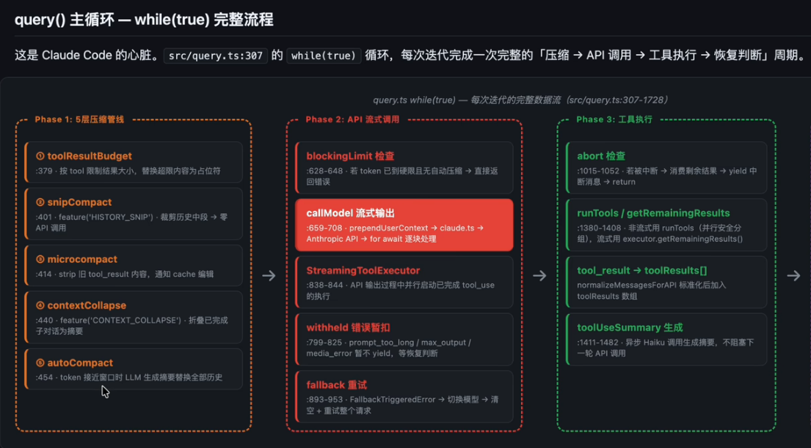
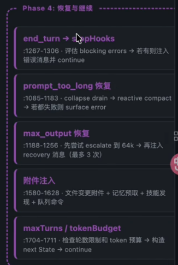
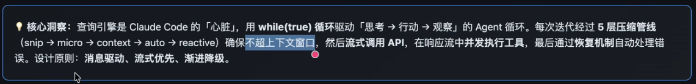
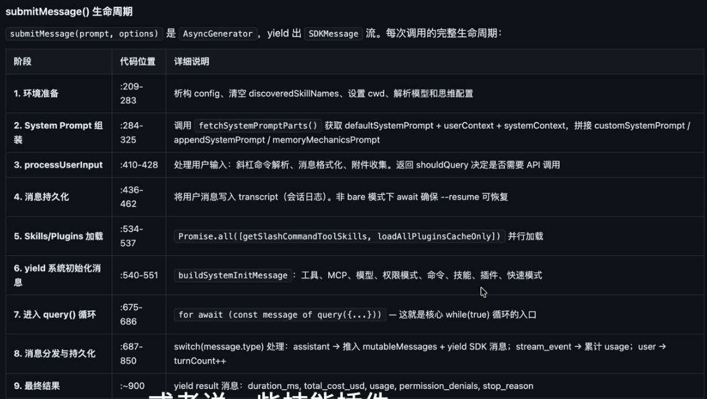
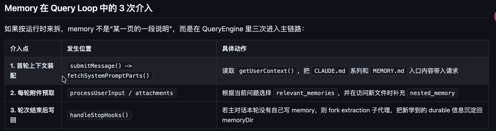
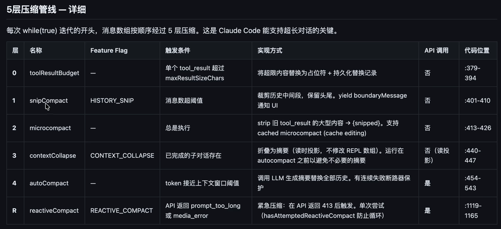
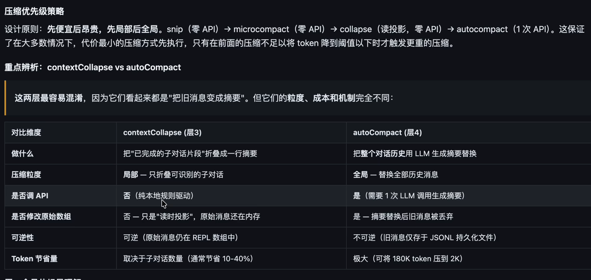
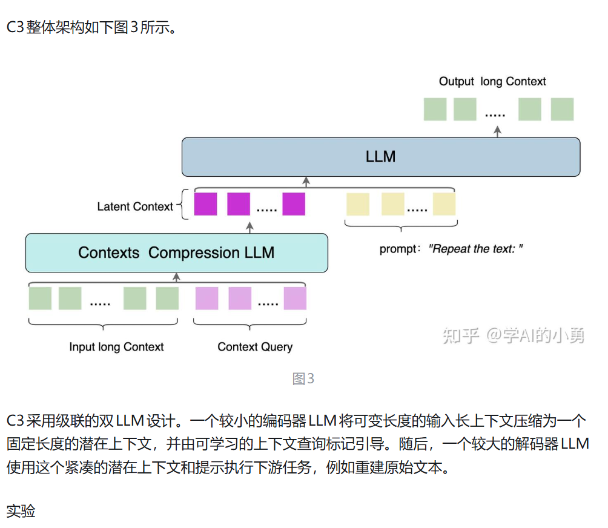
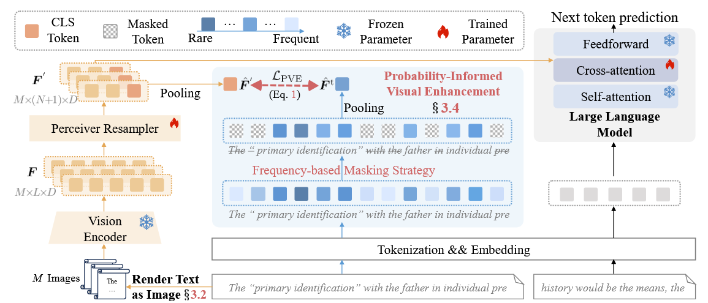

## TCP UDP


#### TCP 三次握手

TCP 报文头部标志位解释：SYN、ACK、FIN

面试口语版回答： 不是单独的 “数据包码”，更准确地说：**SYN、ACK、FIN 是 TCP 报文头部里的控制标志位（flag）**，每个占 1 个比特位，用来告诉对方这个数据包是用来 “建连接、确认、断连接” 的。

简单理解：

- **SYN（同步位）**：用来发起连接、同步序列号，三次握手里用。
- **ACK（确认位）**：用来告诉对方 “我收到你的包了”，握手、挥手、正常传数据都会用。
- **FIN（结束位）**：用来告诉对方 “我发完数据了，要关闭连接”，四次挥手里用。

它们不是独立的数据包，而是**贴在 TCP 包头上的 “功能标签”**。 三次握手就是靠 `SYN`、`SYN+ACK`、`ACK` 这几种带标记的包完成连接； 四次挥手就是靠 `FIN`、`ACK`、`FIN`、`ACK` 完成断开。


#### TCP 四次挥手


 一、TCP 和 UDP 的区别 **TCP 是面向连接的可靠传输协议，** **TCP 有确认、重传、序号机制，能保证数据不丢包、不乱序**，还支持流量控制和拥塞控制，**但头部开销大、传输效率低**，常用于文件传输、网页访问、邮件等场景。 **UDP 是无连接的不可靠协议**，**UDP 不需要建立连接，直接发送数据报文，头部开销小、延迟低、速度快，但不保证数据可靠送达**，适合直播、视频通话、网络游戏、DNS 这类对实时性要求高的场景。 

二、什么是三次握手 **三次握手是 TCP 建立连接的过程，目的是确认客户端和服务端双方的收发能力都正常，同时同步初始序列号**。 第一步，**客户端向服务端发送 SYN 包请求连接**； 第二步，**服务端回复 SYN+ACK 包，确认客户端请求并发起同步**； 第三步，**客户端回复 ACK 包，双方确认后进入连接建立状态**，开始传输数据。 

 三、什么是四次挥手 **四次挥手是 TCP 断开连接的过程**，因为 TCP 是全双工通信，双方需要各自关闭发送通道，所以要四次交互。 **第一步**，**客户端发送 FIN 包，主动关闭发送数据的通道**； **第二步，服务端回复 ACK 确认，此时客户端只能收不能发**； **第三步**，**服务端数据发送完毕后，也发送 FIN 包关闭自己的发送通道**； **第四步，客户端回复 ACK 确认，等待一段时间后双方彻底断开连接**。

## MCP通信协议

[(18 条消息) 深度解析：MCP三大核心通信模式STDIO、SSE与Streamable HTTP的终极指南！ - 知乎](https://zhuanlan.zhihu.com/p/1920408556986954650)

[《MCP从0到1》第3课：MCP通信传输机制（stdio、SSE、Streamable HTTP）最强详解今天这篇文章带 - 掘金](https://juejin.cn/post/7522975050321428489)

[(2 封私信 / 40 条消息) 一文了解：MCP 传输机制 Stdio、SSE 与 Streamable HTTP 的核心区别 - 知乎](https://zhuanlan.zhihu.com/p/1896209461112197767)

【MCP三种传输方式详解：Stdio、SSE、Streamable HTTP】https://www.bilibili.com/video/BV1obKPz6ECM?vd_source=c5c396652c0c83be15efe54e0c348c90

#### stdio

**通过子进程的标准输入输出流(stdin、stdout)进行通信(JsonRpc2.0格式)**


#### SSE

是一种基于[HTTP协议](https://zhida.zhihu.com/search?content_id=259422505&content_type=Article&match_order=1&q=HTTP协议&zhida_source=entity)的**单向数据流传输**方式。**它允许服务器主动向客户端推送实时数据**。**SSE通过保持一个持久的HTTP连接**，**将数据流式传输到客户端，特别适合需要持续更新的实时场景**


缺点：**保持长连接，消耗资源，不支持断线重连**

**第一次连接时，客户端请求/sse接口，服务器返回调用工具的唯一目标端点**

**客户端只需记住这个端点，多次调用工具时，始终向该端点发 POST 请求即可**


## Streamable Http

**Streamable HTTP** 是一种 MCP 传输方式，允许服务器通过 **HTTP POST 请求** 接收客户端消息，并通过 **SSE（Server-Sent Events）流** 或 **单条 JSON 响应** 返回多条消息

- **POST + SSE 组合**：客户端用 POST 发请求，服务器可选择升级为 SSE 流持续推送

- **客户端→服务端：客户端通过HTTP POST 把请求发送到服务器的MCP端点。**
- **服务端→客户端：服务器可以返回单条响应，或升级为 SSE流 来推送多条消息。**

**支持断线重连**

**引入session机制支持状态管理和恢复**


## Multi-agent


# MCP

MCP Server:MCP服务器，里面就是包含一些执行特殊任务的工具

**MCP（Model Context Protocol）即模型 上下文协议 ，旨在统一大模型与外部数据源和工具之间的通信协议**，**是AI agent与外部系统的标准化接口层**。MCP 的主要目的在于解决当前 AI 模型因数据孤岛限制而无法充分发挥潜力的难题，MCP 使得 AI 应用能够安全地访问和操作本地及远程数据，为 AI 应用提供了连接万物的接口。


一般python写的MCP Server 使用uvx启动，node写的MCP Server 使用npx启动


**cline 和 weather的交互过程**

**输入：cline给weather服务器的消息**

**输出：weather给cline的消息**

**以下内容是cline连接mcp服务器时交互过程**


**cline 进行工具调用与MCP Server的交互内容**


#### **cline 与 模型的交互过程**

**cline向大模型发起请求时，prompt会携带很多信息**


**模型每一步都会先进行思考<thinking>，再做决策<use_mcp_tool>，cline再通过MCP Server去调用工具，cline再将工具结果返回给模型(observation)**


**<attempt_completion>:模型认为任务已完成，最终返回给cline的信息。**

## A2A

A2A 指的就是 **Agent to Agent，多智能体之间的协作通信模式**。


A2A作用在agent之间


**MCP作用在大模型和MCP之间**


A2A主要流程 

agent注册阶段


### agent card


| 组件           | 全称 / 格式     | 核心作用                                        | 关键信息                                                     |
| -------------- | --------------- | ----------------------------------------------- | ------------------------------------------------------------ |
| **Agent Card** | JSON 元数据文档 | 智能体 “名片”，实现能力发现Agent2Agent Protocol | 包含身份、能力、服务端点、认证要求，支持自动化检索A2A Protocol |
| **A2A Client** | 客户端智能体    | 发起请求、管理任务的一方A2A Protocol            | 可是用户程序、其他 Agent，负责任务提交与结果接收             |
| **A2A Server** | 服务端智能体    | 处理任务、提供服务的一方A2A Protocol            | 暴露 A2A 兼容 HTTP 端点，支持同步 / 异步响应与流式传输Agent2Agent Protocol |
| **Task**       | 任务单元        | 协作的核心工作载体                              | 含唯一 ID、状态（创建 / 处理 / 完成 / 失败）、输入参数、输出结果A2A |
| **Message**    | 通信单元        | 交互的基本载体A2A Protocol                      | 基于 JSON-RPC 2.0，分请求、响应、通知三类，支持实时推送A2A Protocol |
| **Artifact**   | 工件            | 任务输出成果                                    | 支持文本、文件、数据、结构化结果等多类型交付A2A              |

以 “客服 Agent 协同工单 Agent 处理投诉” 为例，清晰演示协作流程：

1. **能力发现**：客服 Agent（Client）通过 A2A 网络查询工单 Agent 的**Agent Card**，获取其服务端点、支持的任务类型与认证方式。

2. **任务提交**：客服 Agent 生成投诉 Task（含用户 ID、问题描述、优先级），按 A2A 消息格式发送至工单 Agent（Server）Agent2Agent Protocol。

3. **执行与状态同步**：工单 Agent 处理任务，实时通过 A2A 推送更新 Task 状态（如 “已受理→处理中→已完成”）Agent2Agent Protocol。

4. **结果交付**：工单 Agent 返回处理结果（工单 ID、解决方案），客服 Agent 接收后完成闭环。

   

agent问答阶段


## skills

**Agent中的Skills是指封装好的功能模块，是agent的行为规范层，负责帮助AI固化专业流程。让Agent具备调用外部工具、操作数据、与系统交互等实际执行能力，是连接大模型认知能力与真实世界操作的桥梁**

**渐进式披露**：agent启动时只加载skill的name和description。当用户请求命中了某个skill的描述时，才会读取指令层，包含**具体的sop,操作步骤，注意事项等**。被读取进上下文


**reference：一些其他的文档啥的**

**script: 一些代码脚本啥的**


示例：


## Harness

### 面试口语版回答

Harness engineering 说白了，就是**给大模型 “套上缰绳、做好管控” 的工程思路**，不是去优化模型本身，而是专门解决大模型输出不可控、容易跑偏的问题。

它的**核心就是通过工程手段约束大模型的行为**，比如规范它的**输出格式、限制工具调用范围、管控多轮推理的流程**，**避免出现幻觉、乱调用工具**、**约束机制、反馈回路、工作流控制和持续改进循环**。

像我们用 LangGraph 做智能体编排、做全局状态管理、设置检查点断点续跑，其实就是典型的 harness engineering 实践，**目的就是让大模型在可控、稳定的框架里干活，保证项目能落地到生产环境，而不是随便输出不可控的结果**。


[Harness Engineering（驾驭工程） | 菜鸟教程](https://www.runoob.com/ai-agent/harness-engineering.html)


## Mem0框架


## Langchain 和 langgraph的区别


**LangChain 是高层、链式、快速开发的 LLM 应用框架**

**LangGraph 是底层、图结构、强状态、适合复杂智能体（Agent）的编排引擎**。LangGraph 由 LangChain 团队开发，现在是 LangChain 生态的**底层运行时**

**LangGraph 以状态图(StateGraph)为核心，通过节点 + 边 + 全局共享状态来编排流程，是更底层的执行调度引擎**


## 如何评定Agent的质量？

| 维度           | 具体指标                             | 评估方法                |
| -------------- | ------------------------------------ | ----------------------- |
| **任务完成度** | 成功率、准确率、端到端完成率         | 人工标注 + 自动化测试集 |
| **效率**       | 平均步数、响应延迟、token消耗        | 埋点监控 + 成本分析     |
| **稳定性**     | **异常率、重试率、边界case处理能力** | 压力测试 + 混沌工程     |
| **可解释性**   | 推理链清晰度、决策可追溯性           | 日志审计 + 人工抽检     |
| **用户体验**   | 满意度评分、对话轮次、放弃率         | A/B测试 + 用户反馈      |


## 如何处理Agent的幻觉问题？

| 类型           | 表现                  | 解决方案                                              |
| -------------- | --------------------- | ----------------------------------------------------- |
| **事实性幻觉** | 编造不存在的知识      | RAG检索增强、知识图谱约束、工具调用验证               |
| **工具幻觉**   | 调用不存在/错误的工具 | 严格schema校验、工具描述优化、拒识机制                |
| **推理幻觉**   | 逻辑跳跃、因果错误    | Chain-of-Thought显式推理、反思机制（Self-Reflection） |
| **记忆幻觉**   | 错误回忆历史信息      | 外部记忆库（Vector DB）、记忆置信度打分               |


## ReAct架构详解

**ReAct = Reasoning（推理）+ Acting（行动）**

打破传统"先思考后行动"的分离模式，让LLM在**推理**和**行动**之间交替进行，形成"思考→行动→观察→再思考"的循环。


## AI Coding 经验

**1、需求描述尽量的详细具体**

**2、我描述完需要之后，一般会让ai说说他对我需求的理解，我看看他的理解是否正确。以及他的看法，有什么建议？有什么更好的看法？**

**3、大的项目先设计整体架构，再依次实现每一个模块，每一个模块单独测试，之后再联调**

**4、ai生成的方案和代码要review，review之后及时提交到git**

**5、每次大修之后，需要沉底，保存修改记录，让项目从0开始构建的话，保留架构readme文件**


## 框架概览：CrewAI, LangGraph, AutoGen

[智能体大乱斗：CrewAI, LangGraph, AutoGen，哪个才是你的多智能体AI框架之王？](https://blog.eimoon.com/p/crewai-langgraph-autogen-multi-agent-ai-frameworks-comparison/)


**CrewAI**：这个框架的核心理念是“**基于角色的[ 协作](https://blog.eimoon.com/p/crewai-langgraph-autogen-multi-agent-ai-frameworks-comparison/#)**”，它模拟真实组织结构。每个 Agent 都有明确的角色、职责，并能访问专属工具。这让它非常适合那种“团队协作式”的工作流。**CrewAI 擅长任务导向型协作**，尤其是在角色和职责清晰时能高效执行，内置支持常见的业务工作流模式。

**LangGraph**：它采用的是“**基于图（Graph-based）的工作流设计**”，将 Agent 交互视为有向图中的节点。这种架构为复杂的决策管道提供了卓越的灵活性，支持条件逻辑、分支工作流和动态适应。LangGraph 在需要复杂编排、多个决策点和并行处理能力的场景下表现出色。

**AutoGen**：则专注于“**会话式 Agent 架构**”，**强调自然语言交互和动态角色扮演**。它在创建灵活的、对话驱动的工作流方面表现突出，Agent 可以根据上下文动态调整角色。AutoGen 的强项在于快速原型开发和需要“人机协作（Human-in-the-Loop）”的场景，自然语言交互是核心。


我用一个**具体场景**来对比：假设我们要做一个 **"新品上市的市场调研与营销方案"** 任务。

---

## 场景需求拆解

1. **调研员** 收集竞品数据（工具：搜索引擎）
2. **分析师** 分析数据，判断市场机会（工具：数据分析）
3. **决策点**：如果机会评分 > 7分，继续；否则终止
4. **策划师** 制定营销方案
5. **人工审核**：老板确认预算和方向
6. **文案** 产出最终推文/海报文案

---

## CrewAI：像"流水线工厂"

**核心理念**：每个工人站一个工位，按 SOP 顺序干活。

```python
from crewai import Agent, Task, Crew

# 1. 定义角色（像招聘员工）
researcher = Agent(
    role="市场调研员",
    goal="收集竞品价格和用户评论",
    tools=[SerperDevTool()],
    allow_delegation=False  # 只管自己的事
)

analyst = Agent(
    role="数据分析师", 
    goal="评估市场机会并打分",
    tools=[PythonTool()]
)

planner = Agent(
    role="营销策划师",
    goal="制定可执行的营销方案"
)

writer = Agent(
    role="文案",
    goal="写10条微博推文"
)

# 2. 定义任务（像下工单）
task1 = Task(description="搜集3款竞品数据", agent=researcher)
task2 = Task(description="分析数据并打分(1-10)", agent=analyst, context=[task1])
task3 = Task(description="制定营销方案", agent=planner, context=[task2])
task4 = Task(description="写推广文案", agent=writer, context=[task3])

# 3. 组队开工
crew = Crew(agents=[researcher, analyst, planner, writer], tasks=[task1, task2, task3, task4])
result = crew.kickoff()
```

**运行体验**：
- 像工厂流水线：研究员 → 分析师 → 策划师 → 文案，**严格串行**
- 每个 Agent 只看到自己的任务单，不聊天，不商量
- 如果想并行（比如同时调研3个平台），用 `Process.parallel` 配置

**适合**：角色固定、流程标准化的企业工作流（如财报分析、客服工单处理）

---

## LangGraph：像"智能车间"

**核心理念**：不是流水线，是**电路板**——有传感器、开关、回流线。

```python
from langgraph.graph import StateGraph, END
from typing import TypedDict

# 1. 定义状态（全局共享黑板）
class MarketState(TypedDict):
    research_data: str
    score: int
    plan: str
    human_approved: bool
    final_copy: str

# 2. 定义节点（工序）
def research(state):
    data = search_tool.run("竞品分析")
    return {"research_data": data}

def analyze(state):
    score = llm.invoke(f"给这个机会打分(1-10)：{state['research_data']}")
    return {"score": int(score)}

def make_plan(state):
    plan = llm.invoke(f"基于数据写方案：{state['research_data']}")
    return {"plan": plan}

def human_review(state):  # 人工审核节点
    # 弹出界面问老板："这个方案预算50万，是否继续？"
    raise NodeInterrupt(f"请审核方案：{state['plan']}")

def write_copy(state):
    copy = llm.invoke(f"基于方案写文案：{state['plan']}")
    return {"final_copy": copy}

def stop(state):
    return {"final_copy": "机会不足，项目终止"}

# 3. 构建图（关键：条件分支 + 循环）
workflow = StateGraph(MarketState)

workflow.add_node("research", research)
workflow.add_node("analyze", analyze)
workflow.add_node("plan", make_plan)
workflow.add_node("human_review", human_review)
workflow.add_node("write", write_copy)
workflow.add_node("stop", stop)

workflow.set_entry_point("research")
workflow.add_edge("research", "analyze")

# 条件边：像交通信号灯
workflow.add_conditional_edges(
    "analyze",
    lambda state: "go" if state["score"] > 7 else "stop",
    {"go": "plan", "stop": "stop"}
)

workflow.add_edge("plan", "human_review")
workflow.add_edge("human_review", "write")  # 老板批准后
workflow.add_edge("write", END)
workflow.add_edge("stop", END)

app = workflow.compile()
```

**运行体验**：
- 数据在节点间**显式流动**，像电路板上的电流
- **条件分支**：分析结果 < 7分直接走 `stop` 支路，不会浪费算力做方案
- **断点续跑**：走到 `human_review` 节点自动暂停，等老板在后台点"通过"才继续
- **可回溯**：因为 State 被持久化，可以随时回到任意节点重跑

**适合**：需要复杂判断、人工审批、容错回滚的严谨业务流程（如金融风控、医疗诊断）

---

## AutoGen：像"项目组拉群脑暴"

**核心理念**：不是流水线，是**微信群**——大家七嘴八舌，老板随时被@。

```python
from autogen import ConversableAgent, GroupChat, GroupChatManager

# 1. 定义角色（像拉人进群）
researcher = ConversableAgent(
    name="调研员",
    system_message="你是市场调研员，负责搜集数据。发现数据不足时，请要求分析师补充。"
)

analyst = ConversableAgent(
    name="分析师",
    system_message="你是分析师，基于数据打分。如果分数低，直接建议终止项目。"
)

planner = ConversableAgent(
    name="策划师",
    system_message="你是营销专家，只有分析师说机会好时，你才出方案。"
)

boss = ConversableAgent(
    name="老板",
    system_message="你是决策者，负责审核预算。说'批准'或'驳回'。",
    human_input_mode="ALWAYS"  # 关键：每轮都问真人
)

# 2. 群聊设置
groupchat = GroupChat(
    agents=[researcher, analyst, planner, boss],
    messages=[],
    max_round=10,
    speaker_selection_method="auto"  # AI自动决定下一个谁说话
)

manager = GroupChatManager(groupchat=groupchat)

# 3. 丢一个需求进去，大家开始讨论
boss.initiate_chat(
    manager,
    message="我们要推出一款智能水杯，大家讨论下要不要做营销 campaign。"
)
```

**实际对话流**：
```
调研员：我搜了竞品，发现小米/华为已经占据80%市场，数据如下...
分析师：基于这些数据，我给这个机会打 5 分，建议终止。
策划师：我同意分析师，市场太红海了，除非我们有差异化卖点。
老板（真人输入）：驳回，这个项目不做了。
```

或者另一种情况：
```
调研员：竞品只有2家，且差评很多，机会很大！
分析师：我打 8 分，可以做。
策划师：那我建议主打"续航焦虑"卖点，预算30万。
老板（真人输入）：预算降到20万，重新做方案。
策划师：收到，调整为聚焦校园市场，预算20万...
```

**运行体验**：
- **无固定流程**：没人规定必须先调研后分析，Agent 们自己商量着来
- **动态角色**：如果研究员发现数据不够，它可以主动说"分析师你先别急着打分，等我再查一下京东"
- **人机自然融合**：老板像在微信群里被@一样随时介入
- **风险**：如果 Agent 们"聊嗨了"，可能互相踢皮球，10轮都达不成共识

**适合**：创意策划、头脑风暴、需要频繁协商的探索性任务

---

## 三框架对比总结（同场景）

| 维度           | CrewAI           | LangGraph        | AutoGen           |
| -------------- | ---------------- | ---------------- | ----------------- |
| **协作方式**   | 流水线，各司其职 | 电路板，条件分支 | 微信群，自由讨论  |
| **流程确定性** | 高（预定顺序）   | 高（图结构固化） | 低（动态协商）    |
| **人工介入**   | 难（需打断重启） | 易（断点节点）   | 极自然（随时@）   |
| **代码复杂度** | 低               | 高               | 中                |
| **调试难度**   | 低               | 低（可视化图）   | 高（对话黑盒）    |
| **适合谁**     | 业务运营人员     | 工程师/架构师    | 产品经理/创意团队 |

## Claude Code


## Query LOOP

[Claude Code 的上下文压缩流水线：一个 200K 窗口是怎么被精打细算的Claude Code 不是“快满了再 - 掘金](https://juejin.cn/post/7623242804393213961)


















## Sub-agent 

[(4 封私信 / 80 条消息) Claude Code Sub-agent 模式的详解和实践 - 知乎](https://zhuanlan.zhihu.com/p/1940513054916875486)

1. **主 AI (Claude Code)**：它就像一个总指挥。当你下达一个模糊的指令时，它会分析这个任务，并判断是否应该把它交给某个更专业的“手下”。
2. **子代理（Sub-agent）**：这些是各个领域的专家，比如“代码审查员”、“数据库专家”等。它们有自己的[系统提示](https://zhida.zhihu.com/search?content_id=261843063&content_type=Article&match_order=1&q=系统提示&zhida_source=entity)、独立的上下文记忆、甚至被授权使用不同的工具（比如读写文件、执行 shell 命令）。当总指挥把任务交给它时，它会“启动”并专注地完成这一项工作。

### Sub-agent 模式的优势

理解了正确的实现方式后，我们再来看它的优势，会更加清晰。这些优势是基于 Claude Code 这个工具环境的。

1. **上下文保护**：这是最重要的优势。每个子代理在自己**独立**的上下文窗口中运行。这意味着，调用一个“[SQL 专家](https://zhida.zhihu.com/search?content_id=261843063&content_type=Article&match_order=1&q=SQL+专家&zhida_source=entity)”去处理复杂的数据库查询时，不会污染你主对话窗口中关于前端代码的上下文。这让你可以进行非常长、非常复杂的项目对话，而不会因为上下文混乱导致 AI 表现下降。
2. **专业知识**：你可以为每个子代理编写非常详细、非常有针对性的系统提示。一个“代码审查员”的提示，可以包含函数命名、错误处理、安全漏洞等几十条规则。这种“专才”的成功率，远高于让一个“通才”临时抱佛脚。
3. **可重用性**：你定义好的用户级子代理（存放在 `~/.claude/agents/` 中），可以在你的所有项目中复用。你可以打造一套自己专属的、强大的“专家团队”，随时调用。
4. **灵活的权限管理 (Flexible Permissions)**：你可以精细地控制每个子代理能使用的工具。比如，只有“测试工程师”这个子代理才有权限执行 `Bash` 命令去跑测试，而一个“文档撰写员”可能只能读取（`Read`）文件。这带来了更高的安全性。

## 上下文压缩方法：

1、DeepSeek-OCR采用了一种创新的"视觉压缩"思路：把文本先转成图片，再用[视觉编码器](https://zhida.zhihu.com/search?content_id=267111986&content_type=Article&match_order=1&q=视觉编码器&zhida_source=entity)压缩成视觉Token，最后让模型“看图说话”。这种方法的优势在于利用了视觉编码器强大的特征提取能力，但也面临着图像布局复杂性、低分辨率下的模糊视觉编码器损耗等固有限制

2、C3提出了一个更直接的压缩思路：**跳过视觉中介，没有中间商赚差价，直接在文本域进行压缩**。先用一个小型LLM当“压缩小管家”，把几万甚至几十万字的长文本，提炼成32或64个“[潜在Token](https://zhida.zhihu.com/search?content_id=267111986&content_type=Article&match_order=1&q=潜在Token&zhida_source=entity)”——这玩意儿就像把一本厚书浓缩成几张精华便签，字字珠玑还不丢关键信息；再让大型LLM这个“主力选手”拿着便签干活，既省内存又省时间



3、VIST，这是一种慢速-快速压缩框架，模拟人类阅读：**快速路径将远距离标记渲染为图像，让冻结的轻量视觉编码器浏览低显著性上下文。慢路径将近端窗口输入LLM进行细致推理**。



VIST  是一种慢快令牌压缩框架，通过模拟人类浏览高效处理长文本。首先，快速视觉路径将长上下文转换为图像，并采用轻量级视觉编码器捕捉语义紧凑的视觉特征。这些特征随后通过慢速认知路径的交叉注意力整合进大型语言模型，使大型语言模型能够专注于显著内容以进行更深层次的推理。为了优先处理文本图像中的信息性内容，VIST  采用基于频率的遮蔽技术，对文本分词器中的文本标记嵌入进行掩蔽，抑制高频但信息量较低的标记（如“the”和“with”）。这种精细化的嵌入指导采样器从图像中提取关键语义。
