## TCP UDP

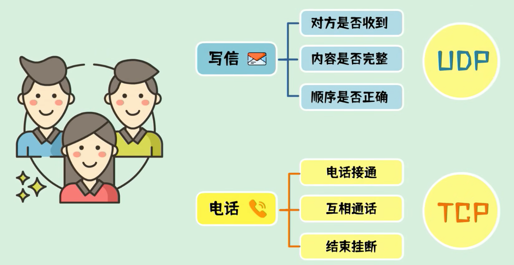

#### TCP 三次握手

TCP 报文头部标志位解释：SYN、ACK、FIN

面试口语版回答： 不是单独的 “数据包码”，更准确地说：**SYN、ACK、FIN 是 TCP 报文头部里的控制标志位（flag）**，每个占 1 个比特位，用来告诉对方这个数据包是用来 “建连接、确认、断连接” 的。

简单理解：

- **SYN（同步位）**：用来发起连接、同步序列号，三次握手里用。
- **ACK（确认位）**：用来告诉对方 “我收到你的包了”，握手、挥手、正常传数据都会用。
- **FIN（结束位）**：用来告诉对方 “我发完数据了，要关闭连接”，四次挥手里用。

它们不是独立的数据包，而是**贴在 TCP 包头上的 “功能标签”**。 三次握手就是靠 `SYN`、`SYN+ACK`、`ACK` 这几种带标记的包完成连接； 四次挥手就是靠 `FIN`、`ACK`、`FIN`、`ACK` 完成断开。

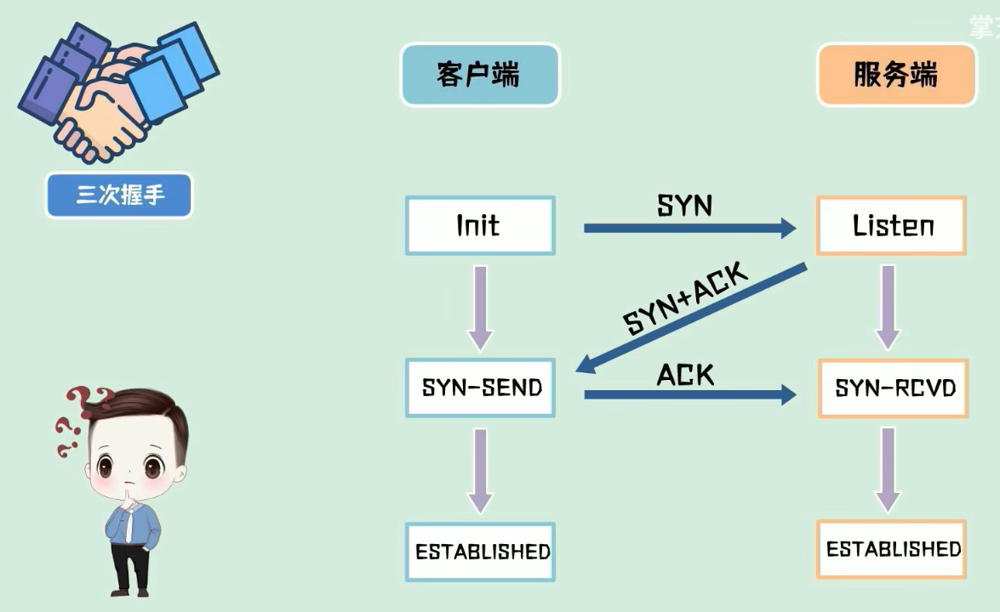

#### TCP 四次挥手

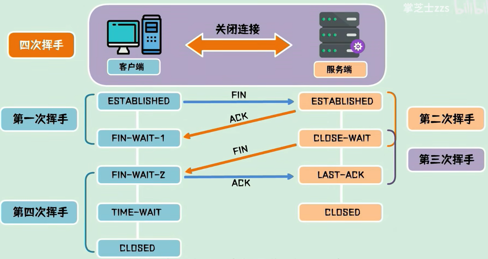

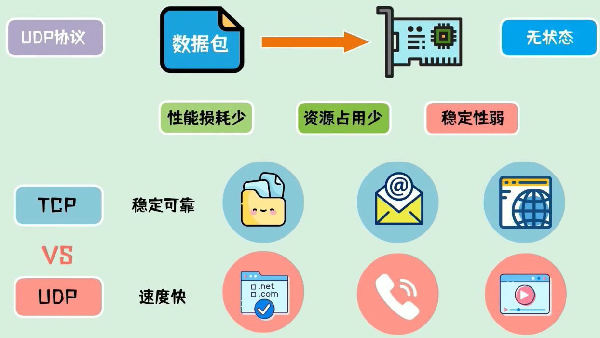

 一、TCP 和 UDP 的区别 **TCP 是面向连接的可靠传输协议，UDP 是无连接的不可靠协议**。 **TCP 有确认、重传、序号机制，能保证数据不丢包、不乱序**，还支持流量控制和拥塞控制，**但头部开销大、传输效率低**，常用于文件传输、网页访问、邮件等场景。 **UDP 不需要建立连接，直接发送数据报文，头部开销小、延迟低、速度快，但不保证数据可靠送达**，适合直播、视频通话、网络游戏、DNS 这类对实时性要求高的场景。 

二、什么是三次握手 **三次握手是 TCP 建立连接的过程，目的是确认客户端和服务端双方的收发能力都正常，同时同步初始序列号**。 第一步，**客户端向服务端发送 SYN 包请求连接**； 第二步，**服务端回复 SYN+ACK 包，确认客户端请求并发起同步**； 第三步，**客户端回复 ACK 包，双方确认后进入连接建立状态**，开始传输数据。 

 三、什么是四次挥手 **四次挥手是 TCP 断开连接的过程**，因为 TCP 是全双工通信，双方需要各自关闭发送通道，所以要四次交互。 **第一步**，**客户端发送 FIN 包，主动关闭发送数据的通道**； **第二步，服务端回复 ACK 确认，此时客户端只能收不能发**； **第三步**，**服务端数据发送完毕后，也发送 FIN 包关闭自己的发送通道**； **第四步，客户端回复 ACK 确认，等待一段时间后双方彻底断开连接**。

## MCP通信协议

[(18 条消息) 深度解析：MCP三大核心通信模式STDIO、SSE与Streamable HTTP的终极指南！ - 知乎](https://zhuanlan.zhihu.com/p/1920408556986954650)

[《MCP从0到1》第3课：MCP通信传输机制（stdio、SSE、Streamable HTTP）最强详解今天这篇文章带 - 掘金](https://juejin.cn/post/7522975050321428489)

[(2 封私信 / 40 条消息) 一文了解：MCP 传输机制 Stdio、SSE 与 Streamable HTTP 的核心区别 - 知乎](https://zhuanlan.zhihu.com/p/1896209461112197767)

【MCP三种传输方式详解：Stdio、SSE、Streamable HTTP】https://www.bilibili.com/video/BV1obKPz6ECM?vd_source=c5c396652c0c83be15efe54e0c348c90

#### stdio

**通过子进程的标准输入输出流(stdin、stdout)进行通信(JsonRpc2.0格式)**

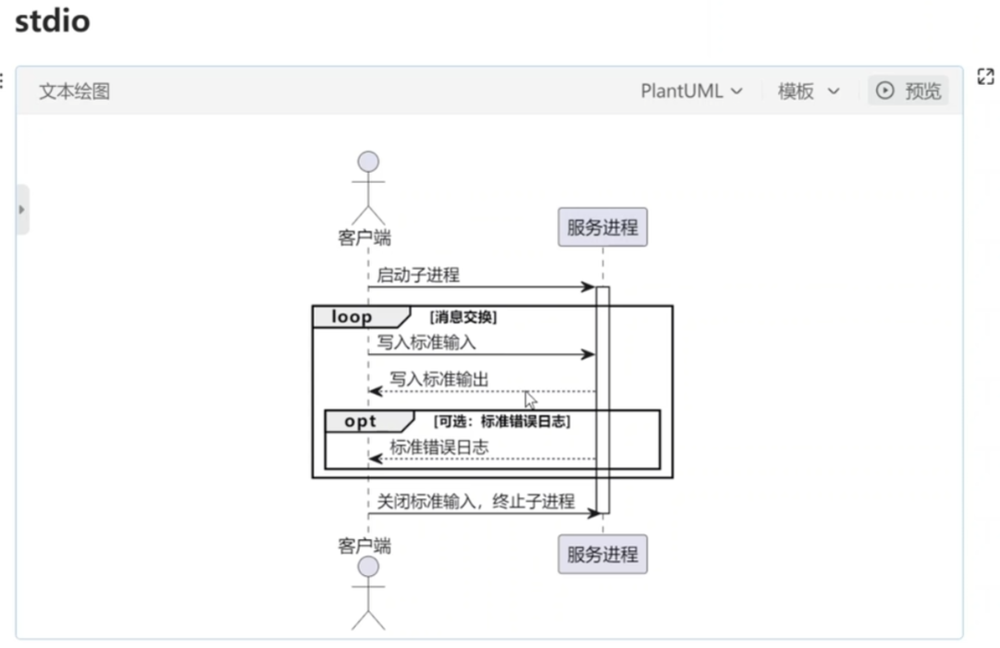

#### SSE

是一种基于[HTTP协议](https://zhida.zhihu.com/search?content_id=259422505&content_type=Article&match_order=1&q=HTTP协议&zhida_source=entity)的**单向数据流传输**方式。**它允许服务器主动向客户端推送实时数据**。**SSE通过保持一个持久的HTTP连接**，**将数据流式传输到客户端，特别适合需要持续更新的实时场景**

缺点：**保持长连接，消耗资源，不支持断线重连**

**第一次连接时，客户端请求/sse接口，服务器返回调用工具的唯一目标端点**

**客户端只需记住这个端点，多次调用工具时，始终向该端点发 POST 请求即可**

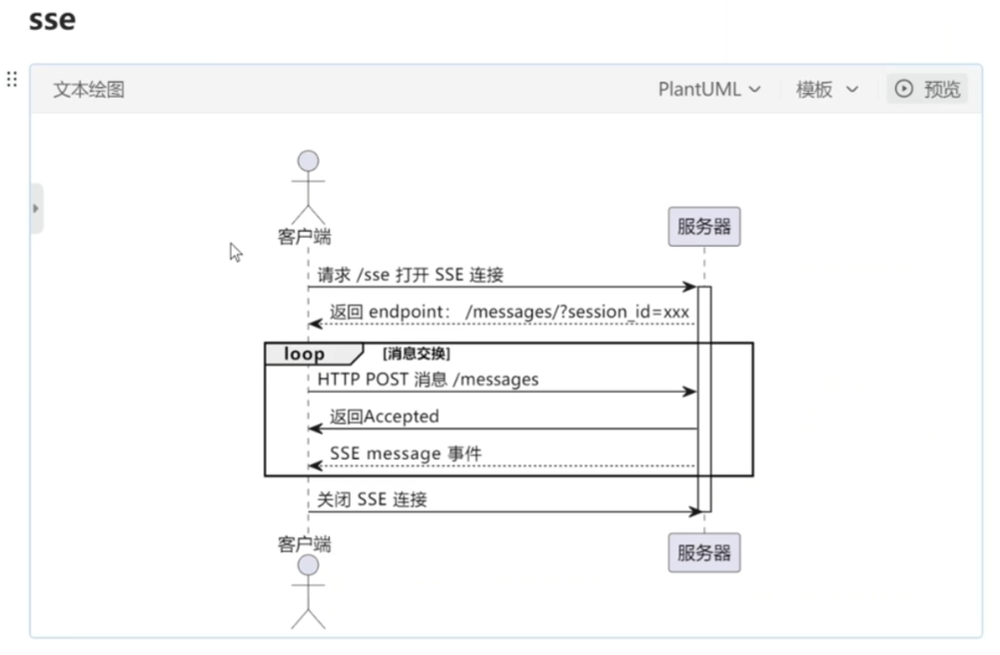

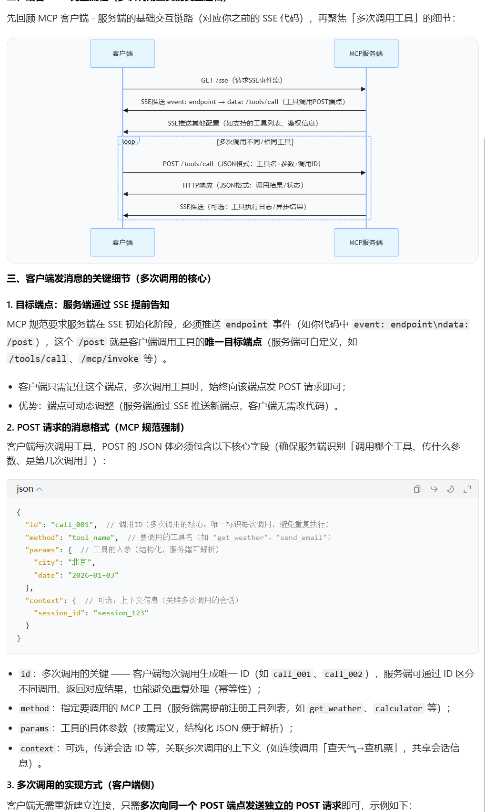

## Streamable Http

**是一种基于HTTP协议的流式传输技术，专门用于大文件（如视频、音频）的分段传输。与SSE不同，Streamable HTTP允许文件在传输的同时被处理，使客户端可以边接收数据边处理，避免等待整个文件加载完成**

- **客户端→服务端：客户端通过HTTP POST 把请求发送到服务器的MCP端点。**
- **服务端→客户端：服务器可以返回单条响应，或升级为 SSE流 来推送多条消息。**

**支持断线重连**

**引入session机制支持状态管理和恢复**

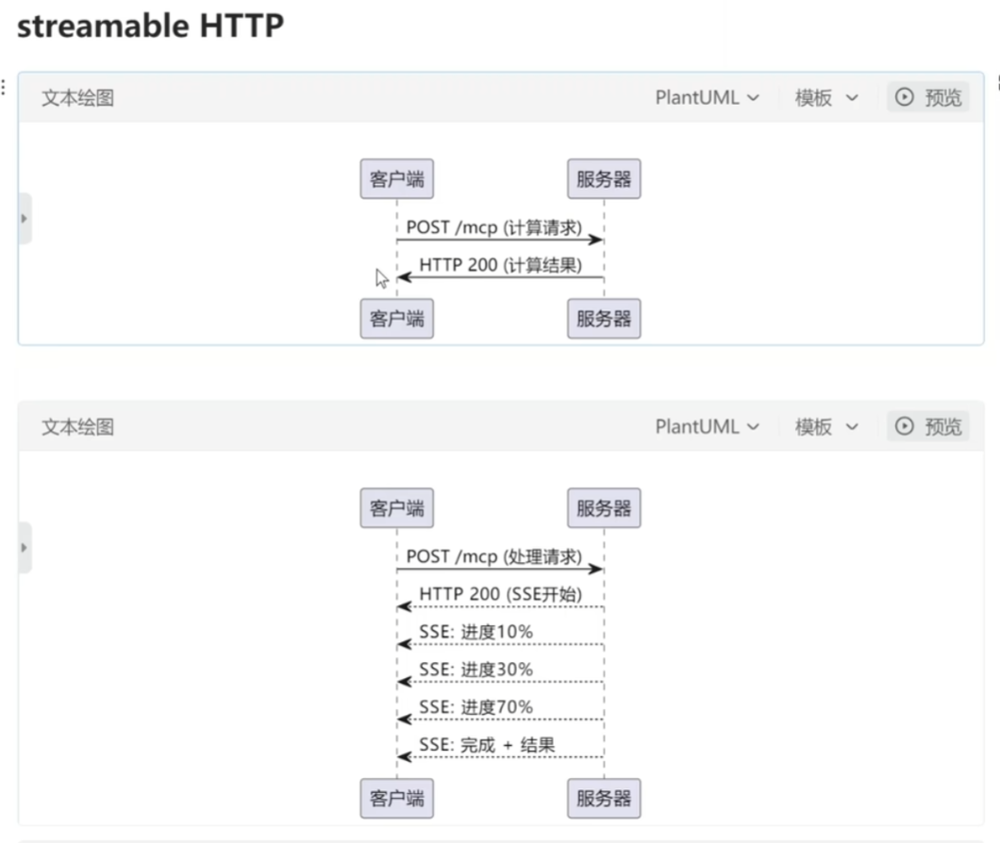

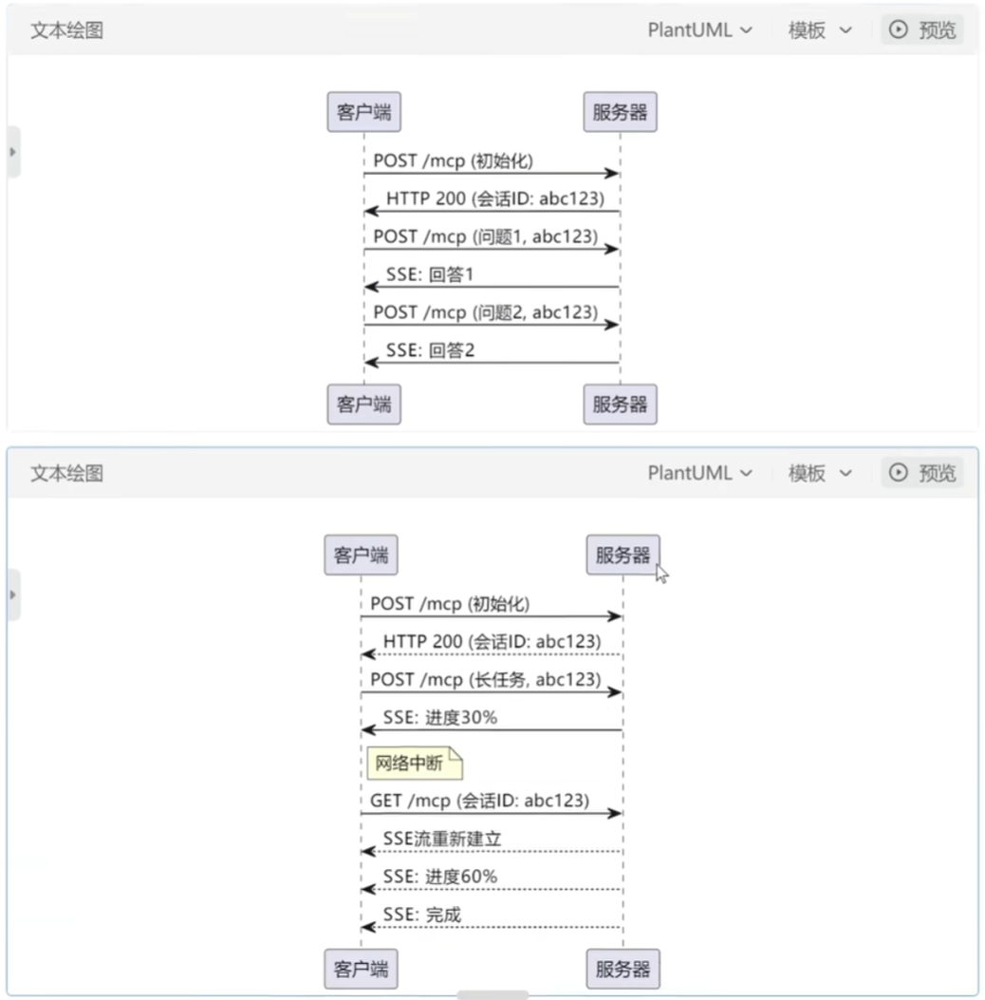

## Multi-agent

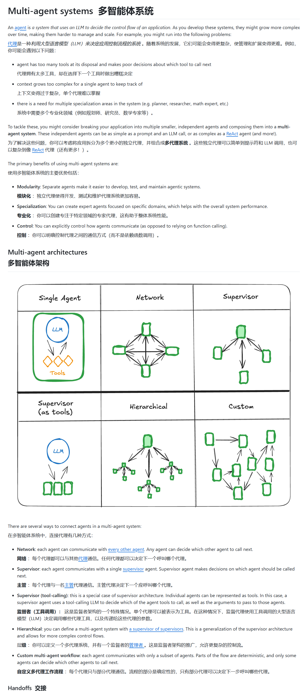

# MCP

MCP Server:MCP服务器，里面就是包含一些执行特殊任务的工具

一般python写的MCP Server 使用uvx启动，node写的MCP Server 使用npx启动

**cline 和 weather的交互过程**

**输入：cline给weather服务器的消息**

**输出：weather给cline的消息**

**以下内容是cline连接mcp服务器时交互过程**

**cline 进行工具调用与MCP Server的交互内容**

#### **cline 与 模型的交互过程**

**cline向大模型发起请求时，prompt会携带很多信息**

**模型每一步都会先进行思考<thinking>，再做决策<use_mcp_tool>，cline再通过MCP Server去调用工具，cline再将工具结果返回给模型(observation)**

**<attempt_completion>:模型认为任务已完成，最终返回给cline的信息。**

## A2A

A2A 指的就是 **Agent to Agent，多智能体之间的协作通信模式**。

A2A作用在agent之间

**MCP作用在大模型和MCP之间**

A2A主要流程 

agent注册阶段

agent card

| 组件           | 全称 / 格式     | 核心作用                                        | 关键信息                                                     |
| -------------- | --------------- | ----------------------------------------------- | ------------------------------------------------------------ |
| **Agent Card** | JSON 元数据文档 | 智能体 “名片”，实现能力发现Agent2Agent Protocol | 包含身份、能力、服务端点、认证要求，支持自动化检索A2A Protocol |
| **A2A Client** | 客户端智能体    | 发起请求、管理任务的一方A2A Protocol            | 可是用户程序、其他 Agent，负责任务提交与结果接收             |
| **A2A Server** | 服务端智能体    | 处理任务、提供服务的一方A2A Protocol            | 暴露 A2A 兼容 HTTP 端点，支持同步 / 异步响应与流式传输Agent2Agent Protocol |
| **Task**       | 任务单元        | 协作的核心工作载体                              | 含唯一 ID、状态（创建 / 处理 / 完成 / 失败）、输入参数、输出结果A2A |
| **Message**    | 通信单元        | 交互的基本载体A2A Protocol                      | 基于 JSON-RPC 2.0，分请求、响应、通知三类，支持实时推送A2A Protocol |
| **Artifact**   | 工件            | 任务输出成果                                    | 支持文本、文件、数据、结构化结果等多类型交付A2A              |

以 “客服 Agent 协同工单 Agent 处理投诉” 为例，清晰演示协作流程：

1. **能力发现**：客服 Agent（Client）通过 A2A 网络查询工单 Agent 的**Agent Card**，获取其服务端点、支持的任务类型与认证方式。

2. **任务提交**：客服 Agent 生成投诉 Task（含用户 ID、问题描述、优先级），按 A2A 消息格式发送至工单 Agent（Server）Agent2Agent Protocol。

3. **执行与状态同步**：工单 Agent 处理任务，实时通过 A2A 推送更新 Task 状态（如 “已受理→处理中→已完成”）Agent2Agent Protocol。

4. **结果交付**：工单 Agent 返回处理结果（工单 ID、解决方案），客服 Agent 接收后完成闭环。

   

agent问答阶段

## skills

**Agent中的Skills是指封装好的功能模块，让Agent具备调用外部工具、操作数据、与系统交互等实际执行能力，是连接大模型认知能力与真实世界操作的桥梁**

**reference：一些其他的文档啥的**

**script: 一些代码脚本啥的**

示例：

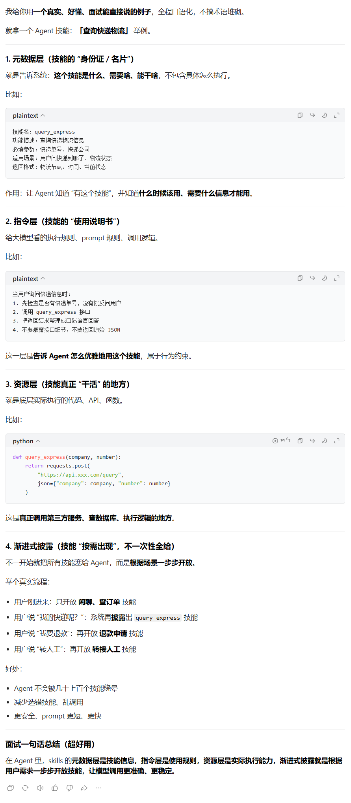

## Harness

### 面试口语版回答

Harness engineering 说白了，就是**给大模型 “套上缰绳、做好管控” 的工程思路**，不是去优化模型本身，而是专门解决大模型输出不可控、容易跑偏的问题。

它的**核心就是通过工程手段约束大模型的行为**，比如规范它的**输出格式、限制工具调用范围、管控多轮推理的流程**，**避免出现幻觉、乱调用工具**、**约束机制、反馈回路、工作流控制和持续改进循环**。

像我们用 LangGraph 做智能体编排、做全局状态管理、设置检查点断点续跑，其实就是典型的 harness engineering 实践，目的就是让大模型在可控、稳定的框架里干活，保证项目能落地到生产环境，而不是随便输出不可控的结果。

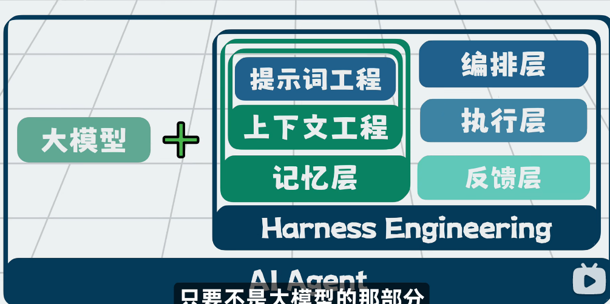

[Harness Engineering（驾驭工程） | 菜鸟教程](https://www.runoob.com/ai-agent/harness-engineering.html)

## Mem0框架

### Langchain 和 langgraph的区别

**LangChain 是高层、链式、快速开发的 LLM 应用框架**

**LangGraph 是底层、图结构、强状态、适合复杂智能体（Agent）的编排引擎**。LangGraph 由 LangChain 团队开发，现在是 LangChain 生态的**底层运行时**

**LangGraph 以状态图(StateGraph)为核心，通过节点 + 边 + 全局共享状态来编排流程，是更底层的执行调度引擎**