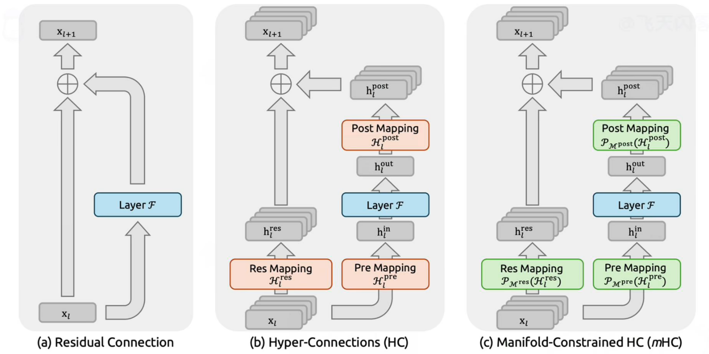
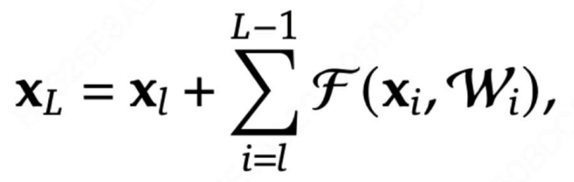
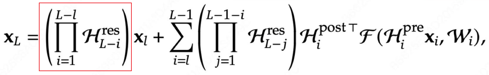

### DeePSeek MOE

**1、从少专家大参数  -> 多专家小参数**

**2、引入共享专家，每个token都必须走共享专家**

### DeepSeek V2

**KV Cache缓存的是之前计算过的KV矩阵，但是随着推理的进行，太占显存了。**

**所以想缓存降维之后的矩阵Cache,推理时将其升维。但是这有一个问题：这不会增加计算吗？KV Cache之前的目的就是减少计算**

**如果不考虑旋转位置编码，这个合并矩阵是可以提前算好的，因为是模型的参数。所以上面提到的增加的计算实际上是不用在意的。**

**但是实际是有位置编码的**

**解决方案就是：额外引入两个矩阵去表示位置编码，然后分开计算两部分。1、不带位置编码的部分 2、带位置编码的部分**

**这里是拼接不是相加**

### DeepSeek V3

**MTP**

一次性预测多个token

[(18 条消息) deepseek技术解读(2)-MTP（Multi-Token Prediction）的前世今生 - 知乎](https://zhuanlan.zhihu.com/p/18056041194)

一次性预测出多个，然后进行batch验证

多个头同时预测加验证

以上是原来MTP架构的流程

以下是DeepSeek V3的

### DeepSeek R1

# DeepSeek-R1：完整训练过程及各阶段对比

DeepSeek-R1的完整训练过程是**多轮“微调+强化学习”迭代优化**的流程，具体分为6个核心阶段：

### 阶段1：冷启动监督微调（SFT）

- **输入**：人工构建的**冷启动数据**（**数千条高质量长思维链数据，覆盖数学、代码等推理场景**）
- **操作**：用这些数据对基础模型**DeepSeek V3**做监督微调（SFT）
- **目标**：规范模型的**输出格式**、**避免多语言混杂**，为后续强化学习打基础

### 阶段2：第一轮GRPO强化学习

- **输入**：SFT后的DeepSeek V3模型
- **操作**：用**GRPO算法（分组相对策略优化）**做强化学习，重点优化数学、代码、科学等任务的推理能力，同时加入**“语言一致性奖励”**解决多语言混杂问题
- **目标**：初步提升模型的推理能力，得到一个推理向的中间模型

### 阶段3：拒绝采样生成高质量数据

- **输入**：阶段2的中间模型
- **操作**：**对同一个任务（如数学题）让模型生成多个输出，通过“拒绝”低质量/错误输出、保留步骤完整/逻辑清晰的输出，得到高质量推理数据**；再结合DeepSeek V3的**非推理数据**（写作、日常问答等），**形成“推理+通用”混合数据集**
- **目标**：**获取能平衡推理与通用能力的训练数据**

### 阶段4：混合数据监督微调（SFT）

- **输入**：阶段3的混合数据集 + 阶段2的中间模型
- **操作**：用**混合数据集**对中间模型再次做SFT
- **目标**：**让模型在保留推理能力的同时，补充通用任务（如写作、对话）的能力**，避免推理能力过拟合

### 阶段5：第二轮GRPO强化学习

- **输入**：阶段4的混合SFT模型
- **操作**：再次用GRPO算法做强化学习，**重点对齐人类对“推理逻辑+通用表达”的综合偏好**
- **目标**：让推理能力与通用能力协同稳定，得到**最终的DeepSeek-R1模型**

### 阶段6：模型蒸馏

- **输入**：最终的DeepSeek-R1模型
- **操作**：将DeepSeek-R1的能力蒸馏到**Qwen、LLAMA3.3**等模型中
- **目标**：得到更小、更易部署的轻量版衍生模型

## DeepSeek DSA

[(46 条消息) DeepSeek-V3.2-Exp 论文详细解读 - 知乎](https://zhuanlan.zhihu.com/p/1956119982858561055)

## MHC

【【闪客】深入解读 DeepSeek mHC！但是用大白话哟~】https://www.bilibili.com/video/BV1jMi4BbESc?vd_source=c5c396652c0c83be15efe54e0c348c90

**残差连接：**

**超连接：**

残差项前面有一个系数，连乘之后可能还是会出现梯度小时或者梯度爆炸的问题

**流型约束超链接：**公式和超连接一样，但是限制了Hres，将Hres限制为双随机矩阵，即矩阵中的元素非负，且行和列的总和为1。双随机矩阵乘法具有封闭性，即双随机矩阵相乘，结果还是双随机矩阵

## Thinking with Visual Primitives

以DeepSeek在2026年4月底发布的题为《Thinking with Visual Primitives》的技术报告来看，你将看到的“视觉原语模型”，其能力的最后、也是最关键的塑造阶段，围绕着一个“先专家化，后统一”的训练策略展开。这个阶段旨在将基础模型的泛化能力，精确定向到精确的空间推理任务上。

### 🧩 第一步：数据基础——奠定基石

在进入后训练之前，高质量的数据是核心。团队从近10万个数据源中筛选出超过3.17万个高质量来源，生成了超过**4000万条**专门用于培养“视觉原语”能力的训练样本。

### 🧠 第二步：专项监督微调 (Supervised Fine-Tuning, SFT)

该模型的后训练策略，最核心的理念是 **“先分头训练，再统一集成”** 。这一步骤体现为“先专家化”：

*   **训练两个专家模型**：研究者针对两种不同的“视觉原语”（点`point`和边界框`bounding box`），分别使用专项数据进行监督微调。
    *   一个模型专门使用 **边界框数据** 进行训练，使其精于定位和框选物体。
    *   另一个模型则专门使用 **点坐标数据** 进行训练，让它更好地理解和生成用于标记路径或点的信息。
*   **策略意图**：这种“分治”策略可以避免在数据量相对较少的情况下，两种不同的空间输出格式相互干扰，确保每个专家都能在其擅长的领域达到最优性能。

### 🎯 第三步：专项强化学习 (Reinforcement Learning, RL) —— 引入GRPO

在SFT之后，模型需要通过强化学习（RL）来“打磨”技巧。这一步中，研究者引入了一种名为 **GRPO（Group Relative Policy Optimization）** 的算法。与常见RL不同，GRPO不需要一个独立的“评价模型”，而是通过对比同一问题下模型生成的多个答案之间的相对优劣来更新策略，这简化了训练流程。

为了引导模型学会“正确思考”，研究者设计了三个维度的奖励模型：

*   **格式奖励 (Format Reward)**：确保模型输出的“视觉原语”（如`<|box|>`或`<|point|>`标记）严格遵守预定义的格式规范。
*   **质量奖励 (Quality Reward)**：评估模型生成的视觉标记是否清晰、明确，没有歧义。
*   **准确度奖励 (Accuracy Reward)**：这是最终评价标准。它直接判断模型生成的视觉原语（如一个框或一个点）是否**精确**地定位到或圈定出了正确的目标物体。

### 🧬 第四步：统一拒绝采样微调 (Unified Rejection Sampling Fine-Tuning)

在强化学习分别优化好两个专家模型后，下一步是让模型获得同时使用“点”和“框”的能力。这一过程通过 **统一拒绝采样微调** 实现。它结合了“拒绝采样”和“微调”两个步骤的核心思想：

1.  **采样**：让上一阶段训练好的两个“专家”模型，针对大量问题生成多个候选答案。
2.  **筛选**：根据设定的标准（如答案的准确性、格式规范性等），从中筛选出最优质的答案。这个过程就像是海选，只留下最优秀的样本。
3.  **微调**：利用这些筛选出的“黄金”样本，最终对模型进行全参数微调。这使得模型既吸收了各个“专家”的精华，又能自主判断在何种情况下应该使用边界框，何种情况下应该使用点坐标。

### 🔬 第五步：在线策略蒸馏 (Online Policy Distillation) —— 最终合并

最后，通过 **在线策略蒸馏**，将两个专家模型的能力无缝地合并到一个最终模型中。在这个阶段，两个专家模型在推理过程中协同工作，它们生成的高质量输出被用来训练一个“学生”模型。这个“学生”模型最终学会在何种场景下运用哪种“视觉原语”，成为一个真正的、统一的“通才”。

### 💎 总结

《Thinking with Visual Primitives》的后训练过程是一套精密且环环相扣的流水线。通过“先专家化，后统一”的策略，它成功地让多模态模型超越了传统语言理解的局限，学会了用“点”和“框”这两种最基础的视觉元素进行思考，从而在复杂空间推理任务中取得了显著的性能突破。