### DeePSeek MOE

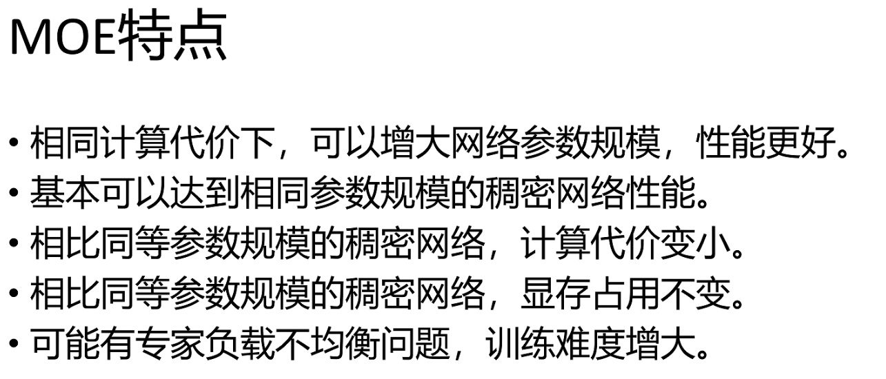

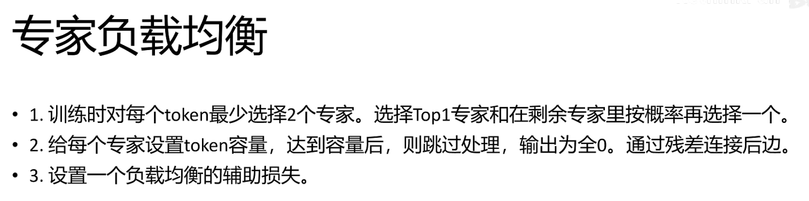

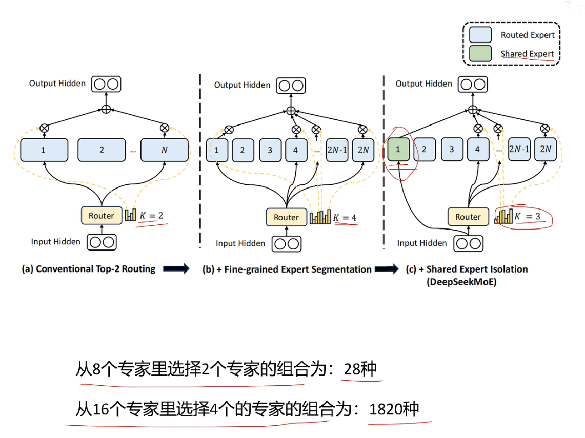

**1、从少专家大参数  -> 多专家小参数**

**2、引入共享专家，每个token都必须走共享专家**

### DeepSeek V2

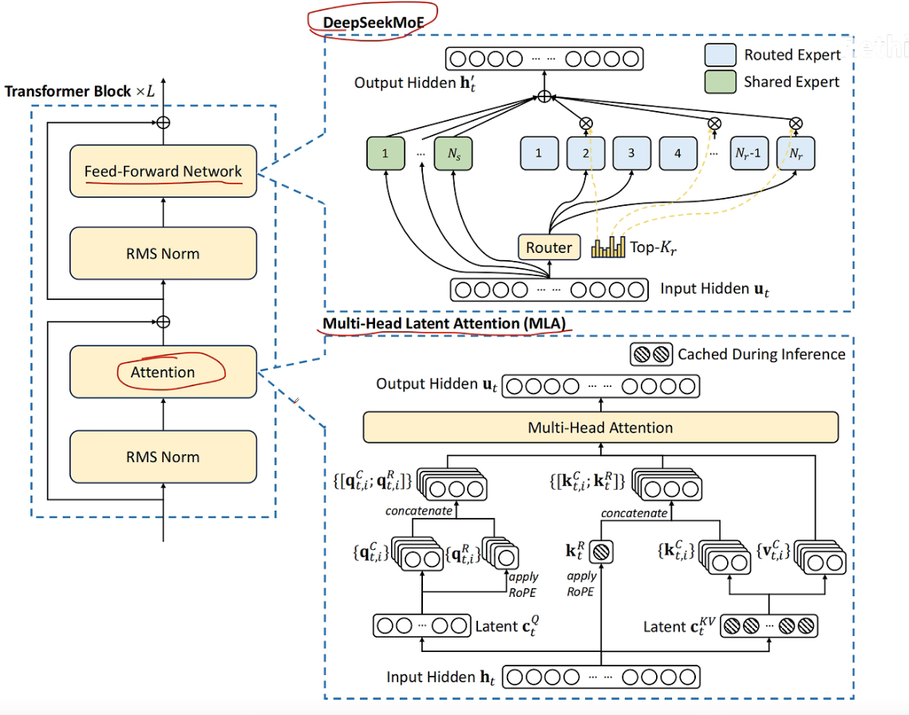

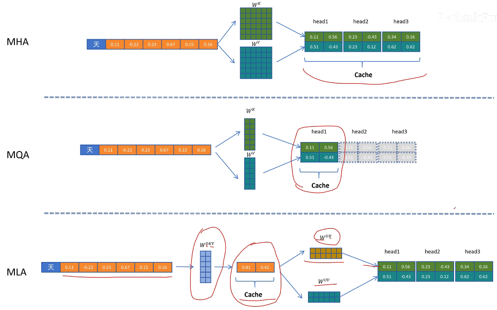

**KV Cache缓存的是之前计算过的KV矩阵，但是随着推理的进行，太占显存了。**

**所以想缓存降维之后的矩阵Cache,推理时将其升维。但是这有一个问题：这不会增加计算吗？KV Cache之前的目的就是减少计算**

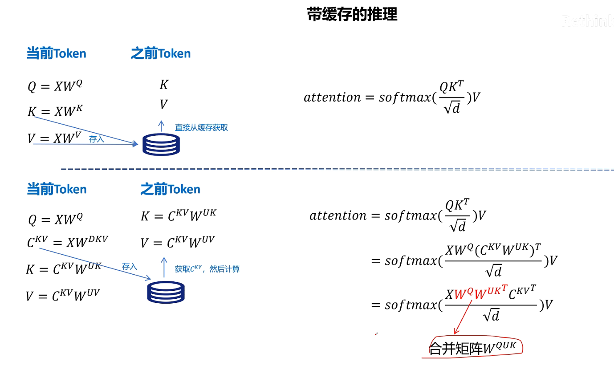

**如果不考虑旋转位置编码，这个合并矩阵是可以提前算好的，因为是模型的参数。所以上面提到的增加的计算实际上是不用在意的。**

**但是实际是有位置编码的**

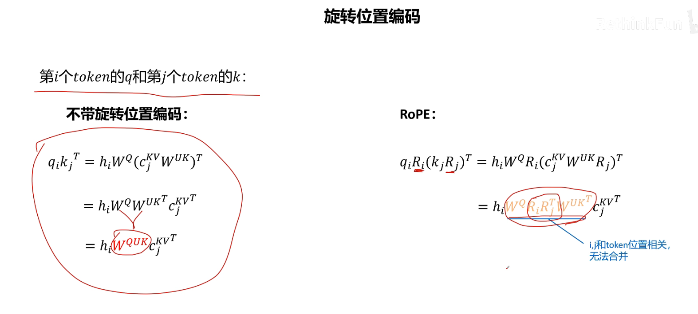

**解决方案就是：额外引入两个矩阵去表示位置编码，然后分开计算两部分。1、不带位置编码的部分 2、带位置编码的部分**

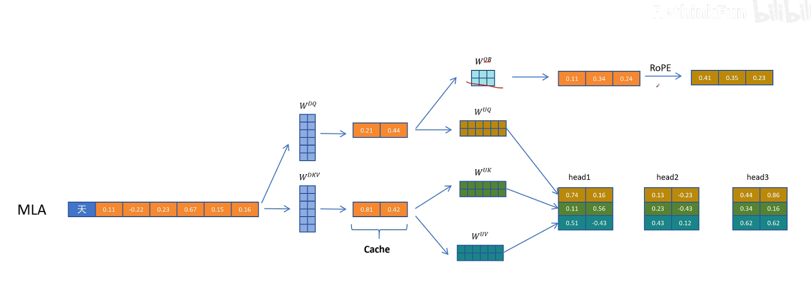

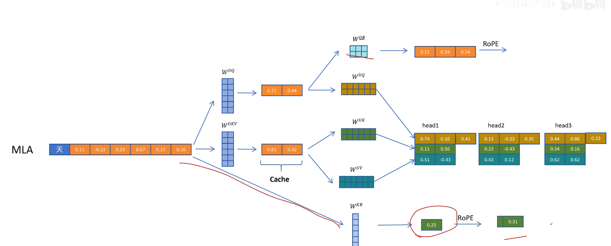

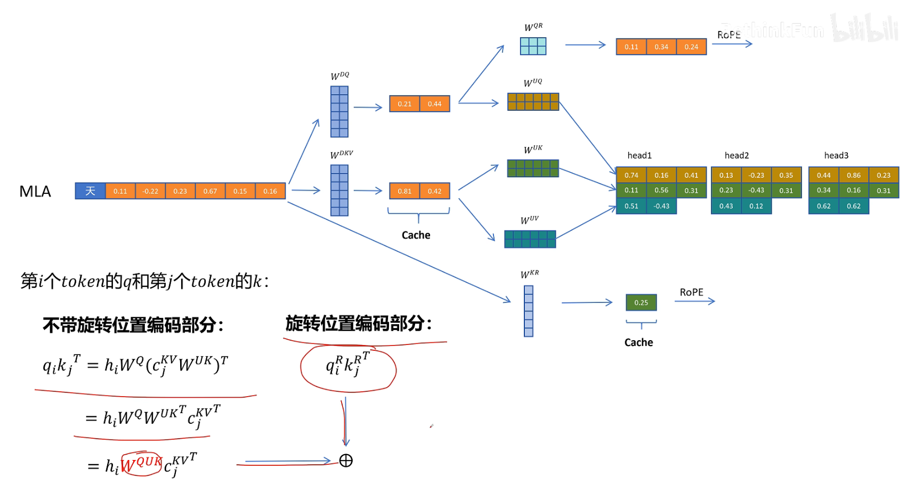

这里是拼接不是相加

### DeepSeek V3

**MTP**

一次性预测多个token

[(18 条消息) deepseek技术解读(2)-MTP（Multi-Token Prediction）的前世今生 - 知乎](https://zhuanlan.zhihu.com/p/18056041194)

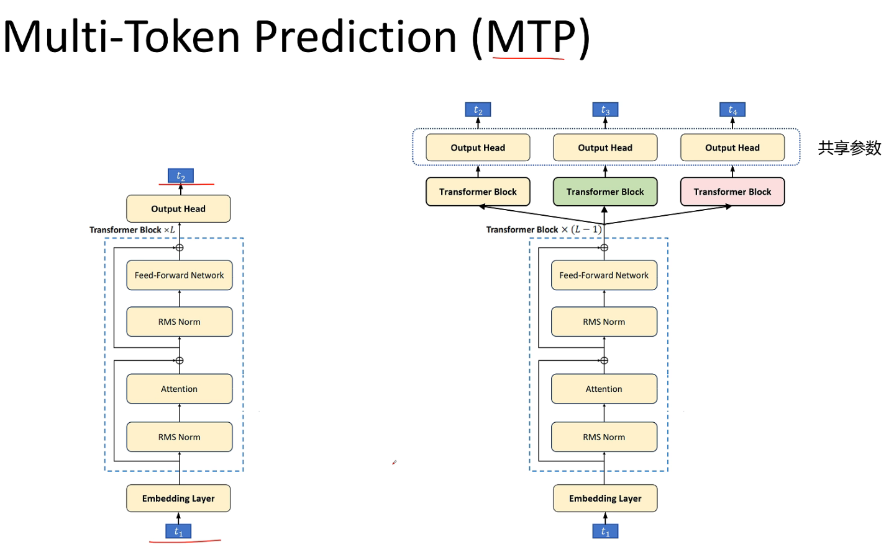

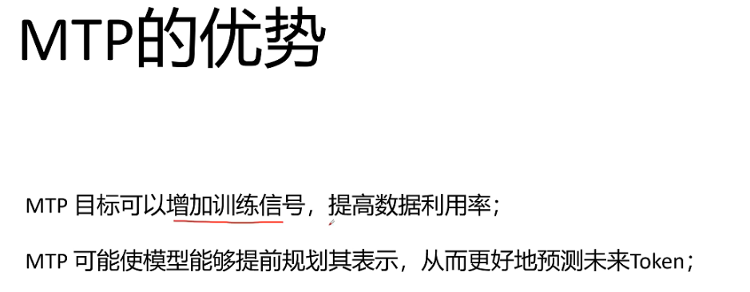

一次性预测出多个，然后进行batch验证

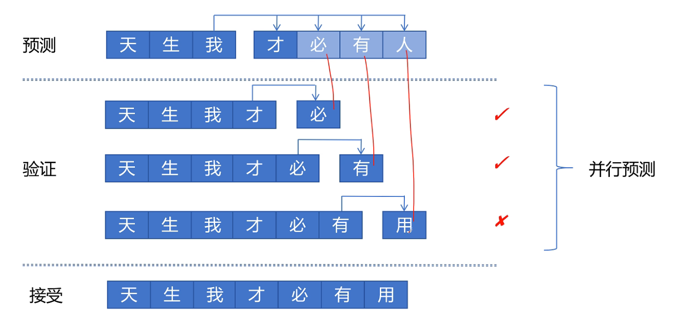

多个头同时预测加验证

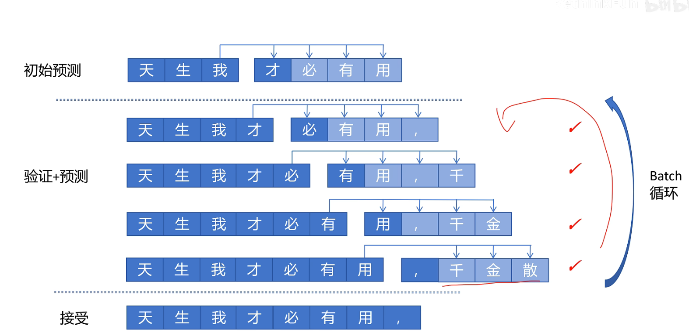

以上是原来MTP架构的流程

以下是DeepSeek V3的

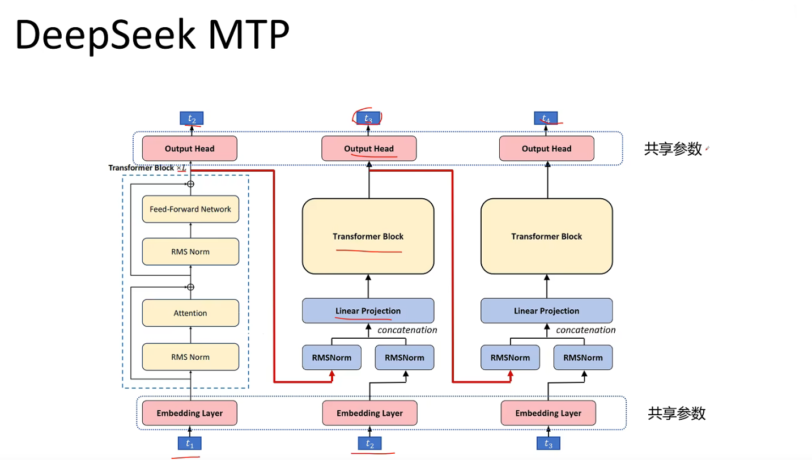

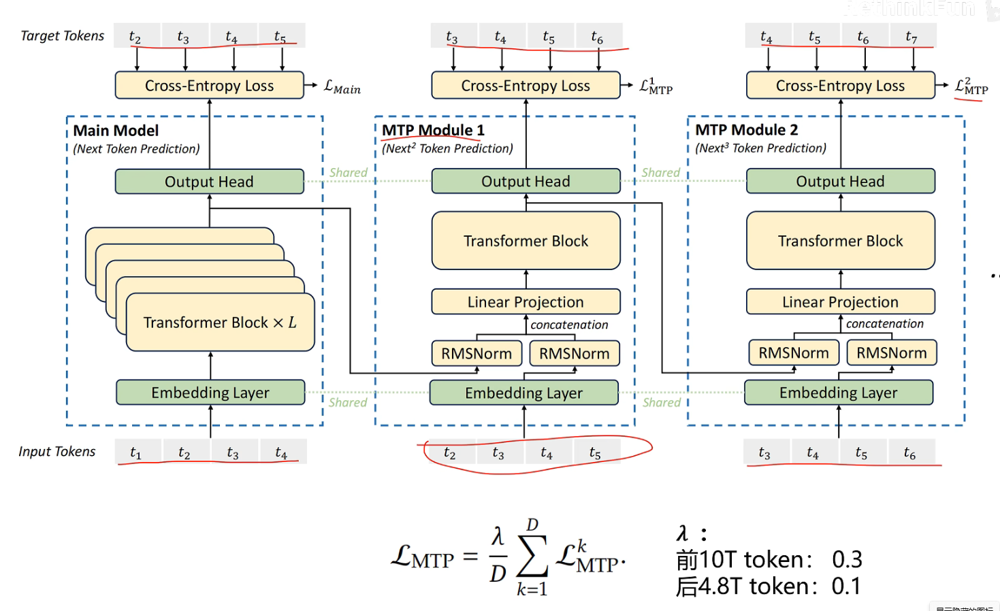

### DeepSeek R1

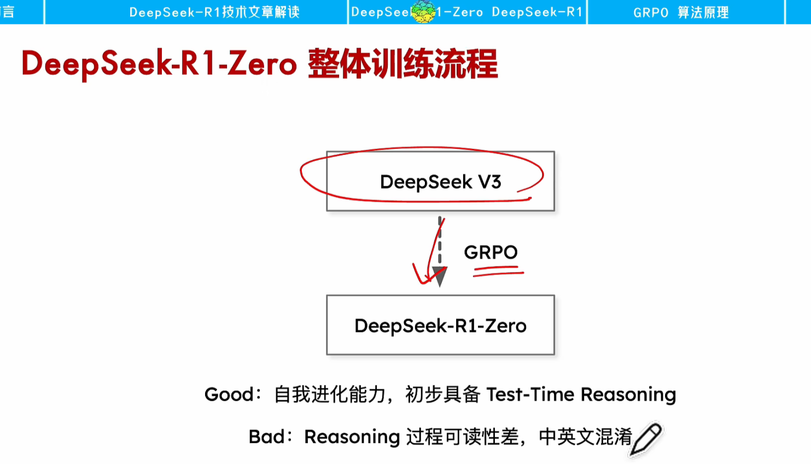

# DeepSeek-R1：完整训练过程及各阶段对比

DeepSeek-R1的完整训练过程是**多轮“微调+强化学习”迭代优化**的流程，具体分为6个核心阶段：

### 阶段1：冷启动监督微调（SFT）

- **输入**：人工构建的**冷启动数据**（**数千条高质量长思维链数据，覆盖数学、代码等推理场景**）
- **操作**：用这些数据对基础模型**DeepSeek V3**做监督微调（SFT）
- **目标**：规范模型的**输出格式**、**避免多语言混杂**，为后续强化学习打基础

### 阶段2：第一轮GRPO强化学习

- **输入**：SFT后的DeepSeek V3模型
- **操作**：用**GRPO算法（分组相对策略优化）**做强化学习，重点优化数学、代码、科学等任务的推理能力，同时加入**“语言一致性奖励”**解决多语言混杂问题
- **目标**：初步提升模型的推理能力，得到一个推理向的中间模型

### 阶段3：拒绝采样生成高质量数据

- **输入**：阶段2的中间模型
- **操作**：**对同一个任务（如数学题）让模型生成多个输出，通过“拒绝”低质量/错误输出、保留步骤完整/逻辑清晰的输出，得到高质量推理数据**；再结合DeepSeek V3的**非推理数据**（写作、日常问答等），**形成“推理+通用”混合数据集**
- **目标**：**获取能平衡推理与通用能力的训练数据**

### 阶段4：混合数据监督微调（SFT）

- **输入**：阶段3的混合数据集 + 阶段2的中间模型
- **操作**：用**混合数据集**对中间模型再次做SFT
- **目标**：**让模型在保留推理能力的同时，补充通用任务（如写作、对话）的能力**，避免推理能力过拟合

### 阶段5：第二轮GRPO强化学习

- **输入**：阶段4的混合SFT模型
- **操作**：再次用GRPO算法做强化学习，**重点对齐人类对“推理逻辑+通用表达”的综合偏好**
- **目标**：让推理能力与通用能力协同稳定，得到**最终的DeepSeek-R1模型**

### 阶段6：模型蒸馏

- **输入**：最终的DeepSeek-R1模型
- **操作**：将DeepSeek-R1的能力蒸馏到**Qwen、LLAMA3.3**等模型中
- **目标**：得到更小、更易部署的轻量版衍生模型

## DeepSeek DSA

[(46 条消息) DeepSeek-V3.2-Exp 论文详细解读 - 知乎](https://zhuanlan.zhihu.com/p/1956119982858561055)

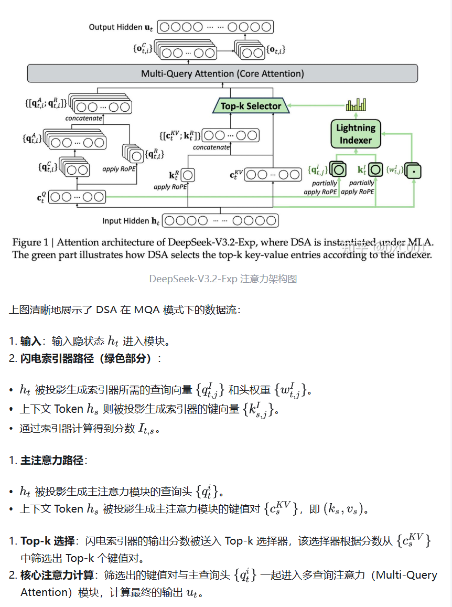