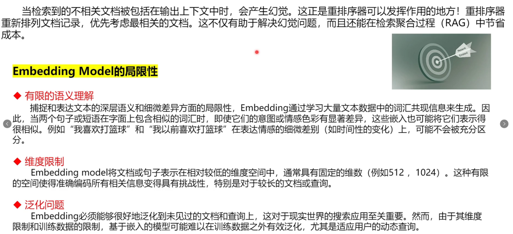
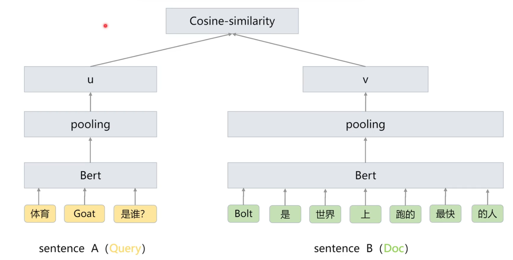
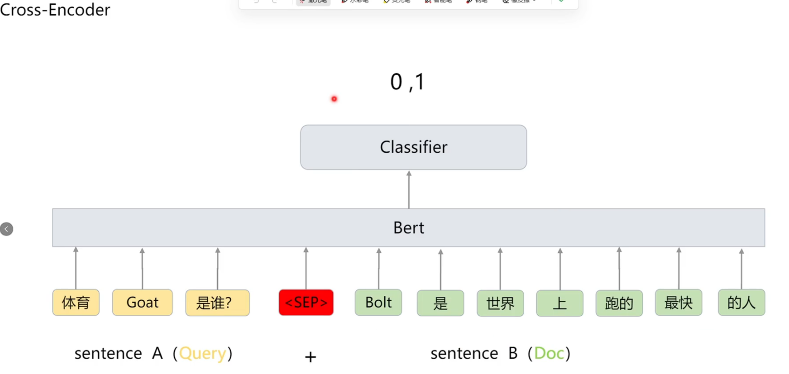

### BGE-M3

[BGE M3-Embedding 模型介绍 - JadePeng - 博客园](https://www.cnblogs.com/xiaoqi/p/18143552/bge-m3)

# 三种常见文本检索匹配方式及差异对比

这是三种常见的文本检索匹配方式，核心是通过不同的向量/权重计算逻辑，衡量“查询（query）”和“文本段（passage）”的相关性，具体解释如下：

### 1. 稠密检索（Dense Retrieval）

核心是**“单全局向量匹配”**——把query和passage各压缩成一个代表整体语义的向量，用向量相似度衡量相关性。

- 步骤：
  1. query输入编码器，得到隐状态层，取开头的「CLS」位置的隐状态，归一化后作为query的向量  $e_q$ ；
  2. 同理，passage输入编码器，取「CLS」位置的归一化隐状态作为passage的向量  $e_p$ ；
- 相关性分数：用两个向量的内积计算 →  $s_{\text{dense}} = \langle e_p, e_q \rangle$ 。

### 2. 词法检索（Lexical Retrieval）

核心是**“单词（token）权重匹配”**——基于query和passage中共同出现的词，通过词的权重乘积之和衡量相关性。

- 步骤：
  1. 对query里的每个词（token）t，用矩阵映射+ReLU激活，从该词的隐状态算出权重  $w_{qt}$ （同一词出现多次，只留最大权重）；
  2. 同理算出passage里每个词的权重  $w_{pt}$ ；
- 相关性分数：找出query和passage的共现词，将这些词的“query权重×passage权重”相加 →  $s_{\text{lex}} = \sum_{t \in q \cap p} (w_{qt} * w_{pt})$ 。

### 3. 多向量检索（Multi-Vector Retrieval）

核心是**“序列向量匹配”**——不用单个全局向量，而是用query和passage整个序列的向量，通过“逐个向量找最优匹配再平均”衡量相关性。

- 步骤：
  1. 用可学习矩阵，把query的整个隐状态层映射成新的向量序列，归一化后得到  $E_q$ ；同理处理passage得到  $E_p$ ；
  2. 对  $E_q$  里的每个向量，和  $E_p$  里的所有向量算内积，取最大的那个值；
- 相关性分数：把query所有向量的“最大内积”取平均 →  $s_{\text{mul}} = \frac{1}{N} \sum_{i=1}^N \max_{j=1}^M E_q[i] \cdot E_p^T[j]$ （N、M是query和passage的长度）。

embedding架构

BGE ReRanker

reranker架构

### Qwen3-Embedding

对于问题加了提示词

取最后一个cls token作为语义表示

### Qwen3-Reranker

构造**<Instruct>提示词<Query>问题<Document>检索回来的文本**，输入给模型

取最后一个token 输出yes和no的概率，拼接起来得到:[no_pro,yes_pro],进行log_softmax,然后反过来exp计算，取出为yes的概率

