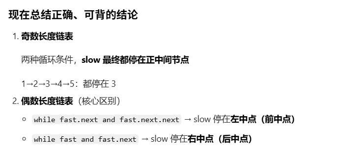
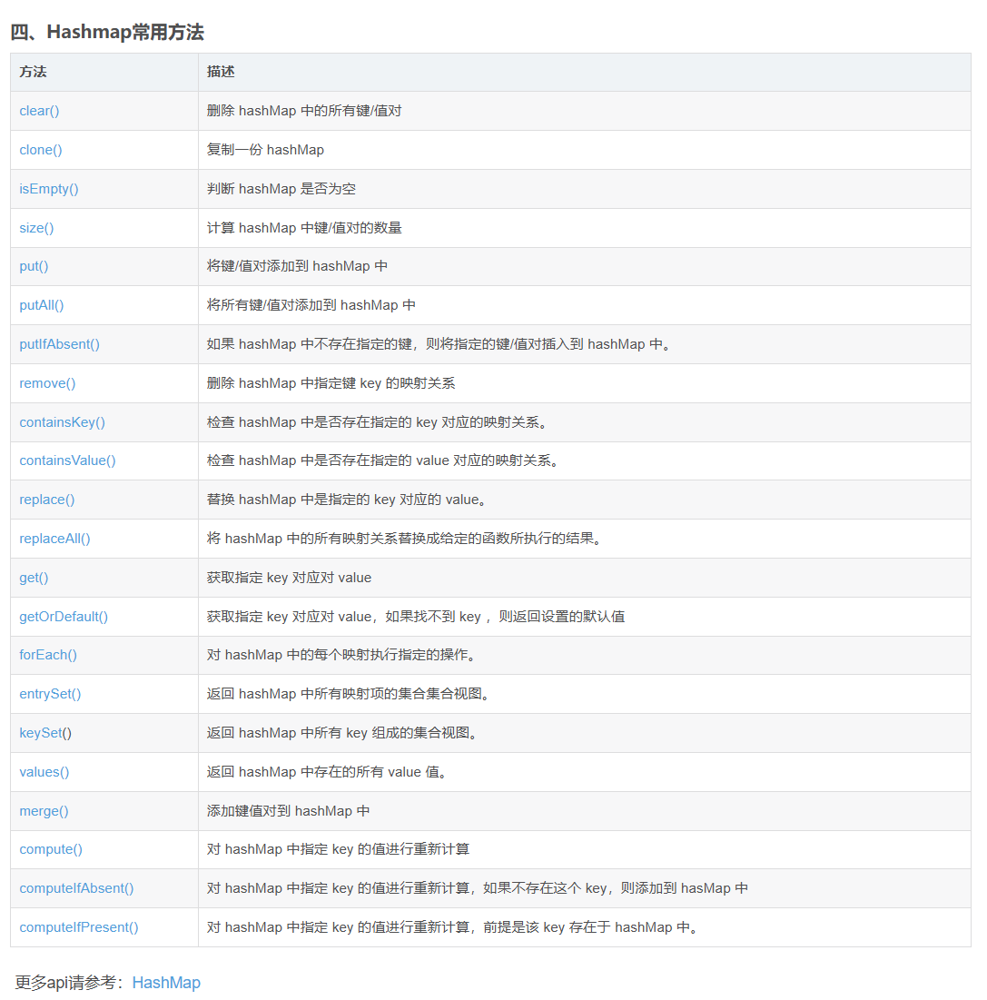
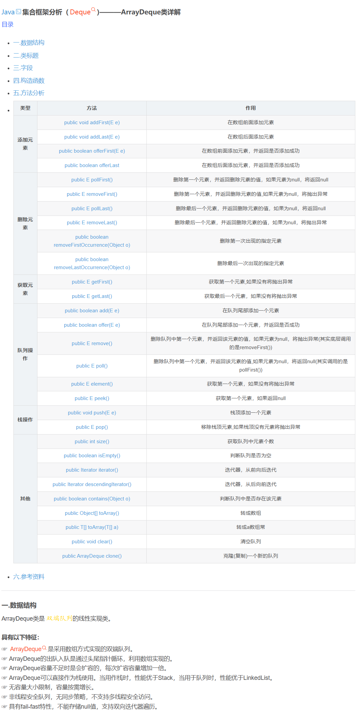
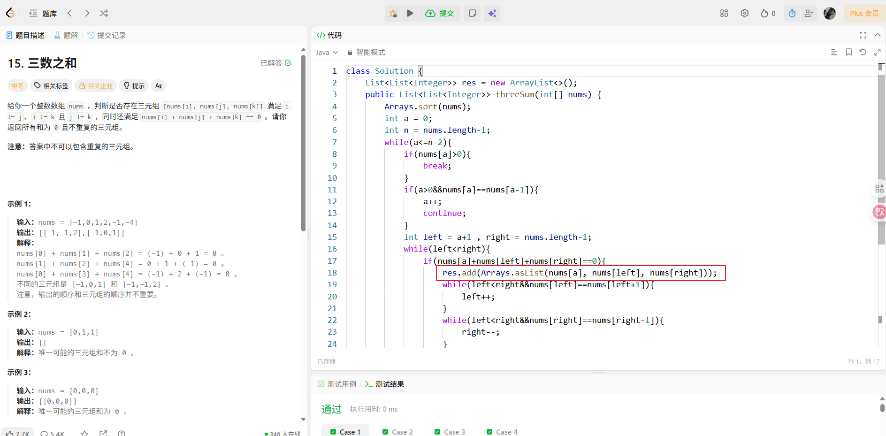
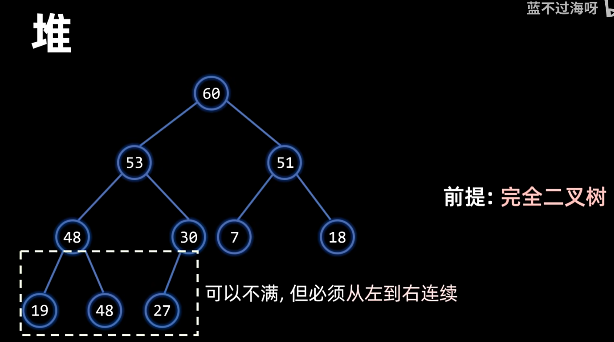
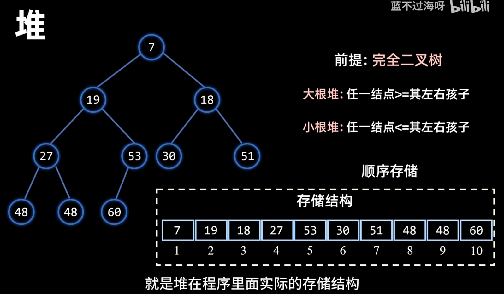

| 数据结构                                   | 初始化方式                                                   | 分类 | API 方法                              | 作用                                                  | 注意事项                                  |
| ------------------------------------------ | ------------------------------------------------------------ | ---- | ------------------------------------- | ----------------------------------------------------- | ----------------------------------------- |
| **列表 (list)**                            | 1. 空列表：`lst = []`2. 带初始值：`lst = [1,2,3]`3. 固定长度初始化：`lst = [0]*n` | 添加 | `append(x)`                           | 末尾添加单个元素                                      | 最常用，一次加 1 个                       |
|                                            |                                                              |      | `extend(iter)`                        | 批量添加可迭代对象元素                                | 区别于 append（append 加整个对象）        |
|                                            |                                                              |      | `insert(idx, x)`                      | 指定索引插入元素                                      | 索引越界补到末尾                          |
|                                            |                                                              | 移除 | `pop(idx=-1)`                         | 删除指定索引元素（默认最后一个），返回删除值          | 索引越界报错                              |
|                                            |                                                              |      | `remove(x)`                           | 删除第一个匹配的元素                                  | 元素不存在报错                            |
|                                            |                                                              |      | `del lst[idx]` / `del lst[start:end]` | 删除指定索引 / 切片元素                               | 无返回值，索引越界报错                    |
|                                            |                                                              |      | `clear()`                             | 清空所有元素                                          | 列表变为 `[]`                             |
| **字典 (dict)**                            | 1. 空字典：`d = {}`2. 带初始值：`d = {"name":"Tom", "age":18}`3. 键值对列表转字典：`d = dict([("name","Tom"), ("age",18)])` | 添加 | `d[key] = value`                      | 添加 / 修改键值对                                     | key 存在则覆盖值                          |
|                                            |                                                              |      | `update(other)`                       | 批量添加键值对                                        | 重复 key 覆盖原值                         |
|                                            |                                                              |      | `setdefault(key, default=None)`       | 安全添加（key 不存在则加，存在则返回原值）            | 不覆盖已有值                              |
|                                            |                                                              | 移除 | `pop(key, default=None)`              | 删除指定 key，返回对应 value                          | key 不存在时，无 default 则报错           |
|                                            |                                                              |      | `popitem()`                           | 删除最后插入的键值对（3.7 + 有序），返回 (key, value) | 空字典调用报错                            |
|                                            |                                                              |      | `del d[key]`                          | 删除指定 key 的键值对                                 | key 不存在报错                            |
|                                            |                                                              |      | `clear()`                             | 清空所有键值对                                        | 字典变为 `{}`                             |
| **集合 (set)**                             | 1. 空集合：`s = set()`（⚠️ 不能用`{}`）2. 带初始值：`s = {1,2,3}`3. 可迭代对象转集合：`s = set([1,2,3])` | 添加 | `add(x)`                              | 添加单个不可变元素                                    | 重复添加无效果；元素可变（list/dict）报错 |
|                                            |                                                              |      | `update(iter)`                        | 批量添加可迭代对象元素                                | 自动去重                                  |
|                                            |                                                              | 移除 | `discard(x)`                          | 删除指定元素                                          | 元素不存在不报错（推荐）                  |
|                                            |                                                              |      | `remove(x)`                           | 删除指定元素                                          | 元素不存在报错                            |
|                                            |                                                              |      | `pop()`                               | 随机删除一个元素，返回该元素                          | 空集合调用报错；集合无序                  |
|                                            |                                                              |      | `clear()`                             | 清空所有元素                                          | 集合变为 `set()`                          |
| **栈 (stack)（基于 list 实现）**           | 1. 空栈：`stack = []`2. 带初始值：`stack = [1,2,3]`（栈底→栈顶：1→2→3） | 添加 | `append(x)`                           | 栈顶（列表末尾）添加元素                              | 栈的核心入栈操作                          |
|                                            |                                                              | 移除 | `pop()`                               | 弹出栈顶元素（列表最后一个），返回该元素              | 栈的核心出栈操作；空栈调用报错            |
|                                            |                                                              | 查看 | `stack[-1]`                           | 查看栈顶元素（不弹出）                                | 空栈访问报错                              |
| **队列 (queue)（基于 collections.deque）** | 1. 空队列：`q = deque()`2. 带初始值：`q = deque([1,2,3])`（队首→队尾：1→2→3）3. 限制长度队列：`q = deque(maxlen=5)`（超出自动丢弃队首） | 添加 | `append(x)`                           | 队尾添加元素                                          | 入队操作                                  |
|                                            |                                                              |      | `appendleft(x)`                       | 队首添加元素（双端队列特性）                          | deque 专属，普通队列不用                  |
|                                            |                                                              | 移除 | `popleft()`                           | 弹出队首元素，返回该元素                              | 队列核心出队操作；空队列报错              |
|                                            |                                                              |      | `pop()`                               | 弹出队尾元素（双端队列特性）                          | 普通队列不推荐使用                        |
|                                            |                                                              | 查看 | `q[0]`                                | 查看队首元素（不弹出）                                | 空队列访问报错                            |
| **堆 (heap)（基于 heapq 模块）**           | 1. 空堆：`heap = []`（空列表）2. 列表转堆：`lst = [3,1,2]; heapq.heapify(lst)`（原地转为小顶堆）3. 自定义大顶堆：`heap = [-x for x in lst]; heapq.heapify(heap)` | 添加 | `heapq.heappush(heap, x)`             | 将元素 x 加入堆，维持小顶堆结构                       | 堆用列表存储，默认小顶堆                  |
|                                            |                                                              | 移除 | `heapq.heappop(heap)`                 | 弹出堆顶元素（最小元素），返回该元素                  | 空堆调用报错                              |
|                                            |                                                              | 构建 | `heapq.heapify(lst)`                  | 将列表原地转为小顶堆                                  | 时间复杂度 O (n)，优于逐个 push           |
|                                            |                                                              | 查看 | `heap[0]`                             | 查看堆顶元素（最小元素，不弹出）                      | 空堆访问报错                              |


`sorted(nums)` 会返回一个**新的排序后列表**，但不会修改原数组 `nums`，而你的双指针逻辑依赖「有序数组」，这会导致后续去重、指针移动全部失效。

✅ 正确写法：`nums.sort()`（原地排序，直接修改原数组）。


虚拟头节点只用在：**删除节点、插入节点、反转链表、头节点会变化**的场景，**纯遍历找中点不用**！

```python
slow = head
fast = head
```





## 双端队列

| 操作类型     | 操作位置 | 抛异常方法（失败报错）      | 安全方法（失败返回 false/null） | 说明                                        |
| ------------ | -------- | --------------------------- | ------------------------------- | ------------------------------------------- |
| **添加元素** | 头部     | `addFirst(E e)`             | `offerFirst(E e)`               | 头部插入元素                                |
|              | 尾部     | `addLast(E e)` / `add(E e)` | `offerLast(E e)` / `offer(E e)` | 尾部插入元素（`add/offer` 是 Queue 继承的） |
| **删除元素** | 头部     | `removeFirst()` / `pop()`   | `pollFirst()` / `poll()`        | 移除并返回头部元素（`pop` 是栈的便捷方法）  |
|              | 尾部     | `removeLast()`              | `pollLast()`                    | 移除并返回尾部元素                          |
| **查询元素** | 头部     | `getFirst()` / `element()`  | `peekFirst()` / `peek()`        | 获取但不删除头部元素                        |
|              | 尾部     | `getLast()`                 | `peekLast()`                    | 获取但不删除尾部元素                        |

```java
Deque<Character> stack = new ArrayDeque<>();
```







## 堆

大顶堆：任一节点>=左右节点    大的在上面

小顶堆：任一节点<=左右节点  小的在上面

```java
 PriorityQueue<Integer> minHeap = new PriorityQueue<>();
 PriorityQueue<Integer> maxHeap = new PriorityQueue<>(Collections.reverOrder());
PriorityQueue<Map.Entry<Integer, Integer>> minHeap = new PriorityQueue<>(
        Comparator.comparingInt(Map.Entry::getValue)
);
```



private StringBuilder temp = new StringBuilder();

temp.append(str.charAt(i));

 temp.deleteCharAt(temp.length()-1);

res.add(temp.toString());


栈

Deque<Character> deque = new ArrayDeque<>();
