# 1.attention

### 1.Attention

#### **1.1 讲讲对Attention的理解？**

Attention机制是一种在处理时序相关问题的时候常用的技术，主要用于处理序列数据。

核心思想是在处理序列数据时，网络应该更关注输入中的重要部分，而忽略不重要的部分，它通过学习不同部分的权重，将输入的序列中的重要部分显式地加权，从而使得模型可以更好地关注与输出有关的信息。

在序列建模任务中，比如机器翻译、文本摘要、语言理解等，输入序列的不同部分可能具有不同的重要性。传统的循环神经网络（RNN）或卷积神经网络（CNN）在处理整个序列时，难以捕捉到序列中不同位置的重要程度，可能导致信息传递不够高效，特别是在处理长序列时表现更明显。

Attention机制的关键是引入一种机制来动态地计算输入序列中各个位置的权重，从而在每个时间步上，对输入序列的不同部分进行加权求和，得到当前时间步的输出。这样就实现了模型对输入中不同部分的关注度的自适应调整。

**1.2 Attention的计算步骤是什么？**

具体的计算步骤如下：

- **计算查询（Query）**：查询是当前时间步的输入，用于和序列中其他位置的信息进行比较。
- **计算键（Key）和值（Value）**：键表示序列中其他位置的信息，值是对应位置的表示。键和值用来和查询进行比较。
- **计算注意力权重**：通过将查询和键进行内积运算，然后应用softmax函数，得到注意力权重。**这些权重表示了在当前时间步，模型应该关注序列中其他位置的重要程度**。
- **加权求和**：**根据注意力权重将值进行加权求和，得到当前时间步的输出**。

在Transformer中，Self-Attention 被称为"Scaled Dot-Product Attention"，其计算过程如下：

1. 对于输入序列中的每个位置，通过计算其与所有其他位置之间的相似度得分（通常通过点积计算）。
2. **对得分进行缩放处理，以防止梯度爆炸**。
3. 将得分用softmax函数转换为注意力权重，以便计算每个位置的加权和。
4. 使用注意力权重对输入序列中的所有位置进行加权求和，得到每个位置的自注意输出。

$$
Attention(Q,K,V)=softmax(\frac{QK^T}{\sqrt{d_k}})V
$$

#### **1.3 Attention机制和传统的Seq2Seq模型有什么区别？**

Seq2Seq模型是一种基于编码器-解码器结构的模型，主要用于处理序列到序列的任务，例如**机器翻译、语音识别**等。

传统的Seq2Seq模型只使用编码器来捕捉输入序列的信息，而解码器只从编码器的最后状态中获取信息，并将其用于生成输出序列。

而Attention机制则允许解码器在生成每个输出时，根据输入序列的不同部分给予不同的注意力，从而使得模型更好地关注到输入序列中的重要信息。

#### **1.4 self-attention 和 target-attention的区别？**

self-attention是指在序列数据中，**将当前位置与其他位置之间的关系建模**。它通过计算每个位置与其他所有位置之间的相关性得分，从而为每个位置分配一个权重。这使得模型能够根据输入序列的不同部分的重要性，自适应地选择要关注的信息。

target-attention则是指将**注意力机制应用于目标（或查询）和一组相关对象之间的关系**。它用于将目标与其他相关对象进行比较，并将注意力分配给与目标最相关的对象。这种类型的注意力通常用于任务如机器翻译中的编码-解码模型，其中需要将源语言的信息对齐到目标语言。

因此，**自注意力主要关注序列内部的关系，而目标注意力则关注目标与其他对象之间的关系**。这两种注意力机制在不同的上下文中起着重要的作用，帮助模型有效地处理序列数据和相关任务。

#### **1.5 在常规attention中，一般有k=v，那self-attention 可以吗?**

self-attention实际只是attention中的一种特殊情况，因此k=v是没有问题的，也即K，V参数矩阵相同。实际上，在Transformer模型中，Self-Attention的典型实现就是k等于v的情况。Transformer中的Self-Attention被称为"Scaled Dot-Product Attention"，其中通过将词向量进行线性变换来得到Q、K、V，并且这三者是相等的。

#### **1.6 目前主流的attention方法有哪些？**

讲自己熟悉的就可：

- **Scaled Dot-Product Attention**: 这是Transformer模型中最常用的Attention机制，用于计算查询向量（Q）与键向量（K）之间的相似度得分，然后使用注意力权重对值向量（V）进行加权求和。
- **Multi-Head Attention**: 这是Transformer中的一个改进，通过同时使用多组独立的注意力头（多个QKV三元组），并在输出时将它们拼接在一起。这样的做法允许模型在不同的表示空间上学习不同类型的注意力模式。
- **Relative Positional Encoding**: 传统的Self-Attention机制在处理序列时并未直接考虑位置信息，而相对位置编码引入了位置信息，使得模型能够更好地处理序列中不同位置之间的关系。
- **Transformer-XL**: 一种改进的Transformer模型，通过使用循环机制来扩展Self-Attention的上下文窗口，从而处理更长的序列依赖性。

#### **1.7 self-attention 在计算的过程中，如何对padding位做mask？**

在 Attention 机制中，同样需要忽略 padding 部分的影响，这里以transformer encoder中的self-attention为例：self-attention中，Q和K在点积之后，需要先经过mask再进行softmax，因此，**对于要屏蔽的部分，mask之后的输出需要为负无穷**，这样softmax之后输出才为0。

#### **1.8 深度学习中attention与全连接层的区别何在？**

这是个非常有意思的问题，要回答这个问题，我们必须重新定义一下Attention。

Transformer Paper里重新用QKV定义了Attention。所谓的QKV就是Query，Key，Value。如果我们用这个机制来研究传统的RNN attention，就会发现这个过程其实是这样的：RNN最后一步的output是Q，这个Q query了每一个中间步骤的K。Q和K共同产生了Attention Score，最后Attention Score乘以V加权求和得到context。那如果我们不用Attention，单纯用全连接层呢？很简单，全链接层可没有什么Query和Key的概念，只有一个Value，也就是说给每个V加一个权重再加到一起（如果是Self Attention，加权这个过程都免了，因为V就直接是从raw input加权得到的。）

**可见Attention和全连接最大的区别就是Query和Key**，而这两者也恰好产生了Attention Score这个Attention中最核心的机制。**而在Query和Key中，我认为Query又相对更重要，因为Query是一个锚点，Attention Score便是从过计算与这个锚点的距离算出来的**。任何Attention based algorithm里都会有Query这个概念，但全连接显然没有。

最后来一个比较形象的比喻吧。如果一个神经网络的任务是从一堆白色小球中找到一个略微发灰的，那么全连接就是在里面随便乱抓然后凭记忆和感觉找，而attention则是左手拿一个白色小球，右手从袋子里一个一个抓出来，两两对比颜色，你左手抓的那个白色小球就是Query。

### 2.Transformer

### 2.1 transformer 中 multi-head attention 中每个 head 为什么要进行降维？

在 Transformer 的 Multi-Head Attention 中，对每个 head 进行降维是**为了在保证模型表达能力的前提下，大幅降低计算复杂度，同时让不同 head 聚焦于不同的特征与关系**。

每个 head 是独立的注意力机制，它们可以学习不同类型的特征和序列关系（比如局部依赖、全局依赖）。通过多个注意力头并行学习多种特征表示，Transformer 的表达能力远强于单头 Attention。

但未降维的多 head 会带来极高的计算成本：原始 Scaled Dot-Product Attention 的核心计算是Q×K^T（查询与键的相似度矩阵）再乘以V（值的加权求和），其计算复杂度为\(O(n^2 d)\)（其中n是序列长度，d是 Q/K/V 的原始维度）—— 这是因为Q×K^T的维度为\(n×d × d×n = n×n\)，再与V（\(n×d\)）相乘，复杂度由序列长度n和特征维度d共同决定（原文漏了n是核心错误）。

若直接使用h个注意力头且不做降维，总计算复杂度会升至\(O(h n^2 d)\)，当h（头数）和n（序列长度）较大时，计算量会呈平方级增长，导致模型训练 / 推理效率极低。

为解决这一问题，Transformer 会对每个 head 做**维度投影降维**：将原始维度为d的 Q/K/V，通过独立的线性变换矩阵\(W_q^i、W_k^i、W_v^i\)（上标i表示第i个 head）映射到低维度\(\hat{d}\)（满足\(d = h × \hat{d}\)，比如原始d=512，h=8则\(\hat{d}=64\)）。

降维后，单个 head 的 Attention 计算复杂度变为\(O(n^2 \hat{d})\)，h个 head 的总复杂度为\(O(h n^2 \hat{d})\)—— 由于\(d = h × \hat{d}\)，总复杂度等价于\(O(n^2 d)\)（与单头 Attention 复杂度持平），但模型却获得了h个独立 head 的表达能力。

简言之，降维让 Transformer 在**不增加整体计算复杂度的前提下**，通过多 head 拆分维度空间，实现了 “表达能力提升” 与 “计算效率可控” 的平衡。

#### **2.3 transformer的点积模型做缩放的原因是什么？**

使用缩放的原因是为了控制注意力权重的尺度，以避免在计算过程中出现**梯度消失**的问题。

假设a = softmax(x), 函数对x求导得a(1-a), 如果a为最大值则a=1, 那么 a(1-1)=0 导致梯度消失。

Attention的计算是在内积之后进行softmax，主要涉及的运算是$e^{q \cdot k}$，可以大致认为内积之后、softmax之前的数值在$-3\sqrt{d}$到$3\sqrt{d}$这个范围内，由于d通常都至少是64，所以$e^{3\sqrt{d}}$比较大而 $e^{-3\sqrt{d}}$比较小，因此经过softmax之后，Attention的分布非常接近一个one hot分布了，这带来严重的梯度消失问题，导致训练效果差。（例如y=softmax(x)在|x|较大时进入了饱和区，x继续变化y值也几乎不变，即饱和区梯度消失）

相应地，解决方法就有两个:

1. 像NTK参数化那样，在内积之后除以 $\sqrt{d}$，使q⋅k的方差变为1，对应$e^3,e^{−3}$都不至于过大过小，这样softmax之后也不至于变成one hot而梯度消失了，这也是常规的Transformer如BERT里边的Self Attention的做法
2. 另外就是不除以 $\sqrt{d}$，但是初始化q,k的全连接层的时候，其初始化方差要多除以一个d，这同样能使得使q⋅k的初始方差变为1，T5采用了这样的做法。

#### **2.4 方差和偏差**

​	理解方差和偏差，最直观的例子就是 **打靶**—— 把 “靶心” 当成「真实结果」，每次 “射击的弹孔” 当成「模型的预测结果」，我们用弹孔的分布来解释两者的区别。

### 1. 先明确核心定义

- **偏差（Bias）**：「预测结果的平均位置」和「真实目标（靶心）」的差距 → 衡量 “准不准”。

比如每次打靶都偏左，平均弹孔离靶心很远，就是 “高偏差”；平均弹孔贴近靶心，就是 “低偏差”。

- **方差（Variance）**：「多次预测结果之间的离散程度」→ 衡量 “稳不稳”。

比如弹孔都挤在一小块区域（不管离靶心近不近），就是 “低方差”；弹孔东一个西一个，分散得很开，就是 “高方差”。

### 2. 四种典型情况（用打靶举例）

我们用 4 种打靶结果，就能把偏差和方差的组合讲透：

#### ① 低偏差 + 低方差（理想情况）

- 弹孔特点：**所有弹孔都紧紧围绕靶心**。

- 解释：

- - 低偏差：多次射击的平均位置几乎就是靶心，预测 “准”；

- - 低方差：每次射击的弹孔都很集中，预测 “稳”。

- 对应模型：比如训练充分的优秀模型（既不欠拟合也不过拟合），比如用合适复杂度的神经网络做房价预测，每次预测都接近真实房价，且不同批次数据的预测结果差异小。

#### ② 低偏差 + 高方差（“准但不稳”）

- 弹孔特点：**多次射击的平均位置贴近靶心，但弹孔分散在靶心周围很大一片区域**（比如有的偏上、有的偏下、有的偏左）。

- 解释：

- - 低偏差：整体平均是准的，没有固定的 “偏移方向”；

- - 高方差：每次预测的波动太大，不稳定。

- 对应模型：典型的 “过拟合” 模型。比如用复杂的决策树预测用户是否点击广告，训练时能精准拟合训练数据（低偏差），但换一批新数据，预测结果就差很多（高方差）—— 因为模型太 “灵活”，把训练数据里的噪音也学进去了。

#### ③ 高偏差 + 低方差（“稳但不准”）

- 弹孔特点：**所有弹孔都挤在一起，但整体偏离靶心很远**（比如全偏在靶心左侧 5 厘米处）。

- 解释：

- - 高偏差：平均位置离真实目标远，预测 “不准”；

- - 低方差：每次预测都很集中，波动小，预测 “稳”。

- 对应模型：典型的 “欠拟合” 模型。比如用简单的线性回归预测复杂的房价（房价受面积、地段、楼层、装修等多因素影响，非线性），模型只能学到 “面积越大房价越高” 的简单规律，每次预测都偏低于真实房价（高偏差），且不同批次数据的预测结果都差不多（低方差）—— 因为模型太 “死板”，学不会复杂规律。

#### ④ 高偏差 + 高方差（“又不准又不稳”）

- 弹孔特点：**弹孔既分散，平均位置又离靶心远**（比如有的偏左、有的偏右、有的偏上，整体还离靶心很远）。

- 解释：

- - 高偏差：平均不准；

- - 高方差：每次预测还不稳定。

- 对应模型：糟糕的模型。比如用没训练好的神经网络（参数随机初始化，没迭代足够次数）做图像分类，既学不会正确特征（高偏差，总把猫认成狗），每次预测同一类图片的结果还不一样（高方差）。

### 3. 一句话总结

- 看 “准不准”→ 看偏差（平均离靶心多远）；

- 看 “稳不稳”→ 看方差（弹孔散不散）。

在机器学习里，我们的目标就是**尽量让模型达到 “低偏差 + 低方差”**—— 既预测得准，又预测得稳。

### 3.BERT

#### **3.1 BERT用字粒度和词粒度的优缺点有哪些？**

BERT可以使用字粒度（character-level）和词粒度（word-level）两种方式来进行文本表示，它们各自有优缺点：

字粒度（Character-level）：

- **优点**：处理未登录词（Out-of-Vocabulary，OOV）：字粒度可以处理任意字符串，包括未登录词，不需要像词粒度那样遇到未登录词就忽略或使用特殊标记。对于少见词和低频词，字粒度可以学习更丰富的字符级别表示，使得模型能够更好地捕捉词汇的细粒度信息。
- **缺点**：计算复杂度高：使用字粒度会导致输入序列的长度大大增加，进而增加模型的计算复杂度和内存消耗。需要更多的训练数据：字粒度模型对于少见词和低频词需要更多的训练数据来学习有效的字符级别表示，否则可能会导致过拟合。

词粒度（Word-level）：

- **优点**：计算效率高：使用词粒度可以大大减少输入序列的长度，从而降低模型的计算复杂度和内存消耗。学习到更加稳定的词级别表示：词粒度模型可以学习到更加稳定的词级别表示，特别是对于高频词和常见词，有更好的表示能力。
- **缺点**：处理未登录词（OOV）：词粒度模型无法处理未登录词，遇到未登录词时需要采用特殊处理（如使用未登录词的特殊标记或直接忽略）。对于多音字等形态复杂的词汇，可能无法准确捕捉其细粒度的信息。

#### **3.2 BERT的Encoder与Decoder掩码有什么区别？**

Encoder主要使用自注意力掩码和填充掩码，而Decoder除了自注意力掩码外，还需要使用编码器-解码器注意力掩码来避免未来位置信息的泄露。这些掩码操作保证了Transformer在处理自然语言序列时能够准确、有效地进行计算，从而获得更好的表现。

#### **3.3 BERT用的是transformer里面的encoder还是decoder？**

BERT使用的是Transformer中的**Encoder部分**，而不是Decoder部分。

Transformer模型由Encoder和Decoder两个部分组成。Encoder用于将输入序列编码为一系列高级表示，而Decoder用于基于这些表示生成输出序列。

在BERT模型中，只使用了Transformer的Encoder部分，并且对其进行了一些修改和自定义的预训练任务，而没有使用Transformer的Decoder部分。

#### **3.4 为什么BERT选择mask掉15%这个比例的词，可以是其他的比例吗？**

BERT选择mask掉15%的词是一种经验性的选择，是原论文中的一种选择，并没有一个固定的理论依据，实际中当然可以尝试不同的比例，15%的比例是由BERT的作者在原始论文中提出，并在实验中发现对于BERT的训练效果是有效的。

#### **3.5 为什么BERT在第一句前会加一个\[CLS] 标志?**

BERT在第一句前会加一个 \[CLS] 标志，**最后一层该位对应向量可以作为整句话的语义表示，从而用于下游的分类任务等**。为什么选它？因为与文本中已有的其它词相比，这个无明显语义信息的符号会更“公平”地融合文本中各个词的语义信息，从而更好的表示整句话的语义。

具体来说，self-attention是用文本中的其它词来增强目标词的语义表示，但是目标词本身的语义还是会占主要部分的，因此，经过BERT的12层，每次词的embedding融合了所有词的信息，可以去更好的表示自己的语义。而 \[CLS] 位本身没有语义，经过12层，得到的是attention后所有词的加权平均，相比其他正常词，可以更好的表征句子语义。

#### **3.6 BERT非线性的来源在哪里？**

主要来自两个地方：**前馈层的gelu激活函数**和**self-attention**。

**前馈神经网络层**：在BERT的Encoder中，每个自注意力层之后都跟着一个前馈神经网络层。前馈神经网络层是全连接的神经网络，通常包括一个线性变换和一个非线性的激活函数，如gelu。这样的非线性激活函数引入了非线性变换，使得模型能够学习更加复杂的特征表示。

**self-attention layer**：在自注意力层中，查询（Query）、键（Key）、值（Value）之间的点积得分会经过softmax操作，形成注意力权重，然后将这些权重与值向量相乘得到每个位置的自注意输出。这个过程中涉及了softmax操作，使得模型的计算是非线性的。

#### **3.7 BERT训练时使用的学习率 warm-up 策略是怎样的？为什么要这么做？**

在BERT的训练中，使用了学习率warm-up策略，这是**为了在训练的早期阶段增加学习率，以提高训练的稳定性和加快模型收敛**。

学习率warm-up策略的具体做法是，在训练开始的若干个步骤（通常是一小部分训练数据的迭代次数）内，**将学习率逐渐从一个较小的初始值增加到预定的最大学习率**。在这个过程中，学习率的变化是线性的，即学习率在warm-up阶段的每个步骤按固定的步幅逐渐增加。学习率warm-up的目的是为了解决BERT在训练初期的两个问题：

- **不稳定性**：在训练初期，由于模型参数的随机初始化以及模型的复杂性，模型可能处于一个较不稳定的状态。此时使用较大的学习率可能导致模型的参数变动太大，使得模型很难收敛，学习率warm-up可以在这个阶段将学习率保持较小，提高模型训练的稳定性。
- **避免过拟合**：BERT模型往往需要较长的训练时间来获得高质量的表示。如果在训练的早期阶段就使用较大的学习率，可能会导致模型在训练初期就过度拟合训练数据，降低模型的泛化能力。通过学习率warm-up，在训练初期使用较小的学习率，可以避免过度拟合，等模型逐渐稳定后再使用较大的学习率进行更快的收敛。

#### **3.8 在BERT应用中，如何解决长文本问题？**

在BERT应用中，处理长文本问题有以下几种常见的解决方案：

- **截断与填充**：将长文本截断为固定长度或者进行填充。BERT模型的输入是一个固定长度的序列，因此当输入的文本长度超过模型的最大输入长度时，需要进行截断或者填充。通常，可以根据任务的要求，选择适当的最大长度，并对文本进行截断或者填充，使其满足模型输入的要求。
- **Sliding Window**：将长文本分成多个短文本，然后分别输入BERT模型。这种方法被称为Sliding Window技术。具体来说，将长文本按照固定的步长切分成多个片段，然后分别输入BERT模型进行处理。每个片段的输出可以进行进一步的汇总或者融合，得到最终的表示。
- **Hierarchical Model**：使用分层模型来处理长文本，其中底层模型用于处理短文本片段，然后将不同片段的表示进行汇总或者融合得到整个长文本的表示。这样的分层模型可以充分利用BERT模型的表示能力，同时处理长文本。
- **Longformer、BigBird等模型**：使用专门针对长文本的模型，如Longformer和BigBird。这些模型采用了不同的注意力机制，以处理超长序列，并且通常在处理长文本时具有更高的效率。
- **Document-Level Model**：将文本看作是一个整体，而不是将其拆分成句子或段落，然后输入BERT模型进行处理。这样的文档级模型可以更好地捕捉整个文档的上下文信息，但需要更多的计算资源。

### 4.MHA & MQA & MGA

#### （1）MHA

从多头注意力的结构图中，貌似这个所谓的**多个头就是指多组线性变换层**，其实并不是，只有使用了一组线性变化层，即三个变换张量对Q，K，V分别进行线性变换，**这些变换不会改变原有张量的尺寸**，因此每个变换矩阵都是方阵，得到输出结果后，多头的作用才开始显现，每个头开始从词义层面分割输出的张量，也就是每个头都想获得一组Q，K，V进行注意力机制的计算，但是句子中的每个词的表示只获得一部分，也就是只分割了最后一维的词嵌入向量。这就是所谓的多头，将每个头的获得的输入送到注意力机制中, 就形成多头注意力机制.

Multi-head attention允许模型**共同关注来自不同位置的不同表示子空间的信息**，如果只有一个attention head，它的平均值会削弱这个信息。

$$
MultiHead(Q,K,V)=Concat(head_1,...,head_h)W^O \\
where ~ head_i = Attention(QW_i^Q, KW_i^K, VW_i^V) 
$$

其中映射由权重矩阵完成：$W^Q_i \in \mathbb{R}^{d_{{model}} \times d_k}
 $, $W^K_i \in \mathbb{R}^{d_{\text{model}} \times d_k}$, $W^V_i \in \mathbb{R}^{d_{\text{model}} \times d_v}$和$W^O_i \in \mathbb{R}^{hd_v \times d_{\text{model}} }$。

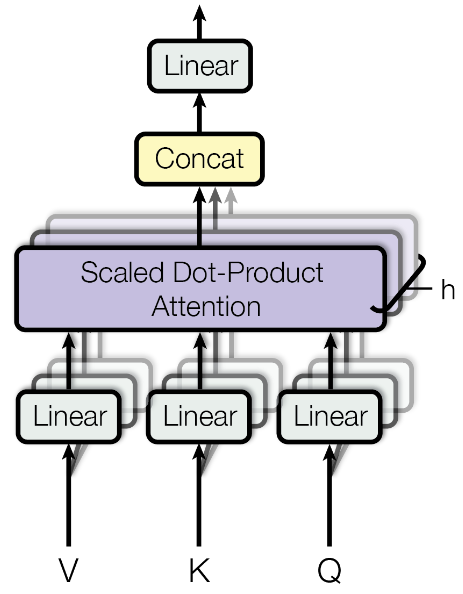

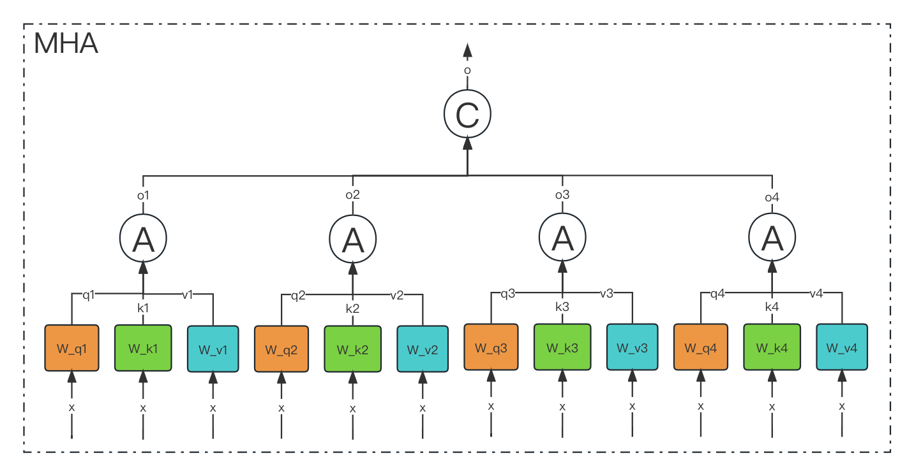

**多头注意力作用**

这种结构设计能**让每个注意力机制去优化每个词汇的不同特征部分**，从而均衡同一种注意力机制可能产生的偏差，让词义拥有来自更多元的表达，实验表明可以从而提升模型效果.

**为什么要做多头注意力机制呢**？

- 一个 dot product 的注意力里面，没有什么可以学的参数。具体函数就是内积，为了识别不一样的模式，希望有不一样的计算相似度的办法。加性 attention 有一个权重可学，也许能学到一些内容。
- multi-head attention 给 h 次机会去学习 不一样的投影的方法，使得在投影进去的度量空间里面能够去匹配不同模式需要的一些相似函数，然后把 h 个 heads 拼接起来，最后再做一次投影。
- 每一个头 hi 是把 Q,K,V 通过 可以学习的 Wq, Wk, Wv 投影到 dv 上，再通过注意力函数，得到 headi。&#x20;

#### （2）MQA

MQA（Multi Query Attention）最早是出现在2019年谷歌的一篇论文 《Fast Transformer Decoding: One Write-Head is All You Need》。

MQA的思想其实比较简单，MQA 与 MHA 不同的是，**MQA 让所有的头之间共享同一份 Key 和 Value 矩阵，每个头正常的只单独保留了一份 Query 参数，从而大大减少 Key 和 Value 矩阵的参数量**。

> Multi-query attention is identical except that the different heads share a single set of keys and values.

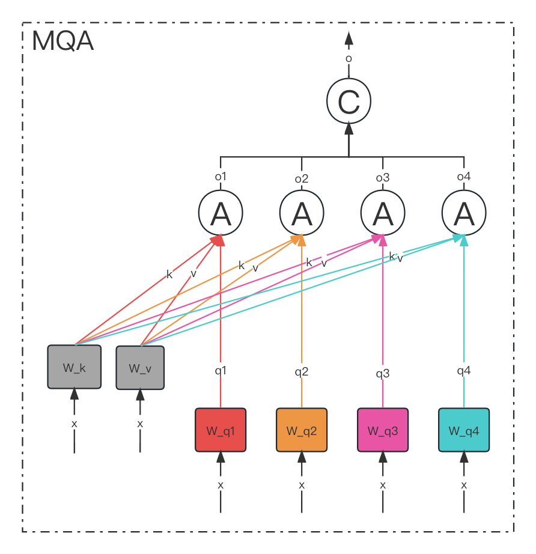

在 Multi-Query Attention 方法中只会保留一个单独的key-value头，这样**虽然可以提升推理的速度，但是会带来精度上的损失**。《Multi-Head Attention:Collaborate Instead of Concatenate 》这篇论文的第一个思路是**基于多个 MQA 的 checkpoint 进行 finetuning，来得到了一个质量更高的 MQA 模型**。这个过程也被称为 Uptraining。

具体分为两步：

1. 对多个 MQA 的 checkpoint 文件进行融合，融合的方法是: 通过对 key 和 value 的 head 头进行 mean pooling 操作，如下图。
2. 对融合后的模型使用少量数据进行 finetune 训练，重训后的模型大小跟之前一样，但是效果会更好

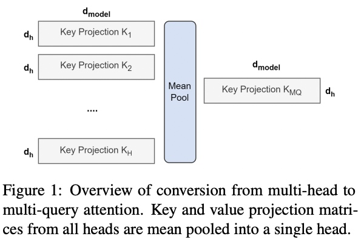

#### （3）GQA

Google 在 2023 年发表的一篇 [《GQA: Training Generalized Multi-Query Transformer Models from Multi-Head Checkpoints》](https://arxiv.org/pdf/2305.13245.pdf "《GQA: Training Generalized Multi-Query Transformer Models from Multi-Head Checkpoints》")的论文

如下图所示，

- 在 **MHA（Multi Head Attention）** 中，每个头有自己单独的 key-value 对；
- 在 **MQA（Multi Query Attention）** 中只会有一组 key-value 对；
- 在 **GQA（Grouped Query Attention）** 中，会对 attention 进行分组操作，query 被分为 N 组，每个组共享一个 Key 和 Value 矩阵。

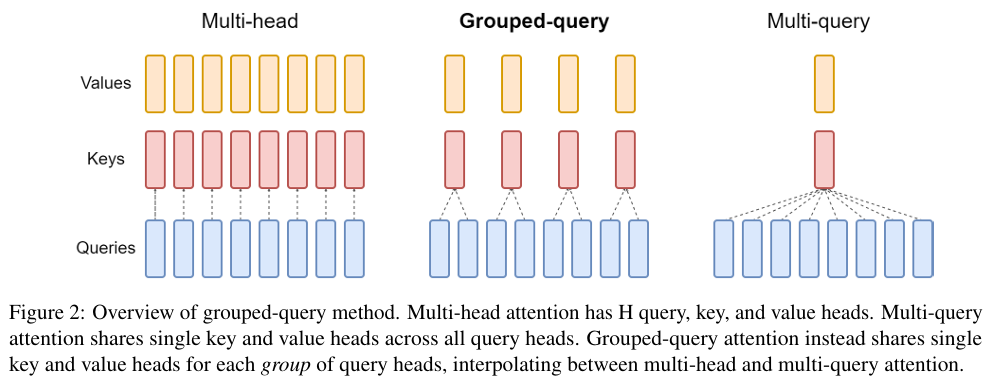

GQA-N 是指具有 N 组的 Grouped Query Attention。GQA-1具有单个组，因此具有单个Key 和 Value，等效于MQA。而GQA-H具有与头数相等的组，等效于MHA。

在基于 Multi-head 多头结构变为 Grouped-query 分组结构的时候，也是采用跟上图一样的方法，对每一组的 key-value 对进行 mean pool 的操作进行参数融合。**融合后的模型能力更综合，精度比 Multi-query 好，同时速度比 Multi-head 快**。

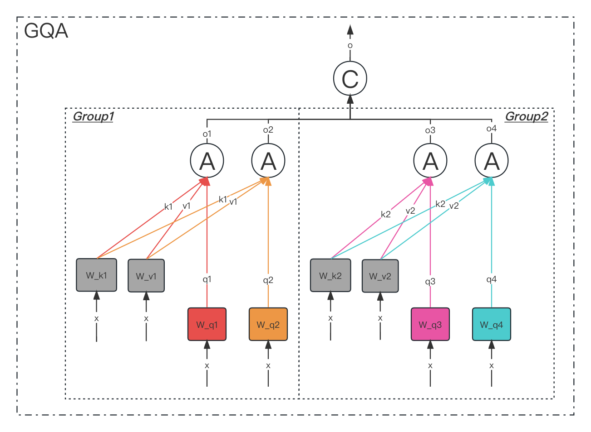

#### （4）总结

MHA（Multi-head Attention）是标准的多头注意力机制，h个Query、Key 和 Value 矩阵。

MQA（Multi-Query Attention）是多查询注意力的一种变体，也是用于自回归解码的一种注意力机制。与MHA不同的是，**MQA 让所有的头之间共享同一份 Key 和 Value 矩阵，每个头只单独保留了一份 Query 参数，从而大大减少 Key 和 Value 矩阵的参数量**。

GQA（Grouped-Query Attention）是分组查询注意力，**GQA将查询头分成G组，每个组共享一个Key 和 Value 矩阵**。GQA-G是指具有G组的grouped-query attention。GQA-1具有单个组，因此具有单个Key 和 Value，等效于MQA。而GQA-H具有与头数相等的组，等效于MHA。

GQA介于MHA和MQA之间。GQA 综合 MHA 和 MQA ，既不损失太多性能，又能利用 MQA 的推理加速。不是所有 Q 头共享一组 KV，而是分组一定头数 Q 共享一组 KV，比如上图中就是两组 Q 共享一组 KV。

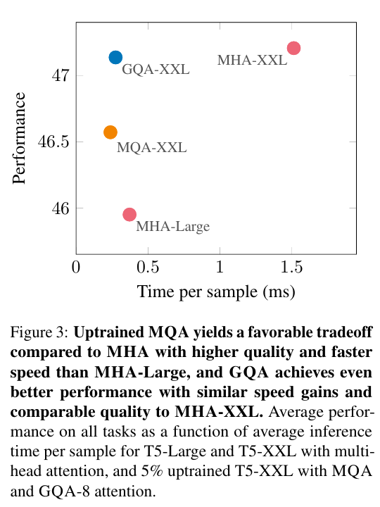

### 5.Flash Attention&#x20;

论文名称：[FlashAttention: Fast and Memory-Efficient Exact Attention with IO-Awareness](https://arxiv.org/abs/2205.14135 "FlashAttention: Fast and Memory-Efficient Exact Attention with IO-Awareness")

Flash Attention的主要目的是加速和节省内存，主要贡献包括： &#x20;

- 计算softmax时候不需要全量input数据，可以分段计算； &#x20;
- 反向传播的时候，不存储attention matrix ($N^2$的矩阵)，而是只存储softmax归一化的系数。

#### 5.1 动机

不同硬件模块之间的带宽和存储空间有明显差异，例如下图中左边的三角图，最顶端的是GPU种的`SRAM`，它的容量非常小但是带宽非常大，以A100 GPU为例，它有108个流式多核处理器，每个处理器上的片上SRAM大小只有192KB，因此A100总共的SRAM大小是$192KB\times 108 = 20MB$，但是其吞吐量能高达19TB/s。而A100 GPU `HBM`（High Bandwidth Memory也就是我们常说的GPU显存大小）大小在40GB\~80GB左右，但是带宽只与1.5TB/s。

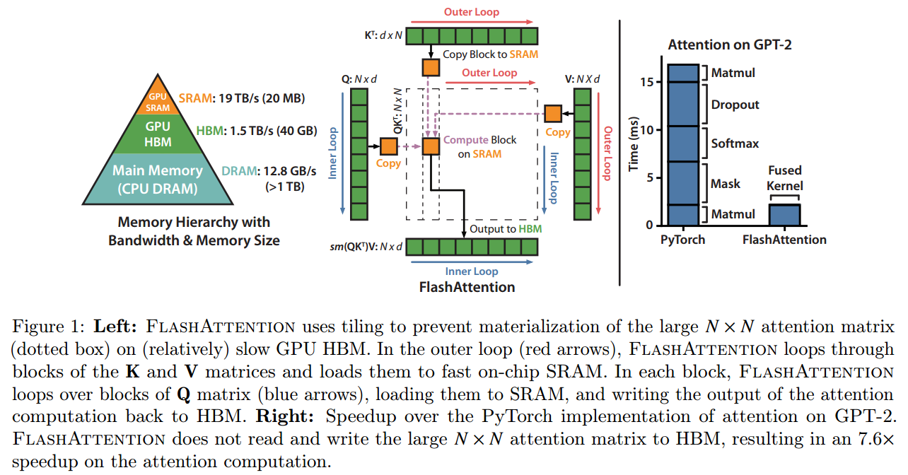

下图给出了标准的注意力机制的实现流程，可以看到因为`HBM`的大小更大，**我们平时写pytorch代码的时候最常用到的就是HBM，所以对于HBM的读写操作非常频繁，而SRAM利用率反而不高**。

FlashAttention的主要动机就是**希望把SRAM利用起来**，但是难点就在于SRAM太小了，一个普通的矩阵乘法都放不下去。FlashAttention的解决思路就是将计算模块进行分解，拆成一个个小的计算任务。

#### 5.2 Softmax Tiling

在介绍具体的计算算法前，我们首先需要了解一下Softmax Tiling。

**（1）数值稳定**

&#x20;Softmax包含指数函数，所以为了避免数值溢出问题，可以将每个元素都减去最大值，如下图示，最后计算结果和原来的Softmax是一致的。

$$
m(x):=\max _{i} ~ x_{i} \\ 
f(x):=\left[\begin{array}{llll}e^{x_{1}-m(x)} & \ldots & e^{x_{B}-m(x)}\end{array}\right] \\ 
\ell(x):=\sum_{i} f(x)_{i} \\ 
\operatorname{softmax}(x):=\frac{f(x)}{\ell(x)}
$$

**（2）分块计算softmax**

因为Softmax都是按行计算的，所以我们考虑一行切分成两部分的情况，即原本的一行数据$x \in \mathbb{R}^{2 B}=\left[x^{(1)}, x^{(2)}\right]$

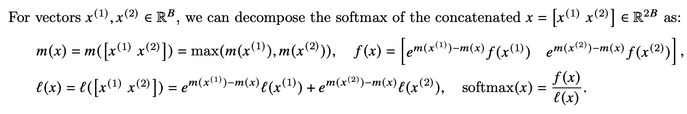

可以看到计算不同块的$f(x)$值时，乘上的系数是不同的，但是最后化简后的结果都是指数函数减去了整行的最大值。以$x^{(1)}$ 为例，

$$
\begin{aligned} m^{m\left(x^{(1)}\right)-m(x)} f\left(x^{(1)}\right) & =e^{m\left(x^{(1)}\right)-m(x)}\left[e^{x_{1}^{(1)}-m\left(x^{(1)}\right)}, \ldots, e^{x_{B}^{(1)}-m\left(x^{(1)}\right)}\right] \\ & =\left[e^{x_{1}^{(1)}-m(x)}, \ldots, e^{x_{B}^{(1)}-m(x)}\right]\end{aligned}
$$

# 分块 Softmax 计算公式的解释示例

### 核心背景：Softmax 的数值稳定

标准 Softmax 公式为：

$\text{softmax}(x)_i = \frac{e^{x_i}}{\sum_{j} e^{x_j}}$

直接计算时，若 $  x_i  $ 很大（如 $  x_i=100  $），$  e^{x_i}  $ 会因溢出变成无穷大。因此**工程上会先减去向量的最大值** $  m(x) = \max(x)  $，转化为：

$\text{softmax}(x)_i = \frac{e^{x_i - m(x)}}{\sum_{j} e^{x_j - m(x)}}$

这样所有指数项都不超过 $  e^0=1  $，避免溢出。

### 分块分解的动机

当向量 $  x  $ 很长时（如 Transformer 处理长文本时的注意力分数），可将 $  x  $ 拆分为多个子向量（如 $  x = [x^{(1)}, x^{(2)}]  $），**并行计算各子块**后再合并，既提升效率，又保持数值稳定。

### 符号与公式拆解

假设 $  x = [x^{(1)}, x^{(2)}]  $（$  x^{(1)}, x^{(2)} \in \mathbb{R}^B  $，总长度 $  2B  $），定义以下辅助量：

* $  m(x^{(k)}) = \max(x^{(k)})  $：子向量 $  x^{(k)}  $ 的局部最大值。

* $  f(x^{(k)}) = \left[ e^{x^{(k)}_1 - m(x^{(k)})}, \dots, e^{x^{(k)}_B - m(x^{(k)})} \right]  $：子向量 “局部减最大值后的指数向量”。

* $  \ell(x^{(k)}) = \sum_{i} f(x^{(k)})_i  $：子向量 “局部指数和”。

#### 1. 全局最大值 $  m(x)  $

全局最大值是各子块局部最大值的最大值：

$m(x) = \max\left( m(x^{(1)}), \ m(x^{(2)}) \right)$

#### 2. 分子 $  f(x)  $

将各子块的 “局部指数向量” 按**全局最大值**调整后拼接：

$f(x) = \left[ \ e^{m(x^{(1)}) - m(x)} \cdot f(x^{(1)}) ,\ \ e^{m(x^{(2)}) - m(x)} \cdot f(x^{(2)}) \ \right]$

其中 $  e^{m(x^{(k)}) - m(x)}  $ 是 “局部最大值” 到 “全局最大值” 的**缩放系数**。

#### 3. 分母 $  \ell(x)  $

分母是各子块 “调整后指数和” 的总和：

$\ell(x) = e^{m(x^{(1)}) - m(x)} \cdot \ell(x^{(1)}) + e^{m(x^{(2)}) - m(x)} \cdot \ell(x^{(2)})$

#### 4. 最终 Softmax

分子除以分母，得到全局 Softmax：

$\text{softmax}(x) = \frac{f(x)}{\ell(x)}$

### 具体例子验证（分块 vs 直接计算）

假设：

* 子向量 $  x^{(1)} = [3, 1, 2]  $（长度 $  B=3  $）

* 子向量 $  x^{(2)} = [5, 4, 6]  $（长度 $  B=3  $）

* 拼接后 $  x = [3, 1, 2, 5, 4, 6]  $（长度 $  2B=6  $）

#### 步骤 1：计算子块局部量

* 对 $  x^{(1)}  $：

  局部最大值 $  m(x^{(1)}) = \max(3,1,2) = 3  $，则：

$f(x^{(1)}) = \left[ e^{3-3}, e^{1-3}, e^{2-3} \right] = \left[ 1, \ e^{-2}, \ e^{-1} \right] \approx \left[ 1, 0.1353, 0.3679 \right]$

局部指数和 $  \ell(x^{(1)}) = 1 + 0.1353 + 0.3679 \approx 1.5032  $。

* 对 $  x^{(2)}  $：

  局部最大值 $  m(x^{(2)}) = \max(5,4,6) = 6  $，则：

$f(x^{(2)}) = \left[ e^{5-6}, e^{4-6}, e^{6-6} \right] = \left[ e^{-1}, \ e^{-2}, \ 1 \right] \approx \left[ 0.3679, 0.1353, 1 \right]$

局部指数和 $  \ell(x^{(2)}) = 0.3679 + 0.1353 + 1 \approx 1.5032  $。

#### 步骤 2：计算全局量

* 全局最大值 $  m(x) = \max(3,6) = 6  $。

* 缩放系数：

$e^{m(x^{(1)}) - m(x)} = e^{3-6} = e^{-3} \approx 0.0498, \quad e^{m(x^{(2)}) - m(x)} = e^{6-6} = e^0 = 1$

#### 步骤 3：分块计算 $  f(x)  $ 和 $  \ell(x)  $

* 分子 $  f(x)  $：

  * $  x^{(1)}  $ 贡献：$  0.0498 \cdot \left[ 1, 0.1353, 0.3679 \right] \approx \left[ 0.0498, 0.0067, 0.0183 \right]  $。

  * $  x^{(2)}  $ 贡献：$  1 \cdot \left[ 0.3679, 0.1353, 1 \right] = \left[ 0.3679, 0.1353, 1 \right]  $。

    拼接后 $  f(x) \approx \left[ 0.0498, 0.0067, 0.0183, 0.3679, 0.1353, 1 \right]  $。

* 分母 $  \ell(x)  $：

$0.0498 \cdot 1.5032 + 1 \cdot 1.5032 \approx 0.0749 + 1.5032 \approx 1.5781$

#### 步骤 4：分块 Softmax 结果

每个元素除以 $  \ell(x) \approx 1.5781  $，得到：

$\text{softmax}(x) \approx \left[ 0.0316, 0.0042, 0.0116, 0.2332, 0.0857, 0.6337 \right]$

#### 直接计算验证（对比）

直接对 $  x = [3,1,2,5,4,6]  $ 计算 Softmax：

* 减全局最大值 $  6  $：$  x - 6 = \left[ -3, -5, -4, -1, -2, 0 \right]  $。

* 指数向量：$  \left[ e^{-3}, e^{-5}, e^{-4}, e^{-1}, e^{-2}, e^0 \right] \approx \left[ 0.0498, 0.0067, 0.0183, 0.3679, 0.1353, 1 \right]  $。

* 指数和：$  \approx 1.5781  $（与分块计算的 $  \ell(x)  $ 一致）。

* Softmax 结果：各指数除以 $  1.5781  $，与分块结果**完全相同**。

### 结论

分块分解 Softmax 的核心是：

* **数值稳定**：每一步都通过 “减最大值” 避免指数溢出；

* **并行高效**：子块可独立计算（如 GPU 并行），最后合并结果；

* **结果等价**：分块计算与直接计算的 Softmax 结果完全一致。

> （注：文档部分内容可能由 AI 生成）

#### 5.3 算法流程

FlashAttention旨在避免从 HBM（High Bandwidth Memory）中读取和写入注意力矩阵，这需要做到：

1. 目标一：在不访问整个输入的情况下计算softmax函数的缩减；**将输入分割成块，并在输入块上进行多次传递，从而以增量方式执行softmax缩减**。
2. 目标二：在后向传播中不能存储中间注意力矩阵。标准Attention算法的实现需要将计算过程中的S、P写入到HBM中，而这些中间矩阵的大小与输入的序列长度有关且为二次型，因此**Flash Attention就提出了不使用中间注意力矩阵，通过存储归一化因子来减少HBM内存的消耗。**

FlashAttention算法流程如下图所示：

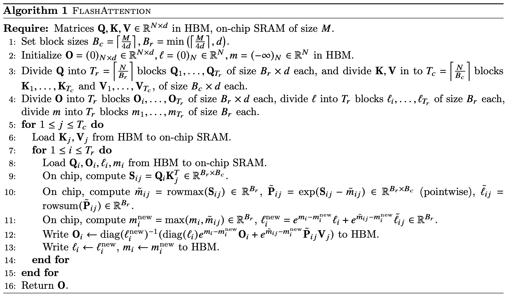

为方便理解，下图将FlashAttention的计算流程可视化出来了，简单理解就是每一次只计算一个block的值，通过多轮的双for循环完成整个注意力的计算。

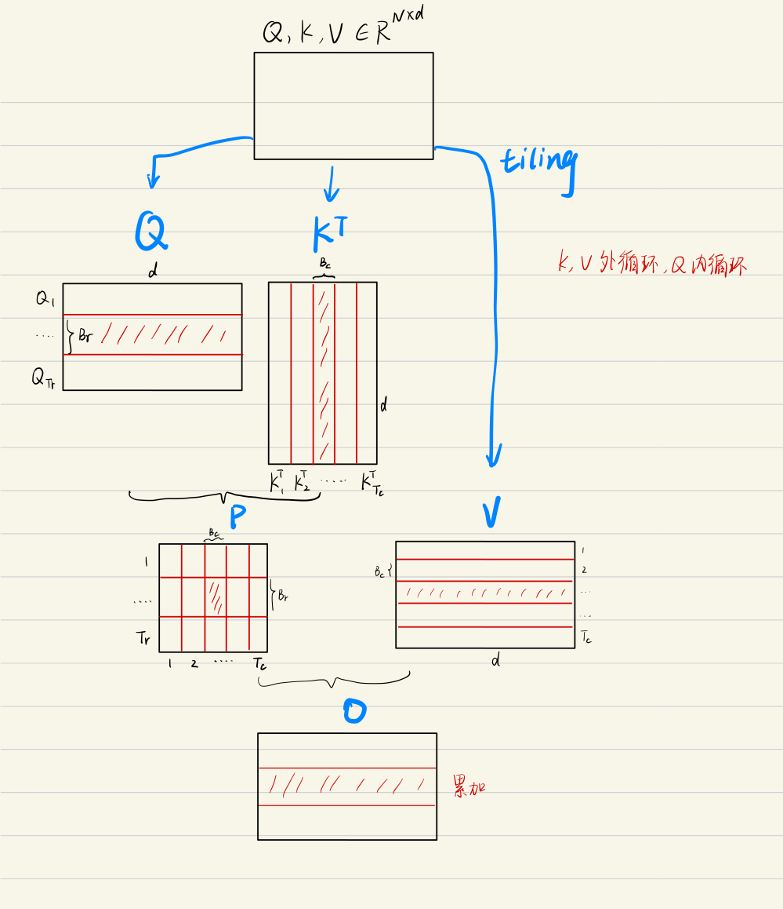

### 6.Transformer常见问题

#### 6.1 Transformer和RNN

最简单情况：没有残差连接、没有 layernorm、 attention 单头、没有投影。看和 RNN 区别

- attention 对输入做一个加权和，加权和 进入 point-wise MLP。（画了多个红色方块 MLP， 是一个权重相同的 MLP）
- point-wise MLP 对 每个输入的点 做计算，得到输出。
- attention 作用：把整个序列里面的信息抓取出来，做一次汇聚 aggregation

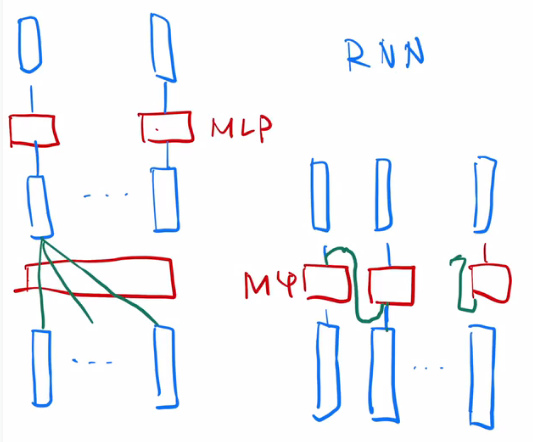

RNN 跟 transformer **异：如何传递序列的信**息

RNN 是把上一个时刻的信息输出传入下一个时候做输入。Transformer 通过一个 attention 层，去全局的拿到整个序列里面信息，再用 MLP 做语义的转换。

RNN 跟 transformer **同：语义空间的转换 + 关注点**

用一个线性层 or 一个 MLP 来做语义空间的转换。

**关注点**：怎么有效的去使用序列的信息。

#### 6.2 一些细节

**Transformer为何使用多头注意力机制？**（为什么不使用一个头）

- 多头保证了transformer可以注意到不同子空间的信息，捕捉到更加丰富的特征信息。可以类比CNN中同时使用**多个滤波器**的作用，直观上讲，多头的注意力**有助于网络捕捉到更丰富的特征/信息。**

**Transformer为什么Q和K使用不同的权重矩阵生成，为何不能使用同一个值进行自身的点乘？** （注意和第一个问题的区别）

- 使用Q/K/V不相同可以保证在不同空间进行投影，增强了表达能力，提高了泛化能力。

- 同时，由softmax函数的性质决定，实质做的是一个soft版本的arg max操作，得到的向量接近一个one-hot向量（接近程度根据这组数的数量级有所不同）。如果令Q=K，那么得到的模型大概率会得到一个类似单位矩阵的attention矩阵，**这样self-attention就退化成一个point-wise线性映射**。这样至少是违反了设计的初衷。

  

  要理解 Transformer 中 **Q（查询）和 K（键）使用不同权重矩阵生成** 的原因，需从「自注意力机制的目标」和「数学性质」两方面分析：

  ### 1. 不同空间投影，增强表达能力

  Transformer 中，Q、K、V 是通过**不同的权重矩阵**对原始词嵌入（或前一层输出）做线性变换得到的。

  - 若 Q 和 K 用**同一个权重矩阵**，则 Q 和 K 会被映射到**同一向量空间**。此时，“查询（Q）匹配键（K）” 的过程会丢失多样性 —— 因为二者的表示空间完全重叠，能捕捉的语义关系会受限于同一空间的表达能力。

  - 若 Q 和 K 用**不同权重矩阵**，则它们会被映射到**不同的子空间**。不同子空间的投影能让 “查询” 和 “键” 从更多维度、更丰富的角度进行匹配，从而捕捉到更复杂的序列内依赖关系，最终增强模型的表达能力与泛化能力。

  ### 2. 避免自注意力退化成线性映射

  自注意力的核心计算是：Attention(Q, K, V) = softmax(QK^T / √d_k) V，其中 QK^T 是 Q 和 K 的点积（衡量相似度），再经过 softmax 得到 “注意力权重”。

  - **softmax 的性质**：softmax 会把输入的 “相似度得分” 转化为**近似 one-hot 的概率分布**（即权重向 “最大得分” 集中，接近 “硬选择” 但更平滑）。

  - **若 Q=K**：此时 QK^T 变成 “自身与自身的点积”，得到的相似度矩阵会极度 “对角化”（每个位置对自身的相似度得分远高于其他位置）。经过 softmax 后，注意力矩阵会**近似单位矩阵**（每个位置主要关注自身，对其他位置的注意力权重几乎为 0）。

  这会导致自注意力退化成 **“逐点的线性映射”** —— 因为每个位置的输出几乎只由自身的 V 经过线性变换得到，完全失去了 “让每个位置关注序列中**其他位置**信息” 的设计初衷，无法捕捉序列内的长距离依赖。

  综上，Q 和 K 使用不同权重矩阵，既是为了通过 “不同空间投影” 增强表达能力，也是为了避免注意力机制退化，确保自注意力能有效捕捉序列内的多位置依赖关系。

  

**Transformer计算attention的时候为何选择点乘而不是加法？两者计算复杂度和效果上有什么区别？**

- K和Q的点乘是为了得到一个attention score 矩阵，用来对V进行提纯。K和Q使用了不同的W\_k, W\_Q来计算，可以理解为是在不同空间上的投影。正因为有了这种不同空间的投影，增加了表达能力，这样计算得到的attention score矩阵的泛化能力更高。
- 为了计算更快。矩阵加法在加法这一块的计算量确实简单，但是作为一个整体计算attention的时候相当于一个隐层，整体计算量和点积相似。在效果上来说，从实验分析，两者的效果和dk相关，dk越大，加法的效果越显著。

**为什么在进行softmax之前需要对attention进行scaled（为什么除以dk的平方根）**，并使用公式推导进行讲解

- 这取决于softmax函数的特性，如果softmax内计算的数数量级太大，会输出近似one-hot编码的形式，导致梯度消失的问题，所以需要scale
- 那么至于为什么需要用维度开根号，假设向量q，k满足各分量独立同分布，均值为0，方差为1，那么qk点积均值为0，方差为dk，从统计学计算，若果让qk点积的方差控制在1，需要将其除以dk的平方根，是的softmax更加平滑

**在计算attention score的时候如何对padding做mask操作？**

- padding位置置为负无穷(一般来说-1000就可以)，再对attention score进行相加。对于这一点，涉及到batch\_size之类的，具体的大家可以看一下实现的源代码，位置在这里：[https://github.com/huggingface/transformers/blob/aa6a29bc25b663e1311c5c4fb96b004cf8a6d2b6/src/transformers/modeling\_bert.py#L720](https://link.zhihu.com/?target=https://github.com/huggingface/transformers/blob/aa6a29bc25b663e1311c5c4fb96b004cf8a6d2b6/src/transformers/modeling_bert.py#L720 "https://github.com/huggingface/transformers/blob/aa6a29bc25b663e1311c5c4fb96b004cf8a6d2b6/src/transformers/modeling_bert.py#L720")
- padding位置置为负无穷而不是0，是因为后续在softmax时，$e^0=1$，不是0，计算会出现错误；而$e^{-\infty} = 0$，所以取负无穷

**为什么在进行多头注意力的时候需要对每个head进行降维？**（可以参考上面一个问题）

- 将原有的**高维空间转化为多个低维空间**并再最后进行拼接，形成同样维度的输出，借此丰富特性信息
  - 基本结构：Embedding + Position Embedding，Self-Attention，Add + LN，FN，Add + LN

**为何在获取输入词向量之后需要对矩阵乘以embedding size的开方？意义是什么？**

- embedding matrix的初始化方式是xavier init，这种方式的方差是1/embedding size，因此乘以embedding size的开方使得embedding matrix的方差是1，在这个scale下可能更有利于embedding matrix的收敛。

**简单介绍一下Transformer的位置编码？有什么意义和优缺点？**

- 因为self-attention是位置无关的，无论句子的顺序是什么样的，通过self-attention计算的token的hidden embedding都是一样的，这显然不符合人类的思维。因此要有一个办法能够在模型中表达出一个token的位置信息，transformer使用了固定的positional encoding来表示token在句子中的绝对位置信息。

**你还了解哪些关于位置编码的技术，各自的优缺点是什么？**（参考上一题）

- 相对位置编码（RPE）1.在计算attention score和weighted value时各加入一个可训练的表示相对位置的参数。2.在生成多头注意力时，把对key来说将绝对位置转换为相对query的位置3.复数域函数，已知一个词在某个位置的词向量表示，可以计算出它在任何位置的词向量表示。前两个方法是词向量+位置编码，属于亡羊补牢，复数域是生成词向量的时候即生成对应的位置信息。

**简单讲一下Transformer中的残差结构以及意义。**

- 就是ResNet的优点，解决梯度消失

**为什么transformer块使用LayerNorm而不是BatchNorm？LayerNorm 在Transformer的位置是哪里？**

[NLP任务为什么使用LayerNorm,而不是BatchNorm-CSDN博客](https://blog.csdn.net/weixin_42449201/article/details/144222455?ops_request_misc=&request_id=&biz_id=102&utm_term=为什么nlp中多用layernorm&utm_medium=distribute.pc_search_result.none-task-blog-2~all~sobaiduweb~default-0-144222455.142^v102^pc_search_result_base1&spm=1018.2226.3001.4187)

[Batch Norm vs Layer Norm：为什么 Transformer 更适合用 Layer Norm？_layer-norm对比batchnorm-CSDN博客](https://blog.csdn.net/shizheng_Li/article/details/144472466?ops_request_misc=%7B%22request%5Fid%22%3A%227e568bbe5adc9ce8ce7808af3f33bc5f%22%2C%22scm%22%3A%2220140713.130102334.pc%5Fall.%22%7D&request_id=7e568bbe5adc9ce8ce7808af3f33bc5f&biz_id=0&utm_medium=distribute.pc_search_result.none-task-blog-2~all~first_rank_ecpm_v1~rank_v31_ecpm-9-144472466-null-null.142^v102^pc_search_result_base1&utm_term=layernorm&spm=1018.2226.3001.4187)

- LN：针对每个样本序列进行Norm，没有样本间的依赖。对一个序列的不同特征维度进行Norm
- CV使用BN是认为channel维度的信息对cv方面有重要意义，如果对channel维度也归一化会造成不同通道信息一定的损失。而同理nlp领域认为句子长度不一致，并且各个batch的信息没什么关系，因此只考虑句子内信息的归一化，也就是LN。

**简答讲一下BatchNorm技术，以及它的优缺点。**

- 优点：
  - 第一个就是可以解决内部协变量偏移，简单来说训练过程中，各层分布不同，增大了学习难度，BN缓解了这个问题。当然后来也有论文证明BN有作用和这个没关系，而是可以使**损失平面更加的平滑**，从而加快的收敛速度。
  - 第二个优点就是缓解了**梯度饱和问题**（如果使用sigmoid激活函数的话），加快收敛。
- 缺点：
  - 第一个，batch\_size较小的时候，效果差。这一点很容易理解。BN的过程，使用 整个batch中样本的均值和方差来模拟全部数据的均值和方差，在batch\_size 较小的时候，效果肯定不好。
  - 第二个缺点就是 BN 在RNN中效果比较差。

**简单描述一下Transformer中的前馈神经网络？使用了什么激活函数？相关优缺点？**

- ReLU

$$
FFN(x)=max(0,~ xW_1+b_1)W_2+b_2
$$

**Encoder端和Decoder端是如何进行交互的？**（在这里可以问一下关于seq2seq的attention知识）

- Cross Self-Attention，**Decoder提供Q，Encoder提供K，V**

**Decoder阶段的多头自注意力和encoder的多头自注意力有什么区别？**（为什么需要decoder自注意力需要进行 sequence mask)

- 让输入序列只看到过去的信息，不能让他看到未来的信息

**Transformer的并行化提现在哪个地方？Decoder端可以做并行化吗？**

- Encoder侧：模块之间是串行的，一个模块计算的结果做为下一个模块的输入，互相之前有依赖关系。从每个模块的角度来说，注意力层和前馈神经层这两个子模块单独来看都是可以并行的，不同单词之间是没有依赖关系的。
- Decode引入sequence mask就是为了并行化训练，Decoder推理过程没有并行，只能一个一个的解码，很类似于RNN，这个时刻的输入依赖于上一个时刻的输出。

**简单描述一下wordpiece model 和 byte pair encoding，有实际应用过吗？**

[大模型的分词器——算法及示例_大模型分词器-CSDN博客](https://blog.csdn.net/weixin_74181752/article/details/148401591?ops_request_misc=%7B%22request%5Fid%22%3A%22143b894ee92f58d1c42389fdd87a190f%22%2C%22scm%22%3A%2220140713.130102334..%22%7D&request_id=143b894ee92f58d1c42389fdd87a190f&biz_id=0&utm_medium=distribute.pc_search_result.none-task-blog-2~all~sobaiduend~default-1-148401591-null-null.142^v102^pc_search_result_base1&utm_term=大模型分词算法&spm=1018.2226.3001.4187)

- 传统词表示方法无法很好的处理未知或罕见的词汇（OOV问题），传统词tokenization方法不利于模型学习词缀之间的关系”
- BPE（字节对编码）或二元编码是一种简单的数据压缩形式，其中最常见的一对连续字节数据被替换为该数据中不存在的字节。后期使用时需要一个替换表来重建原始数据。
- 优点：可以有效地平衡词汇表大小和步数（编码句子所需的token次数）。
- 缺点：基于贪婪和确定的符号替换，不能提供带概率的多个分片结果。

**Transformer训练的时候学习率是如何设定的？Dropout是如何设定的，位置在哪里？Dropout 在测试的需要有什么需要注意的吗？**

- Dropout测试的时候记得对输入整体呈上dropout的比率

**引申一个关于bert问题，bert的mask为何不学习transformer在attention处进行屏蔽score的技巧？**

- BERT和transformer的目标不一致，bert是语言的预训练模型，需要充分考虑上下文的关系，而transformer主要考虑句子中第i个元素与前i-1个元素的关系。
