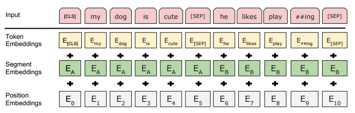

# bert细节

## 1.背景结构

### 1.1 基础知识

BERT（Bidirectional Encoder Representations from Transformers）是谷歌提出，作为一个Word2Vec的替代者，其在NLP领域的11个方向大幅刷新了精度，可以说是近年来自残差网络最优突破性的一项技术了。论文的主要特点以下几点：

1. **使用了双向Transformer作为算法的主要框架**，之前的模型是从左向右输入一个文本序列，或者将 left-to-right 和 right-to-left 的训练结合起来，实验的结果表明，双向训练的语言模型对语境的理解会比单向的语言模型更深刻；
2. 使用了Mask Language Model(**MLM**) 和 Next Sentence Prediction(**NSP**) 的多任务训练目标；
3. 使用更强大的机器训练**更大规模的数据**，使BERT的结果达到了全新的高度，并且Google开源了BERT模型，用户可以直接使用BERT作为Word2Vec的转换矩阵并高效的将其应用到自己的任务中。

BERT **只利用了 Transformer 的 encoder 部分**。因为BERT 的目标是生成语言模型，所以只需要 encoder 机制。

### 1.2 BERT与其他模型相比

- **RNN/LSTM**：**可以做到并发执行**，同时提取词在句子中的关系特征，并且能在多个不同层次提取关系特征，进而更全面反映句子语义 &#x20;
- **word2vec**：其又能根据句子上下文获取词义，从而避免歧义出现。 &#x20;
- **ELMO**：elmo是伪双向，只是将左到右，右到左的信息加起来，而且用的是`lstm`，同时缺点也是显而易见的，模型参数太多，而且模型太大，少量数据训练时，容易过拟合。

其次bert在多方面的nlp任务表现来看效果都较好，具备较强的泛化能力，对于特定的任务只需要添加一个输出层来进行fine-tuning即可

### 1.3 BERT，GPT，ELMo

#### BERT, GPT, ELMo之间的不同点

**关于特征提取器**:

- `ELMo`采用两部分**双层双向LSTM**进行特征提取，然后再进行特征拼接来融合语义信息。
- `GPT`和`BERT`采用**Transformer**进行特征提取。BERT采用的是Transformer架构中的Encoder模块；GPT采用的是Transformer架构中的Decoder模块.
- 很多NLP任务表明Transformer的特征提取能力强于LSTM, 对于ELMo而言, 采用1层静态token embedding + 2层LSTM，提取特征的能力有限。

**单/双向语言模型**:

- 三者之中, **只有**\*\*`GPT`****采用单向语言模型**, 而**`ELMo`****和****`BERT`\*\***都采用双向语言模型**.
- ELMo虽然被认为采用了双向语言模型，但实际上是左右两个单向语言模型分别提取特征，然后进行特征拼接， 这种融合特征的能力比BERT一体化的融合特征方式弱。
- 三者之中, 只有ELMo没有采用Transformer。GPT和BERT都源于Transformer架构，**GPT的单向语言模型采用了经过修改后的Decoder模块**，Decoder采用了look-ahead mask，只能看到context before上文信息，未来的信息都被mask掉了。**而BERT的双向语言模型采用了Encoder模块**，Encoder只采用了padding mask，可以同时看到context before上文信息, 以及context after下文信息。&#x20;

#### BERT, GPT, ELMo各自的优点和缺点

**ELMo**

- **优点**：从早期的Word2Vec预训练模型的最大缺点出发, 进行改进, 这一缺点就是无法解决多义词的问题。**ELMo根据上下文动态调整word embedding，可以解决多义词的问题**。
- **缺点**：ELMo使用L**STM提取特征的能力弱于Transformer**；ELMo使用向量拼接的方式融合上下文特征的能力弱于Transformer.

**GPT**

- **优点**：GPT使用了Transformer提取特征, 使得模型能力大幅提升.
- **缺点**：GPT只使用了单向Decoder，无法融合未来的信息.

**BERT**

- **优点**：BERT使用了双向Transformer提取特征，使得模型能力大幅提升；添加了两个预训练任务, MLM + NSP的多任务方式进行模型预训练.
- **缺点**：**模型过于庞大, 参数量太多**, 需要的数据和算力要求过高, 训练好的模型应用场景要求高；更适合用于语言嵌入表达，语言理解方面的任务，**不适合用于生成式的任务**。

### 1.4 与Transformer区别

只是使用了transformer的encoder &#x20;

与Transformer本身的Encoder端相比，**BERT的Transformer Encoder端输入的向量表示，多了Segment Embeddings。** &#x20;

网络层数L，隐藏层维度H，Attention 多头个数A &#x20;

- base：L=12, H=768, A=12, 110M,使用GPU内存：7G多 &#x20;
- large: L=24,H=1024,A=16, 340M,使用GPU内存：32G多 &#x20;
- transformer 是512维，encoder是6个堆叠，8个头， &#x20;
- bert是12个transformer叠加。每一个transformer由6个 encoder叠加

### 1.5 word2vec到BERT改进了什么

word2vec到BERT的改进之处其实没有很明确的答案，BERT的思想其实很大程度上来源于CBOW模型，如果从准确率上说改进的话，BERT利用更深的模型，以及海量的语料，得到的embedding表示，来做下游任务时的准确率是要比word2vec高不少的。实际上，这也离不开模型的“加码”以及数据的“巨大加码”。再从方法的意义角度来说，**BERT的重要意义在于给大量的NLP任务提供了一个泛化能力很强的预训练模型，而仅仅使用word2vec产生的词向量表示**，不仅能够完成的任务比BERT少了很多，而且很多时候直接利用word2vec产生的词向量表示给下游任务提供信息，下游任务的表现不一定会很好，甚至会比较差。

## 2.模型结构

### 2.1 两个任务

#### （1）Masked LM (MLM)&#x20;

在将单词序列输入给 BERT 之前，每个序列中有 15％ 的单词被 `[MASK]` token 替换。 然后模型尝试基于序列中其他未被 mask 的单词的上下文来预测被掩盖的原单词。在BERT的实验中，15%的WordPiece Token会被随机Mask掉。在训练模型时，一个句子会被多次喂到模型中用于参数学习，但是Google并没有在每次都mask掉这些单词，而是在确定要Mask掉的单词之后，80%的概率会直接替换为`[Mask]`，10%的概率将其替换为其它任意单词，10%的概率会保留原始Token。

1. **80% 的 tokens 会被替换为 \[MASK] token**：**是 Masked LM 中的主要部分，可以在不泄露 label 的情况下融合真双向语义信息**；

2. **10% 的 tokens 会称替换为随机的 token** ：因为需要在最后一层随机替换的这个 token 位去预测它真实的词，而模型并不知道这个 token 位是被随机替换的，就迫使模型尽量在每一个词上都学习到一个 全局语境下的表征，因而也能够让 BERT 获得更好的语境相关的词向量（**这正是解决一词多义的最重要特性**）；

3. **10% 的 tokens 会保持不变但需要被预测** ：这样能够给模型一定的 bias ，相当于是额外的奖励，将模型对于词的表征能够拉向词的 真实表征

   #### **怎么理解第三条？**

   你提的这个问题特别关键，正好戳中了 BERT 预训练任务设计的精妙细节 —— 很多人会忽略这 10% 不变 token 的作用，其实它是平衡模型学习的重要一环。

   这里的表述核心是：10% 不替换的 token 要求预测，本质是给模型一个 “正向引导”，让它学到的词表征更贴近单词本身的真实含义，而非仅依赖上下文猜测。

   ### 1. 先澄清：这里的 “bias” 不是 “偏差”，而是 “偏向性”

   我们通常说的 “bias” 是机器学习里的 “偏差”（比如模型欠拟合的偏差），但这里是个通俗化表达，指**模型学习的 “偏向方向”**。

   简单说，模型在训练时会更 “倾向于” 去学习单词本身固有的特征，而不是只靠上下文去 “蒙” 答案，这个 “倾向” 就是这里的 “bias”。

   ### 2. “额外的奖励”：强化模型对 “单词本身” 的识别能力

   BERT 的核心预训练任务是 “掩码语言模型（MLM）”，大部分被选中的 token 会被替换成[MASK]。

   - **面对[MASK]时，模型可以通过上下文推测可能的词，但可能记不住单词本身的特征。**

   - **而这 10% 的 token没被替换（还是原词），却要求模型预测出它就是原词。如果模型能预测对，就说明它真的 “认识” 这个词本身，而非仅靠上下文猜 —— 这种 “猜对” 的反馈，就是对模型学习 “单词自身特征” 的额外奖励，会强化这种正确的学习行为。**

   ### 3. “拉向词的真实表征”：避免表征 “偏科”

   **“词的真实表征” 指的是：既能体现单词本身的核心含义，又能结合上下文的表征（比如 “苹果” 既要有 “水果” 的核心属性，也要在 “苹果手机” 里体现 “品牌” 属性）。**

   **如果只有[MASK]，模型可能过度依赖上下文，导致同一个词在不同语境下的表征偏差太大（比如认不出 “苹果” 在两种场景下都是同一个词的延伸）。**

   **而 10% 不变 token 的预测任务，会强制模型关注单词本身的固有特征，把过度偏向 “上下文猜测” 的表征，拉回到 “单词本身 + 上下文” 结合的真实表征上，让表征更稳定、更准确。**

   要不要我帮你整理一份**BERT 核心预训练任务（MLM/NSP/10% 不变 token）的设计目的对照表**？这样能更清晰地看到每个任务分别解决了什么问题，以及它们之间的配合关系。

   

#### （2）Next Sentence Prediction (NSP)&#x20;

在 BERT 的训练过程中，模型接收成对的句子作为输入，并且预测其中第二个句子是否在原始文档中也是后续句子。

1. **在训练期间，50％ 的输入对在原始文档中是前后关系，另外 50％ 中是从语料库中随机组成的，并且是与第一句断开的。**
2. **在第一个句子的开头插入 `[CLS]` 标记，表示该特征用于分类模型，对非分类模型，该符号可以省去，在每个句子的末尾插入 `[SEP]` 标记，表示分句符号，用于断开输入语料中的两个句子。**

### 2.2 Embedding

BERT的输入的编码向量（长度是512）是3个嵌入特征的单位和，这三个词嵌入特征是：

1. **位置嵌入（Position Embedding）**：位置嵌入是指将单词的位置信息编码成特征向量，位置嵌入是向模型中引入单词位置关系的至关重要的一环；
2. **WordPiece 嵌入**：WordPiece是指将单词划分成一组有限的公共子词单元，能在单词的有效性和字符的灵活性之间取得一个折中的平衡。例如上图的示例中‘playing’被拆分成了‘play’和‘ing’；
3. **分割嵌入（Segment Embedding）**：用于区分两个句子，例如B是否是A的下文（对话场景，问答场景等）。对于句子对，第一个句子的特征值是0，第二个句子的特征值是1。」

## 3.模型细节

### 3.1 BERT在第一句前会加一个\[CLS]标志

BERT在第一句前会加一个\[CLS]标志，最后一层该位**对应向量可以作为整句话的语义表示**，从而用于下游的分类任务等。

### 3.2 BERT的三个Embedding直接相加会对语义有影响吗

BERT的三个Embedding相加，**本质可以看作一个特征的融合**，强大如 BERT 应该可以学到融合后特征的语义信息的。

Embedding的本质：**Embedding层就是以one hot为输入、中间层节点为字向量维数的全连接层！而这个全连接层的参数，就是一个“字向量表”**！

从运算上来看，one hot型的矩阵相乘，就像是相当于查表，于是它直接用查表作为操作，而不写成矩阵再运算，这大大降低了运算量。再次强调，降低了运算量不是因为词向量的出现，而是因为把one hot型的矩阵运算简化为了查表操作。

在这里想用一个例子再尝试解释一下：

- 假设 token Embedding 矩阵维度是 `[4,768]`；position Embedding 矩阵维度是 `[3,768]`；segment Embedding 矩阵维度是 `[2,768]`。
- 对于一个字，假设它的 token one-hot 是`[1,0,0,0]`；它的 position one-hot 是`[1,0,0]`；它的 segment one-hot 是`[1,0]`。
- 那这个字最后的 word Embedding，就是上面三种 Embedding 的加和。
- 如此得到的 word Embedding，和concat后的特征：`[1,0,0,0,1,0,0,1,0]`，再过维度为 `[4+3+2,768] = [9, 768]` 的全连接层，得到的向量其实就是一样的。

#### 1.4 使用BERT预训练模型为什么最多只能输入512个词?

这是Google BERT预训练模型初始设置的原因，前者对应Position Embeddings，后者对应Segment Embeddings

BERT输入：

- `token embedding`：词向量表示 ，该向量既可以随机初始化，也可以利用Word2Vector等算法进行预训练以作为初始值，使用WordPiece tokenization让BERT在处理英文文本的时候仅需要存储30,522 个词，而且很少遇到oov的词，token embedding是必须的；
- `position embedding`：和Transformer的sin、cos函数编码不同，直接去训练了一个position embedding。给每个位置词一个随机初始化的词向量，再训练；
- &#x20;`segment embedding`：该向量的取值在模型训练过程中自动学习，用于刻画文本的全局语义信息，并与单字/词的语义信息相融合。

输出是文本中各个字/词融合了全文语义信息后的向量表示。

### 3.3 BERT如何区分一词多义？

同一个字在转换为bert的输入之后（id），embedding的向量是一样，但是通过bert中的多层transformer encoder之后，**attention关注不同的上下文，就会导致不同句子输入到bert之后，相同字输出的字向量是不同的**，这样就解决了一词多义的问题。

### 3.4  BERT中Normalization结构：**LayerNorm**

**采用LayerNorm结构**，和BatchNorm的区别主要是做规范化的维度不同。

- **BatchNorm**针对**一个batch里面的数据进行规范化**，**Batch Normalization 是对这批样本的同一维度特征做归一化**
- **LayerNorm**则是**针对单个样本**，不依赖于其他数据，常被用于小mini-batch场景、动态网络场景和 RNN。Layer Normalization 是对这单个样本的所有维度特征做归一化。

BatchNorm的缺点：

1. 需要较大的batch以体现整体数据分布
2. 训练阶段需要保存每个batch的均值和方差，以求出整体均值和方差在infrence阶段使用
3. 不适用于可变长序列的训练，如RNN

Layer Normalization：一个独立于batch size的算法，所以无论一个batch样本数多少都不会影响参与LN计算的数据量，从而解决BN的两个问题。LN的做法是根据样本的特征数做归一化。Layer Normalization不依赖于batch的大小和输入sequence的深度，因此可以用于batch-size为1和RNN中对边长的输入sequence的normalize操作。但在大批量的样本训练时，效果没BN好。

实践证明，LN用于RNN进行Normalization时，取得了比BN更好的效果。但用于CNN时，效果并不如BN明显。

### **layernorm在大模型中计算的例子**

好的，我们以一个完整句子为例。在大模型中，句子会被拆分为多个 token（比如 “[CLS] 我 爱 自然语言 处理 [SEP]”），每个 token 经过前层处理后会输出一个高维隐藏状态向量（比如维度d_model=5）。整个句子的输入可以看作一个**矩阵**：行对应 token（假设句子有 4 个有效 token，即n=4），列对应特征维度（d=5）。

LayerNorm 的核心逻辑是：**对句子中的每个 token，单独在其自身的特征维度上做归一化**（即逐行计算，每行内部独立处理）。下面用具体例子说明。

### 例子：句子输入矩阵

假设句子 “猫 吃 鱼 吗” 经过前层处理后，得到的隐藏状态矩阵为（4 个 token，每个 5 维特征）：

| token | 特征 1 | 特征 2 | 特征 3 | 特征 4 | 特征 5 |
| ----- | ------ | ------ | ------ | ------ | ------ |
| 猫    | 2      | 4      | 6      | 8      | 10     |
| 吃    | 1      | 3      | 5      | 7      | 9      |
| 鱼    | 0      | 2      | 4      | 6      | 8      |
| 吗    | 3      | 5      | 7      | 9      | 11     |

### LayerNorm 计算步骤（逐 token 处理）

对每个 token（每行）单独计算，步骤完全一致。我们以 “猫” 这个 token 为例详细展开，其他 token 只给结果（逻辑相同）。

#### 步骤 1：对 “猫” 的特征计算均值（μ）

“猫” 的特征向量：`x = [2, 4, 6, 8, 10]`，特征维度`d=5`。

均值公式：

$\mu = \frac{1}{d} \sum_{i=1}^{d} x_i$

计算：

$\mu = \frac{2 + 4 + 6 + 8 + 10}{5} = \frac{30}{5} = 6$

#### 步骤 2：对 “猫” 的特征计算方差（σ²）

方差公式：

$\sigma^2 = \frac{1}{d} \sum_{i=1}^{d} (x_i - \mu)^2$

计算：

$\sigma^2 = \frac{(2-6)^2 + (4-6)^2 + (6-6)^2 + (8-6)^2 + (10-6)^2}{5}$

$= \frac{(-4)^2 + (-2)^2 + 0^2 + 2^2 + 4^2}{5}$

$= \frac{16 + 4 + 0 + 4 + 16}{5} = \frac{40}{5} = 8$

#### 步骤 3：对 “猫” 的特征归一化（标准化）

标准化公式（ε 为极小值，这里忽略）：

$\hat{x}_i = \frac{x_i - \mu}{\sqrt{\sigma^2}}$

标准差$\sqrt{\sigma^2} = \sqrt{8} ≈ 2.828$

计算每个特征：

$\hat{x}_1 = \frac{2 - 6}{2.828} ≈ -1.414$

$\hat{x}_2 = \frac{4 - 6}{2.828} ≈ -0.707$

$\hat{x}_3 = \frac{6 - 6}{2.828} = 0$

$\hat{x}_4 = \frac{8 - 6}{2.828} ≈ 0.707$

$\hat{x}_5 = \frac{10 - 6}{2.828} ≈ 1.414$

“猫” 归一化后向量：$\hat{x} ≈ [-1.414, -0.707, 0, 0.707, 1.414]$

#### 步骤 4：缩放与平移（应用可学习参数 γ 和 β）

假设该层的可学习参数为：

`γ = [1.5, 1.5, 1.5, 1.5, 1.5]`（缩放因子），`β = [0.5, 0.5, 0.5, 0.5, 0.5]`（偏移因子）。

最终输出公式：

$y_i = \gamma \cdot \hat{x}_i + \beta$

计算 “猫” 的输出：

$y_1 = 1.5×(-1.414) + 0.5 ≈ -2.121 + 0.5 ≈ -1.621$

$y_2 = 1.5×(-0.707) + 0.5 ≈ -1.061 + 0.5 ≈ -0.561$

$y_3 = 1.5×0 + 0.5 = 0.5$

$y_4 = 1.5×0.707 + 0.5 ≈ 1.061 + 0.5 ≈ 1.561$

$y_5 = 1.5×1.414 + 0.5 ≈ 2.121 + 0.5 ≈ 2.621$

“猫” 的最终输出向量：$y ≈ [-1.621, -0.561, 0.5, 1.561, 2.621]$

### 其他 token 的计算结果（逻辑相同）

用同样的步骤处理 “吃”“鱼”“吗”，得到整个句子的 LayerNorm 输出矩阵：

| token | 特征 1 | 特征 2 | 特征 3 | 特征 4 | 特征 5 |
| ----- | ------ | ------ | ------ | ------ | ------ |
| 猫    | -1.621 | -0.561 | 0.5    | 1.561  | 2.621  |
| 吃    | -1.977 | -0.827 | 0.323  | 1.473  | 2.623  |
| 鱼    | -2.333 | -1.083 | 0.167  | 1.383  | 2.633  |
| 吗    | -1.265 | -0.215 | 0.835  | 1.885  | 2.935  |

### 关键结论

1. **逐 token 独立计算**：LayerNorm 对句子中的每个 token 单独处理（每行自己算均值、方差），与句子长度（多少个 token）无关，这就是它适合变长句子的核心原因。

1. **特征维度内归一化**：每个 token 的归一化只依赖自身的 d 个特征，不涉及其他 token，避免了 BatchNorm 依赖 “批次内其他样本” 的问题。

1. **可学习参数的作用**：γ 和 β 让模型能根据任务调整归一化的 “强度”（比如某些特征需要保留更大的波动），避免过度标准化导致的信息丢失。

简单说，对一句话而言，LayerNorm 就像给每个 token 的 “特征向量” 单独做了一次 “标准化体检”—— 先把每个 token 的特征拉到均值 0、方差 1 附近，再根据模型学到的经验微调，让特征既稳定又有区分度。

### 3.5  为什么说ELMO是伪双向，BERT是真双向？

- ELMo是伪双向，**只是将左到右，右到左的信息加起来**，而且用的是lstm，同时缺点也是显而易见的，模型参数太多，而且模型太大，少量数据训练时，容易过拟合。
- BERT的预训练模型中，预训练任务是一个mask LM ，通过随机的把句子中的单词替换成mask标签， 然后对单词进行预测。

### 3.6  BERT和Transformer Encoder的差异有哪些？

与Transformer本身的Encoder端相比，BERT的Transformer Encoder端**输入的向量表示**，多了`Segment Embeddings`。&#x20;

加入`Segment Embeddings`的原因：Bert会处理句对分类、问答等任务，这里会出现句对关系，而两个句子是有先后顺序关系的，如果不考虑，就会出现词袋子之类的问题（如：武松打虎 和 虎打武松 是一个意思了\~），因此Bert加入了句子向量。

### 3.7 Scaled Dot Product:为什么是缩放点积，而不是点积模型？

当**输入信息的维度 d 比较高，点积模型的值通常有比较大方差**，从而**导致 softmax函数的梯度会比较小**。因此，缩放点积模型可以较好地解决这一问题。

常用的Attention机制为加性模型和点积模型，理论上加性模型和点积模型的复杂度差不多，但是**点积模型在实现上可以更好地利用矩阵乘积，从而计算效率更高**（实际上，随着维度d的增大，加性模型会明显好于点积模型）。

### 3.8 FFN的作用？

- 增强模型的特征提取能力
- FFN 中的 ReLU成为了一个主要的提供非线性变换的单元。

### 3.9 BERT非线性的来源

- **前馈层的GeLU激活函数**
- **self-attention**：self-attention是非线性的（来自softmax）

> GeLU：在激活中引入了随机正则的思想，根据当前input大于其余inputs的概率进行随机正则化，即为在mask时依赖输入的数据分布，即x越小越有可能被mask掉，因此服从伯努利分布$\operatorname{Bernoulli}(\phi(x))$，其中，$\phi(x)=P(X \leq x)$
> ReLU：缺乏随机因素，只用0和1

### 3.10 MLM任务，对于在数据中随机选择 15% 的标记，其中80%被换位\[mask]，10%不变、10%随机替换其他单词，原因是什么？

典型的Denosing Autoencoder的思路，**那些被Mask掉的单词就是在输入侧加入的所谓噪音**。类似BERT这种预训练模式，被称为DAE LM。因此总结来说BERT模型 `[Mask]` 标记就是**引入噪音**的手段。

预测一个词汇时，模型并不知道输入对应位置的词汇是否为正确的词汇（ 10%概率），这就迫使模型更多地依赖于上下文信息去预测词汇，并且赋予了模型一定的纠错能力。

两个缺点： &#x20;

1. 因为Bert用于下游任务微调时， `[MASK]`标记不会出现，它只出现在预训练任务中。这就造成了预训练和微调之间的不匹配，微调不出现`[MASK]`这个标记，模型好像就没有了着力点、不知从哪入手。所以只将80%的替换为`[mask]`，但这也只是缓解、不能解决。 &#x20;
2. 相较于传统语言模型，Bert的每批次训练数据中只有 15% 的标记被预测，这导致模型需要更多的训练步骤来收敛。

### 3.11其mask相对于CBOW有什么异同点？

**相同点**：

- CBOW的核心思想是：给定上下文，根据它的上文 Context-Before 和下文 Context-after 去预测input word。 &#x20;
- 而BERT本质上也是这么做的，但是BERT的做法是给定一个句子，会随机Mask 15%的词，然后让BERT来预测这些Mask的词。

**不同点**：

1. 在CBOW中，每个单词都会成为input word，而BERT不是这么做的，原因是这样做的话，训练数据就太大了，而且训练时间也会非常长。
2. 对于输入数据部分，CBOW中的输入数据只有待预测单词的上下文，而BERT的输入是带有`[MASK]` token的“完整”句子，也就是说**BERT在输入端将待预测的input word用`[MASK]`token代替了**。
3. 通过CBOW模型训练后，每个单词的word embedding是唯一的，因此并不能很好**的处理一词多义的问题**，而BERT模型得到的word embedding(token embedding)融合了上下文的信息，就算是同一个单词，在不同的上下文环境下，得到的word embedding是不一样的。

### 3.12 对于长度较长的语料，如何训练？

对于长文本，有两种处理方式，截断和切分。

- **截断**：一般来说文本中最重要的信息是开始和结尾，因此文中对于长文本做了截断处理。
  1. head-only：保留前510个字符
  2. tail-only：保留后510个字符
  3. head+tail：保留前128个和后382个字符
- **切分**: 将文本分成k段，每段的输入和Bert常规输入相同，第一个字符是\[CLS]表示这段的加权信息。文中使用了Max-pooling, Average pooling和self-attention结合这些片段的表示。

## 4.BERT损失函数

Bert 损失函数组成：第一部分是来自 Mask-LM 的单词级别分类任务；另一部分是句子级别的分类任务；

优点：通过这两个任务的联合学习，可以使得 BERT 学习到的表征既有 token 级别信息，同时也包含了句子级别的语义信息。

$$
L\left(\theta, \theta_{1}, \theta_{2}\right)=L_{1}\left(\theta, \theta_{1}\right)+L_{2}\left(\theta, \theta_{2}\right)
$$

- $\theta$: BERT 中 Encoder 部分的参数；
- $\theta_{1} $: 是 Mask-LM 任务中在 Encoder 上所接的输出层中的参数；
- $\theta_{2}$ :是句子预测任务中在 Encoder 接上的分类器参数；

在第一部分的损失函数中，如果被 mask 的词集合为 M，因为它是一个词典大小 |V| 上的多分类问题，所用的损失函数叫做负对数似然函数（且是最小化，等价于最大化对数似然函数），那么具体说来有：

$$
L_{1}\left(\theta, \theta_{1}\right)=-\sum_{i=1}^{M} \log p\left(m=m_{i} \mid \theta, \theta_{1}\right), m_{i} \in[1,2, \ldots,|V|]
$$

在第二部分的损失函数中，在句子预测任务中，也是一个分类问题的损失函数：

$$
L_{2}\left(\theta, \theta_{2}\right)=-\sum_{j=1}^{N} \log p\left(n=n_{i} \mid \theta, \theta_{2}\right), n_{i} \in[ IsNext, NotNext ]
$$

## 5.模型优缺点和局限性

### 5.1 BERT优点

1. Transformer Encoder因为有Self-attention机制，因此BERT自带双向功能 &#x20;
2. 计算可并行化 &#x20;
3. 微调成本小 &#x20;
4. 因为双向功能以及多层Self-attention机制的影响，使得BERT必须使用Cloze版的语言模型Masked-LM来完成token级别的预训练 &#x20;
5. 为了获取比词更高级别的句子级别的语义表征，BERT加入了Next Sentence Prediction来和Masked-LM一起做联合训练 &#x20;
6. 为了适配多任务下的迁移学习，BERT设计了更通用的输入层和输出层

### 5.2 BERT缺点

1. `[MASK]`标记在实际预测中不会出现，训练时用过多`[MASK]`影响模型表现 &#x20;
2. 每个batch只有15%的token被预测，所以BERT收敛得比left-to-right模型要慢（它们会预测每个token） &#x20;
3. task1的随机遮挡策略略显粗犷，推荐阅读《Data Nosing As Smoothing In Neural Network Language Models》 &#x20;
4. BERT对硬件资源的消耗巨大（大模型需要16个tpu，历时四天；更大的模型需要64个tpu，历时四天。

### 5.3 BERT局限性

从XLNet论文中，提到了BERT的两个缺点，分别如下

1. 被**mask掉的单词之间是有关系的**，比如”New York is a city”，”New”和”York”两个词，那么给定”is a city”的条件下”New”和”York”并不独立，因为”New York”是一个实体，看到”New”则后面出现”York”的概率要比看到”Old”后面出现”York”概率要大得多。
   但是需要注意的是，这个问题并不是什么大问题，甚至可以说对最后的结果并没有多大的影响，因为本身BERT预训练的语料就是海量的(动辄几十个G)，所以如果训练数据足够大，其实不靠当前这个例子，靠其它例子，也能弥补被Mask单词直接的相互关系问题，因为总有其它例子能够学会这些单词的相互依赖关系。
2. BERT的在预训练时会出现特殊的`[MASK]`，但是它在下游的fine-tune中不会出现，这就出现了**预训练阶段和fine-tune阶段不一致的问题**。其实这个问题对最后结果产生多大的影响也是不够明确的，因为后续有许多BERT相关的预训练模型仍然保持了`[MASK]`标记，也取得了很大的结果，而且很多数据集上的结果也比BERT要好。但是确确实实引入`[MASK]`标记，也是为了构造自编码语言模型而采用的一种折中方式。
3. BERT在分词后做`[MASK]`会产生的一个问题，为了解决OOV的问题，通常会把一个词切分成更细粒度的WordPiece。BERT在Pretraining的时候是随机Mask这些WordPiece的，这就可能出现**只Mask一个词的一部分的情况**，这样它只需要记住一些词(WordPiece的序列)就可以完成这个任务，而不是根据上下文的语义关系来预测出来的。类似的中文的词”模型”也可能被Mask部分(其实用”琵琶”的例子可能更好，因为这两个字只能一起出现而不能单独出现)，这也会让预测变得容易。为了解决这个问题，很自然的想法就是词作为一个整体要么都Mask要么都不Mask，这就是所谓的Whole Word Masking。这是一个很简单的想法，对于BERT的代码修改也非常少，只是修改一些Mask的那段代码。
