# 2.prompting

### 1.BitFit

#### 1.1 背景

虽然对每个任务进行全量微调非常有效，但它也会为每个预训练任务生成一个独特的大型模型，这使得很难推断微调过程中发生了什么变化，也很难部署， 特别是随着任务数量的增加，很难维护。

理想状况下，我们希望有**一种满足以下条件的高效微调方法**：

-   到达能够匹配全量微调的效果。
-   仅更改一小部分模型参数。
-   使数据可以通过流的方式到达，而不是同时到达，便于高效的硬件部署。
-   改变的参数在不同下游任务中是一致的。

上述的问题取决于微调过程能多大程度引导新能力的学习以及暴露在预训练LM中学到的能力。

虽然，之前的高效微调方法Adapter-Tuning、Diff-Pruning也能够部分满足上述的需求。但是，作者提出了**一种参数量更小的稀疏的微调方法BitFit**，来满足上述的需求。

#### 1.2 技术原理

BitFit（论文：**BitFit: Simple Parameter-efficient Fine-tuning or Transformer-based Masked Language-models**）是一种**稀疏的微调方法**，它**训练时只更新bias的参数或者部分bias参数**。

对于Transformer模型而言，**冻结大部分 transformer-encoder 参数，只更新bias参数跟特定任务的分类层参数**。涉及到的bias参数有attention模块中计算`query`,`key`,`value`跟合并多个attention结果时涉及到的bias，MLP层中的bias，Layernormalization层的bias参数。

在Bert-Base/Bert-Large这种模型里，bias参数仅占模型全部参数量的0.08%～0.09%。但是通过在Bert-Large模型上基于GLUE数据集进行了 BitFit、Adapter和Diff-Pruning的效果对比发现，BitFit在参数量远小于Adapter、Diff-Pruning的情况下，效果与Adapter、Diff-Pruning想当，甚至在某些任务上略优于Adapter、Diff-Pruning。

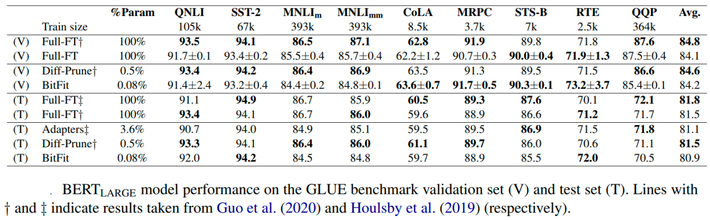

同时，通过实验结果还可以看出，**BitFit微调结果相对全量参数微调而言, 只更新极少量参数的情况下，在多个数据集上都达到了不错的效果**，虽不及全量参数微调，但是远超固定全部模型参数的Frozen方式。

同时，通过对比BitFit训练前后的参数，**发现很多bias参数并没有太多变化**（例如：跟计算key所涉及到的bias参数）。发现计算query和将特征维度从N放大到4N的FFN层（intermediate）的bias参数变化最为明显，只更新这两类bias参数也能达到不错的效果，反之，固定其中任何一者，模型的效果都有较大损失。

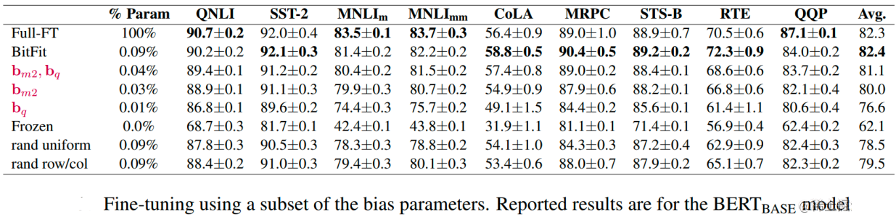

### 2.Prefix Tuning

#### 2.1 背景

在Prefix Tuning之前的工作主要是人工设计离散的模版或者自动化搜索离散的模版。对于人工设计的模版，模版的变化对模型最终的性能特别敏感，加一个词、少一个词或者变动位置都会造成比较大的变化。而对于自动化搜索模版，成本也比较高；同时，以前这种离散化的token搜索出来的结果可能并不是最优的。

除此之外，传统的微调范式利用预训练模型去对不同的下游任务进行微调，对每个任务都要保存一份微调后的模型权重，一方面微调整个模型耗时长；另一方面也会占很多存储空间。

基于上述两点，Prefix Tuning提出**固定预训练LM**，**为LM添加可训练，任务特定的前缀，** 这样就可以为不同任务保存不同的前缀，微调成本也小；同时，这种Prefix实际就是连续可微的Virtual Token（Soft Prompt/Continuous Prompt），相比离散的Token，更好优化，效果更好。

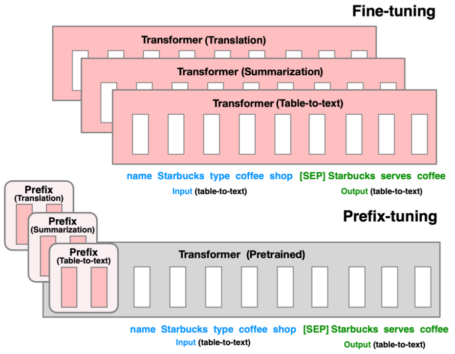

#### 2.2 技术原理

Prefix Tuning（论文：**Prefix-Tuning: Optimizing Continuous Prompts for Generation**），**在输入token之前构造一段任务相关的virtual tokens作为Prefix，然后训练的时候只更新Prefix部分的参数，而PLM中的其他部分参数固定**。

针对不同的模型结构，需要构造不同的Prefix。

-   **针对自回归架构模型**：**在句子前面添加前缀**，得到 `z = [PREFIX; x; y]`，合适的上文能够在固定 LM 的情况下去引导生成下文（比如：GPT3的上下文学习）。
-   **针对编码器-解码器架构模型**：**Encoder和Decoder都增加了前缀**，得到 `z = [PREFIX; x; PREFIX0; y]`。Encoder端增加前缀是为了引导输入部分的编码，Decoder 端增加前缀是为了引导后续token的生成。

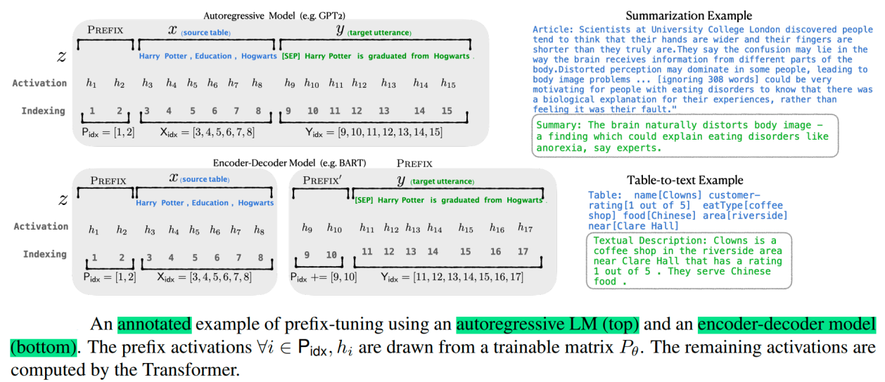

该方法其实和构造Prompt类似，只是Prompt是人为构造的“显式”的提示，并且无法更新参数，而Prefix则是可以学习的“隐式”的提示。

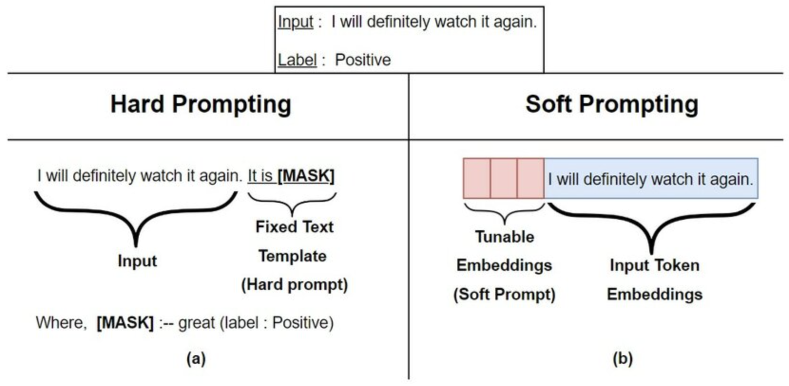

同时，**为了防止直接更新Prefix的参数导致训练不稳定和性能下降的情况，在Prefix层前面加了MLP结构，训练完成后，只保留Prefix的参数**。

你说得非常对！Prefix Tuning 的核心设计远不止 “在输入序列前加一段文本前缀” 这么简单，其**深层机制是在 Transformer 模型的每个注意力层中，给 Key（K）和 Value（V）矩阵 “插入” 可训练的前缀参数**，以此引导模型的注意力模式适配特定任务。这部分是它与其他微调技术（如仅在输入层加前缀的 Prompt Tuning）的关键区别，也是其高效性的核心原因。

### 一、先明确：Transformer 注意力层的基本计算逻辑

要理解 Prefix 加在 K 和 V 上的意义，先回顾 Transformer 中单个注意力头的计算过程：

对于输入序列的每个 token，模型会先计算三个向量：

* **Query（Q）**：当前 token “想查询什么”；

* **Key（K）**：其他 token 的 “身份标识”；

* **Value（V）**：其他 token 的 “具体信息”。

注意力分数的计算公式是：

$\text{Attention}(Q,K,V) = \text{softmax}\left(\frac{QK^T}{\sqrt{d_k}}\right)V$

简单说：Q 与 K 的相似度决定了 “关注其他 token 的程度”，再用这个程度加权求和 V，得到当前 token 的注意力输出。

### 二、Prefix Tuning：在 K 和 V 中插入 “任务引导前缀”

Prefix Tuning 的关键设计是：在**每个注意力层**中，给 K 和 V 矩阵额外增加一段 “可训练的前缀向量”（记为$\text{Prefix}^K$和$\text{Prefix}^V$），而 Query（Q）仍由输入序列本身计算（不额外加前缀）。

具体来说，假设输入序列的长度为$n$，我们给每个注意力层添加长度为$m$的前缀，则：

* 原始的$K$矩阵维度是$(n, d_k)$（$d_k$是 K 的维度），扩展后变为$(m + n, d_k)$，前$m$行是$\text{Prefix}^K$，后$n$行是输入序列的 K；

* 原始的$V$矩阵维度是$(n, d_v)$，扩展后变为$(m + n, d_v)$，前$m$行是$\text{Prefix}^V$，后$n$行是输入序列的 V；

* Q 矩阵仍为$(n, d_q)$，仅由输入序列计算。

此时，注意力分数的计算变为：

$\text{Attention}(Q, [\text{Prefix}^K; K], [\text{Prefix}^V; V]) = \text{softmax}\left(\frac{Q \cdot [\text{Prefix}^K; K]^T}{\sqrt{d_k}}\right) \cdot [\text{Prefix}^V; V]$

这里的$[\text{Prefix}^K; K]$表示将$\text{Prefix}^K$和原始 K 按行拼接。

### 三、为什么要给 K 和 V 加前缀？（核心作用）

给 K 和 V 加前缀，本质是**给模型注入 “任务相关的先验注意力模式”**，具体体现在：

1. **引导模型 “关注任务特征”**

   输入序列的 Q 是 “当前要处理的内容”（比如情感分析中的评论文本），而$\text{Prefix}^K$和$\text{Prefix}^V$是 “任务引导信号”（比如 “情感分析需要关注形容词、程度词”）。

   当 Q 与$\text{Prefix}^K$计算相似度时，会自然地向$\text{Prefix}^V$中的 “任务特征” 倾斜，相当于让模型在处理输入时，先 “参考任务模板” 再计算注意力。

   举例：在电影评论情感分析中，$\text{Prefix}^K$可能编码了 “‘炸裂’‘精彩’是正面词，‘拖沓’‘糟糕’是负面词” 的信息，$\text{Prefix}^V$则编码了这些词对应的情感权重。当输入 “这部电影演技炸裂” 时，Q 会与$\text{Prefix}^K$中 “炸裂” 对应的 K 向量高度相似，从而在 V 中更关注$\text{Prefix}^V$中 “正面” 的权重，最终输出 “正面” 标签。

2. **跨层一致的任务引导**

   Transformer 有多层注意力层（比如 BERT-base 有 12 层），Prefix Tuning 会在**每一层**都加入$\text{Prefix}^K$和$\text{Prefix}^V$（且不同层的前缀参数独立）。这意味着 “任务引导信号” 会贯穿模型的所有计算层，从底层的语义编码到高层的任务决策，全程引导模型的注意力模式。

   对比：如果只在输入层加一段文本前缀（如 Prompt Tuning），其信号可能在深层被稀释，而 Prefix Tuning 通过每层加前缀，保证了任务引导的 “穿透力”。

3. **避免干扰输入序列的原始语义**

   Q 由输入序列本身计算，保证了对输入文本的语义理解不受干扰；而 K 和 V 加前缀，仅在 “如何关注信息” 的层面注入任务特征，既保留了预训练模型的通用语义能力，又高效适配了特定任务。

### 四、再结合 MLP 的作用（训练阶段的细节）

训练时，这些$\text{Prefix}^K$和$\text{Prefix}^V$并非直接训练，而是通过 MLP 生成的：

* 我们会定义一个 “基础前缀向量”（比如随机初始化），输入到 MLP 中，MLP 的输出作为每层实际使用的$\text{Prefix}^K$和$\text{Prefix}^V$；

* 训练过程中，我们优化的是 MLP 的参数（而非直接优化$\text{Prefix}^K$和$\text{Prefix}^V$），MLP 会学习如何 “动态调整” 前缀，让其更平稳地适配任务（避免参数跳变导致的训练不稳定）；

* 训练结束后，用最终的 MLP 计算出固定的$\text{Prefix}^K$和$\text{Prefix}^V$，然后丢弃 MLP，推理时直接使用这些固定前缀。

### 五、与其他技术的核心区别（从 K/V 角度看）

* **全微调**：修改所有层的 Q/K/V 投影矩阵（模型主体参数），成本高；

* **LoRA**：在 Q/K/V 的投影矩阵中加入低秩扰动（修改矩阵本身），参数比全微调少，但仍涉及矩阵运算；

* **Prefix Tuning**：不修改 Q/K/V 的投影矩阵，仅在 K 和 V 中 “插入” 额外的前缀向量（新增参数是前缀本身），参数效率更高，且任务引导更直接。

总结来说，Prefix Tuning 通过在每个注意力层的 K 和 V 中插入可训练前缀，精准控制了模型的注意力模式，同时结合 MLP 辅助训练保证稳定性，最终用极少的参数实现了预训练模型对特定任务的高效适配。这也是它在参数效率和任务性能上表现优异的核心原因。

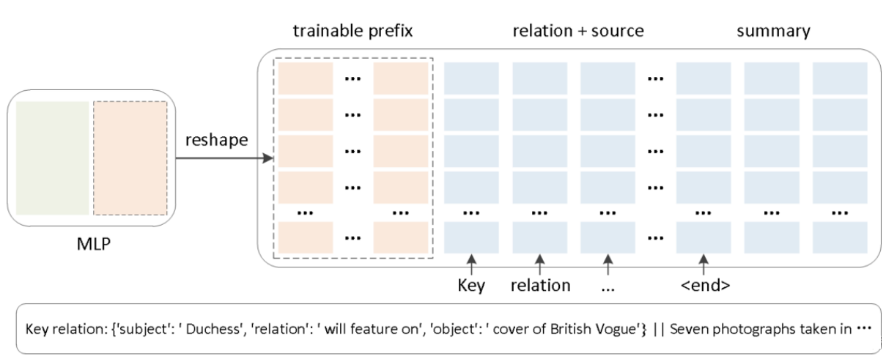

除此之外，通过消融实验证实，只调整embedding层的表现力不够，将导致性能显著下降，因此，在每层都加了prompt的参数，改动较大。

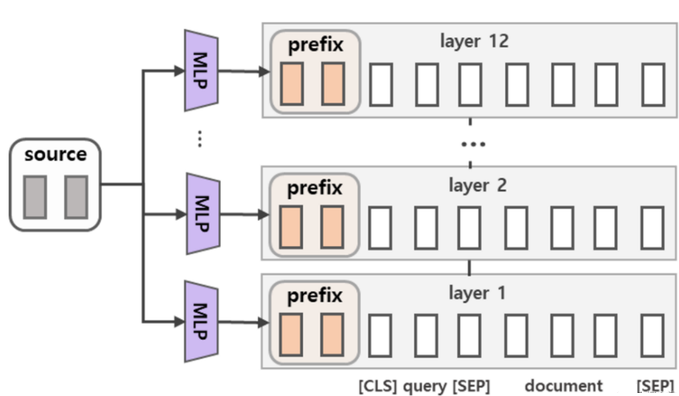

另外，实验还对比了位置对于生成效果的影响，Prefix-tuning也是要略优于Infix-tuning的。其中，Prefix-tuning形式为 `[PREFIX; x; y]`，Infix-tuning形式为 `[x; INFIX; y]`。

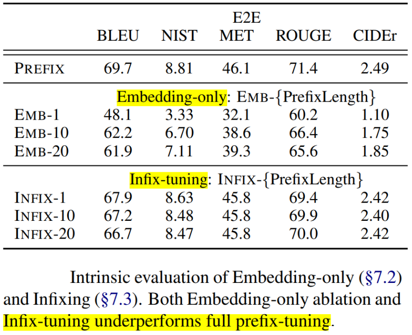

### 3.Prompt Tuning

#### 3.1 背景

大模型全量微调对每个任务训练一个模型，开销和部署成本都比较高。同时，离散的prompts（指人工设计prompts提示语加入到模型）方法，成本比较高，并且效果不太好。

基于此，作者提出了Prompt Tuning，**通过反向传播更新参数来学习prompts，而不是人工设计prompts；同时冻结模型原始权重，只训练prompts参数，** 训练完以后，用同一个模型可以做多任务推理。

#### 3.2 技术原理

Prompt Tuning（论文：**The Power of Scale for Parameter-Efficient Prompt Tuning**），该方法可以看作是Prefix Tuning的简化版本，它给**每个任务定义了自己的Prompt，然后拼接到数据上作为输入，但只在输入层加入prompt tokens**，并且不需要加入 MLP 进行调整来解决难训练的问题。

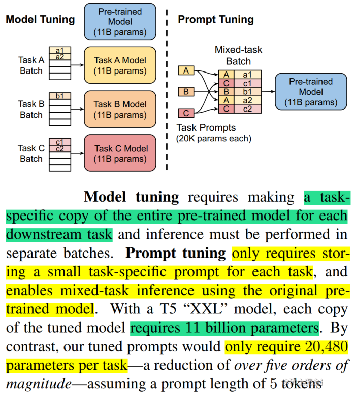

通过实验发现，随着预训练模型参数量的增加，Prompt Tuning的方法会逼近全参数微调的结果。

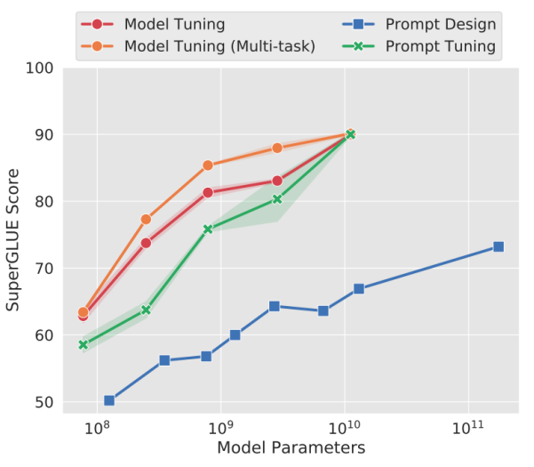

同时，Prompt Tuning 还提出了 Prompt Ensembling，也就是**在一个批次（Batch）里同时训练同一个任务的不同 prompt（即采用多种不同方式询问同一个问题）**，这样相当于训练了不同模型，比模型集成的成本小多了。

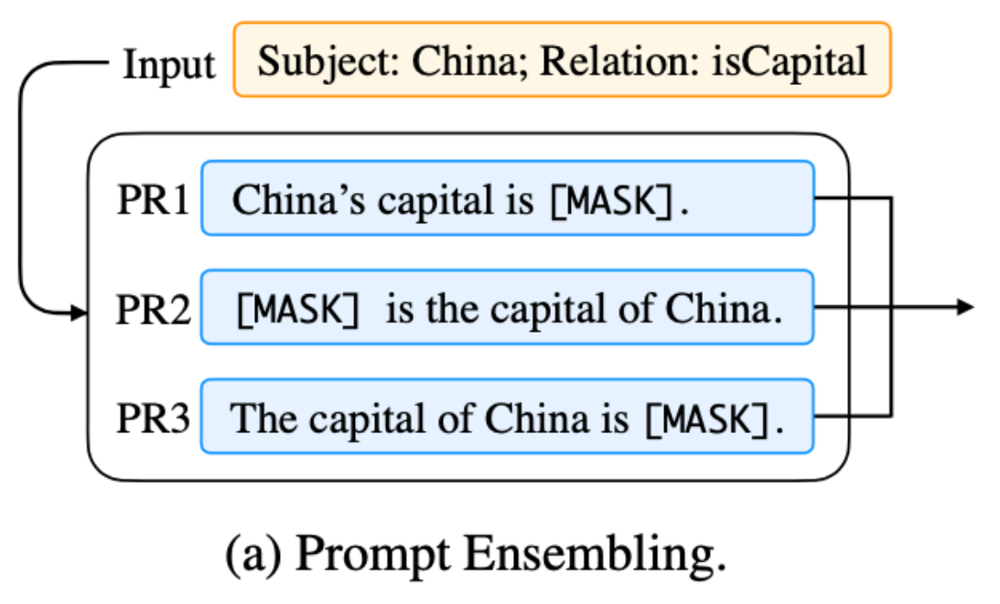

### 4.**P-Tuning**

#### 4.1 背景

该方法的提出主要是为了解决这样一个问题：**大模型的Prompt构造方式严重影响下游任务的效果**。比如：GPT-3采用人工构造的模版来做上下文学习（in context learning），但人工设计的模版的变化特别敏感，加一个词或者少一个词，或者变动位置都会造成比较大的变化。

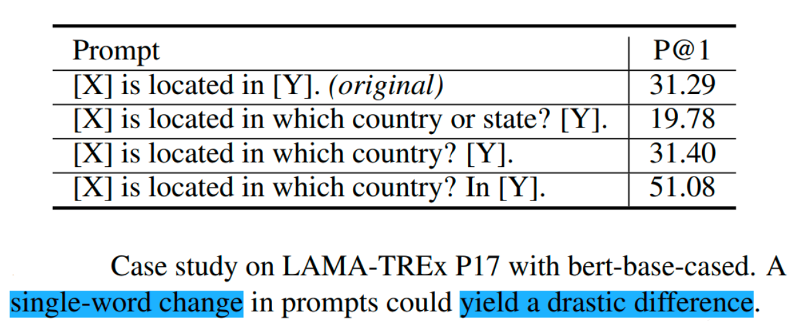

同时，近来的自动化搜索模版工作成本也比较高，以前这种离散化的token的搜索出来的结果可能并不是最优的，导致性能不稳定。

基于此，作者提出了P-Tuning，设计了一种**连续可微的virtual token**（同Prefix-Tuning类似）。

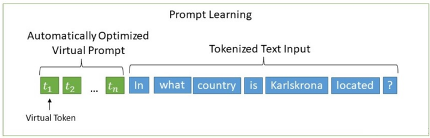

#### 4.2 技术原理

P-Tuning（论文：**GPT Understands, Too**），该方法**将Prompt转换为可以学习的Embedding层，并用MLP+LSTM的方式来对Prompt Embedding进行一层处理**。

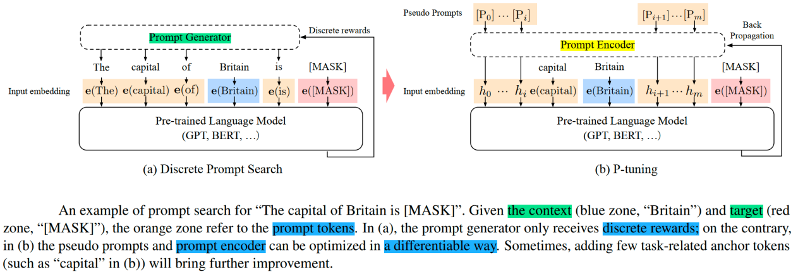

相比Prefix Tuning，P-Tuning加入的可微的virtual token，**但仅限于输入层，没有在每一层都加；另外，virtual token的位置也不一定是前缀，插入的位置是可选的**。这里的出发点实际是把传统人工设计模版中的真实token替换成可微的virtual token。

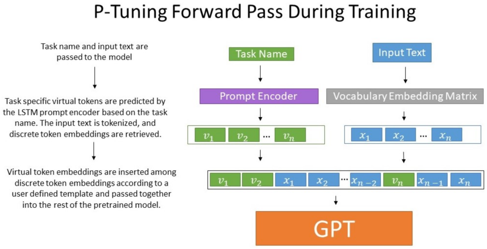

经过预训练的LM的词嵌入已经变得高度离散，如果随机初始化virtual token，容易优化到局部最优值，而这些virtual token理论是应该有相关关联的。因此，作者通过实验发现**用一个prompt encoder来编码会收敛更快，效果更好**。即用一个LSTM+MLP去编码这些virtual token以后，再输入到模型。

从对比实验证实看出，P-Tuning获得了与全参数一致的效果。甚至在某些任务上优于全参数微调。

并且在实验中还发现，相同参数规模，如果进行全参数微调，Bert的在NLU任务上的效果，超过GPT很多；但是在P-Tuning下，GPT可以取得超越Bert的效果。

### 5.**P-Tuning** v2

#### 5.1 背景

之前的Prompt Tuning和P-Tuning等方法存在两个主要的问题：

第一，**缺乏模型参数规模和任务通用性**。

-   **缺乏规模通用性**：Prompt Tuning论文中表明当模型规模超过100亿个参数时，提示优化可以与全量微调相媲美。但是对于那些较小的模型（从100M到1B），提示优化和全量微调的表现有很大差异，这大大限制了提示优化的适用性。
-   **缺乏任务普遍性**：尽管Prompt Tuning和P-tuning在一些 NLU 基准测试中表现出优势，但提示调优对硬序列标记任务（即序列标注）的有效性尚未得到验证。

第二，**缺少深度提示优化**，在Prompt Tuning和P-tuning中，连续提示只被插入transformer第一层的输入embedding序列中，在接下来的transformer层中，插入连续提示的位置的embedding是由之前的transformer层计算出来的，这可能导致两个可能的优化挑战。

-   由于序列长度的限制，可调参数的数量是有限的。
-   输入embedding对模型预测只有相对间接的影响。

考虑到这些问题，作者提出了Ptuning v2，它**利用深度提示优化（如：Prefix Tuning），对Prompt Tuning和P-Tuning进行改进，作为一个跨规模和NLU任务的通用解决方案**。

#### 5.2 技术原理

P-Tuning v2（论文： **P-Tuning v2: Prompt Tuning Can Be Comparable to Fine-tuning Universally Across Scales and Tasks**），该方法**在每一层都加入了Prompts tokens作为输入，而不是仅仅加在输入层**，这带来两个方面的好处：

-   更多可学习的参数（从P-tuning和Prompt Tuning的0.01%增加到0.1%-3%），同时也足够参数高效。
-   加入到更深层结构中的Prompt能给模型预测带来更直接的影响。

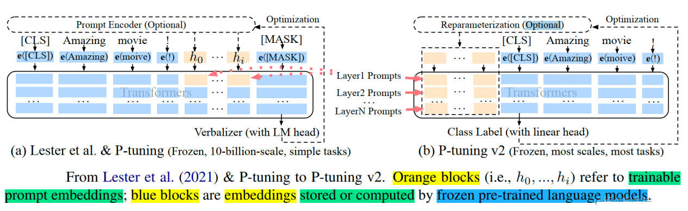

具体做法基本同Prefix Tuning，可以看作是将文本生成的Prefix Tuning技术适配到NLU任务中，然后做了一些改进：

-   **移除重参数化的编码器**。以前的方法利用重参数化功能来提高训练速度和鲁棒性（如：Prefix Tuning中的MLP、P-Tuning中的LSTM））。在 P-tuning v2 中，作者发现重参数化的改进很小，尤其是对于较小的模型，同时还会影响模型的表现。
-   **针对不同任务采用不同的提示长度**。提示长度在提示优化方法的超参数搜索中起着核心作用。在实验中，我们发现不同的理解任务通常用不同的提示长度来实现其最佳性能，这与Prefix-Tuning中的发现一致，不同的文本生成任务可能有不同的最佳提示长度。
-   **引入多任务学习**。先在多任务的Prompt上进行预训练，然后再适配下游任务。多任务学习对我们的方法来说是可选的，但可能是相当有帮助的。一方面，连续提示的随机惯性给优化带来了困难，这可以通过更多的训练数据或与任务相关的无监督预训练来缓解；另一方面，连续提示是跨任务和数据集的特定任务知识的完美载体。我们的实验表明，在一些困难的序列任务中，多任务学习可以作为P-tuning v2的有益补充。
-   **回归传统的分类标签范式，而不是映射器**。标签词映射器（Label Word Verbalizer）一直是提示优化的核心组成部分，它将one-hot类标签变成有意义的词，以利用预训练语言模型头。尽管它在few-shot设置中具有潜在的必要性，但在全数据监督设置中，Verbalizer并不是必须的。它阻碍了提示调优在我们需要无实际意义的标签和句子嵌入的场景中的应用。因此，P-Tuning v2回归传统的CLS标签分类范式，采用随机初始化的分类头（Classification Head）应用于tokens之上，以增强通用性，可以适配到序列标注任务。

论文中展示了P-tuning v2在不同模型规模下的表现。对于简单的NLU任务，如SST-2（单句分类），Prompt Tuning和P-Tuning在较小的规模下没有显示出明显的劣势。但是当涉及到复杂的挑战时，如：自然语言推理（RTE）和多选题回答（BoolQ），它们的性能会非常差。相反，P-Tuning v2在较小规模的所有任务中都与微调的性能相匹配。并且，P-tuning v2在RTE中的表现明显优于微调，特别是在BERT中。

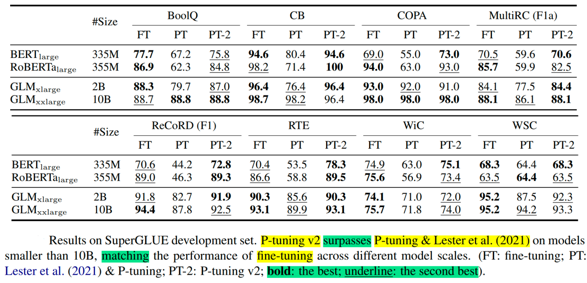

论文还通过消融实验研究了不同任务上Prompt Length的影响：

-   针对简单任务：如情感分析，较短的Prompt（\~20）即可取得不错的效果。
-   针对复杂任务：如阅读理解，需要更长的Prompt（\~100）。

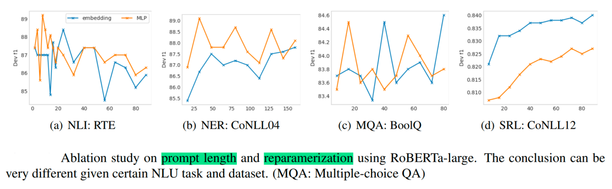

总之，P-Tuning v2是一种在**不同规模和任务中都可与微调相媲美的提示方法**。P-Tuning v2对从330M到10B的模型显示出一致的改进，并在序列标注等困难的序列任务上以很大的幅度超过了Prompt Tuning和P-Tuning。P-Tuning v2可以成为微调的综合替代方案和未来工作的基线（Baseline）。

P-Tuning v2 是针对**参数高效微调（Parameter-Efficient Fine-Tuning）** 提出的改进方案，核心目标是解决早期 P-Tuning（v1）在复杂任务和大模型上效果不足的问题，同时借鉴了 Prefix Tuning 的跨层引导思想，最终在 “参数效率” 和 “任务性能” 之间实现了更好的平衡。

### 先理清背景：为什么需要 P-Tuning v2？

早期的参数高效微调技术存在明显局限：

* **Prompt Tuning**：仅在输入层添加离散或连续的 “提示词（Prompt）”，但提示信号在深层网络中容易被稀释，复杂任务（如命名实体识别 NER、逻辑推理）上效果差；

* **P-Tuning v1**：虽然用连续可训练向量替代了离散 Prompt，但仅在**输入层**添加前缀，引导能力有限，大模型（如 10B 以上）上性能不如全微调；

* **Prefix Tuning**：在每个注意力层的 K/V 中添加前缀，引导能力强，但实现相对复杂（需单独处理 K/V 矩阵）。

P-Tuning v2 正是为了融合这些技术的优势：既保留参数高效性（仅训练少量前缀参数），又增强对深层网络的引导能力（适配复杂任务和大模型）。

### P-Tuning v2 的核心设计（关键改进点）

#### 1. **跨层添加连续前缀：让任务引导贯穿所有网络层**

与 P-Tuning v1 仅在输入层加前缀不同，P-Tuning v2 借鉴了 Prefix Tuning 的 “跨层引导” 思想：在 Transformer 模型的**每一个注意力层**都添加一段连续可训练的前缀向量（Prefix）。

具体来说：

* 对于一个有 L 层的 Transformer 模型，P-Tuning v2 会为每一层设计一组独立的前缀（长度为 m，可自定义）；

* 这些前缀不是仅作用于 K/V 矩阵（如 Prefix Tuning），而是作为 “虚拟输入” 与原始输入序列一起送入模型，参与每一层的 Q/K/V 计算。

例如，原始输入序列为 `[x1, x2, ..., xn]`，添加前缀后，每一层的输入变为 `[p1, p2, ..., pm, x1, x2, ..., xn]`（其中 `p1...pm` 是该层的前缀向量）。

这样做的好处是：任务引导信号（前缀）能**贯穿所有网络层**，从底层语义编码到高层任务决策，全程影响模型的注意力分配，避免了 “浅层引导信号在深层被稀释” 的问题。

#### 2. **连续可训练前缀：摆脱人工设计依赖**

P-Tuning v2 的前缀是**连续的向量**（而非离散的自然语言词汇），且通过模型训练自动优化，无需人工设计 Prompt（如 “这是一个关于... 的任务”）。

* 训练初期，前缀向量随机初始化；

* 训练过程中，通过反向传播直接优化前缀的参数（无需 MLP 辅助，简化了训练流程）；

* 最终得到的前缀向量是 “任务专属的隐式引导信号”（比如在 NER 任务中，前缀会编码 “关注人名、地名等实体” 的信息）。

这种设计既避免了离散 Prompt 对人工经验的依赖，又能让前缀更精准地适配任务需求。

#### 3. **参数效率与性能的平衡：少量参数实现接近全微调的效果**

P-Tuning v2 仅训练前缀参数，模型主体（如 Transformer 的注意力层、FFN 层）的参数完全冻结。

* 假设模型有 L 层，每层前缀长度为 m，隐藏维度为 d，则总可训练参数为 `L × m × d`。例如，对于 12 层的 BERT-base（d=768），若 m=10，则仅需训练 `12×10×768≈92k` 参数，远少于全微调（BERT-base 约 110M 参数）；

* 关键是，通过跨层前缀的强引导能力，P-Tuning v2 在多种任务（尤其是复杂 NLU 任务）上的性能**接近甚至超过全微调**，而参数成本仅为全微调的 0.1%\~1%。

#### 4. **统一适配 NLU 和 NLG 任务**

早期的 Prefix Tuning 更适合生成任务（NLG），而 P-Tuning v1 在理解任务（NLU）上表现一般。P-Tuning v2 通过灵活的前缀设计，实现了对两类任务的统一支持：

* **NLU 任务（如分类、NER）**：前缀引导模型聚焦任务标签相关的特征（如 “判断情感极性”）；

* **NLG 任务（如摘要、翻译）**：前缀引导模型生成符合任务风格的输出（如 “生成简洁摘要”）。

### P-Tuning v2 与其他技术的核心区别

| 技术            | 前缀作用范围       | 前缀形式    | 可训练参数         | 复杂任务性能         |
| --------------- | ------------------ | ----------- | ------------------ | -------------------- |
| Prompt Tuning   | 仅输入层           | 离散 / 连续 | 极少（输入层前缀） | 较差                 |
| P-Tuning v1     | 仅输入层           | 连续        | 较少（输入层前缀） | 一般                 |
| Prefix Tuning   | 每层 K/V 矩阵      | 连续        | 较少（K/V 前缀）   | 较好（偏 NLG）       |
| **P-Tuning v2** | 每层输入（全参与） | 连续        | 较少（跨层前缀）   | 优秀（NLU/NLG 通用） |

### 实际效果：为什么 P-Tuning v2 更优？

在实验中，P-Tuning v2 在多种场景下表现突出：

* 小模型（如 BERT-base）上，性能远超 P-Tuning v1 和 Prompt Tuning，接近全微调；

* 大模型（如 10B 级别的 T5）上，性能与全微调基本持平，但训练成本降低 100 倍以上；

* 在硬任务（如少样本 NER、逻辑推理）上，由于跨层引导能力强，优势更明显。

### 总结

P-Tuning v2 的核心是 “**用跨层连续前缀实现强任务引导，同时保持参数高效性**”。它解决了早期参数高效微调技术在复杂任务和大模型上的局限性，通过简洁的设计（无需额外模块，仅优化前缀参数）实现了 “少量参数换高性能” 的目标，成为目前参数高效微调中最受欢迎的方案之一。
