### BLIP

[LLM大模型: blip2/blip3多模态大模型原理 - 第七子007 - 博客园](https://www.cnblogs.com/theseventhson/p/18488142)

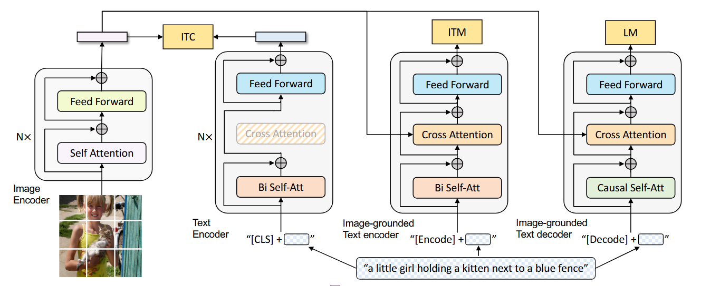

三个损失：

**ITC:图文对比学习**

**ITM:图文匹配**

**LM:基于图片的文本生成**

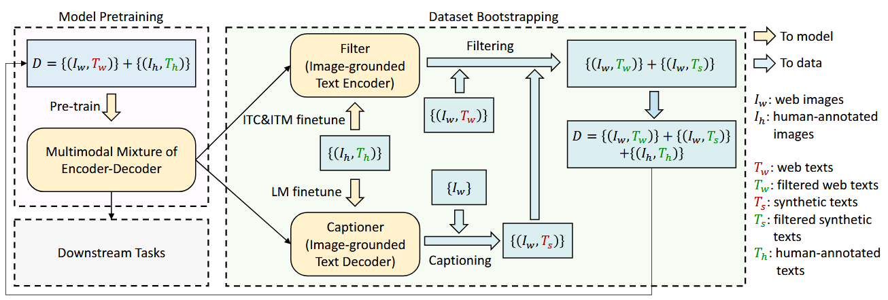

数据集自举训练

1、先用网络数据和人类标注的数据去训练，得到一个预训练模型

2、然后使用人类标注的数据集进行微调，得到filter和captioner

3、然后将网络收集的数据给到3中的filter模型进行过滤

4、然后将网络收集的数据给到3中的captioner模型生成文本，再将图文给filter进行过滤

5、最终，人工标注的，以及3和4中基于网络数据进行清洗过的数据，又得到了一个新的预训练数据，以此往复

### BLIP2

第一阶段预训练(**Q-former学习视觉语言表征之间的关系**)，和BLIP的训练方法差不多

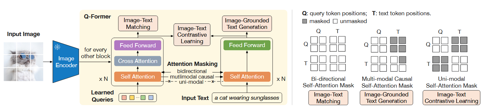

```
import torch
import torch.nn.functional as F

# ====================== 1. 初始化所有核心组件（联合训练共用） ======================
# 1.1 图像编码器：CLIP-ViT-L/14，冻结权重
image_encoder = ViTEncoder(pretrained="clip-vit-large-14")
for param in image_encoder.parameters():
    param.requires_grad = False

# 1.2 Q-Former：核心桥梁（Self-Attention + Cross-Attention + FFN），可训练
q_former = QFormer(
    num_queries=32,        # Learned Queries数量（固定长度）
    hidden_size=768,       # 隐藏层维度（和ViT/文本一致）
    num_layers=12,         # Q-Former的block数量
    vocab_size=10000       # 文本词汇表大小（适配ITG生成）
)

# 1.3 任务专属Head（均为可训练）
itm_head = torch.nn.Linear(768, 2)          # ITM：二分类（匹配/不匹配）
itg_lm_head = torch.nn.Linear(768, 10000)   # ITG：文本生成（预测下一个token）

# 1.4 优化器：仅更新Q-Former + 各任务Head
optimizer = torch.optim.Adam([
    {"params": q_former.parameters()},
    {"params": itm_head.parameters()},
    {"params": itg_lm_head.parameters()}
], lr=1e-4)

# ====================== 2. 输入数据（单批次覆盖三个任务的需求） ======================
batch_size = 8
# 2.1 基础输入
images = torch.randn(batch_size, 3, 224, 224)          # 图像：[8,3,224,224]
text_tokens = torch.randint(0, 10000, (batch_size, 16))# 文本token：[8,16]（16为序列长度）
text_embeddings = TokenEmbedding(10000, 768)(text_tokens)  # 文本嵌入：[8,16,768]

# 2.2 任务专属标签
itm_labels = torch.tensor([1,1,0,1,0,0,1,0])           # ITM标签：1=匹配，0=不匹配 [8]
itg_labels = text_tokens[:, 1:].contiguous()           # ITG生成目标：去掉第一个token [8,15]
itg_attention_mask = torch.ones(batch_size, 15)        # ITG掩码：[8,15]（1表示有效token）

# ====================== 3. 图像侧：ViT提取特征（所有任务共用K/V） ======================
image_features = image_encoder(images)  # 图像特征序列：[8,256,768]（256=ViT patch数）

# ====================== 4. 共享组件：提取Learned Queries ======================
learned_queries = q_former.get_learned_queries(batch_size=batch_size)  # [8,32,768]

# ====================== 5. 任务1：ITC（图文对比学习） ======================
# 5.1 图像嵌入I：仅Queries + 图像特征（无文本）
image_queries_itc = q_former.cross_attention(
    query=learned_queries, key=image_features, value=image_features
)  # [8,32,768]
image_emb = F.normalize(torch.mean(image_queries_itc, dim=1), p=2, dim=-1)  # [8,768]

# 5.2 文本嵌入T：仅文本 + Self-Attention（无图像）
text_self_attn_mask_bi = torch.ones(batch_size, 16, 16)  # 双向掩码
text_self_attn_itc = q_former.self_attention(text_embeddings, attention_mask=text_self_attn_mask_bi)  # [8,16,768]
text_emb = F.normalize(torch.mean(text_self_attn_itc, dim=1), p=2, dim=-1)  # [8,768]

# 5.3 ITC损失（InfoNCE）
sim_matrix = torch.matmul(image_emb, text_emb.t()) / 0.07  # 相似度矩阵：[8,8]，温度系数0.07
labels_itc = torch.arange(batch_size).to(sim_matrix.device)
itc_loss_i2t = F.cross_entropy(sim_matrix, labels_itc)          # 图像→文本
itc_loss_t2i = F.cross_entropy(sim_matrix.t(), labels_itc)      # 文本→图像
itc_loss = (itc_loss_i2t + itc_loss_t2i) / 2                    # 总ITC损失

# ====================== 6. 任务2：ITM（图文匹配） ======================
# 6.1 拼接Queries+文本，走完整Q-Former流程
query_text_seq_itm = torch.cat([learned_queries, text_embeddings], dim=1)  # [8,48,768]
self_attn_mask_itm = torch.ones(batch_size, 48, 48)                        # 双向掩码：[8,48,48]

# 6.2 Self-Attention + Cross-Attention + FFN
self_attn_itm = q_former.self_attention(query_text_seq_itm, attention_mask=self_attn_mask_itm)  # [8,48,768]
cross_attn_itm = q_former.cross_attention(self_attn_itm, key=image_features, value=image_features)  # [8,48,768]
fusion_repr_itm = q_former.feed_forward(cross_attn_itm)                                            # [8,48,768]

# 6.3 ITM损失
pooled_repr_itm = fusion_repr_itm[:, 0, :]  # 取<cls>位置：[8,768]
itm_logits = itm_head(pooled_repr_itm)      # 预测匹配概率：[8,2]
itm_loss = F.cross_entropy(itm_logits, itm_labels)  # 交叉熵损失

# ====================== 7. 任务3：ITG（图像引导文本生成） ======================
# 7.1 拼接Queries+文本前缀（仅前15个token，适配生成目标）
text_embeddings_itg = text_embeddings[:, :-1, :]  # 文本前缀：[8,15,768]（去掉最后一个token）
query_text_seq_itg = torch.cat([learned_queries, text_embeddings_itg], dim=1)  # [8,47,768]

# 7.2 因果掩码（生成任务核心：只能看前面的token）
self_attn_mask_itg = torch.tril(torch.ones(batch_size, 47, 47))  # 下三角掩码：[8,47,47]

# 7.3 Self-Attention + Cross-Attention + FFN
self_attn_itg = q_former.self_attention(query_text_seq_itg, attention_mask=self_attn_mask_itg)  # [8,47,768]
cross_attn_itg = q_former.cross_attention(self_attn_itg, key=image_features, value=image_features)  # [8,47,768]
fusion_repr_itg = q_former.feed_forward(cross_attn_itg)                                            # [8,47,768]

# 7.4 提取文本部分的表示（去掉Queries，仅保留文本前缀的输出）
text_repr_itg = fusion_repr_itg[:, 32:, :]  # 去掉前32个Queries：[8,15,768]

# 7.5 ITG损失（语言模型交叉熵）
itg_logits = itg_lm_head(text_repr_itg)  # 预测token：[8,15,10000]
itg_loss = F.cross_entropy(
    itg_logits.reshape(-1, 10000),  # [120,10000]（8*15=120）
    itg_labels.reshape(-1),         # [120]
    ignore_index=0                  # 忽略padding token（假设0是PAD）
)

# ====================== 8. 联合训练：总损失 + 反向传播 ======================
# 8.1 损失加权（超参可调整，通常设为1:1:1）
total_loss = itc_loss + itm_loss + itg_loss

# 8.2 反向传播 + 优化
optimizer.zero_grad()  # 清空梯度
total_loss.backward()  # 反向传播
optimizer.step()       # 更新参数

# 8.3 打印训练日志
print(f"Total Loss: {total_loss.item():.4f}")
print(f"  - ITC Loss: {itc_loss.item():.4f}")
print(f"  - ITM Loss: {itm_loss.item():.4f}")
print(f"  - ITG Loss: {itg_loss.item():.4f}")
```


第二阶段预训练(**视觉到语言生成学习，并训练Q-Forform使其输出的视觉表示能够被LLM解读**)

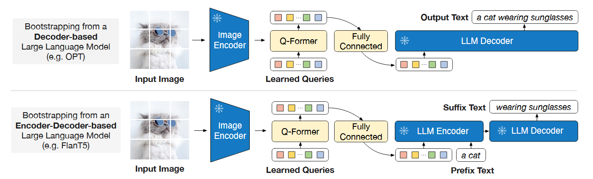

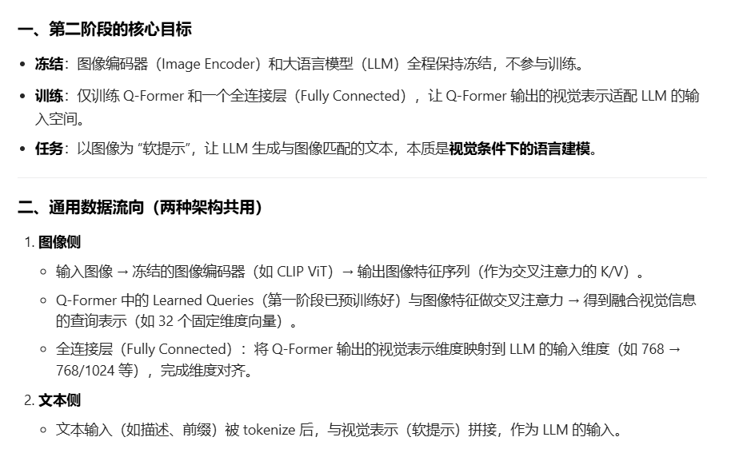

# CogVLM：NeurIPS 2024 视觉专家模型解读

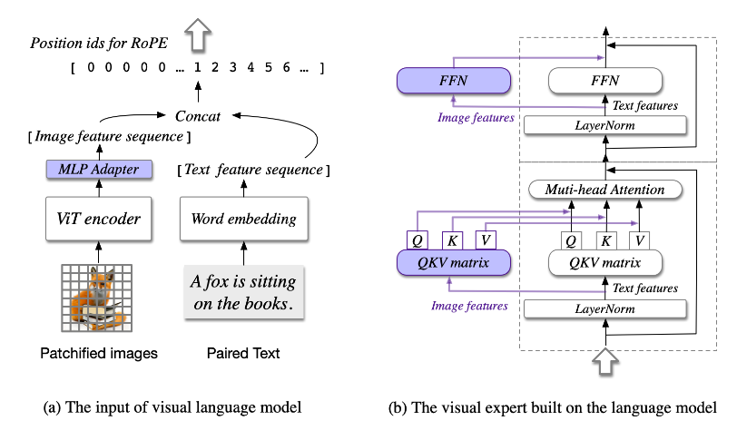

这个图对应的是**智谱AI发表在NeurIPS 2024的论文《CogVLM: Visual Expert for Pretrained Language Models》**（arXiv链接：https://arxiv.org/abs/2311.03079），这是CogVLM模型的核心架构图。结合论文内容，图中模块的论文级解读如下：

### 一、论文核心背景（图的设计动机）

论文针对**“浅层对齐多模态模型（如BLIP-2）视觉能力弱、深度融合模型（如LLaVA）易遗忘NLP能力”**的痛点，提出了**“视觉专家（Visual Expert）”**机制：**在冻结预训练语言模型（LLM）主体参数的前提下，在LLM每一层插入可训练的视觉专家模块**，实现“图文特征深度融合+保留LLM原文本能力”——你提供的图正是这一核心机制的可视化。

### 二、图(a)：对应论文的“输入处理模块”（论文2.1节）

图(a)是CogVLM的**输入特征对齐流程**，对应论文中“ViT编码器+MLP适配器”的设计：

1. **Patchified images → ViT encoder**：

1. 论文中使用**EVA2-CLIP-E作为ViT编码器**，将图像分割为patch后编码为视觉特征序列；

1. **ViT encoder → MLP Adapter**：

1. 论文中用**两层SwiGLU结构的MLP适配器**，将ViT输出的视觉特征映射到与LLM词嵌入相同的维度空间；

1. **Paired Text → Word embedding**：

1. 文本经词嵌入层转化为文本特征序列；

1. **Concat + Position ids for RoPE**：

1. 论文中规定：**所有图像特征共享相同的位置ID（全设为0），文本特征的位置ID从1开始递增**（图中`[0 0 0 ... 1 2 3 ...]`），通过旋转位置编码（RoPE）区分图文特征，避免位置混淆。

### 三、图(b)：对应论文的“视觉专家模块”（论文2.2节）

图(b)是CogVLM的核心创新——**视觉专家（Visual Expert）**，对应论文中“LLM每一层的视觉专家结构”：

1. **特征拆分与预处理**：

1. 输入特征被拆分为`Image features`和`Text features`，文本特征先经`LayerNorm`（与论文中“保持LLM层归一化逻辑一致”对应）；

1. **QKV matrix的双分支设计**：

1. 论文中明确：视觉专家为图像特征单独设计了**可训练的QKV矩阵**（图中紫色`QKV matrix`），而文本特征复用LLM原有的QKV矩阵（图中白色`QKV matrix`）——这是“视觉专家”的核心：仅训练图像对应的QKV参数，冻结LLM原有参数；

   **在计算完qkv之后，图像和文本的qkv是进行拼接还是直接相加呢？**

   **把「图像的 Q 序列」和「文本的 Q 序列」在序列长度维度拼接，得到一个 “混合模态的 Q 序列”**

   **同理，K 序列、V 序列也做同样的拼接，得到 “混合模态的 K 序列”“混合模态的 V 序列”**

1. **Multi-head Attention**：

1. 图像与文本的Q/K/V在多头注意力层交互，实现“图文特征深度融合”（论文中称为“跨模态注意力交互”）；

1. **FFN的双分支设计**：

1. 图像特征对应**可训练的FFN**（图中紫色`FFN`），文本特征复用LLM原FFN（图中白色`FFN`）——与QKV设计一致，仅训练图像对应的FFN参数。

### 四、图与论文的对应关系总结

这张图是论文中的**Figure 3**（CogVLM架构图），直接对应论文的核心架构：

- 图(a)是“输入特征对齐流程”，解决“图文特征维度/位置不兼容”问题；
- 图(b)是“视觉专家模块”，解决“图文深度融合+避免LLM遗忘”问题。

这篇论文的核心贡献正是通过图中所示的结构，在冻结LLM参数的前提下，实现了图文特征的深度融合，让CogVLM在15+跨模态基准上达到SOTA，同时保留了LLM原有的文本能力。

CogVLM2

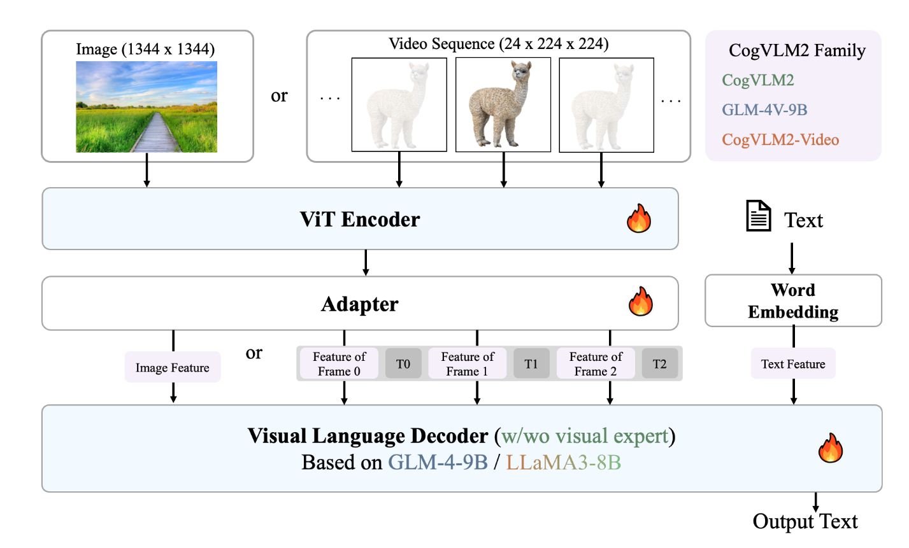

# CogVLM2：2024 年 8 月 29 日发布的视觉语言模型

《CogVLM2: Visual Language Models for Image and Video Understanding》是**智谱AI与清华大学知识工程实验室于2024年8月29日发表在arXiv（编号2408.16500）的论文**，是CogVLM系列的第二代多模态模型，核心目标是解决“前代模型视觉分辨率低、文本处理能力有限、视频理解缺失”的痛点，在保持轻量化的同时实现“媲美闭源模型的多模态能力”。

### 一、论文核心动机

前代CogVLM存在3个局限：

1. 图像输入分辨率仅224×224，无法捕捉文档、工业影像的细节；
2. 文本处理长度有限，不支持长文档交互；
3. 仅支持静态图像，缺乏视频时序理解能力。

论文的核心思路是：**继承“视觉专家（Visual Expert）”架构，通过“高分辨率视觉编码+动态模态融合+多阶段训练”，在冻结LLM主体参数的前提下，同时提升图像/视频理解能力、支持长文本交互**。

### 二、模型架构（论文核心创新）

CogVLM2采用**“50亿参数视觉编码器 + 70亿参数视觉专家模块 + 8B参数Llama3-8B-Instruct语言基座”**的异构架构（总参数量19B，推理时仅激活约120亿参数，兼顾性能与效率），核心设计包括：

1. **高分辨率视觉编码**：

   用EVA2-CLIP-E作为视觉编码器，支持1344×1344像素输入；**在编码器后加入“2×2卷积降采样模块”，压缩高分辨率特征序列长度，平衡性能与推理速度**。

1. **优化的视觉专家模块**：

   继承CogVLM的“视觉专家注入LLM层”设计，但新增**动态模态融合机制**——**根据任务类型（如VQA/图像描述）调整视觉-语言注意力权重，实现“任务适配的跨模态交互**”。

1. **图文位置编码区分**：

   图像特征的位置ID全设为0，文本特征位置ID从1开始递增（通过RoPE编码区分模态），避免图文特征混淆。

### 三、预训练与微调策略（论文关键训练方法）

1. **预训练阶段**：
   1. 数据层面：采用“迭代精炼+合成数据”——先用初始模型标注数据并人工校正，再合成中文OCR、GUI图像等稀缺数据，解决视觉-语言数据噪声大、分布有限的问题；
   2. 训练策略：分三阶段逐步启用参数（先训交叉注意力、再训视觉专家、最后训视觉编码器），同时混合“语言预训练数据+视觉-语言数据”，避免LLM文本能力退化；并**逐步提升图像分辨率**（从224×224到1344×1344），让模型渐进适应高分辨率输入。
2. **微调阶段**：
   1. 图像SFT：分两阶段——先在30万对齐语料+VQA数据集上增强基础能力，再用5万偏好数据优化输出风格；
   2. 视频SFT：从图像模型迁移，输入24帧视频，新增“时序定位调优”，通过自动化生成视频问答数据（用GPT-4o过滤），实现视频时序理解。

### 四、核心改进与性能表现

1. **核心能力升级**：
   1. 支持1344×1344图像分辨率、8K文本长度；
   2. 新增CogVLM2-Video分支，支持视频时序理解；
   3. 提供中英双语版本，针对中文OCR、古汉字等场景专项优化。
2. **基准测试结果**：

3. 在MMBench、MM-Vet、TextVQA、DocVQA等基准上取得SOTA：
   - TextVQA（中文）：85.0分（超越GPT-4V的78.0分）；
   - DocVQA：92.3分（开源模型第一）；
   - OCRbench（中文）：780分（较前代提升32%）。

### 五、开源与应用

论文对应的模型已开源（GitHub：THUDM/CogVLM2），基于Llama3-8B-Instruct提供英文和中英双语版本，且支持Int4量化（16GB显存即可推理），可落地于工业质检（PCB焊点缺陷识别）、智能文档处理（合同审核）、医疗影像解析等场景。

这篇论文的核心贡献是：**以19B轻量化参数量，实现了“高分辨率视觉理解+长文本交互+视频时序能力”的统一，为开源多模态模型提供了“性能媲美闭源、部署成本低”的新范式**。

### Qwen-VL

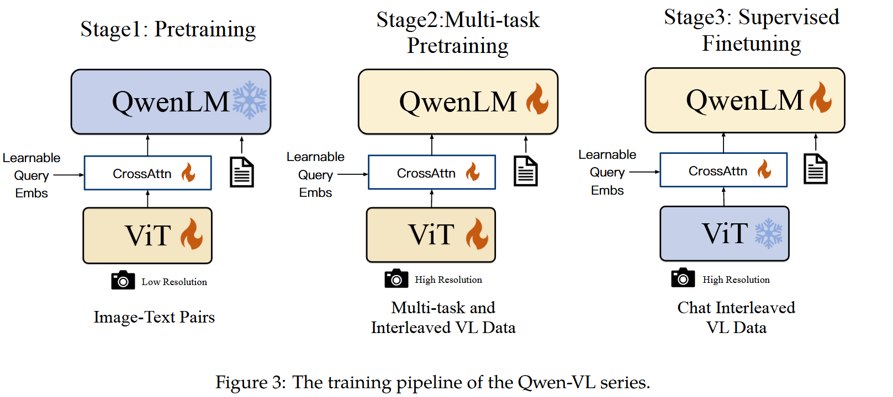

### QwenVL系列

[多模态技术梳理：Qwen-VL系列 - 知乎](https://zhuanlan.zhihu.com/p/25267823390)

qwen-vl

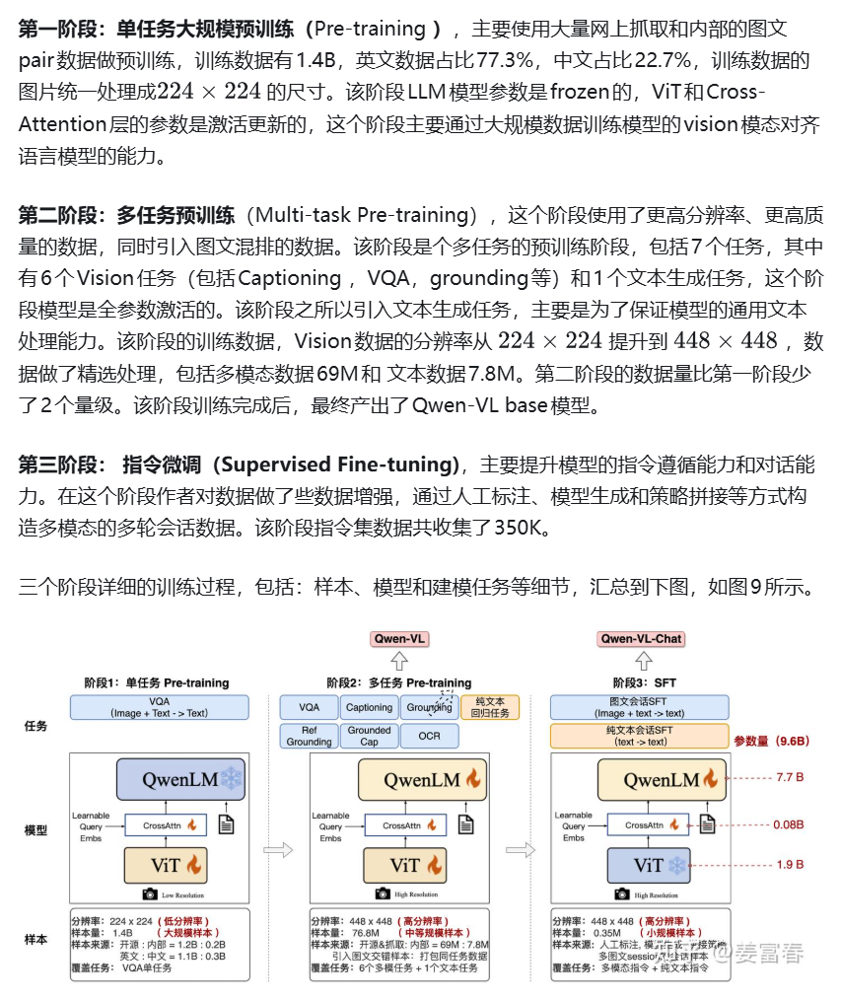

qwen2-vl

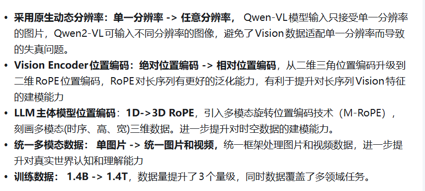

**还有就是将模态映射层从Cross-Attention改为了MLP**

## qwen2.5-vl

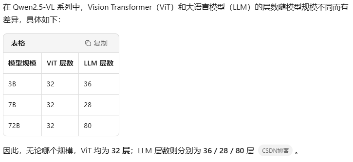

[(6 条消息) 【Qwen】Qwen2.5-VL技术报告 - 知乎](https://zhuanlan.zhihu.com/p/1927463592279671080)

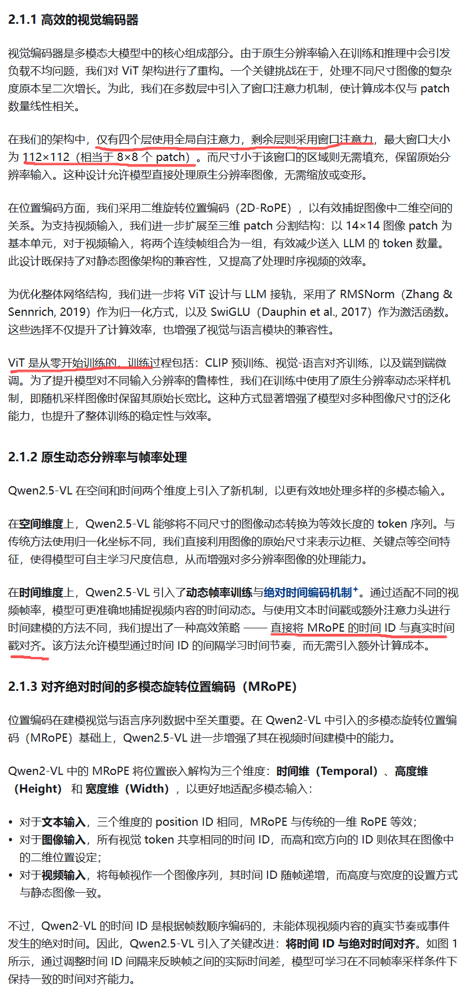

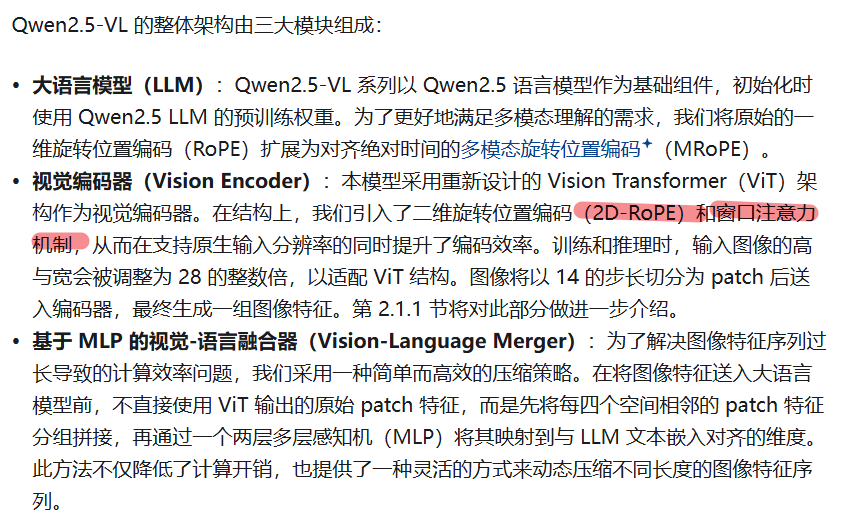


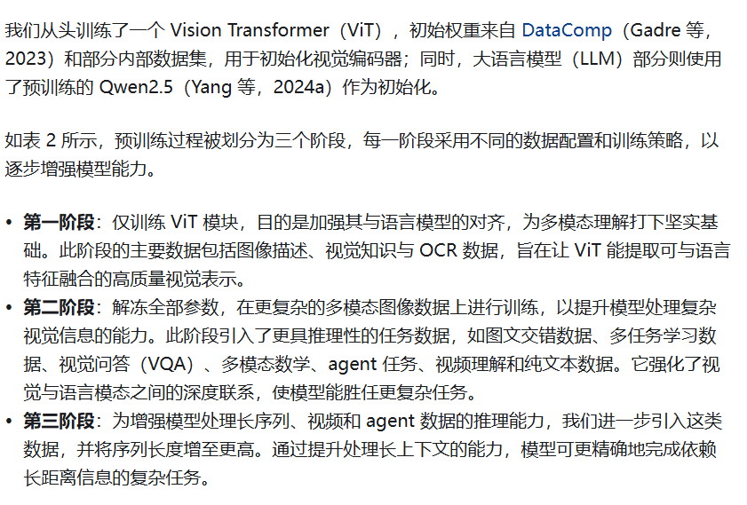

## Qwen3-vl

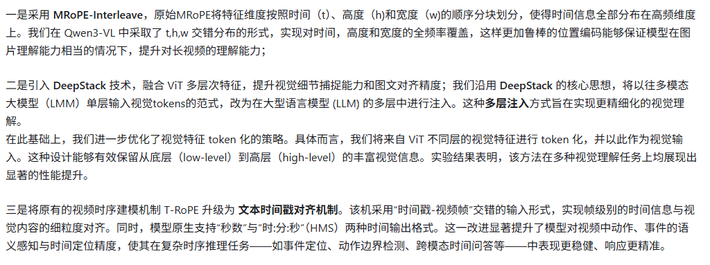

**维度越低，频率变化越快**

嵌入维度被划分为时间（t）、水平（h）和垂直（w）子空间，每个子空间分配不同的旋转频率。这导致频谱不平衡，后续研究显示这会降低长视频理解基准的性能。为解决这个问题，我们重新设计了频率分配，通过在嵌入维度中交错t、h和w分量（Huang等，2025）。这确保每个时空轴在低频和高频频带上均有统一的表示

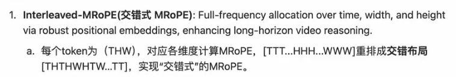


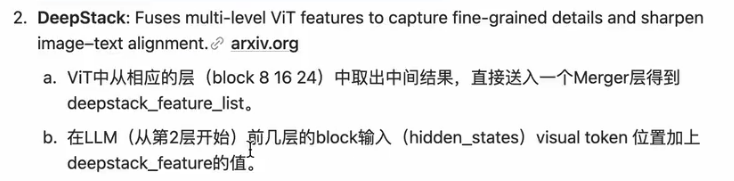


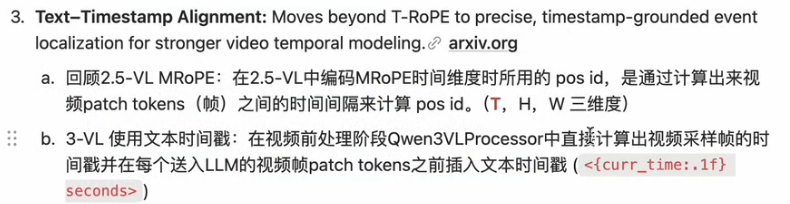


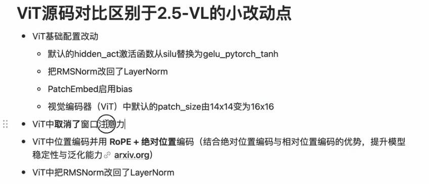

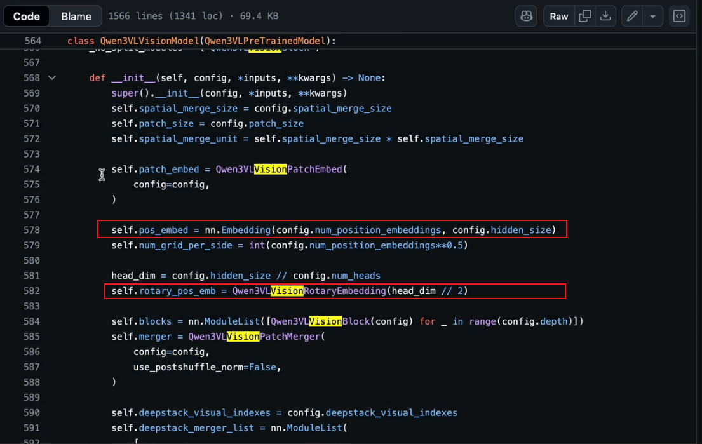

这个感觉有问题，如果文本段的t都一样，感觉文本会失去位置关系

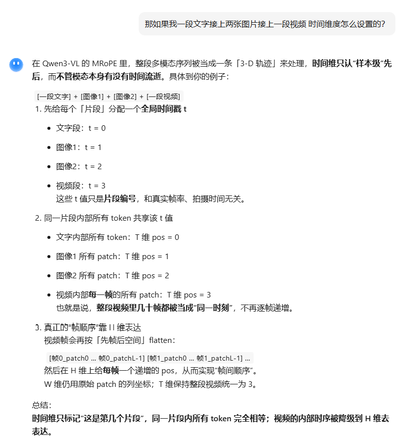

## llava

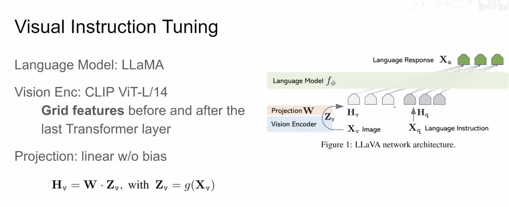

一阶段预训练

主要是为了特征对齐，使用单轮对话数据预测图片的caption,只训练这个线性层W

二阶段 端到端微调

训练W和LLM


# LLaVA：两阶段训练及优化详解

LLaVA（Large Language and Vision Assistant）采用**两阶段训练范式**，核心是先对齐视觉-语言特征空间，再通过指令微调让模型学会遵循视觉指令并生成自然语言响应。以下是各阶段的详细流程与关键细节。

### 一、整体架构概述

LLaVA的基础架构由三部分组成：

| 组件           | 作用                            | 初始状态                       |
| -------------- | ------------------------------- | ------------------------------ |
| **视觉编码器** | 提取图像特征（如CLIP ViT-L/14） | 冻结（所有阶段）               |
| **MLP投影层**  | 将视觉特征映射到LLM词嵌入空间   | 第一阶段训练，第二阶段继续训练 |
| **语言模型**   | 生成文本响应（如Vicuna-7B/13B） | 第一阶段冻结，第二阶段训练     |

### 二、第一阶段：视觉-语言特征对齐预训练（Stage 1: Feature Alignment）

#### 1. 核心目标

- 仅训练**MLP投影层**，冻结视觉编码器与语言模型权重
- 将视觉特征空间与语言模型的词嵌入空间对齐，使LLM能理解图像内容
- 建立图像到文本的基础映射，类似训练视觉“分词器”

#### 2. 数据集

- 原始：**LAION-CC-SBU 558K子集**（LLaVA-Pretrain）或Filtered CC3M（595K图文对，CC-595K）
- 处理方式：将图文对转换为“朴素问答”格式（如：“描述这张图片”→图像→原始标题）
- 样本格式：`[图像] → "描述这张图片" → [图片标题]`

#### 3. 输出

- 训练好的**MLP投影层权重**，可与冻结的视觉编码器、语言模型组合成基础多模态模型

### 三、第二阶段：视觉指令微调（Stage 2: Visual Instruction Tuning）

#### 1. 核心目标

- 联合训练**MLP投影层+语言模型**权重，保持视觉编码器冻结
- 让模型学会遵循多模态指令，生成符合人类偏好的自然语言响应
- 支持复杂视觉任务：VQA、图像描述、多轮对话、视觉推理等

#### 2. 数据集

- 核心：**GPT-4生成的158K高质量多模态指令数据**（Instruct-158K），含多样化任务类型
- 扩展（LLaVA-1.5+）：学术任务数据（515K VQA、图像描述等），总计约650K+样本
- 任务覆盖：单轮/多轮问答、图像描述、视觉推理、细粒度定位等
- 样本格式：`[图像] → "详细描述这张图片中的动物及其行为" → [GPT-4生成的详细回答]`

#### 3. 输出

- 完整的**LLaVA模型权重**（视觉编码器+训练的MLP+训练的语言模型）
- 可直接用于多模态对话与视觉任务推理

### 五、训练流程总结表

| 阶段           | 训练组件    | 数据集          | 核心目标           | 训练时长 | 内存优化           |
| -------------- | ----------- | --------------- | ------------------ | -------- | ------------------ |
| **特征对齐**   | 仅MLP投影层 | 558K/595K图文对 | 视觉-语言空间对齐  | 1–4小时  | BF16，梯度检查点   |
| **指令微调**   | MLP+LLM     | 650K+指令数据   | 指令跟随与响应生成 | 20小时   | LoRA/FSDP/ZeRO     |
| **进阶预训练** | 全参数      | 4M+高质量数据   | 知识注入           | 额外天数 | 混合精度，模型并行 |

# Flamingo

[Flamingo：打破模态壁垒的少样本视觉语言模型_flamingo模型哪一年提出的-CSDN博客](https://blog.csdn.net/m0_65010824/article/details/155012939?ops_request_misc=&request_id=&biz_id=102&utm_term=flamingo&utm_medium=distribute.pc_search_result.none-task-blog-2~all~sobaiduweb~default-2-155012939.142^v102^pc_search_result_base4&spm=1018.2226.3001.4187)

## Vit


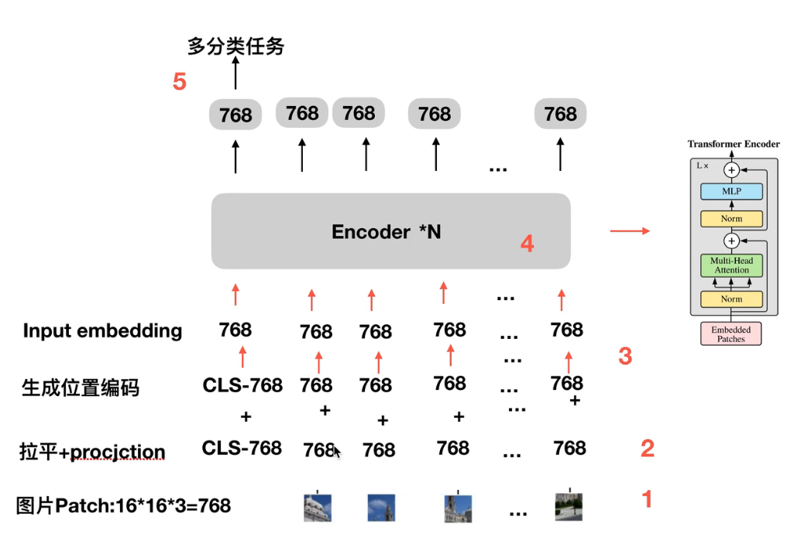

1、首先将图片切片成patch,每个patch是16 * 16 * 3

2、加一个cls的token在最前面，然后将每个patch拉平，拉成一个长为768的向量，然后做一个线性映射，先升维，再降维

3、加上位置编码，位置编码用的是**可训练的绝对位置编码**。最后得到input_embedding

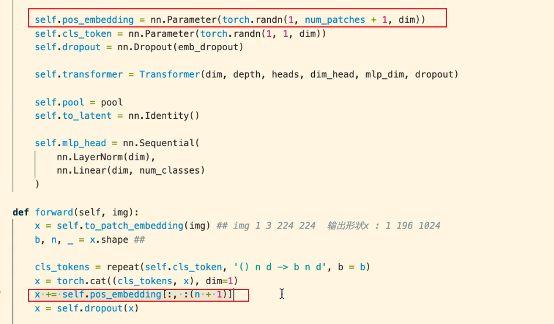

## Clip

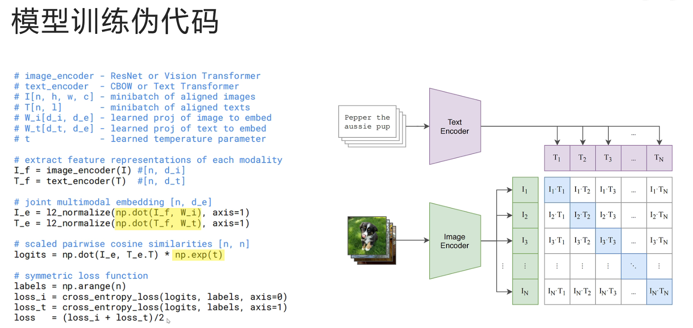

np.dot():计算点积

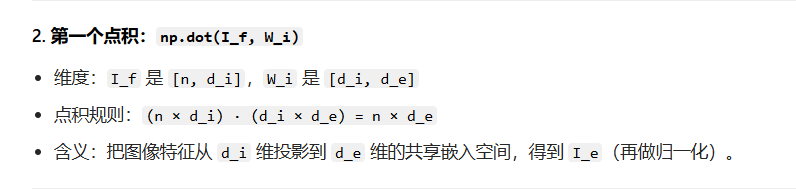

np.dot(I_f,W_i) : 这里指将特征线性映射

np.exp(t) : 这里指温度系数

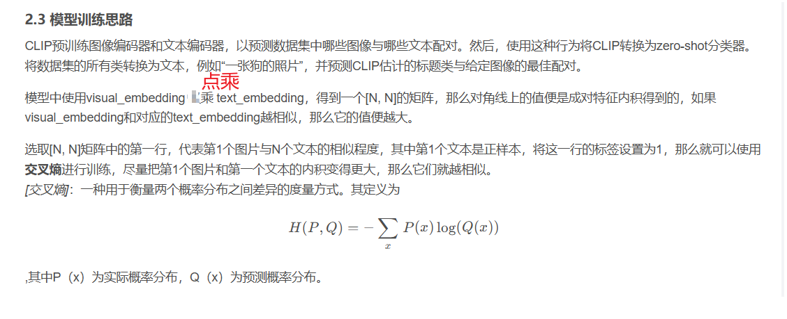
