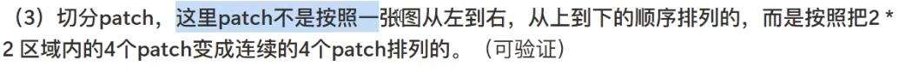
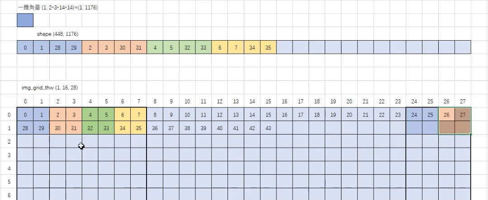
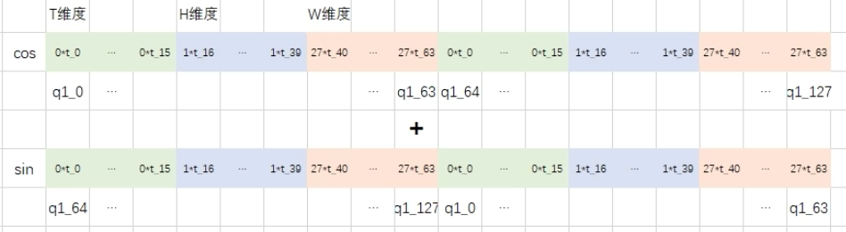

# qwen2.5vl-7b
## 1、process_vision_info
    fetch_image：根据图片地址读取图片
    smart_resize： 根据实际图片尺寸、以及28去调整图片的尺寸。四舍五入
## 2、processor -> Qwen2_5_VLProcessor.call
###  处理图片
    根据图片尺寸分组处理图片
    resize
    normalize
    在时间维度unsqueeze 从(batct,channel,height,width) -> (batch,temple,channel,height,width)
    一张(3,224,224)展平成(1,256,1176)的patch。这里就是把一个图上14*14的像素变为一个列,1176=2(temple)*3(channel)*14*14
    return pixel_values=(1,256,1176) image_grid_thw=(1,16,16)

    num_image_tokens=16*16/4=64
    对文本进行encode,根据图片展平后的大小(num_image_tokens)预留多少个151655(<|image_pad|>编码之后的id)

###  处理视频
    idx：采集原始视频中的第多少帧
    video： 将视频这种第idx帧的图片取出来
    之后就是跟图片一样，做一些图片级别的预处理操作
## 3、generate
###  视觉编码器部分
    视觉编码器的hidde_state维度是1280
    Qwen2_5_VLModel的forward
    Qwen2_5_VisionTransformerPretrainedModel的forward -> Qwen2_5_VisionPatchEmbed的forward 进行空间3D卷积 将(3,2,14,14) 变成一个(1280)的列向量
    rot_pos_emb 进行旋转位置编码 rotary_pos_emb:每一个patch的旋转位置编码的前一半
    get_window_index 得到每一个窗口的长度、patch的标号信息
    window_index = tensor([ 0,  1,  2,  3,  8,  9, 10, 11, 16, 17, 18, 19, 24, 25, 26, 27,  4,  5,
         6,  7, 12, 13, 14, 15, 20, 21, 22, 23, 28, 29, 30, 31, 32, 33, 34, 35,
        40, 41, 42, 43, 48, 49, 50, 51, 56, 57, 58, 59, 36, 37, 38, 39, 44, 45,
        46, 47, 52, 53, 54, 55, 60, 61, 62, 63])  这里实际上是每一个窗口用到的合并单元的信息，这里的0表示第0个合并单元，就是4个patch得到的合并单元。
    cu_window_seqlens = [0, 64, 128, 128, 192, 256, 256, 256, 256, 256] 存的是每一个窗口用到了多少个patch:64=16*4,
    16即 0,  1,  2,  3,  8,  9, 10, 11, 16, 17, 18, 19, 24, 25, 26, 27
    blk 进行注意力计算
    merger 四个patch融合成一个
    然后此时hidden_state不是按照正常顺序排列的，前面为了窗口注意力好计算，是按照window_index的顺序排的，现在还需要还原回来
### 文本编码器部分
    文本编码器的hidde_state维度是2048
    Qwen2_5_VLTextModel的forward 
    
    position_ids第一个维度是3,表示时间、高度、宽度
    计算旋转位置编码时token的位置，就用的以下id号,但是只算前一半hidden_state(分头之后2048/16=128,128/2=64)cos和sin
    position_ids=tensor([[[ 0,  1,  2,  3,  4,  5,  6,  7,  8,  9, 10, 11, 12, 13, 14, 15, 16,
                            17, 18, 19, 20, 20, 20, 20, 20, 20, 20, 20, 20, 20, 20, 20, 20, 20,
                            20, 20, 20, 20, 20, 20, 20, 20, 20, 20, 20, 20, 20, 20, 20, 20, 20,
                            20, 20, 20, 20, 20, 20, 20, 20, 20, 20, 20, 20, 20, 20, 20, 20, 20,
                            20, 20, 20, 20, 20, 20, 20, 20, 20, 20, 20, 20, 20, 20, 20, 20, 28,
                            29, 30, 31, 32, 33]],
    
                            [[ 0,  1,  2,  3,  4,  5,  6,  7,  8,  9, 10, 11, 12, 13, 14, 15, 16,
                            17, 18, 19, 20, 20, 20, 20, 20, 20, 20, 20, 21, 21, 21, 21, 21, 21,
                            21, 21, 22, 22, 22, 22, 22, 22, 22, 22, 23, 23, 23, 23, 23, 23, 23,
                            23, 24, 24, 24, 24, 24, 24, 24, 24, 25, 25, 25, 25, 25, 25, 25, 25,
                            26, 26, 26, 26, 26, 26, 26, 26, 27, 27, 27, 27, 27, 27, 27, 27, 28,
                            29, 30, 31, 32, 33]],
    
                            [[ 0,  1,  2,  3,  4,  5,  6,  7,  8,  9, 10, 11, 12, 13, 14, 15, 16,
                            17, 18, 19, 20, 21, 22, 23, 24, 25, 26, 27, 20, 21, 22, 23, 24, 25,
                            26, 27, 20, 21, 22, 23, 24, 25, 26, 27, 20, 21, 22, 23, 24, 25, 26,
                            27, 20, 21, 22, 23, 24, 25, 26, 27, 20, 21, 22, 23, 24, 25, 26, 27,
                            20, 21, 22, 23, 24, 25, 26, 27, 20, 21, 22, 23, 24, 25, 26, 27, 28,
                            29, 30, 31, 32, 33]]], device='cuda:0')
    
    旋转位置编码示意图

# gme-qwen2-vl-7b
输入一张图片进行embedding时，会在前面加一句提示词"You are a helpful assistant."

'<|im_start|>system\nYou are a helpful assistant.<|im_end|>\n<|im_start|>user\n<|vision_start|><|image_pad|><|vision_end|><|im_end|>\n<|im_start|>assistant\n<|endoftext|>'

'<|im_start|>system
You are a helpful assistant.<|im_end|>
<|im_start|>user
<|vision_start|><|image_pad|><|vision_end|><|im_end|>
<|im_start|>assistant
<|endoftext|>'

