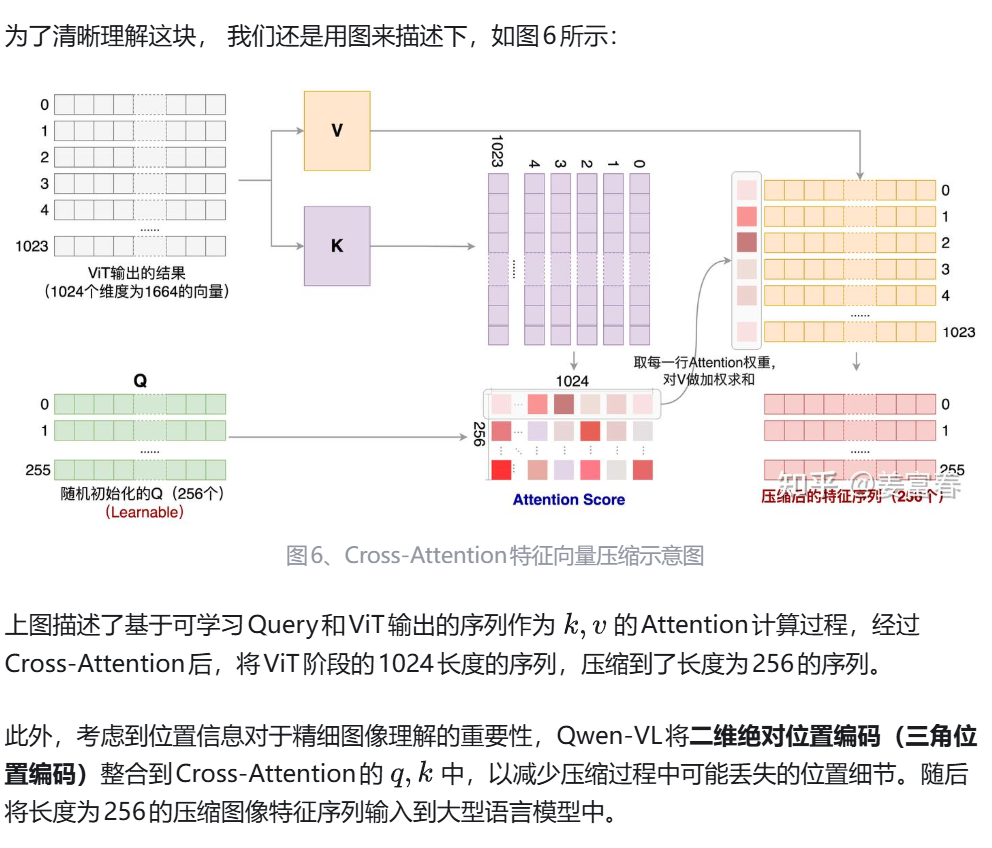
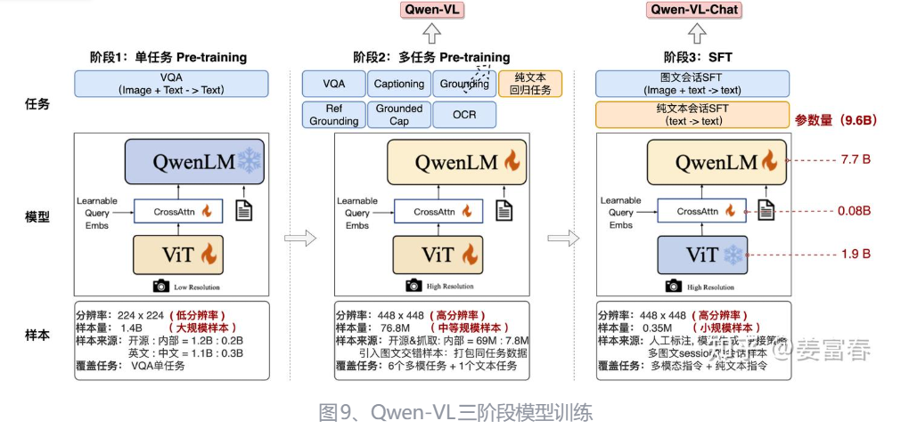

## Qwen-VL

## Qwen2-VL

将影射层改为了mlp

- **采用原生动态分辨率：单一分辨率 -> 任意分辨率，** Qwen-VL模型输入只接受单一分辨率的图片，Qwen2-VL可输入不同分辨率的图像，避免了Vision数据适配单一分辨率而导致的失真问题。
- **Vision Encoder位置编码：绝对位置编码 -> 相对位置编码**，从二维三角位置编码升级到二维RoPE位置编码，RoPE对长序列有更好的泛化能力，有利于提升对长序列Vision特征的建模能力
- **LLM主体模型位置编码**：**1D->3D RoPE**，引入多模态旋转位置编码技术（M-RoPE），刻画多模态(时序、高、宽)三维数据。进一步提升对时空数据的建模能力。
- **统一多模态数据： 单图片 -> 统一图片和视频，**统一框架处理图片和视频数据，进一步提升对真实世界认知和理解能力
- **训练数据： 1.4B -> 1.4T**，数据量提升了3个量级，同时数据覆盖了多领域任务。

Qwen2-VL采用了一种更简单的压缩方法：对空间位置临近的patch 特征做拼接，再经过2层MLP线性变换，这样将原来长度为 的序列，可压缩到 ，最终将压缩后的特征序列输入给LLM模型

## Qwen2.5-VL

