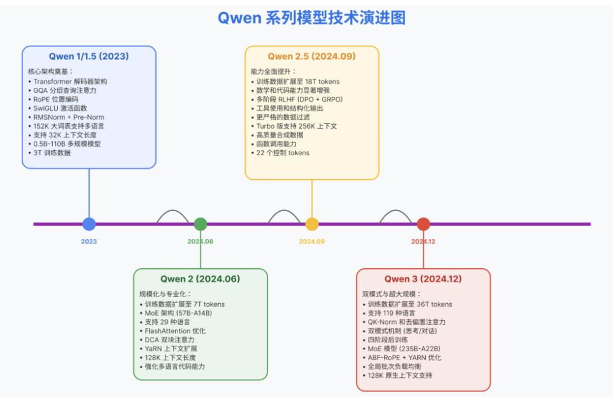

[一文通透Qwen LLM系列——从Qwen、Qwen1.5、Qwen2、Qwen2.5到Qwen3(融合了chat和推理)、Qwen3 MoE_qwen3 1.5b-CSDN博客](https://blog.csdn.net/v_JULY_v/article/details/150444999)

## Qwen1.5

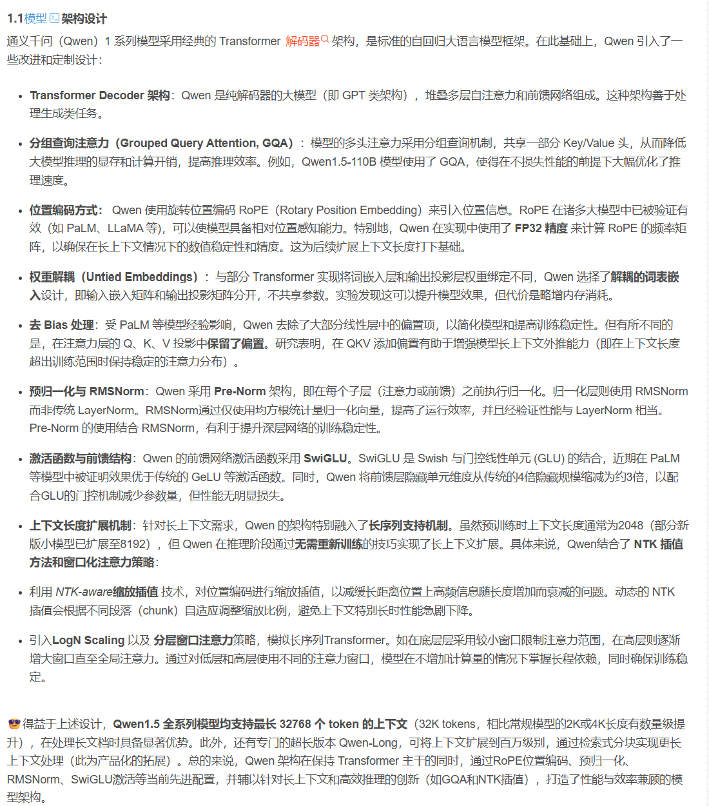

### **Qwen2**

moe,更细粒度的专家，少专家大参数 -> 多专家小参数  细粒度更高，组合更多  同时有个共享专家和路由专家

数据合成：拒绝采样，数学问题 先ruble base验证结果，再看推理链路  代码问题：执行反馈


### Qwen2.5

**Rmsnorm:训练稳定性**

**GQA、SwiGLU、pre-normalization**

**两阶段预训练sft**:  

step1:4096长度文本  

 step2:   32768长文本

**多阶段rl**: 

**off-policy dpo**  :  用sft之后的模型采样 chosen和rejected   **培养奖励模型难以评估的能力(思维链)**

这一阶段侧重于发展**奖励模型难以评估的能力，如推理、事实性和跟随指令**。通过对训练数据的细致构建和验证，我们确保离线强化学习信号既可学习又可靠（Xiang 等，2024），使模型能够有效习得这些复杂技能。

**on-policy grpo** ： 用奖励模型评估

**在线强化学习阶段利用奖励模型检测输出质量细微差别的能力**，包括**真实性、帮助性、简洁性、相关性、无害性和去偏见**。它使模型能够生成精确、连贯且结构良好的响应，同时保持安全性和可读性。因此，模型的输出始终符合人类质量标准和期望。

### Qwen3

**引入qk-norm**：QK-Norm 是在自注意力机制中，对**Query(Q)\**与\**Key(K)\**向量显式执行归一化的技术，核心作用是\**约束注意力得分数值范围、缓解梯度不稳定、提升长上下文与混合精度训练的稳定性**

**多语言**

MOE架构没有用共享专家,共128个专家，每个token激活8个专家

**三阶段预训练**：

1、**general state**：**提升通用的理解能力**

2、**reasoning state**: **提升推理能力，在代码、推理数据上进行**

3、**长上下文数据**，提高rope的频率从10,000到1000,000，使用**yarn**和**DCA**(Dual Chunk Attention)

**旗舰模型4阶段后训练阶段**：

1、**长思维链冷启动 掌握初步推理能力**  ： 1、**难度均衡**：排除很难或者很简单的，**排除答案对，但是思考过程不对的。**  2、**领域均衡**

2、**推理RL GRPO**  ： **使用对于冷启动阶段得到的模型，是可学习的数据，也不能太难**

3、**为了融合模型在快慢模式上的思考能力  SFT 推理数据和非推理数据，有了思维预算的能力**

4、**通用RL**  ： **指令遵循 、 格式遵循**  ： 奖励来自：   1、**rule base的奖励** 2、**将参考答案以及模型的答案给一个比较好的模型判断，是否正确** 3、**偏好对训出来的奖励模型**

通用小模型后训练(**强弱蒸馏**)：

1、**off-policy ：教师模型产生think和非think数据，进行sft**

1、**on-policy:  学生模型生成输出→对齐教师模型的概率分布（通过 KL 散度约束）**

主要为了解决think control 和 蒸馏小模型


## Qwen3-Next

【闭关两周半，完全从零开始实现Qwen3-Next模型（参数60M，线性注意力GatedDeltaNet），从架构原理到代码实现，绝对是你能找到的最详细的讲解】https://www.bilibili.com/video/BV1f8sdziERA?vd_source=c5c396652c0c83be15efe54e0c348c90

【【技术前沿】Qwen3-Next-80B架构详解，线性注意力革命,下一代Attention模型已来！采用稀疏的MOE架构！通义大模型 AI大模型  qwen3】https://www.bilibili.com/video/BV1k9pqznEEz?vd_source=c5c396652c0c83be15efe54e0c348c90

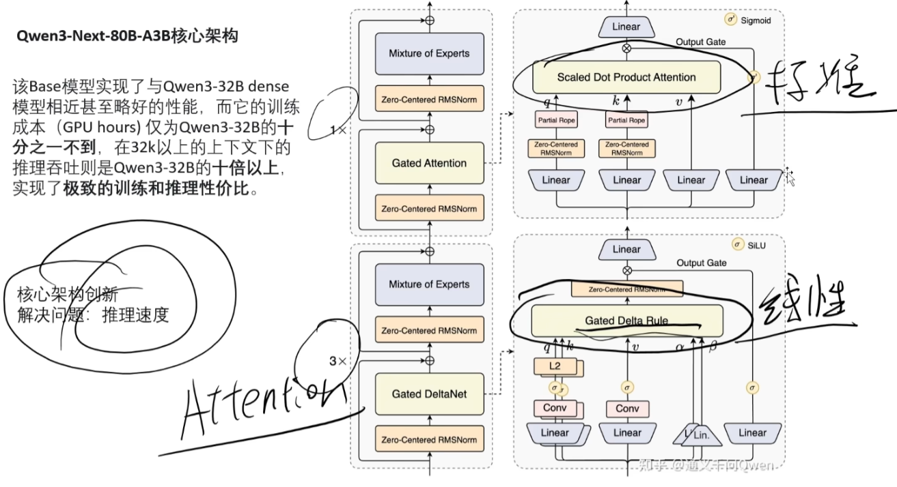

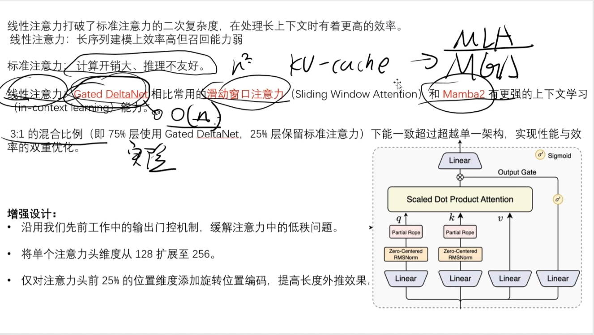

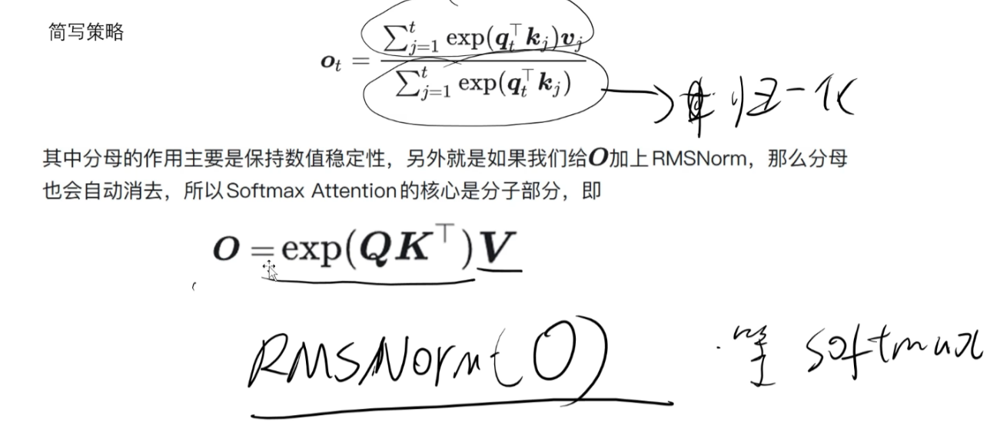

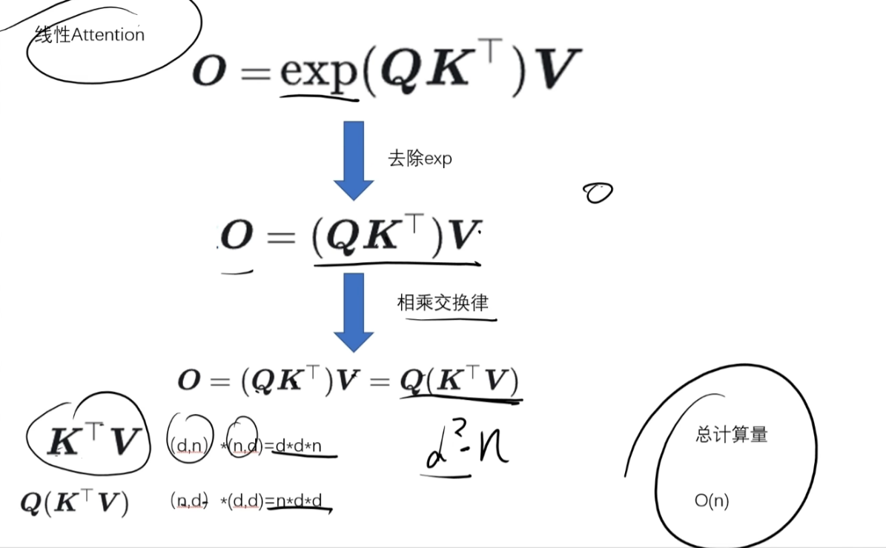

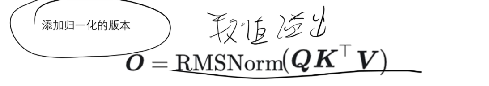

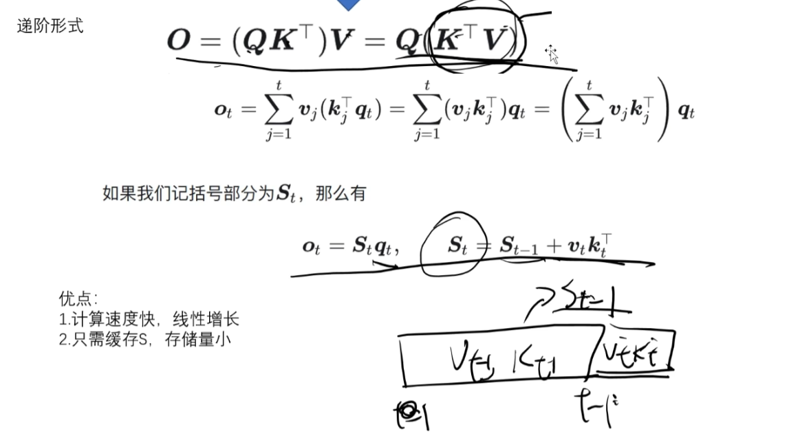

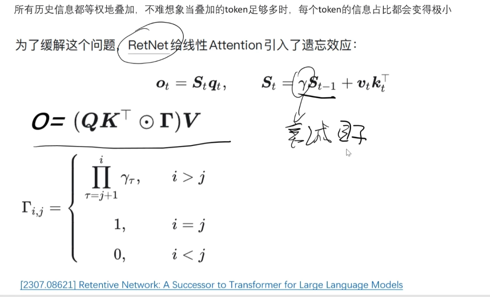


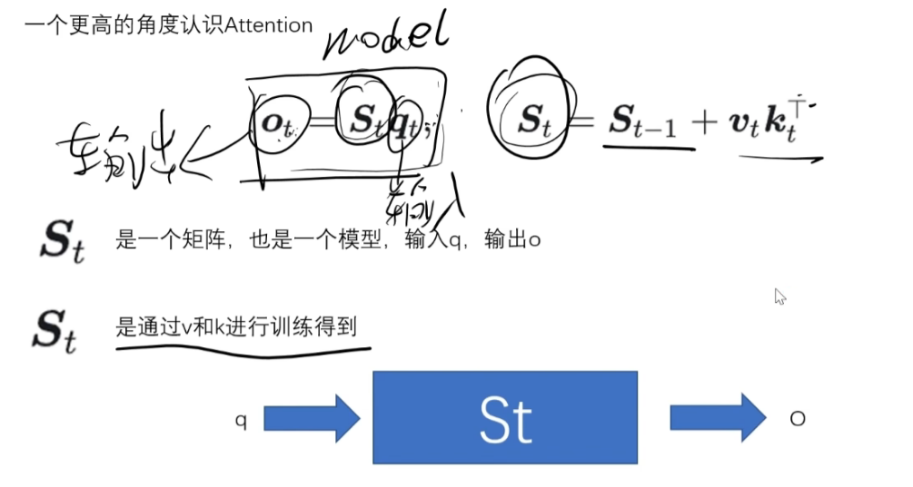

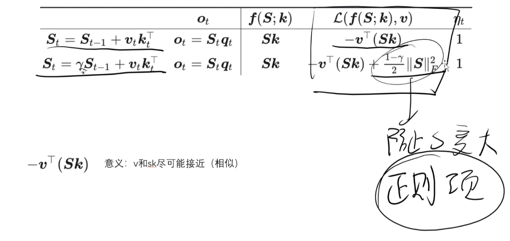

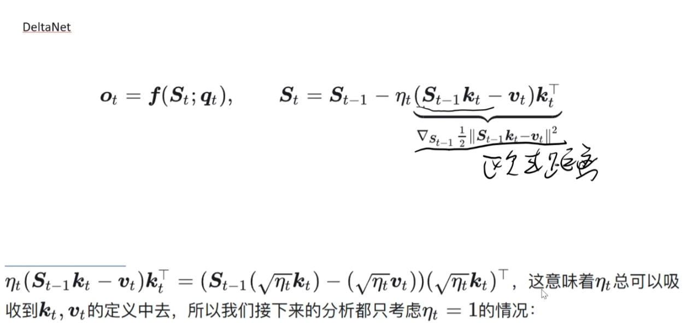

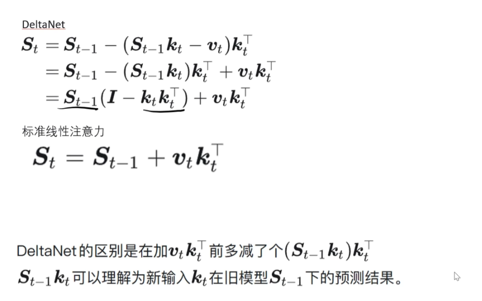

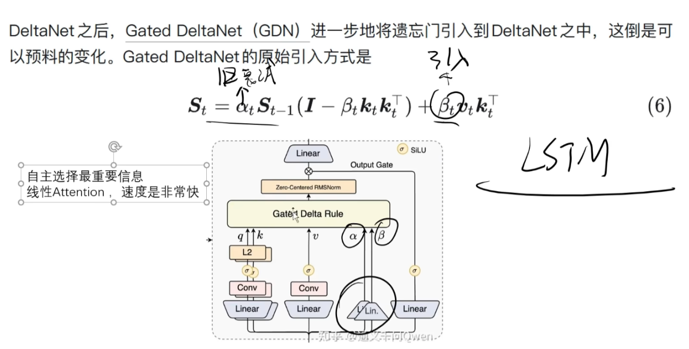

QWEN3.5

- **混合层架构**：注意力使用了 [Qwen3-Next](https://zhida.zhihu.com/search?content_id=270285706&content_type=Article&match_order=1&q=Qwen3-Next&zhida_source=entity) 里的混合层架构，每3层线性注意力插入1层标准注意力
- **[Gated Attention](https://zhida.zhihu.com/search?content_id=270285706&content_type=Article&match_order=1&q=Gated+Attention&zhida_source=entity)**：全注意力和线性注意力都引入了Qwen3-Next 中的门控机制。其中线性注意力采用了[DeltaNet](https://zhida.zhihu.com/search?content_id=270285706&content_type=Article&match_order=1&q=DeltaNet&zhida_source=entity)
- **原生多模态**：大概率从预训练开始使用了视觉数据

[(15 条消息) 【LLM】Qwen3.5解剖 - 知乎](https://zhuanlan.zhihu.com/p/2005306558997882654)

[(4 条消息) Qwen3.5源码逻辑与模型架构 - 知乎](https://zhuanlan.zhihu.com/p/2006241509226350575)

```python
def torch_recurrent_gated_delta_rule(
    query,               # Q矩阵，维度[b, s, 32, 128], 32是head num，128是Head Dim
    key,                 # K矩阵，维度[b, s, 32, 128], 32是head num，128是Head Dim
    value,               # V矩阵，维度[b, s, 32, 128], 32是head num，128是Head Dim
    g,                   # 门控衰减因子，维度[b, s, 32], 32是head num
    beta,                # 逐token衰减权重，维度[b, s, 32], 32是head num
    initial_state,       # 初始递归状态，维度[b, 32, 32, 32],在自回归推理中表示每个Layer初始状态
    output_final_state,  # 是否输出当前Layer最终递归状态（流式推理需返回，用于下一轮增量计算）
    use_qk_l2norm_in_kernel=False,  # 是否对Q/K做L2归一化，提升数值稳定性
):
    # 保存输入的原始数据类型（通常是fp16/bf16），最后还原以保证精度一致
    initial_dtype = query.dtype
    
    # 可选：对Q/K做L2归一化，避免QK^T（或递归状态）数值爆炸，提升注意力核稳定性
    if use_qk_l2norm_in_kernel:
        query = l2norm(query, dim=-1, eps=1e-6)  # 对每个token的每个head的128个特征做归一化
        key = l2norm(key, dim=-1, eps=1e-6) # 同上
    
    
    # 1. transpose(1,2)：[b, s, 32, 128] → [bs, 32, s, 128]
    # 2. contiguous()：保证张量内存连续，避免后续计算报错
    # 3. to(torch.float32)：低精度（fp16/bf16）下指数/矩阵乘易数值不稳定，转float32计算
    query, key, value, beta, g = [
        x.transpose(1, 2).contiguous().to(torch.float32) for x in (query, key, value, beta, g)
    ]

     # 获取核心维度：batch_size=批大小，num_heads=头数，sequence_length=序列长度，k_head_dim=K的头维度
    batch_size, num_heads, sequence_length, k_head_dim = key.shape
    v_head_dim = value.shape[-1]  # V的每个head的维度（可与K不同）
    
    # Attention标准缩放因子：1/√d_k，防止Q的数值过大导致递归状态爆炸
    scale = 1 / (query.shape[-1] ** 0.5)
    query = query * scale  # 对所有Q做缩放,这与传统的self-Attention中一致。


    # 初始化注意力输出张量：维度[b, 32, s, 128]，初始值全0
    core_attn_out = torch.zeros(batch_size, num_heads, sequence_length, v_head_dim).to(value)
    
    # 初始化递归状态（保存历史K/V的加权信息，避免计算全局QK^T）：
    # - 若initial_state为None：首次计算时初始化为全0张量，维度[b, 32, 128, 128]
    # - 若initial_state不为None：自回归推理中复用前一轮（其实是上一个Token推理）的最终状态，实现增量计算
    last_recurrent_state = (
        torch.zeros(batch_size, num_heads, k_head_dim, v_head_dim).to(value)
        if initial_state is None
        else initial_state.to(value)
    )

    # 遍历每个token（时序维度），仅依赖当前及之前token
    for i in range(sequence_length):
        q_t = query[:, :, i]          # [b, 32, 128]：第i个token的Q
        k_t = key[:, :, i]            # [b, 32, 128]：第i个token的K
        v_t = value[:, :, i]          # [b, 32, 128]：第i个token的V
        # g_t：第i个token的门控衰减因子，exp()将线性衰减转为指数衰减
        # .unsqueeze(-1).unsqueeze(-1)将g_t的Shape扩展为[b, 32, 1, 1]（方便与递归状态矩阵做广播相乘）
        g_t = g[:, :, i].exp().unsqueeze(-1).unsqueeze(-1)
        # beta_t：第i个token的逐token衰减系数，unsqueeze适配V的维度
        # .unsqueeze(-1)将beta_t的Shape变换为[b, 32, 1]（方便和xx广播相乘）
        beta_t = beta[:, :, i].unsqueeze(-1)

        # 核心逻辑：历史Token状态随Token生成，做指数级衰减，避免远的历史Token信息占比过高
        # last_recurrent_state: [b, 32, 128, 128]
        last_recurrent_state = last_recurrent_state * g_t

        # 1. k_t.unsqueeze(-1)：将k_t的Shape变换为[b, 32, 128, 1]
        # 2. last_recurrent_state * k_t.unsqueeze(-1)：广播相乘，提取历史状态中与当前K匹配的部分
        # 3. sum(dim=-2)：对k_head_dim维度求和，得到[b, 32, v_head_dim]，v_head_dim是128
        kv_mem = (last_recurrent_state * k_t.unsqueeze(-1)).sum(dim=-2)

    
        # 核心逻辑：delta = (当前V - 历史V贡献) × 逐token衰减系数beta_t
        # 物理意义：只保留当前V中“未被历史信息覆盖的新内容”，beta_t控制新内容的权重
        delta = (v_t - kv_mem) * beta_t  # [b, 32, v_head_dim]， v_head_dim是128

    
        # 1. k_t.unsqueeze(-1)：将k_t的Shape变换为[b, 32, k_head_dim, 1], k_head_dim也是128
        # 2. delta.unsqueeze(-2)：将delta的Shape变换为[b, 32, 1, v_head_dim]
        # 3. 外积运算：k_t ⊗ delta → [b, 32, k_head_dim, v_head_dim]
        # 4. 更新得到当前的递归状态，这个递归状态可以理解为K*V，就是历史Token对于生成当前Token的累加贡献
        last_recurrent_state = last_recurrent_state + k_t.unsqueeze(-1) * delta.unsqueeze(-2)

        # 1. q_t.unsqueeze(-1)：将输入q的Shape变换为[b, 32, k_head_dim, 1]
        # 2. last_recurrent_state * q_t.unsqueeze(-1)：广播相乘 
        # 3. sum(dim=-2)：对k_head_dim维度求和，得到[b, 32, v_head_dim]
        # 物理意义：当前Q对历史所有K/V加权和的“查询结果”，等价于标准Attention的Q×(KV^T)
        core_attn_out[:, :, i] = (last_recurrent_state * q_t.unsqueeze(-1)).sum(dim=-2)

    # 若不需要输出最终递归状态（非流式推理），置为None以节省显存
    if not output_final_state:
        last_recurrent_state = None
    
    # 维度还原：transpose(1,2) → [b, s, 32, v_head_dim]（回到输入的维度顺序）
    # contiguous()：保证内存连续；to(initial_dtype)：还原为原始精度（fp16/bf16）
    core_attn_out = core_attn_out.transpose(1, 2).contiguous().to(initial_dtype)
    
    # 返回注意力输出 + 最终递归状态
    return core_attn_out, last_recurrent_state
```


