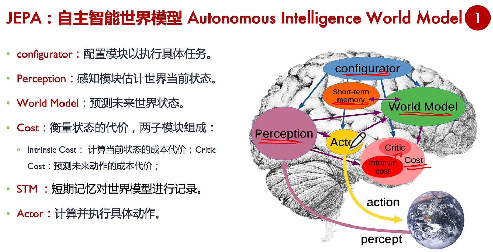
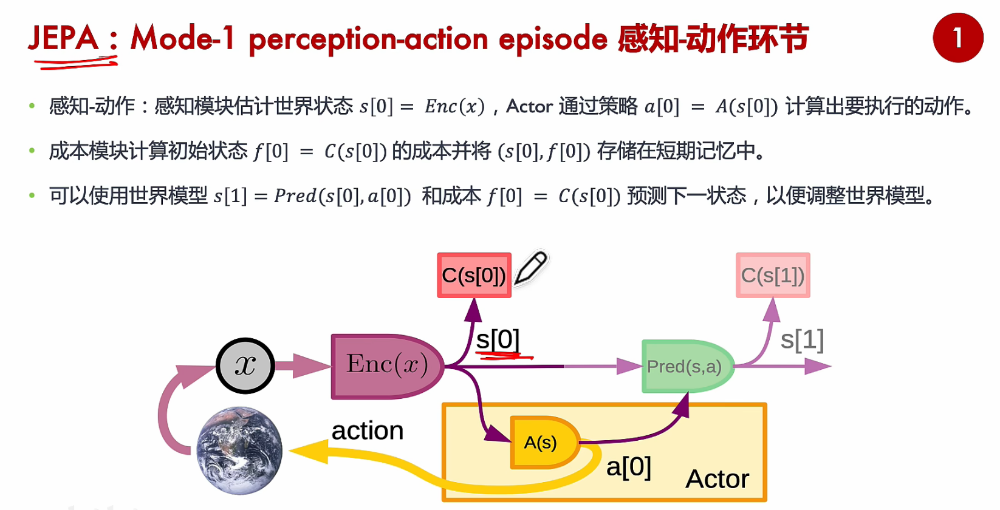
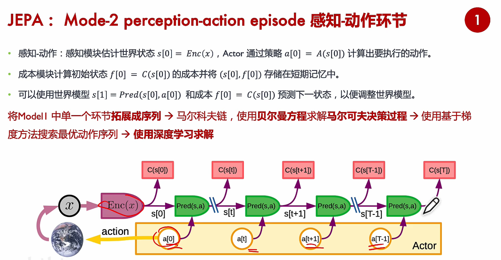

【Yann Lecun主推JEPA世界模型详细解读 #大模型 #世界模型 #sora】https://www.bilibili.com/video/BV1v1421Q73e?vd_source=c5c396652c0c83be15efe54e0c348c90

[JEPA：联合嵌入预测架构介绍 ——学习笔记_jepa架构-CSDN博客](https://blog.csdn.net/Luu_uu_uu/article/details/159320508)

