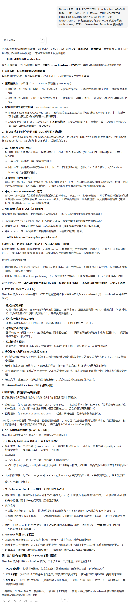
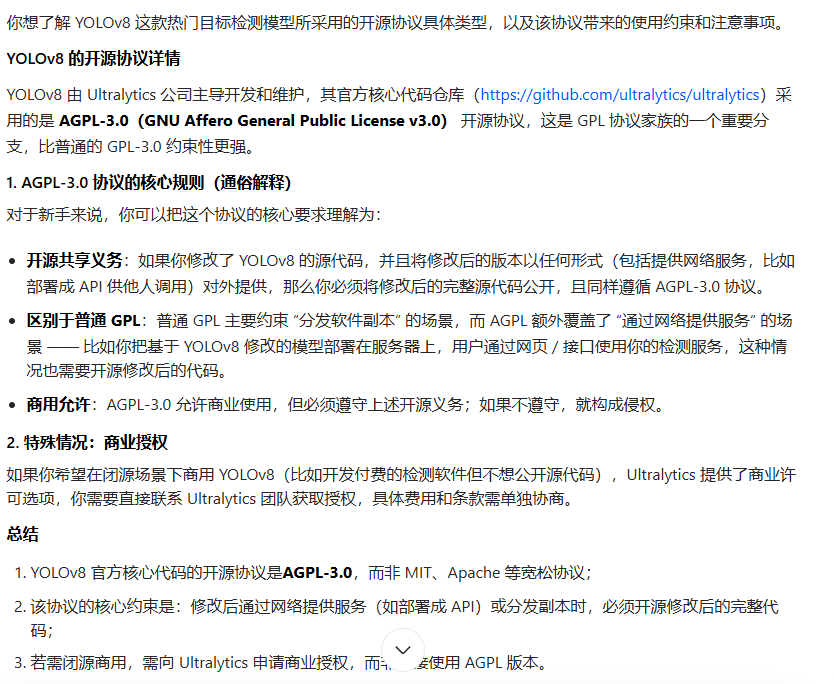

[【论文精读】EfficientNetv1：卷积神经网络模型缩放的再思考（Rethinking Model Scaling for Convolutional Neural Networks）_efficientnet: rethinking model scaling for convolu-CSDN博客](https://blog.csdn.net/J_oshua/article/details/137966329)

[EfficientNet网络结构详细解读+SE注意力机制+pytorch框架复现-CSDN博客](https://blog.csdn.net/J_oshua/article/details/138583004)

efficientnet :30mb左右

nanodet:15mb左右

Nanodet

YOLO开源协议

