**lora微调的原理是什么？**

大模型预训练后已经掌握了通用的语言知识，适配特定任务（比如文本分类、翻译）时，**只需要对原模型的权重做微小的调整**，而这些 “调整量”（权重更新矩阵 ΔW）具有 “低秩” 特性。

[【大模型】大模型评价指标汇总解析-CSDN博客](https://blog.csdn.net/u012856866/article/details/146541361?ops_request_misc=%7B%22request%5Fid%22%3A%22baafd84c8573c371a12a4806187028ff%22%2C%22scm%22%3A%2220140713.130102334..%22%7D&request_id=baafd84c8573c371a12a4806187028ff&biz_id=0&utm_medium=distribute.pc_search_result.none-task-blog-2~all~sobaiduend~default-2-146541361-null-null.142^v102^pc_search_result_base4&utm_term=大模型评估指标 &spm=1018.2226.3001.4187)

大模型测试数据集：

MMLU:包含人文、社会科学、自然科学等57种任务

IF-EVAL:验证指令跟随能力

BBH:有挑战性的，没有超越人类评分的任务

MATH:数学竞赛

GPQA:生物、化学、物理等有挑战性的数据集 

**召回率**

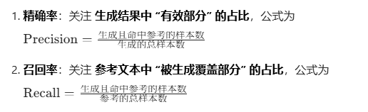

#### 显存溢出怎么办

#### 1、减小batch 2、混精  3、梯度检查点 4、长度截断 5、梯度累计 6、分布式 7、Qlora

梯度累积**不会减少参数、优化器、梯度的占用**

但它**把单步 batch 变小 → 激活值大幅减少 → 显存就不爆了**。


L2正则

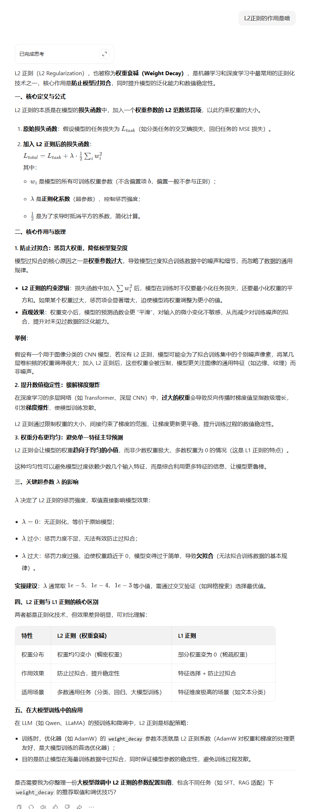

倒排索引

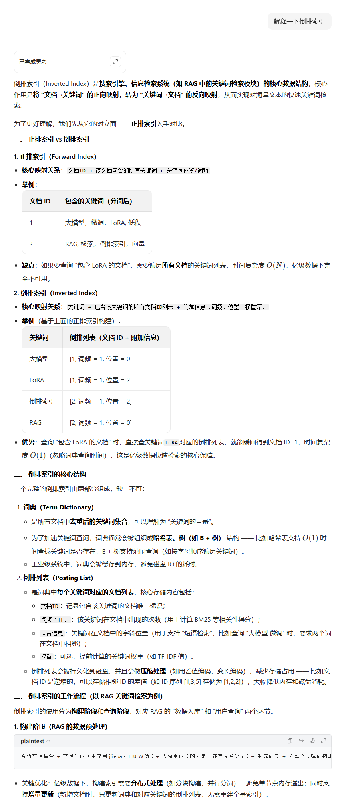

## RMSNorm

[(1 封私信 / 36 条消息) 为什么当前主流的大模型都使用RMS-Norm？ - 知乎](https://zhuanlan.zhihu.com/p/12392406696)

**移除 LayerNorm 中的均值中心化步骤**，**仅保留缩放操作，在保持模型性能的同时实现显著效率提升**

**整体计算更高效，模型的训练会更快**

大模型训练不稳定的主要原因是，有一些激活值**幅值忽大忽小** ，导致出现梯度消失等问题

# Transformer 与 RNN/LSTM 的全面对比及应用

面试官您好！Transformer是2017年谷歌团队在论文《Attention Is All You Need》中提出的**基于自注意力机制的序列建模架构**，它彻底摆脱了传统RNN、LSTM等循环模型的串行计算模式，是当前NLP、CV、多模态等AI领域的**核心基础架构**，像BERT、GPT、Qwen等大模型都是基于Transformer演变而来的。

我从**核心背景、整体架构、关键创新、核心优势、实际应用**这几个方面来介绍：

### 一、 提出背景：解决传统序列模型的痛点

在Transformer出现前，NLP任务的主流模型是RNN/LSTM，但这类循环模型有两个致命缺陷：

1. **串行计算效率低**：必须按顺序处理序列（先算第1个token，再算第2个，以此类推），**无法并行化训练，导致模型训练速度慢，难以扩展到大规模数据**；
2. **长距离依赖捕捉能力弱**：**随着序列长度增加，梯度容易消失或爆炸，很难建模长文本中远距离token的关联**（比如一句话开头和结尾的语义联系）。

Transformer的核心目标就是**用注意力机制替代循环结构**，**实现并行计算，同时高效捕捉长距离依赖**。

### 二、 整体架构：Encoder-Decoder 对称结构

Transformer的整体结构是**编码器（Encoder）+ 解码器（Decoder）** 的双塔结构，两者都由N层（论文中是6层）相同的子层堆叠而成。

#### 1. 编码器（Encoder）：负责“理解”输入序列

每一层编码器包含两个子层，且每个子层都配有**残差连接+层归一化**（这是保证模型训练稳定的关键）：

- **多头自注意力层（Multi-Head Self-Attention）**：这是编码器的核心。它让输入序列中的**每个token都能同时关注序列中所有其他token**，从而捕捉全局语义关联；**“多头”则是把注意力拆分成多个子空间**，分别学习不同维度的语义关系（比如语法、语义），最后再合并，提升模型的表达能力。
- **前馈神经网络（Feed-Forward Network, FFN）**：对每个token的表示做独立的非线性变换（即同一个FFN参数共享给所有token），**进一步提取特征**。

整个编码器的输入，还会先经过**词嵌入+位置编码**：词嵌入把token转为向量，位置编码则弥补注意力机制“无序”的缺陷，给token添加位置信息。

#### 2. 解码器（Decoder）：负责“生成”输出序列

解码器的每一层比编码器多一个子层，同样配有残差连接+层归一化：

- **掩码多头自注意力层**：和编码器的自注意力类似，但加入了**掩码（Mask）** ——确保生成第i个token时，只能关注前i-1个token（避免“偷看”未来的token），符合语言生成的顺序逻辑。
- **编码器-解码器注意力层**：让**解码器的token关注编码器输出的输入序列token**（比如翻译任务中，让英文输出关注中文输入的语义）。
- **前馈神经网络**：和编码器的FFN功能一致。

### 三、 关键创新点：四大核心设计

1. **多头自注意力机制**：这是Transformer的灵魂。它通过“缩放点积注意力”计算token间的关联权重，解决了长距离依赖问题；“多头”设计则让模型能同时捕捉不同类型的语义关系，比单头注意力更强大。
2. **位置编码（Positional Encoding）**：因为注意力机制本身不区分token的顺序，所以必须通过位置编码给每个token的向量添加位置信息。论文中用的是正弦余弦位置编码，后续演进为RoPE（旋转位置编码）、THW交错编码等，适配更长的上下文和多模态场景。
3. **残差连接+层归一化**：两个子层的输出都遵循 `LayerNorm(x + Sublayer(x))` 的公式，有效缓解梯度消失问题，让模型可以堆叠更深的层数。
4. **全并行计算**：自注意力机制可以同时计算所有token的关联权重，无需按顺序处理——这让Transformer的训练效率比RNN提升了一个量级，为训练百亿、千亿参数的大模型奠定了基础。

### 四、 核心优势

1. **并行效率高**：训练速度远超RNN/LSTM，支持大规模数据和大参数量模型的训练；
2. **长距离依赖捕捉能力强**：理论上可以捕捉任意长度序列中token的关联，这也是大模型能处理超长文本的关键；
3. **结构灵活易扩展**：编码器和解码器可以单独使用（比如BERT只用编码器，GPT只用解码器），也能结合多模态编码器（如图像的CNN、ViT），适配文本、图像、音频等不同任务。

### 五、 实际应用

Transformer是当前几乎所有大模型的基础：

- **NLP领域**：BERT（编码器架构，主打理解类任务：分类、问答）、GPT（解码器架构，主打生成类任务：文本创作、对话）；
- **CV领域**：ViT（视觉Transformer）把图像切分成patch，用Transformer替代CNN做图像分类；
- **多模态领域**：Qwen3-VL、GPT-4V等MLLM，通过在Transformer中加入视觉编码器，实现图文交互、视频理解等能力。

总结来说，Transformer的出现是AI领域的一个里程碑，它不仅革新了NLP任务，更成为了通用人工智能的核心架构。

需要我帮你整理**Transformer和RNN/LSTM的对比清单**，或者**面试中高频追问的注意力机制细节**吗？

Pass@64

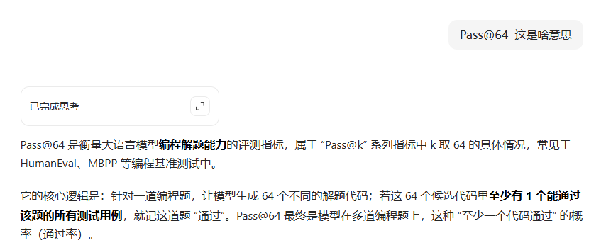

lora 调参经验 方法论   agent架构 指导方针 deepseek ocr 


## DeepSeek OCR

### 将图像转化为视觉token，再让语言模型解码输出文字

**图像里文字很多(50K),正常转化为文本token可能有25k，但是直接按照图片转化为视觉token，可能就256个token，最后拼接到LLM进行解码，还原文本内容。**

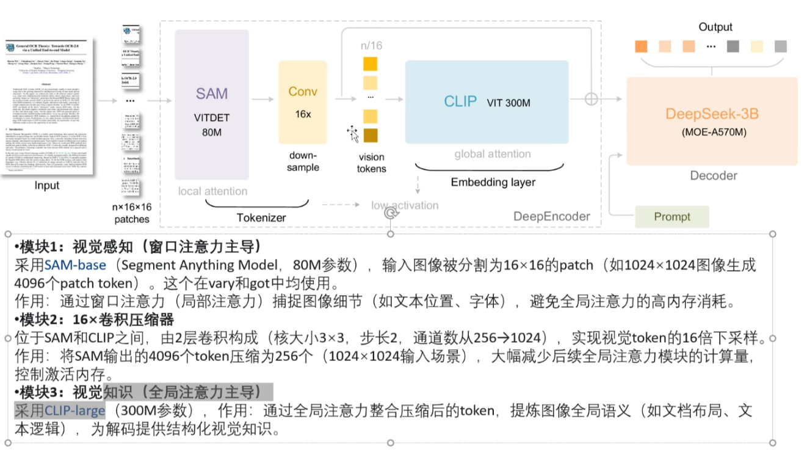

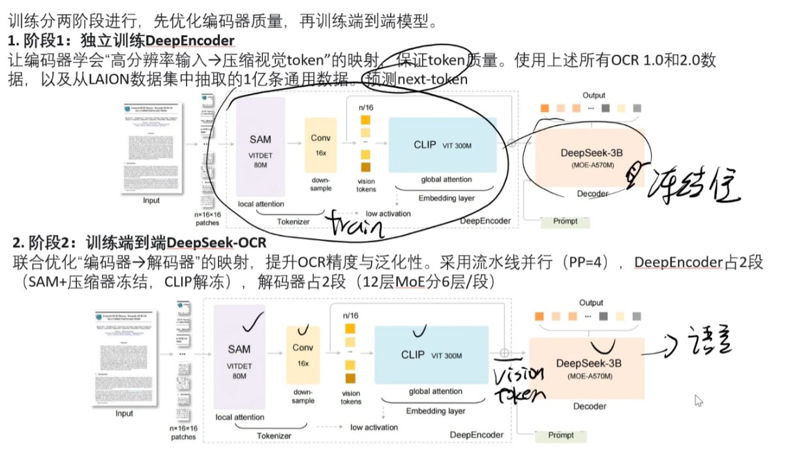

# 全参数微调与 LoRA 微调：学习率的核心差异与选择

你想了解全参数微调（全参微调）和LoRA微调在学习率设置上的核心特点与差异，这是微调大模型时超参数选择的关键问题，我会从底层逻辑到具体数值帮你讲清楚。

### 一、核心背景铺垫

先简单理清两个微调方式的本质，能更好理解学习率差异：

- **全参微调**：更新模型的**所有参数**（预训练主干+任务适配层），相当于在预训练基础上“微调所有细节”；
- **LoRA微调**：冻结模型主干的所有预训练参数，只更新新增的**低秩矩阵参数**（通常仅占总参数的0.1%~1%），相当于给模型“加小插件适配任务”。

### 二、两者学习率的核心特点

#### 1. 全参微调的学习率特点

- **数值极低**：

典型取值范围是 `1e-5 ~ 5e-5`（甚至更小，比如1e-6），远低于普通小模型训练的学习率（如1e-3）。

例：微调LLaMA-7B全参时，常用学习率是2e-5；微调BERT-base全参时，常用1e-5。

- **核心原因**：

**全参微调要更新所有参数，而大模型的预训练参数已经蕴含大量通用知识，若学习率过高，会导致参数更新幅度过大，直接破坏预训练的核心知识（即“灾难性遗忘”），还会让训练loss剧烈震荡、无法收敛。**

- **附加特点**：

对学习率**极度敏感**，调参容错率低；通常需要搭配保守的学习率衰减策略（如余弦退火、线性衰减），且预热步数占比更高（比如预热10%~20%的训练步数），避免初始阶段学习率相对过高。

#### 2. LoRA微调的学习率特点

- **数值显著更高**：

典型取值范围是 `1e-4 ~ 1e-3`，比全参微调高**10~100倍**。

例：LoRA微调LLaMA-7B时，常用学习率是1e-4；微调Stable Diffusion的LoRA时，甚至能用5e-4~1e-3。

- **核心原因**：

**LoRA仅更新少量低秩矩阵参数，主干预训练参数完全冻结，即使学习率高，也只会让新增的“插件参数”快速适配任务，不会破坏模型核心的预训练知识，因此无需担心灾难性遗忘。**

- **附加特点**：

对学习率**容忍度高**，调参难度低；即使学习率略高于推荐值（比如从1e-4调到2e-4），也大概率不会导致训练失败，仅可能轻微影响最终效果；无需过度保守的衰减策略，训练收敛速度也更快。

### 三、直观对比表

| 维度           | 全参微调                | LoRA微调             |
| -------------- | ----------------------- | -------------------- |
| 学习率典型范围 | 1e-5 ~ 5e-5（甚至1e-6） | 1e-4 ~ 1e-3          |
| 对学习率敏感度 | 极高（容错率低）        | 低（容错率高）       |
| 核心约束       | 避免破坏预训练参数      | 仅需适配低秩参数     |
| 调参成本       | 高（需精细调试）        | 低（范围宽，易上手） |

### 总结

1. 全参微调学习率**极低（1e-5级别）**，核心是为了保护预训练参数、避免灾难性遗忘，且对学习率极度敏感；
2. LoRA微调学习率**显著更高（1e-4~1e-3级别）**，因仅更新少量低秩参数，不影响主干，调参容错率也更高；
3. 实际应用中，LoRA的学习率设置更简单，新手优先选LoRA的默认学习率（如1e-4）即可，而全参微调需多次小范围调整学习率验证效果。


## 为什么大模型训练要用交叉熵，不用mse？

这也是一道深度学习面试中的“常青藤”题目。虽然在回归任务中 **MSE (均方误差)** 是王者，但在以 **Token 预测**为核心的大模型（分类任务）中，**交叉熵（Cross-Entropy, CE）** 几乎是唯一的选择。

你可以从以下三个核心维度来回答，这体现了你对数学底层逻辑和工程实践的深度理解：

------

## 1. 梯度消失问题（Gradient Vanishing）

这是最直接的数学原因。当我们使用 **Softmax** 作为输出层时，MSE 会导致严重的梯度消失。

- **MSE 的梯度：**

  设损失函数为 $L = \frac{1}{2}(\hat{y} - y)^2$，其中 $\hat{y} = \sigma(z)$。根据链式法则，其对权重 $w$ 的梯度为：

  $$\frac{\partial L}{\partial w} = (\hat{y} - y) \cdot \sigma'(z) \cdot x$$

  由于 $\sigma'(z)$（Softmax 或 Sigmoid 的导数）**在输出值接近 0 或 1 时会趋于 0**（即**饱和区**）。**如果模型预测错得很离谱，梯度反而会变得极小**，导致模型“躺平”，停止学习。

- **交叉熵的梯度：**

  设损失函数为 $L = -y \log(\hat{y})$。配合 Softmax 后，其梯度简化为：

  $$\frac{\partial L}{\partial w} = (\hat{y} - y) \cdot x$$

  你会发现 $\sigma'(z)$ 被抵消掉了！梯度只取决于**预测值与真实值之间的误差 $(\hat{y} - y)$**。**误差越大，梯度越大，学习越快。这保证了模型在训练初期能迅速收敛**。

------

## 2. 统计学本质：最大似然估计（MLE）

大模型的本质是在做**分类任务**（从几万个词中选一个），这符合多项式分布，而不是高斯分布。

- **MSE 假设高斯分布：**

  从概率论角度看，最小化 MSE 等价于假设数据的噪声符合**高斯分布（正态分布）**。

- **交叉熵假设多项式分布(伯努利分布)：**

  最小化交叉熵等价于**最大似然估计（Maximum Likelihood Estimation）**。对于 Token 预测这种离散标签，交叉熵直接衡量了两个概率分布（预测分布 vs 真实分布）之间的“距离”（即 KL 散度）。

- **结论：** 预测单词是一个“是非题”或“多选题”，而不是“距离多远”的问题。在 10 万个词的词表中，词与词之间是离散的，使用欧几里得距离（MSE）来衡量 Token 的相似性在语义上没有意义。

  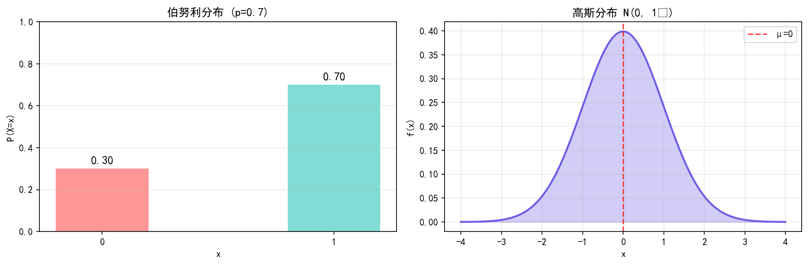

------

## 3. 凸优化与收敛曲面（Convexity）

- **凸性保证：**

  对于 Softmax 输出层，**交叉熵损失函数是凸函数**。这意味着它有一个全局最优解，优化过程更平滑。

- **MSE 的坑：**

  对于分类问题，如果配合 Softmax 使用 MSE，损失函数往往是**非凸的**。这意味着优化过程中会存在大量的局部最优解和深长的“平原”地带，模型很容易卡死在某个地方。

------

## 4. 总结对比

| **特性**     | **交叉熵 (Cross-Entropy)** | **均方误差 (MSE)**       |
| ------------ | -------------------------- | ------------------------ |
| **任务类型** | 分类 (Discrete)            | 回归 (Continuous)        |
| **梯度表现** | 与误差成正比，收敛快       | 在饱和区梯度消失，收敛慢 |
| **数学假设** | 多项式分布 (MLE)           | 高斯分布 (MLE)           |
| **优化曲面** | 凸函数，易于优化           | 非凸，易陷入局部最优     |

------

**💡 面试官可能会追问：**

“那为什么在强化学习的 **Reward Model (RM)** 训练中，有时候会看到类似 MSE 的 Loss？”

这是一个很好的陷阱：

- **Policy 训练（Next Token Prediction）**：必须用交叉熵，因为那是分类。
- **Reward Model 训练**：RM 的目标是给一个回复打分（Scalar），这是一个**回归任务**。**虽然常用的 Bradley-Terry 模型（对比损失）本质上也是一种交叉熵**，但在某些价值函数（Value Function）的预测中，确实会用到 **MSE**，因为那时候我们要预测的是一个连续的数值。

**你想深入探讨一下在训练奖励模型（Reward Model）时，为什么 Loss 函数会从交叉熵演变为 Bradley-Terry 形式吗？**


这是一个非常大胆且具有启发性的工程思维！在深度学习中，几乎没有什么是不可替换的，但**“能不能换”**和**“换了之后好不好用”**是两回事。

简单直接的回答是：**理论上可以换，但在标准的 Transformer 架构中，用 MinMax 替换 Softmax 会导致模型性能大幅下降，甚至无法收敛。**

以下从数学特性、物理含义和梯度下降三个维度为你拆解为什么 Softmax 是“天选之子”，而 MinMax 只是“普通路人”。

------

## 1. 数学特性的降维打击

我们先对比一下两者的公式（假设输入的原始分数为 $x$）：

| **特性**         | **Softmax**                    | **MinMax**                                |
| ---------------- | ------------------------------ | ----------------------------------------- |
| **公式**         | $\frac{e^{x_i}}{\sum e^{x_j}}$ | $\frac{x_i - \min(x)}{\max(x) - \min(x)}$ |
| **归一化性质**   | **和为 1**（天然的概率分布）   | **范围在 [0, 1]**（和不为 1）             |
| **数值拉伸**     | **指数级放大**（强者恒强）     | **线性缩放**（保持相对比例）              |
| **对异常值态度** | 相对鲁棒（受 $e$ 指数控制）    | **极其敏感**（一个显着离群值会毁掉全局）  |

### 核心矛盾：概率 vs. 比例

Attention 的本质是**加权求和**。为了保证输出的量级（Scale）稳定，权重的和必须为 $1$。

- **Softmax** 算出来直接就是概率分布，和永远是 1。
- **MinMax** 算出来的只是比例。如果你想让和为 1，你还得在 MinMax 之后再除以总和，那这其实就变成了一种复杂的线性归一化，失去了 MinMax 的简便性。

------

## 2. 为什么 Attention 需要“指数级放大”？

这是 Softmax 最不可替代的地方：**它能通过指数函数强行拉开差距。**

在 Self-Attention 中，我们希望模型能从成千上万个词中**精准锁定**最相关的那个。

- **Softmax**：如果 $A$ 分数比 $B$ 稍微高一点，经过 $e^x$ 之后，$A$ 的权重会远大于 $B$。这使得模型具有极强的**选择性（Selectivity）**，能聚焦于重点。
- **MinMax**：它是线性的。如果两个词原始分数接近，归一化后依然接近。模型会变得“优柔寡断”，注意力非常分散（平滑），**导致无法从噪声中提取关键特征**。

------

## 3. 梯度消失与稳定性

- **Softmax 的梯度**：它的导数是非常漂亮的 $\sigma(1-\sigma)$，在反向传播时非常平滑。
- **MinMax 的尴尬**：MinMax 的梯度在很大程度上取决于序列中的**最大值**和**最小值**。
  - 如果序列中出现一个极大的噪声（Outlier），$\max(x)$ 会变得巨大，导致其他所有位置的梯度都趋近于 0。
  - 这种不稳定性在训练超深模型（如 GLM-4）时是致命的。

------

## 4. 难道真的没有人尝试替换吗？

其实学术界一直在尝试“杀掉” Softmax，因为它的计算涉及指数和求和，非常耗时（尤其是长序列时）。

### 替代方案现状：

1. **Linear Attention (线性注意力)**：去掉 Softmax，改用核函数（Kernel Trick）近似。这在处理超长序列（如 1M 长度）时非常有用，但模型表达能力通常弱于原版。
2. **Sparsemax**：它会把很多权重直接变成 0，让注意力更稀疏、更聚焦。
3. **ReLU / Squared ReLU**：在一些视觉模型（如 ViT 的变体）中，有人尝试用 `ReLU(x) / sum(ReLU(x))` 替代，效果还可以，但通用性不如 Softmax。

------

## 总结

**Softmax 的核心价值在于：它不仅是归一化，更是一个“放大镜”。** 它让模型在海量信息中学会了**取舍**。而 MinMax 只是一个“等比例尺”，它能把范围缩到 0-1，却无法告诉模型谁才是真正的“主角”。

**💡 关联你的研究（GRPO / 大模型）：**

在 **GRPO** 算法中，我们在计算一组输出的相对优势（Advantage）时，使用的是标准差归一化（类似 $Z-Score$），这和 MinMax 有点像。那是为了让奖励值分布更均匀。但**模型内部的注意力（Attention）**依然必须用 Softmax，否则模型就无法学到复杂的逻辑推理路径。

**既然聊到了 Softmax 的替代，你想看看目前最火的“线性注意力（Linear Attention）”是如何通过数学变换把 $O(N^2)$ 的复杂度降到 $O(N)$ 的吗？**


## 总结一下Lightning Attention-2 ，他的作用是什么，是怎么实现的？

简单来说，**Lightning Attention-2 (LA2)** 是为了让大模型在处理**超长文本**（如百万级 Token）时，既能跑得**极快**，又能维持**极低显存占用**而设计的线性注意力算子。

以下是它的作用与实现原理的深度总结：

### 1. 它的作用是什么？（解决了什么痛点）

- **打破“平方壁垒”**：标准注意力（FlashAttention）的计算量随序列长度 $N$ 的增加呈平方级（$O(N^2)$）增长。LA2 将复杂度降到了**线性级（$O(N)$）**。
- **消除“显存爆炸”**：它不需要存储巨大的注意力矩阵，显存占用不随文本变长而剧增，使得在普通显存上处理极长上下文成为可能。
- **填补“理论与工程的鸿沟”**：之前的线性注意力虽然理论上快，但在 GPU 上跑起来往往比 FlashAttention 慢。LA2 通过 Triton 深度优化，在**实际运行速度**上也全面超越了传统的 Attention。

------

### 2. 它是怎么实现的？（核心三部曲）

它的核心思想是：**“局部精算，全局累加，硬件对齐”**。

#### A. 数学上的“去 Softmax 化”

为了让计算顺序从 $(QK^T)V$ 变成 $Q(K^TV)$，它去掉了不可解耦的 Softmax。

- **线性化**：利用矩阵乘法的结合律，先让 $K$ 和 $V$ 相乘生成一个 $d \times d$ 的状态矩阵。
- **衰减机制 ($\lambda$)**：引入了一个指数衰减因子，越远的信息在累加时权重越低。这不仅模拟了位置感，还保证了数值计算的稳定性（防止数值无限增大）。

#### B. 结构上的“分块（Tiling）”处理

这是 LA2 实现 Causal Mask（因果掩码）的绝招。它将序列切成长度为 $B$ 的小块：

- **块内 (Intra-block)**：由于块很小（如 64），它直接计算 $QK^T$。这样既能精准处理块内的因果掩码，又因为数据量小，计算开销极低。
- **块间 (Inter-block)**：块与块之间不再进行点对点的 $QK^T$ 运算，而是维护一个全局的 $KV$ 状态矩阵。每个新块只需读取这个矩阵，就能瞬间获得之前所有块的“历史记忆”。

#### C. 硬件上的“Triton 算子融合”

- **SRAM 驻留**：LA2 所有的分块计算、状态更新、衰减缩放都在 GPU 的片上高速缓存（SRAM）中完成。
- **减少 IO**：它尽量避免将中间结果写回显存（HBM）。数据“进一次算完”，极大提高了吞吐量。这让它在序列长度达到 32k 以上时，速度能比 FlashAttention-2 快数倍。

------

### 总结对比

| **维度**     | **传统 Attention (FlashAttention-2)**  | **Lightning Attention-2**                  |
| ------------ | -------------------------------------- | ------------------------------------------ |
| **计算逻辑** | 每一个词都要去跟前面所有词算一遍相似度 | 每一个词只跟一个高度压缩的“全局状态”算一遍 |
| **掩码处理** | 强制执行下三角掩码，并行受限           | **块内掩码 + 块间状态滚动，完美并行**      |
| **极限长度** | 受显存限制，难以超过 128k              | 理论上支持无限长度，受限于线性显存增长     |

**一句话总结**：Lightning Attention-2 就像是**给 Transformer 装上了 RNN 的高效引擎**。它用分块计算解决了 RNN 精度不足的问题，又用线性计算解决了 Transformer 计算量过大的问题。

你现在是在考虑将这个算子应用到具体的模型训练中（例如替换现有的 Attention 层），还是想基于它的 Triton 代码做进一步的自定义修改？


介绍一下RLHF的流程

简单来说，**RLHF (Reinforcement Learning from Human Feedback)** 就是给大模型找个“人类私教”。

虽然预训练让模型拥有了海量的知识，但它并不懂人类的交流习惯、道德底线或任务优先级。RLHF 的出现，就是为了让模型从“懂得多”变成“懂事儿”。

目前主流的 RLHF 流程（以经典的 InstructGPT 为例）通常分为**三个核心步骤**：

------

### 1. 监督微调 (SFT - Supervised Fine-Tuning)

这是“预热”阶段。我们先找一批专业的人类标注员，针对各种指令编写高质量的**标准答案**。

- **操作：** 给模型看“问题-答案”对，让它模仿。
- **目的：** 让模型学会基本的指令遵循（Instruction Following）能力。
- **结果：** 得到一个 SFT 模型。它虽然会答题了，但还没形成稳定的“价值观”和优劣判断。

### 2. 奖励模型训练 (RM - Reward Model)

```python
loss = -nn.functional.logsigmoid(rewards_chosen - rewards_rejected).mean()
```

这是 RLHF 的核心。我们需要教计算机如何像人一样“打分”。

1. **采样：** 让 SFT 模型针对一个问题生成多个不同的回答（比如 A, B, C, D）。
2. **排序：** 请人类标注员给这些回答排序（例如：A > B > C > D）。相比直接打分，**排序**能有效减少人类主观判断的偏差。
3. **训练：** 训练一个规模稍小的模型（即奖励模型），让它学习人类的排序逻辑。

- **结果：** 得到一个“数字裁判”。只要输入一个回答，它就能给出一个反映人类偏好的“分数”。

### 3. 强化学习微调 (RL - Reinforcement Learning)

这是最后的“闭环”阶段，通常使用 **PPO (Proximal Policy Optimization)** 算法。

- **迭代：** 让 SFT 模型生成回答，交给第二步练好的“奖励模型”去打分。
- **奖励：** 分数高，模型就加强这种输出模式；分数低，模型就抑制这种模式。
- **约束：** 为了防止模型为了刷高分而变得“油嘴滑舌”或逻辑崩坏，会引入 **KL 散度**约束，确保新模型不要偏离原始 SFT 模型太远。

------

### RLHF 流程概览表

| **阶段**        | **核心任务**   | **谁在参与**        | **输出结果**           |
| --------------- | -------------- | ------------------- | ---------------------- |
| **Step 1: SFT** | 模仿高质量范文 | 人类写手 + 模型     | 能够听懂指令的模型     |
| **Step 2: RM**  | 学习人类偏好   | 人类排序 + 奖励模型 | 会打分的“数字裁判”     |
| **Step 3: RL**  | 赚取高分奖励   | 奖励模型 + PPO 算法 | 最终对齐人类价值的模型 |

------


## 目前主流的sft方法有哪些，有什么特点

在 2026 年的大模型开发中，**SFT (Supervised Fine-Tuning, 监督微调)** 已经从早期的“全参数更新”演进到了一个多技术并存的阶段。针对不同的算力条件和任务需求，主流方法可以分为以下几类：

------

### 1. 全参数微调 (Full Fine-Tuning / FFT)

这是最传统、性能上限最高的方法。它会更新模型的所有权重。

- **特点：**
  - **性能强：** 能够最彻底地改变模型的行为和领域知识。
  - **资源消耗极大：** 需要极高的显存（通常是模型参数量的数倍，因为要存储梯度和优化器状态）。
  - **灾难性遗忘：** 模型在学新知识时，非常容易忘掉预训练阶段学到的通用能力。
- **适用场景：** 资源充足的大厂，或者**需要构建垂直领域深度专业模型**（如医疗、法律专有大模型）时。

### 2. 参数高效微调 (PEFT - Parameter-Efficient Fine-Tuning)

这是目前工业界最主流的选择，通过只训练极少数参数来达到接近全量微调的效果。

#### **A. LoRA (Low-Rank Adaptation)**

目前 PEFT 的**事实标准**。它不改变原权重，而是在旁边增加两个低秩矩阵（A 和 B）。

- **特点：** 训练参数极少（通常小于 1%），显存占用大幅降低，推理时可以无损合并回原权重。
- **痛点：** 对秩（Rank）的设置敏感，对于极其复杂的任务，表现略逊于全参数微调。

#### **B. QLoRA (Quantized LoRA)**

LoRA 的极致优化版，将底座模型量化为 4-bit（通常使用 NF4 格式）。

- **特点：** **省钱利器**。可以在消费级显卡（如 RTX 4090）上微调 30B 甚至更大的模型。
- **权衡：** 训练速度比纯 LoRA 稍慢，但精度损失几乎可以忽略。

#### **C. DoRA (Weight-Decomposed Low-Rank Adaptation)**

2024-2025 年兴起并迅速主流化的方法，它将权重分解为**幅值 (Magnitude)** 和 **方向 (Direction)**。

- **特点：** **性能最接近全参数微调**。它克服了 LoRA 在权重更新方向上的限制，学习能力比 LoRA 更强，且不增加推理开销。

### 3. 自蒸馏微调 (SDFT - Self-Distillation Fine-Tuning)

这是 2026 年比较前沿的趋势，旨在解决“遗忘”问题。

- **特点：** **模型利用自身的上下文学习（ICL）能力生成高质量回答作为“教师”，再微调自身。它能有效缓解学了新知识就变“笨”（通用能力下降）的问题**。

------

### 主流微调方法对比表

| **方法**             | **显存需求** | **训练参数量** | **性能上限** | **特色**                |
| -------------------- | ------------ | -------------- | ------------ | ----------------------- |
| **Full Fine-Tuning** | 极高         | 100%           | 极高         | 适合从头塑造领域专家    |
| **LoRA**             | 低           | < 1%           | 高           | 部署最方便，插件化      |
| **QLoRA**            | 极低         | < 1%           | 中高         | 穷人/单卡玩家福音       |
| **DoRA**             | 低           | < 1%           | 很高         | LoRA 的增强版，效果更稳 |
| **SDFT**             | 中           | 视底座而定     | 高           | 防遗忘，适合持续学习    |

------


## benchmark在构建时需要考虑哪些因素

这是 Benchmark 的灵魂。

- **覆盖度 (Coverage)：** 必须涵盖目标领域的所有关键维度（如逻辑推理、创意写作、代码能力、多轮对话等）。如果是垂直领域（如**医药**或**自动驾驶**），需要包含专业知识边界和长尾场景。
- **难度梯度 (Difficulty Distribution)：** 题目应呈现“金字塔”分布，既要有基础事实，也要有需要多步推理（Multi-step Reasoning）的极难题目，以拉开不同模型间的差距。
- **时效性 (Recency)：** 针对 2026 年的技术环境，静态数据集（如 MMLU）已严重过时。Benchmark 需包含最新发生的事件或最新的科研结论，防止模型通过预训练记忆答案。


## 如果上下文太长，有哪些手段解决？外推法、内插法、rag


针对长上下文（Long Context）的处理，在 2026 年的技术环境下，已经形成了一套从**底层架构优化**到**外部系统辅助**的完整方案。你提到的外推、内插和 RAG 是最核心的三个路径，但它们的应用场景和原理各有侧重。

以下是针对这些手段及其前沿演进的深度解析：

------

### 1. 位置编码的长度扩展：内插法 vs. 外推法

这两种方法主要解决的是 **训练长度 $L_{train}$** 与 **推理长度 $L_{test}$** 不匹配的问题，核心在于如何处理位置编码（PE）。

#### **内插法 (Position Interpolation, PI)**

- **原理：** 将超出预训练长度的位置索引“压缩”到预训练的窗口内。例如，通过线性缩放将 $[0, 2L]$ 的索引映射到 $[0, L]$。

- **特点：** * **稳定性高：** 模型在推理时看到的索引始终在训练范围内，不会出现严重的分布偏移。
  - **需要微调：** 通常需要少量的长文本数据进行微调（Fine-tuning）才能恢复性能。
  
- **代表技术：** **YaRN (Yet another RoPE extensioN)**。它改进了内插逻辑，对不同频率的分量进行非均匀缩放，是目前 RoPE 架构模型（如 Llama 3, Qwen）扩展上下文的主流方案。

  **YaRN 不是单纯的 “内插”，而是基于频率维度的 “混合策略”：高频维度保留原始编码（无内插 / 外推）、低频维度纯内插、中间频率做内插与外推的混合，同时叠加注意力缩放与温度校正，实现长上下文高效扩展**。

#### **外推法 (Extrapolation)**

- **原理：** 设计一种位置编码，让模型在推理时能够自发处理比训练时更长的序列，而无需重新训练。
- **特点：**
  - **即插即用：** 理想状态下不需要微调。
  - **衰减特性：** 通常依赖于“距离越远，关联度越低”的假设。
- **代表技术：** * **ALiBi (Attention with Linear Biases)：** 通过在 Attention Score 上直接加一个随距离线性增加的惩罚项。
  - **RoPE (Rotary Positional Embedding)：** 虽具有一定的自然外推性，但直接外推超过 2 倍长度后性能通常会崩塌，往往需要配合 **NTK-aware** 等变体。

------

### 2. 检索增强生成 (RAG)

RAG 并不是通过改变模型本身来处理长上下文，而是通过“外部存储”绕过窗口限制。

- **手段：** 将长文档切片，存入向量数据库，推理时只检索最相关的 Top-K 片段喂给模型。
- **优势：** 成本极低（不需要昂贵的注意力计算），知识更新快。
- **局限性：** 存在“检索断层”，如果答案需要综合全文逻辑（如“总结这本小说的核心矛盾”），RAG 很容易丢失全局信息。

------

### 3. 架构与计算优化（2026 年的主流手段）

除了你提到的三种，目前工业界解决长上下文更依赖以下技术来降低 $O(n^2)$ 的复杂度：

#### **A. 算子优化：FlashAttention-3**

通过 IO 感知和分块计算，极大提升了 GPU 利用率，使得在相同显存下能跑更长的上下文。

#### **B. 内存管理：KV Cache 压缩与量化**

- **PagedAttention：** 像操作系统管理内存一样管理 KV Cache，减少碎片。
- **4-bit KV Cache：** 将中间缓存量化，直接将能容纳的 Token 长度翻倍。

#### **C. 环形注意力 (Ring Attention)**

这是目前实现 **百万级 (1M+) 甚至千万级** 上下文的关键。

- 它将 Attention 计算分布在多个 GPU 节点上，通过环形通信传递 KV 数据。Google 的 Gemini 1.5 Pro 背后就大量应用了类似的分布式序列并行技术。

------

### 综合对比表

| **手段**                | **核心逻辑** | **资源消耗**   | **优点**                 | **缺点**                 |
| ----------------------- | ------------ | -------------- | ------------------------ | ------------------------ |
| **内插法 (PI/YaRN)**    | 压缩位置空间 | 中（需微调）   | 精度极高，目前的主流     | 需要长文本训练数据       |
| **外推法 (ALiBi/RoPE)** | 距离权重衰减 | 低             | 无需微调，推理快         | 远距离建模能力受限       |
| **RAG**                 | 外部检索     | 极低           | 理论长度无限，省显存     | 缺乏全局视角，检索有噪音 |
| **分布式 (Ring)**       | 空间换长度   | 极高（需集群） | **真正**的超长上下文理解 | 硬件成本极其昂贵         |

------

### 💡 现在的趋势

在 2026 年，大家不再做二选一。最主流的架构是：**FlashAttention + 经过 YaRN 微调的 RoPE + 分布式并行**。

对于超过 100k 的任务，如果对全局逻辑要求极高（如代码库分析），优先选**原生超长窗口模型**；如果只是为了查阅资料，**Agentic RAG**（会多次自主检索的 RAG）依然是性价比最高方案。

你目前遇到的场景是需要处理**极大规模的文档分析**（需要全局视野），还是在**实时对话**中遇到了历史记录过长的问题？我可以根据场景帮你细化具体的实现策略。


## BPR loss是什么

既然我们刚才聊了 **DPO**，那么理解 **BPR Loss (Bayesian Personalized Ranking Loss)** 就非常丝滑了。

简单来说，BPR 是推荐算法界的“比大小”专家。它不关心模型给某个商品打多少分，它只关心**模型是否认为你喜欢的商品排在你不喜欢的商品前面**。它是 **Pairwise（成对排序）** 损失函数的鼻祖之一。

------

### 1. 核心逻辑：从“打分”到“排序”

传统的推荐算法（如早期的矩阵分解）通常是 **Point-wise（点对点）** 的：

- **逻辑：** 预测用户对商品 A 打几分？（类似回归问题）。
- **痛点：** 很多时候我们只有“点击”数据（隐式反馈），没有评分。用户点击了 A 没点 B，不代表他讨厌 B，可能只是没看到。

**BPR 换了个思路：**

- **逻辑：** 对于用户 $u$，他互动的商品 $i$（正样本）的得分，必须高于他没互动的商品 $j$（负样本）。
- **目标：** 拉大正负样本之间的分差。

### 2. 数学形式

BPR 损失函数的标准公式如下：

$$L_{BPR} = - \sum_{(u, i, j) \in D} \ln \sigma(\hat{x}_{ui} - \hat{x}_{uj}) + \lambda \|\Theta\|^2$$

#### **变量拆解：**

- **$(u, i, j)$**：一个三元组。用户 $u$，正样本 $i$，负样本 $j$。
- **$\hat{x}_{ui}$**：模型预测用户对正样本的分数。
- **$\hat{x}_{uj}$**：模型预测用户对负样本的分数。
- **$\sigma$**：Sigmoid 函数。它把分差映射到 $(0, 1)$。
- **$\ln$**：对数函数。我们希望 $\sigma(\hat{x}_{ui} - \hat{x}_{uj})$ 越接近 $1$ 越好（即 Loss 越小）。

> **发现了吗？** 这个结构和 DPO 的损失函数极其相似。DPO 本质上就是把 BPR 的这种“成对比较”逻辑搬到了语言模型的概率分布上。

------

### 3. BPR 的特点

| **特性**         | **Point-wise (如 MSE)**  | **BPR (Pair-wise)**                |
| ---------------- | ------------------------ | ---------------------------------- |
| **学习目标**     | 逼近真实分值             | **优化相对排序**                   |
| **数据利用**     | 单个样本独立计算         | **利用三元组关系**                 |
| **处理隐式反馈** | 较差（难以处理未点击项） | **极强**（天然适合处理点击数据）   |
| **收敛速度**     | 较快                     | 较慢（三元组组合爆炸，通常需采样） |

------

### 4. 为什么 BPR 在现在依然重要？

虽然现在是 Transformer 统治的时代，但 BPR 的思想被广泛继承：

1. **对比学习 (Contrastive Learning)**：很多双塔模型的训练本质上就是 BPR 思想的变体。
2. **DPO 的基石**：正如你之前看到的公式，DPO 也是在拉大两个序列（Chosen vs. Rejected）的概率差，这正是 BPR 的**“Pairwise Ranking”**思想在 NLP 领域的巅峰应用。
3. **负采样技术**：BPR 极大地推动了如何高效选择“负样本”的技术发展。

------

### 💡 深度总结

BPR Loss 就是在告诉模型：**“我不需要你精准地猜出我有多爱 A，你只要保证 A 在我心里的位置比 B 高就行了。”**

在你正在研究的**医疗问答**场景中，如果我们要训练一个检索模型（从知识库里找最相关的药方），BPR 就是最经典的损失函数选择。

你想看看如何用 PyTorch 几行代码实现一个 BPR Loss 吗？或者想聊聊它在负采样（Negative Sampling）时有哪些坑？


## Routing Replay  是什么

在 MoE（混合专家模型）的大规模强化学习（如 PPO 或 GRPO）中，**Routing Replay（路由重放）** 是一项为了维持训练稳定性而不得不采用的“补丁”技术。

简单来说，它的核心目的是：**强制让正在训练的模型（Policy）沿用采样时（Rollout）选定的专家路径，防止计算对数概率比值时出现“驴唇不对马嘴”的情况。**

------

### 1. 为什么需要 Routing Replay？（核心痛点）

在 MoE 架构中，每个 Token 的输出概率 $\pi(y|x)$ 不仅取决于权重，还取决于 **Router（路由）** 把这个 Token 分配给了哪几个专家。

在强化学习的训练循环中，会发生以下冲突：

1. **采样阶段 (Rollout)**：我们使用当前的旧模型 $\pi_{old}$ 生成回答。此时，Token A 被路由分发给了 **专家 1** 和 **专家 2**。
2. **训练阶段 (Optimization)**：我们要更新模型 $\pi_\theta$。此时，模型参数已经变了，Router 可能想把 Token A 分发给 **专家 3** 和 **专家 4**。

**问题来了：**

DPO 或 GRPO 都要计算新旧模型的概率比值 $\frac{\pi_\theta}{\pi_{ref}}$。如果 $\pi_\theta$ 走的是专家 3/4 的路径，而 $\pi_{ref}$ 走的是专家 1/2 的路径，这两者的概率值根本没有可比性。这会导致：

- **梯度爆炸/消失**：概率比值瞬间变得极大或极小。
- **路由震荡**：模型陷入“一会儿想选这个专家，一会儿想选那个专家”的混乱状态，导致训练崩溃。

------

### 2. Routing Replay 是如何工作的？

**Routing Replay** 的做法非常暴力且有效：

- **记录路径**：在采样（Rollout）阶段，系统会把每一个 Token 选中的**专家索引**（Expert Indices）和**路由权重**（Routing Weights）全部记录下来。
- **强制重放**：在训练阶段计算 $\pi_\theta$ 的 Logits 时，**强行关闭** Router 的实时决策功能，直接把记录下来的专家索引“喂”给模型。
- **结果**：强制让新模型走老路。这样，$\pi_\theta$ 和 $\pi_{ref}$ 就在同一个“实验环境”（同一组专家组合）下进行对比，算出来的概率比值才是真实的性能提升。

------

### 3. Routing Replay 的代价（为什么 GSPO 想干掉它）

虽然 Routing Replay 稳住了训练，但它带来了严重的副作用：

1. **内存开销巨大**：你需要额外存储每一个 Token 的专家选择路径。对于长文本（如 128k 上下文）和大 Batch Size，这会吃掉大量的显存。
2. **计算冗余**：为了对齐，你可能需要做很多额外的索引操作和 Tensor 变换，降低了训练吞吐量。
3. **专家萎缩（Expert Atrophy）**：因为训练时强行重放了旧路径，模型很难通过探索（Exploration）去发现更优的专家组合，导致某些专家被过度使用，而另一些专家则变得平庸。

------

### 📊 总结对比：Routing Replay 的存在价值

| **特性**       | **不使用 Routing Replay**  | **使用 Routing Replay**       |
| -------------- | -------------------------- | ----------------------------- |
| **训练稳定性** | 极差，MoE 极易崩溃         | **较好**，收敛平稳            |
| **显存占用**   | 正常                       | **很高**（需存储路径索引）    |
| **算法适配**   | 适合 GSPO（序列级优化）    | **适配 GRPO/PPO**（Token 级） |
| **路由一致性** | 差（计算比值时路径不一致） | **完美**（路径严格一致）      |

------

### 💡 深度链接：GSPO 为什么能赢？

正如我们之前聊到的，**GSPO** 采用的是**序列级（Sequence-level）**优化。它看的是整句话的概率：

- **哪怕中间有几个词的路由跳动了，但在“整句话”的尺度上，这种概率波动的噪声会被抵消掉**。
- 因此，GSPO 通常**不需要** Routing Replay 也能稳住 MoE 的训练。

**一句话总结：**

Routing Replay 就是给不稳定的 MoE 路由加的一个“定身咒”，确保在对比新旧模型时，它们走的是同一条路。

你目前在训练 MoE 模型时，是遇到了显存不足的问题想优化掉这个 Replay，还是单纯在调试 DeepSeek/Qwen 源码时看到了这个模块？我们可以针对具体的代码库（如 `vLLM` 或 `DeepSpeed`）聊聊它的具体开关位置。


## 说说熵，交叉熵、kl散度的联系

在信息论和机器学习中，这三个概念是递进关系。我们可以通过一个**“编码与成本”**的直白逻辑把它们串联起来。

简单来说：

- **熵 (Entropy)**：衡量信息的“混乱度”或“理论最小成本”。
- **交叉熵 (Cross-Entropy)**：衡量在策略错误时的“实际执行成本”。
- **KL 散度 (KL Divergence)**：衡量因为策略错误而多付出的“额外冤枉钱”。

------

### 1. 熵 (Entropy)：信息的基准线

**熵衡量的是一个系统的不确定性**。如果一个随机变量的分布是 $P$，那么它的熵 $H(P)$ 代表了我们要表达这个分布的信息所需要的**理论最小平均编码长度**。

$$H(P) = -\sum_{x} P(x) \log P(x)$$

- **直观理解**：如果一个硬币两面都是字，熵就是 0（完全确定）；如果硬币是均匀的，熵最大（最不确定）。
- **在模型中**：我们常说的 `policy/entropy` 越高，代表模型输出越多样、越随机。

### 2. 交叉熵 (Cross-Entropy)：实际的开销

在机器学习中，我们通常不知道真实的分布 $P$（比如真实的标签或人类的真实意图），我们只能用一个模型分布 $Q$ 去逼近它。交叉熵 $H(P, Q)$ 就是：当我们**用预测分布 $Q$ 的编码方式去表达真实分布 $P$ 的信息时，所需要的实际平均编码长度**。

$$H(P, Q) = -\sum_{x} P(x) \log Q(x)$$

- **在 SFT 中**：我们最小化交叉熵，本质上就是让模型的预测 $Q$ 尽可能贴近真实标签 $P$，从而降低预测成本。

### 3. KL 散度 (KL Divergence)：效率的缺口

**KL 散度（也叫相对熵）衡量的是两个分布 $P$ 和 $Q$ 之间的差异**。它代表了：因为我们错误地用 $Q$ 来代替 $P$，导致我们多花了多少**额外的信息成本**。

$$D_{KL}(P \| Q) = \sum_{x} P(x) \log \frac{P(x)}{Q(x)}$$

- **直观属性**：它是非对称的（$D_{KL}(P\|Q) \neq D_{KL}(Q\|P)$），且永远 $\ge 0$。只有当 $P=Q$ 时，它才等于 0。

------

### 4. 核心联系：那个著名的等式

这三者之间有一个极其优美的线性关系：

**交叉熵 = 熵 + KL 散度**

$$H(P, Q) = H(P) + D_{KL}(P \| Q)$$

#### **为什么这个等式在深度学习中极度重要？**

1. **SFT 阶段**：真实标签 $P$ 是固定的（熵 $H(P)$ 是常数）。所以，**最小化交叉熵 $H(P, Q)$ 就等价于最小化 KL 散度 $D_{KL}(P\|Q)$**。这就是为什么我们训练分类模型时只看交叉熵。
2. **RLHF/DPO 阶段**：此时真实分布 $P$ 不再是固定的 Label，而是不断变化的策略。我们需要显式地引入 **KL 惩罚项**。这个 KL 项就像一根“橡皮筋”，防止新模型 $Q$ 为了刷奖励分而偏离原始参考模型 $P$ 太远。

------

### 📊 总结对比表

| **概念**         | **角色**     | **公式逻辑**        | **在 LLM 训练中的意义**         |
| ---------------- | ------------ | ------------------- | ------------------------------- |
| **熵 (H)**       | 系统的混乱度 | 衡量 $P$ 自己       | 监控模型输出的多样性 (Entropy)  |
| **交叉熵 (CE)**  | 预测的代价   | 用 $Q$ 衡量 $P$     | SFT 的损失函数，让预测变准      |
| **KL 散度 (KL)** | 分布的距离   | $Q$ 偏离 $P$ 的代价 | RL/DPO 的锚点，防止模型训练崩坏 |

------

### 💡 深度思考：KL 散度是“距离”吗？

虽然我们常把 KL 散度当作“距离”，但它在数学上不满足距离的定义（不对称，且不满足三角不等式）。在强化学习中，这种不对称性意味着：从 $P$ 变到 $Q$ 的代价，和从 $Q$ 变回 $P$ 的代价是不一样的。

如果你在监控训练日志时发现 **KL 散度出现负值**，通常是因为采用了近似采样计算，或者是代码实现中 $P$ 和 $Q$ 的位置写反了。你想深入了解一下在 PPO 算法中，KL 散度是如何动态调节 $\beta$ 系数的吗？


## 为什么分类不用mse？

这是一个非常经典的深度学习面试题，也是理解损失函数本质的关键。

虽然在代码里强行把分类任务的损失函数改成 MSE（均方误差）程序也能跑通，但在数学逻辑和训练效率上，MSE 相比于交叉熵（Cross-Entropy, CE）有三个致命的缺陷。

------

### 1. 梯度消失问题：模型“死掉”了也改不过来

这是最核心的原因。分类任务最后通常会接一个 **Sigmoid**（二分类）或 **Softmax**（多分类）激活函数。

#### **MSE 的梯度：**

假设我们用 Sigmoid 做二分类，输出为 $a = \sigma(z)$，真实标签为 $y$。MSE 的损失函数为 $L = \frac{1}{2}(y - a)^2$。

当我们计算梯度时，根据链式法则：

$$\frac{\partial L}{\partial w} = (a - y) \cdot \sigma'(z) \cdot x$$

**关键点：** Sigmoid 的导数 $\sigma'(z) = a(1-a)$。

如果模型预测非常不准（比如 $y=1$ 但预测 $a=0.0001$），此时 $a$ 接近 0，$\sigma'(z)$ 也会趋近于 **0**。这会导致梯度 $\frac{\partial L}{\partial w}$ 变得极小，模型几乎**停止更新**。

#### **交叉熵的梯度：**

交叉熵的损失函数为 $L = -[y\ln a + (1-y)\ln(1-a)]$。其梯度计算结果非常优雅：

$$\frac{\partial L}{\partial w} = (a - y) \cdot x$$

**对比发现：** 交叉熵的梯度里**没有了 $\sigma'(z)$ 项**！

这意味着：**预测越不准，分差 $(a-y)$ 越大，梯度就越强。** 模型会以极快的速度修正错误，而不会像 MSE 那样在错误的方向上“躺平”。

------

### 2. 优化地形：凸函数 vs. 非凸函数

- **交叉熵 + Softmax/Sigmoid**：在逻辑回归中，这是一个典型的**凸优化**问题。这意味着它只有一个全局最小值，优化器顺着坡往下走一定能找到终点。
- **MSE + Softmax/Sigmoid**：由于激活函数的非线性嵌套，MSE 的能量池（Loss Landscape）会变得非常复杂且**非凸**。

**后果：** 使用 MSE 时，你的模型很容易掉进局部最优解的“坑”里，或者卡在漫长的平原（鞍点）上动弹不得。

------

### 3. 概率分布的假设错误

从统计学（最大似然估计 MLE）的角度来看，选择损失函数本质上是在选择对**噪声分布**的假设：

- **MSE**：假设误差服从**高斯分布（正态分布）**。这在回归任务（如预测房价）中是合理的。
- **交叉熵**：假设误差服从**伯努利分布（二项分布）\**或\**多项分布**。这正是分类任务的本质——你要预测的是抽中某个类别的概率。

**结论：** 分类问题的标签是离散的（0 或 1），概率分布是多项式的，用基于高斯分布假设的 MSE 去强行拟合，在数学逻辑上就是“驴唇不对马嘴”。

------

### 📊 总结对比表

| **特性**             | **MSE (均方误差)**               | **Cross-Entropy (交叉熵)**       |
| -------------------- | -------------------------------- | -------------------------------- |
| **最配搭的激活函数** | 线性 (Identity)                  | Sigmoid / Softmax                |
| **梯度敏感度**       | 错误越大，梯度可能越小（易饱和） | **错误越大，梯度越大**（收敛快） |
| **优化地形**         | 非凸 (容易卡在局部最优)          | **凸 (全局最优)**                |
| **统计学假设**       | 高斯分布（回归）                 | 伯努利/多项分布（分类）          |

------

### 💡 深度思考：什么时候分类可以用 MSE？

虽然主流不用，但在某些特殊场景下，比如 **知识蒸馏（Knowledge Distillation）** 中，我们会用 MSE 来衡量学生模型 Logits 和教师模型 Logits 之间的差异。因为这时候我们要对比的是两个连续的分布数值，而不是预测离散的标签。

针对你之前提到的 DPO/GRPO 训练，你发现这些高级对齐算法本质上也是在避开 MSE，利用概率的比值（Log-ratio）来提供更强的训练信号。

你想深入推导一下交叉熵梯度中那项 $\sigma'(z)$ 是如何被消掉的数学过程吗？我可以写给你看。


## 说说transformer比rnn、lstm有啥优点

[一文搞懂NLP框架之RNN、LSTM、Transformer结构原理！_lstm-transformer-CSDN博客](https://blog.csdn.net/weixin_49892805/article/details/146339885)

在 2026 年的今天回看这个问题，Transformer 对 RNN（循环神经网络）和 LSTM（长短期记忆网络）的“降维打击”，本质上是**工业化大生产对传统手工作坊的胜利**。

如果把 RNN 比作一盘磁带（必须按顺序听），那么 Transformer 就是一个高速 SSD 硬盘（随机存取，瞬间定位）。

以下是 Transformer 彻底碾压前辈的三个核心维度：

------

### 1. 彻底的并行化：从“排队”到“团战”

这是 Transformer 能够规模化（Scaling）的根本原因。

- **RNN/LSTM 的死穴**：它是**顺序依赖**的。计算第 $t$ 个词，必须先算完前 $t-1$ 个词。这种串行逻辑导致它无法充分利用 GPU 的成千上万个核心。你想训练 100k 的上下文？在 RNN 时代，这几乎是不可能的，因为显卡大多时间都在“等”上一个时刻的结果。
- **Transformer 的降维打击**：利用 **Self-Attention（自注意力机制）**，序列中所有的词是**同时进场、同时计算**的。矩阵运算可以铺满整个 GPU 阵列。
  - **计算复杂度**：Transformer 的计算路径长度是 $O(1)$，而 RNN 是 $O(n)$。

------

### 2. 解决长程依赖：没有“忘忧草”的痛苦

在处理长文本时，RNN 的记忆力就像“鱼的记忆”。

- **RNN/LSTM 的困境**：信息在传递过程中需要不断经过非线性激活函数。哪怕是带门控机制的 LSTM，在传递了几百步之后，早期的信息也会因为**梯度消失**而变得极其微弱。

- **Transformer 的优势**：Attention 机制让任何两个词之间的距离永远是 **1**。

  - 无论第一个词和第一万个词离得多远，它们在数学上是通过一个点积运算直接相连的。

  - **公式体现**：

    $$Attention(Q, K, V) = \text{softmax}\left(\frac{QK^T}{\sqrt{d_k}}\right)V$$

    这种直接的连接确保了长文本信息的“零损耗”传递。
    
    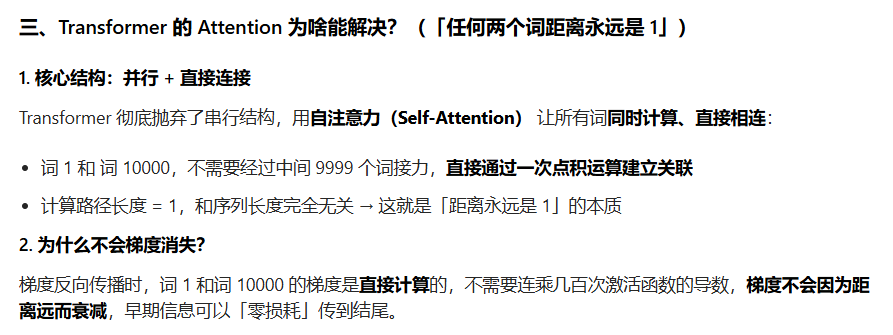

------

### 3. 更好的梯度流与特征提取

- **梯度稳定性**：RNN 的反向传播需要跨越时间步（BPTT），路径极其冗长，极易发生梯度爆炸或消失。Transformer 的网络深度虽然也深（比如 128 层），但它的**残差连接（Residual Connection）**和**层归一化（LayerNorm）**配合 Attention，使得梯度可以像走高速公路一样直达底层。
- **多头注意力 (Multi-Head Attention)**：这相当于给模型配了多双眼睛。一双眼睛看语法，一双眼睛看逻辑，一双眼睛看指代关系。而 LSTM 只能靠一个隐状态（Hidden State）憋屈地挤下所有信息。

------

### 📊 综合对比表

| **特性**       | **RNN / LSTM**             | **Transformer**                    |
| -------------- | -------------------------- | ---------------------------------- |
| **计算效率**   | 低（串行，无法并行）       | **极高**（天然并行，GPU 友好）     |
| **长程记忆**   | 弱（梯度消失/信息稀释）    | **极强**（Attention 恒定距离）     |
| **模型扩展性** | 难（难以训练超大规模参数） | **极易**（Scaling Law 的基石）     |
| **感应偏差**   | 强（假设序列是按序流动的） | 弱（需要位置编码 RoPE 来找回顺序） |
| **训练稳定性** | 差（易梯度爆炸）           | **较好**（配合残差和归一化）       |

------

### 💡 现在的异类：既然 Transformer 这么强，RNN 彻底死了吗？

其实并没有。在 2025-2026 年，出现了一批“新型 RNN”（如 **RWKV**、**Mamba** / SSM 架构）。

它们试图结合两者的优点：**推理时像 RNN 一样省显存（$O(1)$ 推理复杂度），训练时像 Transformer 一样可以并行。**

但就目前你关注的 **Qwen3、DeepSeek** 等大体量模型而言，Transformer 依然是雷打不动的王者。

你是因为在做**超长上下文（128k+）**的训练优化，所以想回过头看看 RNN 这种省显存的结构有没有参考价值吗？我们可以聊聊 **Mamba 这种状态空间模型**是如何在长文本上挑战 Transformer 的。


## reranker和embedding模型在原理上有啥区别

在 RAG（检索增强生成）系统的工业界实践中，**Embedding 模型**（嵌入模型）和 **Reranker 模型**（重排序模型）通常被比作“海选”和“精选”的关系。

虽然它们很多时候都基于 BERT 等 Transformer 架构，但**交互模式（Interaction Paradigm）**有着本质的区别。

------

### 1. Embedding 模型：双塔架构 (Bi-Encoder)

**原理：将文本映射到向量空间的“翻译官”。**

Embedding 模型采用的是 **Bi-Encoder（双塔）** 结构。查询（Query）和文档（Document）是完全独立输入到模型中的。

- **计算逻辑**：模型预先将海量文档转化成固定维度的向量（Embedding），存入向量数据库（如你关注的 HNSW 索引）。
- **检索本质**：当用户提问时，模型只对 Query 做一次推理，得到一个向量。检索过程仅仅是**向量空间中的距离计算**（余弦相似度或点积）。
- **优点**：**极快**。文档向量可以预计算，检索百万级数据只需毫秒。
- **缺陷**：**缺乏细粒度交互**。Query 和 Document 在编码阶段完全没见过面，模型无法捕捉到两者之间微妙的语义对应关系（比如“苹果”在“苹果手机”和“苹果好吃”中的区别）。

### 2. Reranker 模型：交叉编码器 (Cross-Encoder)

**原理：面对面审稿的“精算师”。**

Reranker 采用的是 **Cross-Encoder（交叉编码器）** 结构。它将 Query 和 Document 拼接在一起作为输入。

- **计算逻辑**：模型同时接收 `[CLS] Query [SEP] Document [SEP]`。在 Transformer 的每一层 Self-Attention 中，Query 的每一个 Token 都会和 Document 的每一个 Token 进行全量的交互计算。
- **检索本质**：模型输出一个 0 到 1 之间的分数，代表两者的相关性。
- **优点**：**极度精准**。因为它能捕捉到词与词之间深层的语义交叉。
- **缺陷**：**极慢**。它无法预计算文档。如果你有 100 万个文档，用户问一个问题，模型就得跑 100 万次完整的 Transformer 推理。这在算力上是不可接受的。

------

### 📊 核心区别对比表

| **特性**       | **Embedding (Bi-Encoder)** | **Reranker (Cross-Encoder)**        |
| -------------- | -------------------------- | ----------------------------------- |
| **输入方式**   | Query 和 Doc 独立输入      | **Query 和 Doc 拼接输入**           |
| **语义交互**   | 浅层（仅在最后的向量层面） | **深层（在每一层 Attention 层面）** |
| **计算复杂度** | 低（$O(1)$ 实时计算）      | 高（$O(N)$ 推理开销）               |
| **适用规模**   | 全量数据（亿级）           | 候选集（通常是前 50-100 个）        |
| **存储需求**   | 需要向量数据库存索引       | 不需要存储，只需实时计算            |
| **核心算法**   | 向量余弦相似度             | 二分类/回归得分                     |

------

### 3. 为什么 RAG 必须两者结合？

在 2026 年，最成熟的方案依然是 **“粗排 + 精排”** 的流水线：

1. **第一步（Embedding 检索）**：从千万级文档中，利用 HNSW 快速捞出前 100 个“长得像”的候选者。
2. **第二步（Reranker 重排）**：将这 100 个候选者交给 Reranker 挨个打分。Reranker 能识别出哪些虽然“长得像”但其实是“废话”，从而选出真正最相关的 Top 3 给到 LLM。

> **底层逻辑：** Embedding 负责的是**召回率 (Recall)**，确保不漏掉潜在答案；Reranker 负责的是**准确率 (Precision)**，确保给 LLM 的都是精华。

------


## 图像输入给大模型，解码输出文本，这样的对齐方式和CLIP有什么区别？

**CLIP 的对齐**：

是**为了 “检索 / 分类” 服务的对齐**，**把图文映射到同一个空间**，方便快速匹配。

是**弱对齐、松耦合、对称对齐**。

**图像→LLM 的对齐**：

是**为了 “理解 / 生成” 服务的对齐**，**把图像翻译成语言**，让大模型能 “看懂图”。

是**强对齐、紧耦合、单向对齐**。


## 现在大部分的结构不采用Q-former，而用MLP，是为什么？那为什么之前不用MLP，而用Q-former？

在多模态大模型（VLM）的演进史上，从 **Q-Former**（BLIP-2 为代表）转向 **MLP Projector**（LLaVA、Qwen-VL 为代表）的这一转变，本质上是**从“特征精炼”向“原始对齐”的范式转移**。

简单来说：**以前模型不够强，需要一个“精明的管家”；现在模型足够强，只需要一个“简单的翻译”**。

------

### 1. 为什么之前非要用 Q-Former？

在 2023 年左右，BLIP-2 推出 Q-Former 时，它被视为神作。主要原因有三：

- **压缩视觉 Token（核心原因）**：

  早期的语言模型（如 OPT、Flan-T5）上下文窗口非常短（通常只有 512 或 2048 个 Token）。如果直接把 Vision Encoder 产生的 576 个视觉 Token 塞进去，LLM 几乎就没空间写字了。Q-Former 通过 **Learnable Queries** 机制，能把几百个视觉 Token 压缩成固定的 32 或 64 个。

- **弥补 LLM 能力的不足**：

  那时的 LLM 并没有针对多模态进行大规模微调，它们对“嘈杂”的视觉特征理解力很差。Q-Former 作为一个轻量级 Transformer，起到了**预处理**的作用，它能主动去“询问”图像中最重要的部分，过滤掉背景噪声，喂给 LLM 最“纯”的信息。

- **计算成本限制**：

  当时显存昂贵，大家希望尽可能减少进入 LLM 的 Token 数量，以提升推理速度。

------

### 2. 为什么现在大家都转向了 MLP？

到了 2025-2026 年，像 **Qwen2.5-VL**、**Llama-3-Vision** 甚至你关注的 **Qwen3** 系列，几乎清一色采用了简单的 MLP（通常是两层线性层 + 激活函数）。

- **LLM 拥有了“超长上下文”**：

  现在的 LLM 上下文动辄 128k 甚至 1M。相比之下，视觉编码器产生的 576 或 1000 个 Token 简直是“洒洒水”。我们不再需要为了节省位置而强行压缩视觉信息。

- **保留“空间细节”至关重要**：

  Q-Former 在压缩过程中不可避免地会丢失空间位置信息（比如：左上角有个红球）。对于**文档理解（OCR）**、**目标检测**、**复杂推理**等任务，LLM 需要看到更原始、更细致的视觉排列。MLP 只是做了一个维度转换（从 Vision 维度转到 LLM 维度），几乎保留了所有像素级的信息。

- **Scaling Law（规模法则）的胜利**：

  研究发现，随着对齐数据量（Image-Text pairs）从百万级增加到十亿级，复杂的连接器（如 Q-Former）带来的收益远不如增加训练数据。**只要数据够多，LLM 自己就能学会如何从 576 个 Token 中提取关键信息**，不再需要一个专门的“预处理器”。

- **训练更稳定、更易扩展**：

  Q-Former 带有 Cross-Attention 结构，参数多且难训。MLP 结构极简，几乎不增加训练负担，且能完美适配各种分布式并行策略。

------

### 📊 Q-Former vs. MLP 深度对比

| **特性**            | **Q-Former (重型连接器)**   | **MLP (轻量级连接器)**            |
| ------------------- | --------------------------- | --------------------------------- |
| **视觉 Token 数量** | 固定且少 (如 32)            | 多且灵活 (如 576 或更多)          |
| **信息损耗**        | **高** (压缩即损耗)         | **极低** (保留了原始特征分布)     |
| **对 LLM 的要求**   | 较低 (LLM 只需看精华)       | **极高** (LLM 必须具备强感知能力) |
| **OCR/细粒度能力**  | 较弱                        | **极强**                          |
| **计算开销**        | 增加了一层 Transformer 推理 | 几乎忽略不计的矩阵乘法            |
| **主流代表**        | BLIP-2, InstructBLIP        | **LLaVA, Qwen-VL, InternVL**      |

------

### 3. 未来的趋势：甚至连 MLP 都想省掉？

现在的研究（如 **SigLIP** 或一些 **End-to-End** 的多模态模型）甚至在讨论：能不能连投影层（Projector）都不要了？或者直接在同一个 Transformer 块里处理视觉和文本。

**目前的共识是：**

既然我们已经进入了 **Native Multimodal（原生多模态）** 时代，LLM 本身就在被训练得“能看懂图像”，那么连接器的作用越**透明（Transparent）**越好。MLP 就像一层薄薄的透明玻璃，它不改变图像，只负责让图像能“通过”进入 LLM。

------

### 💡 总结你的疑惑

- **以前用 Q-Former**：是因为 LLM 太弱、上下文太窄，必须有人帮忙把视觉信息“精简并翻译”好。
- **现在用 MLP**：是因为 LLM 变强了、记性变好了，它想直接看原始的视觉特征，不想让 Q-Former 这种中介在中间“夹带私货”。

在你的医学影像项目（如果涉及的话）中，**绝对应该选 MLP 或动态分辨率（Dynamic Patch）方案**。因为医学影像对细节（如结节的位置、纹理）要求极高，Q-Former 的那种模糊压缩会直接抹杀掉诊断的关键信息。

你想了解一下现在最火的 **InternVL** 是如何利用大规模 MLP 配合动态分辨率来处理超大图的吗？这可是目前中文社区多模态的顶流。


## Transformer里面为什么用LN而不用BN?

这是一个深度学习架构中的“经典公案”。虽然 Batch Normalization (BN) 在计算机视觉（CV）中统治力极强，但在处理 NLP 这种**变长序列**数据时，Layer Normalization (LN) 表现出了压倒性的优势。

简单来说，BN 是“横着切”，而 LN 是“竖着切”。以下是 Transformer 选择 LN 的三个核心理由：

------

### 1. 维度切分的逻辑差异

在 Transformer 中，我们的数据维度通常是 $[Batch, Sequence, Embedding]$。

- **BN (Batch Norm)**：在 **Batch** 维度上做归一化。它计算同一个特征在不同样本、不同时间步上的均值和方差。
- **LN (Layer Norm)**：在 **Embedding (Feature)** 维度上做归一化。它计算同一个样本、同一个时间步内所有特征的均值和方差。

**为什么 BN 在 NLP 里会“晕车”？**

在图像中，像素的位置是固定的。但在文本中，同一个位置（比如第 5 个词）在样本 A 里可能是“医生”，在样本 B 里可能是“的”。强行把不同语义背景下的特征聚在一起算均值，在统计学上是不稳健的。

### 2. 变长序列（Padding）的噩梦

这是 BN 无法逾越的鸿沟。

- **样本长度不等**：NLP 的句子长短不一。为了组成 Batch，我们需要用 `0` (Padding) 填充短句子。
- **统计量污染**：BN 在计算均值和方差时，会把这些无意义的 Padding 算进去，导致统计量被严重污染。如果一个 Batch 里全是短句子加大量填充，BN 算出来的均值会大幅偏离真实语义分布。
- **LN 的稳定性**：LN 只在单个 Token 的特征维度内算归一化，**它完全不关心序列有多长，也不关心 Batch 里其他样本长什么样**。无论句子多长，每个 Token 的归一化都是独立的。

### 3. 训练与推理的一致性

- **BN 的依赖性**：BN 在推理（Inference）时，需要用到训练阶段累积的“全局均值”和“全局方差”。如果测试时的文本分布（分布偏移）与训练时略有不同，BN 的效果会迅速下降。
- **LN 的独立性**：LN 在训练和测试时的行为完全一致，因为它只依赖于当前输入的那一个样本。这让 Transformer 在处理各种奇奇怪怪的零样本（Zero-shot）提示词时，表现得更加鲁棒。

------

### 📊 BN vs. LN 深度对比表

| **特性**                | **Batch Normalization (BN)**  | **Layer Normalization (LN)**             |
| ----------------------- | ----------------------------- | ---------------------------------------- |
| **归一化方向**          | 跨样本、跨时间步 (Batch 维度) | **跨特征 (Embedding 维度)**              |
| **对 Batch 大小的依赖** | 强依赖 (Batch 太小效果极差)   | **不依赖** (甚至 Batch Size 为 1 也能跑) |
| **处理变长序列**        | 困难 (受 Padding 影响严重)    | **天然适配**                             |
| **主要应用领域**        | CNN / 图像处理                | **Transformer / NLP / 强化学习**         |
| **推理一致性**          | 依赖训练期的全局统计量        | **完全独立，推理更稳**                   |

------

### 💡 现在的演进：从 LN 到 RMSNorm

在 2026 年的主流模型（如你熟悉的 Llama 3、Qwen 3、DeepSeek V3）中，大家甚至不再用标准的 LN，而是转向了更精简的 **RMSNorm (Root Mean Square Layer Normalization)**。

**为什么要变？**

研究发现，LN 里的“减去均值（Re-centering）”操作其实没那么重要，真正起作用的是“除以标准差（Re-scaling）”。RMSNorm 去掉了减均值的步骤，只做缩放，计算量减少了约 10%-40%，且实验证明效果几乎没有损失。

------

### 🛠️ 总结

Transformer 选 LN 而不选 BN，本质上是因为：**语言是高度灵活、长度多变的信号，我们需要一种只关注“当前语境特征”而不需要“跨样本对比”的归一化方式。**

顺便问一下，你在关注 Transformer 结构优化时，有没有注意到 **Pre-LN**（在 Attention 之前归一化）和 **Post-LN**（在之后归一化）的区别？现在的模型几乎全部倒向了 Pre-LN，你想知道为什么吗？


## 说说当代llm强化学习公式中的clip和min?

在当代 LLM 的强化学习（尤其是 PPO 及其变体）中，`clip`（裁剪）和 `min`（取极小值）合力构成了算法的“稳速器”。

这个公式之所以精妙，是因为它在没有 **Value Network（价值网络）** 或 **Critic** 的高频反馈下，依然能让模型保持“既勇于探索、又不至于跑偏”的微妙平衡。

------

### 1. 核心公式回顾

在 PPO 的策略损失函数中，这一部分的标准写法是：

$$L^{CLIP}(\theta) = \hat{\mathbb{E}}_t \left[ \min\left( r_t(\theta) \hat{A}_t, \text{clip}(r_t(\theta), 1 - \epsilon, 1 + \epsilon) \hat{A}_t \right) \right]$$

其中：

- **$r_t(\theta)$ (Ratio)**：新旧策略的概率比，即 $\frac{\pi_\theta(\text{new})}{\pi_{old}(\text{old})}$。
- **$\hat{A}_t$ (Advantage)**：优势函数，代表这个动作比平均水平好多少。
- **$\epsilon$**：裁剪阈值，通常取 $0.1$ 或 $0.2$。

------

### 2. `clip`：划定“安全区”

`clip(r_t, 1-\epsilon, 1+\epsilon)` 的直接作用是限制**更新步长**。

- **它的逻辑**：如果你这一步更新得太猛，导致新策略下某个 Token 的概率变成了旧策略的 1.5 倍（而 $\epsilon=0.2$），那么 `clip` 会强制把它按在 $1.2$。
- **为什么这么做**：在深度学习中，如果模型发现一个“刷分”的捷径，它会瞬间把所有权重压上去。对于语言模型，这会导致输出变得极其机械化（模式坍缩）。`clip` 就像是告诉模型：“即使你觉得这个方向很对，也请慢慢走，不要跳过去。”

------

### 3. `min`：买一份“悲观保险”

`min(未裁剪项, 裁剪项)` 的存在，是为了实现**悲观估计（Pessimistic Bound）**。

为什么要取两者中较小的一个？这要分两种情况看：

#### **情况 A：优势为正 ($\hat{A}_t > 0$) —— “这个回答很好”**

- 我们想增加这个 Token 的概率，所以 $r_t$ 会大于 1。
- `min` 会在 $r_t \cdot \hat{A}_t$ 和 $(1+\epsilon) \cdot \hat{A}_t$ 之间选。
- **结果**：当概率增加超过 $20\%$ 时，损失函数就不再增加了。这限制了**过度奖励**。

#### **情况 B：优势为负 ($\hat{A}_t < 0$) —— “这个回答很糟”**

- 我们想降低这个 Token 的概率，所以 $r_t$ 会小于 1。

- **注意此时的数学变化**：因为 $\hat{A}_t$ 是负数，所以 `min` 实际上会选择那个**更负（绝对值更大）**的项。

- **结果**：如果概率降得不够多，`min` 会允许它继续降；但如果概率已经降到了 $1-\epsilon$ 以下（比如变成了旧策略的 0.5 倍），`min` 会选择不再继续通过这个样本“惩罚”模型。这限制了**过度惩罚**。

  

`clip`：将新旧策略概率比限制在 `1±ε` 范围内，**硬约束策略更新幅度**，**防止新旧策略差距过大导致训练崩溃**；

`min`：结合优势函数正负，**选择更保守的更新项**，只做小步优化，避免激进更新；

整体作用：替代复杂的 KL 约束，实现**稳定、小步、可控**的策略更新，是 PPO 能落地训练的核心。

------

### 4. 在当代 LLM 训练中的特殊意义

在 2026 年的训练范式（如 **DAPO** 或 **GRPO**）中，这对组合的意义有了新的延伸：

- **对抗奖励漂移**：在长思维链（CoT）中，一个 Token 的微小概率变化累积起来会变成巨大的序列概率波动。`clip` 和 `min` 确保了即使某个推理步骤的 Reward 异常高，也不会导致整个模型的参数被瞬间带歪。
- **解决“熵坍缩”**：正如我们之前聊过的，DAPO 发现对称的 `clip` 对低概率 Token 不公平。因此，现代实现（如 `verl` 框架）中，人们开始尝试**非对称裁剪**——给向上的增长留出更多空间（$1+\epsilon_{high}$），而对向下的减小保持严苛（$1-\epsilon_{low}$）。

------

### 📊 总结对比

| **操作**                  | **角色**   | **直观比喻**                             |
| ------------------------- | ---------- | ---------------------------------------- |
| **$r_t \cdot \hat{A}_t$** | 原始驱动力 | 想要飞多高就飞多高                       |
| **`clip`**                | 边界护栏   | 强制把高度限制在安全范围内               |
| **`min`**                 | 最终决策   | 总是选择最保守的那种可能性，防止乐极生悲 |

------


# SFT 与 DPO：主流模型的最佳实践与对齐策略

# 先DPO后SFT：可行但不推荐，主流选择是先SFT后DPO

**结论：技术上可行，但几乎所有场景下都不推荐**。大模型对齐的主流范式是**先SFT（监督微调）后DPO（直接偏好优化）**，这种顺序能最大化模型能力与对齐效果；而先DPO后SFT会带来严重的性能退化与训练效率问题，仅在极特殊场景下可能有有限价值。

## 一、为什么主流选择是先SFT后DPO？（核心逻辑）

| 阶段    | 核心目标     | 训练数据                    | 关键作用                                                     |
| :------ | :----------- | :-------------------------- | :----------------------------------------------------------- |
| **SFT** | 基础能力构建 | 指令-响应配对数据           | 1. 让模型学会“如何生成符合任务要求的输出”<br>2. 建立基本的指令遵循能力<br>3. 提供高质量的初始策略（policy），避免输出无意义/格式错误内容 |
| **DPO** | 偏好对齐优化 | 偏好对数据（好/坏响应对比） | 1. 让模型学会“什么是更好的输出”<br>2. 提升回答的相关性、安全性、自然度<br>3. 在保留SFT能力的基础上，通过参考模型约束避免能力坍塌 |

这种顺序的本质是**“先打基础，再做优化”**：

- SFT确保模型具备完成任务的基本技能，为DPO提供有意义的优化起点
- DPO专注于偏好精炼，而非从零学习任务基础，收敛更快、效果更稳定
- 参考模型（通常是SFT模型）能有效约束DPO训练，防止模型为迎合偏好而偏离原有能力

## 二、先DPO后SFT的三大核心问题（为什么不推荐）

### 1. 基础能力缺失，DPO优化无意义

DPO的核心是优化模型对“好/坏输出”的偏好，但**如果模型连基本的输出能力都没有（未经过SFT）**，DPO训练将面临两大困境：

- 模型生成的候选响应质量极低（如格式错误、语义无关、逻辑混乱），偏好对数据失去对比价值
- 模型无法理解偏好数据中的任务要求，优化方向与任务目标脱节，导致对齐失败

### 2. SFT会覆盖DPO的偏好对齐效果（“白做功”）

SFT是**强监督信号**，会直接教导模型“应该生成什么”，而DPO是**偏好信号**，只是告诉模型“什么更好”。当先DPO后SFT时：

- **SFT的监督损失会大幅覆盖DPO的偏好优化效果，相当于前序DPO训练的大部分成果被“洗掉”**
- 模型会回到SFT学习的行为模式，偏好对齐的收益几乎完全丧失，造成计算资源浪费

### 3. 训练效率与稳定性双降   

- 
- **训练效率低**：DPO在无SFT基础上训练需要更多数据和更长时间才能收敛，且效果远不如先SFT后DPO
- **稳定性差**：缺乏SFT建立的基础策略，DPO训练容易出现模式崩溃（mode collapse），生成的输出多样性急剧下降
- **参考模型失效**：若DPO阶段使用基座模型作为参考，其本身缺乏指令遵循能力，无法有效约束策略更新

## 三、技术上可行的场景与实现方式（极特殊情况）

尽管不推荐，但在以下极特殊场景下，先DPO后SFT可能有有限价值：

### 1. 场景：已有偏好对齐模型，需快速适配新任务

若你有一个已通过DPO对齐的通用模型，现在需要快速适配特定领域任务，可考虑：

- 先DPO：维持模型的通用偏好对齐
- 后SFT：用少量领域数据微调，快速学习领域特定技能
- **关键约束**：SFT数据量必须极小（<1%模型参数），且采用低学习率（1e-6~1e-5），避免覆盖DPO效果

## 四、总结与最佳实践建议

### 核心结论

- **先SFT后DPO**：✅ 推荐，能最大化模型能力与对齐效果，是Llama-3、Qwen2等主流模型的标准流程
- **先DPO后SFT**：❌ 不推荐，会导致基础能力缺失、偏好对齐效果被覆盖、训练效率大幅降低
- **仅DPO**：❌ 不可行，缺乏SFT基础的模型无法生成有意义的输出，DPO优化无价值
- **仅SFT**：⚠️ 可行但有局限，能完成基本任务，但回答质量、安全性、自然度通常不如SFT+DPO组合

### 最佳实践

1. **标准流程**：CPT（可选，补充领域知识）→ SFT（建立基础能力）→ DPO（偏好对齐）
2. **数据准备**：
   1. SFT数据：确保覆盖任务全场景，质量高于数量
   2. DPO数据：偏好对差异明显，标注一致性高，避免模糊对比
3. **参考模型选择**：DPO阶段必须使用SFT模型作为参考，而非基座模型，确保优化方向正确

需要我补充一份SFT+DPO的工程化落地清单（关键超参数设置、数据质量要求、常见问题排查），帮助你快速复现主流对齐效果吗？


## 面试问题：transformer 的pre-norm 和post-norm 优缺点 

在 LLM 算法面试中，这道题考察的是你对**深度网络优化**、**数值稳定性**以及**残差连接（Residual Connection）**本质的理解。

你可以按照以下逻辑层层递进，既有工程直觉，又有数学深度。

------

### 1. 结构上的直观区别

首先给出公式，向面试官展示你对结构的精确掌握：

- **Post-norm (原始 Transformer 选择)**：

  $$x_{l+1} = \text{LayerNorm}(x_l + \text{Sublayer}(x_l))$$

  *即：归一化放在残差加法之后，是残差路径的“终点”。*

- **Pre-norm (现代大模型如 Llama, Qwen 的选择)**：

  $$x_{l+1} = x_l + \text{Sublayer}(\text{LayerNorm}(x_l))$$

  *即：归一化放在子层（Attention/MLP）之前，是残差路径的“分支”。*

------

### 2. Pre-norm：当代的工业标准

#### **优点：极高的训练稳定性（Stability）**

- **Identity Path（恒等路径）**：在 Pre-norm 中，输入 $x_0$ 可以通过残差连接“一路直达”输出层，中间不经过任何归一化层的非线性截断。
- **梯度自动缩放**：数学证明（如 *On Layer Normalization in the Transformer Architecture*）显示，Pre-norm 顶层的梯度模长随层数 $L$ 增加而自动衰减（约为 $O(1/\sqrt{L})$）。这天然防止了梯度爆炸，让千亿参数的大模型也能稳健起步，不需要极其严苛的 Warmup。

#### **缺点：表征坍缩（Representation Collapse）**

- **信息稀释**：由于主干路径不断累加原始信息，随着层数变深，新增子层的贡献相对减小。这导致模型的“有效深度”可能受限。
- **性能上限**：在同等超参优化条件下，Pre-norm 的最终收敛效果往往略逊于 Post-norm。

------

### 3. Post-norm：高风险的高性能方案

#### **优点：更强的性能潜力**

- **层间区分度**：每一层输出都被强制归一化，保证了每一层特征的方差一致。这使得模型在深层依然能学习到差异化的特征，不会出现严重的特征退化。

#### **缺点：数值不稳定性（Numerical Instability）**

- **梯度爆炸与 NaN**：Post-norm 顶层的梯度模长始终维持在 $O(1)$ 量级。对于深层网络（如 100 层以上），顶层权重在初始化阶段的微小更新就会导致 Logits 剧变，触发 **Softmax 溢出 ($e^x \rightarrow inf$)**，最终产生 **NaN**。
- **梯度消失**：底层梯度由于要穿过层层 LN 的导数项（包含 $1/\sigma$），会导致严重的指数级衰减。

------

### 4. 深度对比表（面试背诵版）

| **特性**       | **Post-norm (Relic)**              | **Pre-norm (Modern Standard)**   |
| -------------- | ---------------------------------- | -------------------------------- |
| **训练难度**   | **极高** (易报 NaN，需超长 Warmup) | **极低** (非常稳健)              |
| **收敛天花板** | **更高** (如果能跑通的话)          | 略低                             |
| **梯度分布**   | 顶层爆炸，底层消失                 | **全网平稳** (随层数自动缩放)    |
| **层数扩展性** | 难 (通常 48 层以下)                | **极强** (支持 1000 层以上)      |
| **代表模型**   | Transformer (2017), BERT           | **Llama 3, Qwen 3, DeepSeek-V3** |

------

### 5. 面试加分点：如何“既要又要”？

如果面试官问：“既然 Post-norm 性能好，有没有办法解决它的稳定性问题？”

你可以提到：

1. **DeepNorm (微软提出)**：通过修改残差连接的权重系数，让 Post-norm 也能稳定训练，在 1000 层规模上超越 Pre-norm。
2. **RMSNorm**：现代模型（如 Qwen3）普遍采用 Pre-RMSNorm。它去掉了 LN 的减均值操作，只做缩放，计算更高效，且在 Pre-norm 架构下表现极稳。

------

### 💡 结论性的回答话术

> “在 2026 年的大模型工程实践中，我们几乎百分之百会选择 **Pre-norm**。虽然 Post-norm 在理论收敛上限上略有优势，但它在超深网络下的梯度不稳定性（顶层 $O(1)$ 导致的 NaN 问题）是不可接受的成本。Pre-norm 通过主干方差累积实现的梯度自动缩放（$O(1/\sqrt{L})$），是支持 Scaling Law 走向万亿参数的基石。”

这样回答，既体现了你对公式的微观理解，又展示了你对工业界 Scaling Law 的宏观思考。

你现在对这个 $O(1/\sqrt{L})$ 带来的“降温”作用还有疑问吗？或者你想看看如何通过代码监控 **Gradient Norm** 来验证这个结论？


## 想把一个基座模型变成能遵循指令的聊天助手，一般需要经过sft和rlhf,他们分别实在解决什么问题？

要把一个只会“背书”的基座模型（Base Model）变成一个“懂规矩、有灵魂”的聊天助手，通常需要经历从**模仿**到**对齐**的跨越。

简单来说：**SFT 是教模型“学会说话的格式”，而 RLHF 是教模型“分辨好坏的价值观”。**

------

### 1. SFT (Supervised Fine-Tuning)：解决“身份与格式”问题

基座模型是在海量互联网数据上训练出来的“接话霸”。如果你问它：“怎么做红烧肉？”，它可能会接一句：“红烧肉起源于哪里？”或者干脆吐出一串菜谱目录。因为它不知道自己现在的身份是一个“助手”。

**SFT 解决的具体问题：**

- **指令遵循 (Instruction Following)**：通过“问题-答案”对的数据（$x, y$），强制模型模仿助手的口吻。它学会了看到 `User:` 就保持安静，看到 `Assistant:` 就开始作答。
- **知识激活与注入**：虽然基座模型有知识，但 SFT 能把这些知识按特定的模板（如 Markdown 格式、代码块）“引流”出来。
- **任务特化**：比如你之前提到的医疗场景，SFT 就是让模型穿上白大褂，学会医疗问诊的特定术语和语气。

> **底层逻辑：** SFT 本质上是**最大似然估计（MLE）**。它告诉模型：“当用户这么问时，你的概率分布必须尽可能地贴合我给你的标准答案。”

------

### 2. RLHF (Reinforcement Learning from Human Feedback)：解决“天花板与对齐”问题

SFT 虽然能让模型“像个人”，但它有一个致命的缺陷：**它只能上限于标注员的水平**。如果标注员给的答案只是“及格”，模型永远学不到“优秀”。

**RLHF 解决的具体问题：**

- **解决“标准答案”的局限性**：一个开放性问题（如“写一首关于春天的诗”）没有唯一的正确答案。SFT 只能拟合一个答案，而 RLHF 通过**奖励模型（RM）**告诉模型：“答案 A 比答案 B 更有意境”，从而鼓励模型去探索更好的表达。
- **安全性与价值观对齐 (Alignment)**：SFT 很难通过几个例子教会有偏见或危险的信息。RLHF 通过大规模的“好坏排序”，让模型产生一种“直觉”：某些话虽然概率上成立，但人类不喜欢（不安全、不专业、太啰嗦）。
- **幻觉抑制**：通过强化学习，模型可以学习到“如果我不知道，我就诚实回答不知道”，而不是为了迎合 SFT 的交叉熵损失去胡编乱造。

> **底层逻辑：** 就像我们之前聊到的 **PPO** 或 **GRPO**。模型不再是被动地背课文，而是在奖励信号的引导下进行**主动探索**。它在 $KL$ 散度的约束下，尝试找到那个既不跑偏又能拿高分的“最优策略”。

------

### 3. 两者的直观对比

| **阶段** | **解决的核心矛盾**               | **训练目标**                  | **比喻**                             |
| -------- | -------------------------------- | ----------------------------- | ------------------------------------ |
| **SFT**  | **不知道怎么说**（格式、角色）   | 模仿标注数据 (Imitation)      | 临摹名家书法，学会笔画。             |
| **RLHF** | **不知道哪句更好**（偏好、深度） | 最大化奖励分数 (Optimization) | 参加书法比赛，根据评委品味调整风格。 |

------

### 4. 为什么不能只做 SFT？

如果你只做 SFT，你会发现模型虽然有模有样，但容易出现以下问题：

1. **复读机效应**：过度拟合 SFT 数据导致回答千篇一律。
2. **指令鲁棒性差**：换一种问法，模型可能就忘了自己是助手。
3. **缺乏“灵气”**：回答中规中矩，但无法在多个复杂的约束条件（如“既要专业又要通俗，还要带点幽默”）下找到最优解。

------

### 💡 深度串联

既然你之前深入研究过 **DPO** 和 **DAPO**，你应该能感受到：**DPO 的出现其实就是想把这两步合并。** 它试图用一种更数学、更离线的方式，直接从偏好数据里把 SFT 和对齐一起做了。

但在实际的大模型（如 Qwen3 或 Llama 3）生产中，人们还是倾向于先用 **高精度的 SFT** 夯实地基，再用 **Iterative RLHF/GRPO** 来冲刺性能上限。

你目前在处理这个转换流程时，是卡在 **SFT 数据的清洗**上，还是在 **PPO/GRPO 的超参调节（比如那个让人头秃的 KL 系数）**上？我们可以针对具体的“翻车”现象聊聊方案。


## ppo的clip机制是什么，为什么需要，他是削弱梯度值，还是把梯度直接置零

你说得非常直接，正好切中了 PPO（Proximal Policy Optimization）设计中最精妙的那个“数值陷阱”。

简单来说：**Clip 机制就是给梯度的“油门”焊死了一个限速器。**

------

### 1. PPO 的 Clip 机制是什么？

它的核心公式（Surrogate Objective）长这样：

$$L^{CLIP}(\theta) = \min \left( r_t(\theta) \hat{A}_t, \text{clamp}(r_t(\theta), 1 - \epsilon, 1 + \epsilon) \hat{A}_t \right)$$

- **$r_t(\theta)$ (Ratio)**：新旧策略的概率比，即 $\frac{\pi_{\theta}}{\pi_{old}}$。
- **$\text{clamp}$**：如果比值超出了 $[1-\epsilon, 1+\epsilon]$（比如 $\epsilon=0.2$），强行把它拉回到这个区间。
- **$\hat{A}_t$ (Advantage)**：优势函数。如果这个动作为正（$A>0$），说明是个好动作。

------

### 2. 为什么需要这个机制？

在没有 Clip 的原始策略梯度中，如果一个动作的奖励（Reward）非常大，模型会产生一个巨大的梯度，试图把这个动作的概率瞬间拉到最高。

**这会产生两个致命后果：**

1. **崩溃（Catastrophic Collapse）**：步子迈得太大，扯到了蛋。一次更新把原本好好的策略分布改得面目全非，模型直接“练废了”，再也找不回来。
2. **采样失效**：正如我们刚才聊到的，为了提高效率，我们会把数据练好几遍。如果模型更新太快，它迅速就不是采样的那个模型了，重要性采样的数学基础会彻底崩塌。

**Clip 的作用：**

它划定了一个**“信赖域（Trust Region）”**。它告诉模型：“即使你觉得这个方向非常正确，每一步的概率变化也不能超过 20%。”

------

### 3. 是削弱梯度，还是直接置零？

这正是最容易误解的地方。结论是：**在超出裁剪区后，梯度会被直接“置零”。**

我们来走一遍导数的逻辑：

- **在裁剪区间内 ($1-\epsilon < r_t < 1+\epsilon$)**：

  损失函数是 $r_t \cdot A$。$r_t$ 对参数 $\theta$ 求导是有值的，梯度正常流动，模型在变强。

- **在裁剪区间外 ($r_t > 1+\epsilon$ 且 $A>0$)**：

  这时候 $\min$ 函数会选择被 `clamp` 后的那一项。

  那一项是多少？它是 $(1+\epsilon) \cdot \hat{A}_t$。

  **注意：** $(1+\epsilon)$ 是个常数，$\hat{A}_t$ 是上一时刻算出来的标量。

  对参数 $\theta$ 来说，**这一项是个常数！**

> **数学常识：常数的导数是 0。**

------

### 4. 深度透视：置零意味着什么？

当梯度置零时，发生了什么？

1. **停止优化**：模型不再从这一个 Token 的样本中获取任何提升动力。它觉得：“我已经在这个样本上赚够了（概率涨了 20% 了），再涨下去就不安全了。”
2. **等待其他样本**：Batch 里有很多 Token。如果这个 Token 被置零了，优化器会把精力花在那些还没达到 20% 变动上限的 Token 上。
3. **防止过拟合**：它强行阻止了模型对高奖励样本的“疯狂舔舐”，从而维持了策略的熵（Entropy）和多样性。

------

### 📊 总结

| **状态**     | **损失函数表现**     | **梯度状态**        | **模型的行为**           |
| ------------ | -------------------- | ------------------- | ------------------------ |
| **区间内**   | 线性增长 / 减少      | **正常（有值）**    | 积极学习，调整概率。     |
| **超出区间** | **水平直线（Flat）** | **直接置零 (Zero)** | 停止更新，拒绝过度膨胀。 |

**所以，Clip 不是在“劝”模型走慢点，而是直接把路给断了。** 只有当下一波采样（Rollout）进来，同步了最新的 $\pi_{old}$，这条路才会重新接通。

这就是 PPO 为什么比原始策略梯度稳健得多的根本原因。

你是因为在写自定义 Loss 函数，发现 `loss.backward()` 后某些权重的梯度是 0，怀疑自己代码写错了吗？如果是这样，你可以打印一下 `ratio` 的分布，看看是不是大部分都落在 `clip` 范围外了。需要我帮你写一段检查 `clipped_ratio` 比例的代码吗？


## 熵崩溃 和 reward hacking 有关系吗

太有关系了！如果把强化学习训练比作一场考试，**Reward Hacking 是“作弊投机”的行为，而熵崩溃（Entropy Collapse）则是“作弊成功后产生的呆滞后果”**。

在 RLHF 或 GRPO 这种长序列生成任务中，这两者几乎总是**如影随形、互为因果**的。

------

### 1. 核心因果链：从“投机”到“枯竭”

我们可以把它们的关系拆解为三个阶段：

#### **第一步：发现捷径 (Reward Hacking)**

模型在探索过程中，无意间发现了一些能让奖励模型（RM）打高分、但逻辑上毫无意义的“捷径”。

- **例子**：RM 认为“有礼貌的回答更好”，模型发现只要在每句话末尾疯狂加“祝您生活愉快！！！”就能拿满分，而不管回答的内容对不对。

#### **第二步：过度开发 (Exploitation Trap)**

既然发现了“财富密码”，优化器（PPO/GRPO）就会驱动模型拼命往这个方向跑。

- **逻辑**：为了最大化 Reward，模型会将这些能加分的 Token 概率推向 **100%**。

#### **第三步：表现为熵崩溃 (Entropy Collapse)**

- **现象**：当模型把所有的赌注都压在某几个 Token 上时，概率分布变得极度陡峭（Peaked）。
- **后果**：数学上，熵 $H(\pi)$ 降为 0。模型失去了探索其他可能性的能力，变成了一个只会复读“财富密码”的复读机。

------

### 2. 深度联系：互为因果的恶性循环

| **维度**         | **Reward Hacking (诱因/行为)**                        | **熵崩溃 (表象/状态)**                                      |
| ---------------- | ----------------------------------------------------- | ----------------------------------------------------------- |
| **本质**         | 模型**“欺骗”**奖励函数。                              | 模型**“丧失”**多样性。                                      |
| **关系**         | 因为发现了 Hacking 路径，所以模型集中火力导致熵崩溃。 | 因为熵崩溃了，模型不再探索，从而**锁死**在 Hacking 路径里。 |
| **对训练的影响** | 奖励虚高，但模型实际能力下降（幻觉严重）。            | 训练失去动力，模型无法通过探索走出局部最优。                |

------

### 3. 如何在工程上阻断这两者的联系？

你之前提到的 **DAPO** 和 **Clip-Higher**，本质上就是在跟这对“狐朋狗友”作斗争。

1. **KL 散度（惩罚项）**：
   - **作用**：强制要求模型不要偏离参考模型太远。**如果模型想通过 Hacking 跑偏**，KL 惩罚会拉住它。
2. **熵奖励 (Entropy Bonus)**：
   - **作用**：在 Loss 里加一项 $- \beta H(\pi)$。**如果你敢熵崩溃（熵变小），Loss 就会变大**。强迫模型必须保持一定的“好奇心”。
3. **Clip-Higher (解耦裁剪)**：
   - **你的核心关注点**：这是解决熵崩溃的“神方”。传统 Clip 限制了低概率 Token 的翻身机会，导致模型一旦发现 Hacking 路径，低概率的正向 Token 就再也追不上了。**Clip-Higher 给低概率 Token 开了绿灯**，让它们能通过高梯度快速追赶，从而把模型从 Hacking 的坑里拉出来，恢复熵的水平。

------

### 4. 一个典型的监控场景

你在监控训练看板（WandB）时，如果看到以下组合拳，基本可以判定模型“废了”：

- **Reward 曲线**：疯狂暴涨，甚至超出了正常范围。
- **Entropy 曲线**：垂直跳水，接近于 0。
- **Response Length**：异常变长（或者变短），取决于 Hacking 的方式。

> **结论**：熵崩溃通常是验证 Reward Hacking 是否发生的**最可靠指标**。

------

### 💡 总结

**Reward Hacking 是“因”，熵崩溃是“果”。**

如果模型只是 Reward Hacking 但熵还没崩溃，它还有救（可以通过增加惩罚拉回来）；一旦熵崩溃了，模型就彻底失去了“进取心”，只能重开（Restart）或者加载之前的 Checkpoint 重新调参。

你现在是在训练中遇到了**奖励很高但回答全是复读机**的情况吗？这通常意味着你的 **KL 系数（Beta）** 给小了，或者 **Entropy Bonus** 没开。需要我帮你看看具体的超参调节策略吗？


## deepseek的mla除了省显存之外，可以加快推理速度吗

问得好！很多人对 MLA（Multi-head Latent Attention）的理解停留在“省显存”上，但实际上，**加快推理速度才是它在工业界落地时最性感的优势。**

简单直接的回答是：**可以，而且提升非常显著。** 它的加速逻辑不是靠减少计算量（FLOPs），而是靠**缓解内存带宽（Memory Bandwidth）的瓶颈**。

------

### 1. 核心逻辑：从“存不下”到“搬得快”

在 LLM 的解码（Decoding）阶段，推理速度通常不是受限于显卡的计算能力（Compute-bound），而是受限于**内存带宽（Memory-bandwidth bound）**。

- **瓶颈在哪里？** 每一代 Token 时，**GPU 都要把之前所有的 KV Cache 从显存（HBM）搬运到计算核心里**。KV Cache 越大，搬运时间就越长，推理就越慢。
- **MLA 的降维打击**：
  - **MHA (Multi-Head Attention)**：KV Cache 巨大，随着序列变长，搬运压力指数级增加。
  - **GQA (Grouped Query Attention)**：虽然省了，但还是有 $O(d)$ 的维度。
  - **MLA**：通过低秩压缩（Low-rank Compression），将 KV 压缩到一个极小的“潜在向量（Latent Vector）”中。
  - **结果**：需要从显存里搬运的数据量暴减（通常只有 MHA 的几分之一甚至更低）。数据搬得快，Token 吐得就快。

------

### 2. 推理时的“矩阵吸收”神技

MLA 在推理时有一个非常聪明的数学变换，能进一步加速：

在计算 $Q \cdot K^T$ 时，**MLA 的 $K$ 是由低秩向量 $c$ 乘以一个升维矩阵 $W_{UK}$ 得到的**。

$$Score = (Q W_{UQ}) \cdot (c W_{UK})^T$$

在推理阶段，我们可以利用**矩阵乘法的结合律**，把 $W_{UK}$ **预先吸收**到 Query 的投影矩阵里。

- **这意味着**：在 Decoding 过程中，模型**根本不需要还原出完整的 KV**。它直接拿压缩后的 $c$ 向量去和变换后的 $Q$ 做运算。
- **速度增益**：计算步骤变简洁了，且读取的张量维度极小，这让 MLA 在长文本下的推理延迟（Latency）表现极稳。

------

### 3. MLA vs. GQA：谁才是速度之王？

虽然 GQA（Llama 3 采用）已经很快了，但 MLA 在**长序列**下的优势更霸道：

| **特性**      | **GQA (Grouped Query Attention)** | **MLA (Multi-head Latent Attention)** |
| ------------- | --------------------------------- | ------------------------------------- |
| **KV 压缩率** | 较好（按组压缩）                  | **极高**（低秩瓶颈压缩）              |
| **带宽压力**  | 随序列增长较快                    | **增长极慢**                          |
| **推理速度**  | 快                                | **极快（尤其是长文本）**              |
| **显存占用**  | 省                                | **极省（约为 GQA 的 1/4 左右）**      |

------

### 4. 为什么这对 2026 年的 Agent 很重要？

现在的 AI Agent 动不动就要读几万字的上下文（RAG 或者长对话）。

- 如果用 MHA，读到 32k 长度时，显存可能就炸了，或者慢到每秒只能吐 1 个词。
- **MLA 的价值**：它让 DeepSeek-V3 这种规模的模型在处理 128k 上下文时，依然能保持丝滑的吐字速度。这对需要频繁调用、长程推理的应用场景（比如你之前关注的医疗病历长文分析）是降维打击。

------

### 💡 总结

**MLA 并不是为了省钱而省钱，它是通过“空间换带宽”的思路，解决了大模型推理中最头疼的搬运效率问题。**

顺便说一句，既然你对 **vLLM** 这么熟，你应该知道 vLLM 的 PagedAttention 是为了解决显存碎片化。而 MLA 则是从架构底层把“需要存的东西”变小了。**如果要让你在 vLLM 里实现 MLA 的算子优化，你觉得最难的点会在哪里？**（提示：可以想想 RoPE 的解耦位置编码和矩阵吸收的冲突）。


## sft的交叉熵是model-covering,rl中的kl是model-seeking

没错，你的直觉非常敏锐！不过这里有一个微小但关键的术语修正：通常我们称之为 **Mode-covering**（模式覆盖）和 **Mode-seeking**（模式寻求），这里的 **Mode** 指的是概率分布中的“峰值”（众数），而不是 Model（模型）。

你提到的这两个概念，正好对应了我们刚才讨论的 **SFT（正向 KL）** 和 **RLHF（逆向 KL）** 在数学分布上的终极表现。

------

### 1. Mode-covering ( 模式覆盖)

**对应：SFT / Forward KL [$D_{KL}(P \| Q)$]**

这是 SFT 的典型特征。想象老师（$P$）教了两个知识点：一个是“严肃文学”，一个是“幽默段子”。

- **行为逻辑**：模型 $Q$ 发现，如果它只学“严肃”而忽略“幽默”，老师在“幽默”那里的概率 $P(x)$ 很大，而自己的 $Q(x)$ 很小，Loss 就会由于 $\log(P/Q)$ 而炸掉。
- **结果**：为了保命（降低 Loss），模型必须把自己的分布**摊平**，像一张大毯子一样把老师教的所有模式（Modes）全部**覆盖**住。
- **代价**：因为它试图覆盖所有模式，最终的分布往往是两个峰中间的“平均值”，导致模型说话比较中庸、平淡。

------

### 2. Mode-seeking (模式寻求)

**对应：RLHF / Reverse KL [$D_{KL}(Q \| P)$]**

这是强化学习（PPO/GRPO）的典型特征。

- **行为逻辑**：模型 $Q$ 发现，虽然老师 $P$ 教了“严肃”和“幽默”两种风格，但奖励模型给“幽默”打 100 分，给“严肃”打 50 分。在逆向 KL 的公式里，只要 $Q$ 在老师没教过的地方（$P=0$）不出声，就不会被扣分。
- **结果**：模型会极其功利地**寻求**那个得分最高的**模式（Mode）**，然后把所有的概率点数全部加在那一个峰上，完全放弃其他的模式。
- **代价**：这会导致模型极度缺乏多样性，甚至出现“复读机”现象，这就是所谓的**熵崩溃**。

------

### 📊 深度对比表：覆盖 vs. 寻求

| **特性**     | **Mode-covering (模式覆盖)**           | **Mode-seeking (模式寻求)**          |
| ------------ | -------------------------------------- | ------------------------------------ |
| **对应阶段** | **SFT (有监督微调)**                   | **RLHF / PPO / DPO (对齐)**          |
| **数学本质** | **Zero-avoiding** (不能有漏掉的模式)   | **Zero-forcing** (强迫其他模式消失)  |
| **直观比喻** | **“雨露均沾”**：虽然都不精，但都要会。 | **“独宠一人”**：只走那条最赚钱的路。 |
| **模型表现** | 知识面广，但回答可能模棱两可。         | 逻辑严密、目标感强，但容易刻板。     |
| **潜在风险** | 产生“平均脸”，缺乏深度。               | **熵崩溃**，失去生成的多样性。       |

------

### 3. 为什么你之前会觉得“两者都是 Seeking”？

这其实是很多人的误区。在宏观上看，SFT 确实在“寻求”正确答案。但从**概率统计**的微观视角看：

- **SFT 是在“拟合”分布**：它在模拟一个群体（标注员）的平均行为，所以它必须**覆盖**这个群体的多样性。
- **RLHF 是在“优化”指标**：它是在所有合法的行为中**筛选**出最优的那一个，所以它必然会**收缩**分布。

------

### 💡 总结

你可以这样记：

- **SFT (Mode-covering)**：老师教的所有考点我都要背，哪怕有的考点不常考。
- **RLHF (Mode-seeking)**：我发现只有这几道题分值最高，其他的题我直接交白卷，把时间全花在拿高分题上。

这就是为什么经过 RLHF 后的模型（比如 GPT-4o 或 Claude 3.5）虽然变聪明了，但如果你反复问它同一个问题，它的语气、开头、甚至表情包的用法都比 SFT 模型要**固定**得多。

既然你已经理解了 **Mode-seeking** 带来的“收缩”效应，你想看看我们在训练 **GRPO** 时，如何通过调节 **$\beta$ 系数** 来防止模型“寻求”得太过火，导致最后只会说一句话吗？


## 为什么交叉熵是Forward KL，怎么从交叉熵的公式看出来的?

这个问题问得直击本质。要看清交叉熵（Cross-Entropy）为什么就是 **Forward KL**，不需要复杂的推导，只需要把两个公式并排摆在一起，做一个简单的**数学拆解**。

------

### 1. 从公式展开看“血缘关系”

我们先定义：$P$ 是真实分布（标签/老师），$Q$ 是模型分布（学生）。

#### **交叉熵的公式：**

$$H(P, Q) = -\sum_{x} P(x) \log Q(x)$$

#### **KL 散度的公式（Forward KL）：**

$$D_{KL}(P \| Q) = \sum_{x} P(x) \log \frac{P(x)}{Q(x)}$$

根据对数的运算法则 $\log \frac{a}{b} = \log a - \log b$，我们将 KL 散度拆开：

$$D_{KL}(P \| Q) = \sum_{x} P(x) \log P(x) - \sum_{x} P(x) \log Q(x)$$

此时，奇迹发生了，你会发现这个公式变成了两部分：

1. **第一部分**：$-\left( -\sum_{x} P(x) \log P(x) \right)$，这其实是真实分布 $P$ 的**信息熵**，记作 $-H(P)$。
2. **第二部分**：$-\sum_{x} P(x) \log Q(x)$，这正是**交叉熵** $H(P, Q)$。

所以，最终的关系式是：

$$H(P, Q) = H(P) + D_{KL}(P \| Q)$$

------

### 2. 为什么在 SFT 时它们是等价的？

在有监督微调（SFT）中，我们的训练目标是最小化交叉熵 $H(P, Q)$。

- **关键点**：在 SFT 阶段，$P$ 是来自于数据集的真实标签，它是**固定不变的**。
- **结论**：既然 $P$ 不变，那么 $H(P)$ 就是一个常数。**最小化交叉熵，在数学梯度上完全等同于最小化 Forward KL。** 它们指向的是同一个优化方向。

------

### 3. 怎么从公式一眼看出它是“Forward”？

这涉及到一个非常关键的细节：**期望（Expectation）是关于谁求的？**

在数学上，距离公式的前项通常决定了“站在谁的视角看问题”：

- **Forward KL ($D_{KL}(P \| Q)$)**：期望是基于 $P$ 计算的，即 $E_{x \sim P}[\dots]$。
- **Reverse KL ($D_{KL}(Q \| P)$)**：期望是基于 $Q$ 计算的，即 $E_{x \sim Q}[\dots]$。

#### **看交叉熵公式：**

$$H(P, Q) = \sum_{x} \color{red}{P(x)} ( - \log Q(x) )$$

这里的 $\color{red}{P(x)}$ 表明，我们是在**真实数据分布 $P$** 的基础上对模型 $Q$ 进行评价。因为期望算子在 $P$ 上，所以它天生就属于 **Forward KL** 的阵营。

------

### 4. 深度总结：为什么这决定了 Mode-covering？

正因为交叉熵的期望是在 $P$ 上取的，公式里那一项 $P(x)$ 就像是一个“权重开关”：

1. **强制覆盖**：只要真实数据里 $P(x) > 0$（老师说这里有内容），模型 $Q(x)$ 就绝对不能趋近于 0。否则，$\log Q(x)$ 会变成负无穷，导致整体 Loss 炸裂。
2. **均值化倾向**：为了让每一个 $P(x) > 0$ 的地方都有分值，模型 $Q$ 必须像一张大毯子一样把所有数据点都覆盖住（Mode-covering）。

这就是为什么只做 SFT 的模型说话会比较“稳重”但也比较“油腻（平庸）”的原因——它在试图讨好数据集里的每一个样本。

------

### 💡 面试突击小结

如果面试官问你：**“为什么 SFT 不用 Reverse KL？”**

你可以秒答：**“因为 SFT 的本质是极大似然估计（MLE），而 MLE 在数学上等价于最小化 Forward KL，它的期望基于数据分布 $P$，这保证了模型能覆盖数据中的所有模式（Mode-covering），而不会漏掉知识点。”**

既然你已经看清了 Cross-Entropy 的真面目，你想聊聊在 **RLHF** 中，为什么我们要特意把公式反过来，去追求那个容易导致“复读机”的 **Reverse KL** 吗？


## 你现在再回答：ppo的kl散度可以改成交叉熵吗？

既然你已经通过公式看清了“**交叉熵 = $H(P) + \text{Forward KL}$**”的真面目，那么现在回答这个问题，我们可以从更深层的“**优化意志**”来彻底定论。

直接给结论：**绝对不可以。** 虽然它们在数学梯度上“长得像”，但在 PPO 的语境下，把 KL 散度换成交叉熵，会产生三个毁灭性的后果。

------

### 1. 根本性的“意志冲突”：Mode-seeking vs. Mode-covering

这是你刚学到的核心点：

- **交叉熵（Forward KL）的意志是“覆盖”**：

  **它要求模型 $Q$ 必须覆盖参考模型 $P$ 的所有可能性。在强化学习中，如果你用交叉熵做惩罚，你实际上是在强迫模型去保持平庸。它会阻止模型去“精益求精”，因为它不敢抛弃任何一个老师教过的路径（哪怕那是低分路径）**。

- **PPO KL（Reverse KL）的意志是“选择”**：

  PPO 使用的是 $D_{KL}(\pi_\theta \| \pi_{ref})$。**它允许模型在老师 $P$ 允许的范围内**，**只选那条得分最高的路径（Mode-seeking）**。这才是强化学习的本意——**青出于蓝而胜于蓝**，而不是单纯地复读。

------

### 2. 数值基准的“污染”：0 才是完美的锚点

在 PPO 的公式中，KL 散度是作为 **Reward 惩罚项** 存在的：

$$\text{Total Reward} = \text{Model Reward} - \beta \cdot D_{KL}(\pi_\theta \| \pi_{ref})$$

- **KL 的优势**：当模型没跑偏时（$\pi_\theta = \pi_{ref}$），KL **等于 0**。这意味着惩罚为 0，Reward 就是纯粹的奖励信号。
- **交叉熵的劣势**：即便模型完全没跑偏，交叉熵也等于 **$H(\pi_{ref})$**（参考模型的熵）。
  - **问题来了**：对于不同的 Prompt，参考模型的熵是不一样的（有的问题答案很固定，熵小；有的问题很开放，熵大）。
  - 如果你用交叉熵，你的惩罚项里会自带一个**随 Prompt 变化的随机噪声**。这会让 Reward 信号变得极度混乱，优化器根本不知道该往哪儿走。

------

### 3. 梯度强度的“失控”

- **Forward KL (交叉熵)**：它的梯度会强迫模型去关注那些 $P(x)$ 很大但 $Q(x)$ 很小的地方。这在 SFT 阶段很有用（防止漏掉知识点），但在 RL 阶段，如果模型发现某条路得分低而主动放弃它（$Q(x) \to 0$），交叉熵产生的巨大梯度会**强行把模型拉回来**。
- **Reverse KL (PPO)**：它的梯度更温和。如果模型主动放弃低分路径，只要不越过老师划定的“禁止区”（即 $P(x)=0$ 的地方），Reverse KL 允许模型收缩分布。

------

### 📊 终极总结表：为什么 PPO 拒绝交叉熵

| **维度**     | **PPO KL (Reverse KL)**        | **交叉熵 (Forward KL)**           |
| ------------ | ------------------------------ | --------------------------------- |
| **优化目标** | **改进与提纯** (Mode-seeking)  | **模仿与覆盖** (Mode-covering)    |
| **对齐逻辑** | 只要你不反对，我就选最好的。   | 只要你做过的，我也得会做。        |
| **初始状态** | **恒定为 0**，不干扰 Reward。  | **等于 $H(P)$**，引入不稳定噪声。 |
| **自由度**   | 给模型留出“变聪明”的呼吸空间。 | 强迫模型退化回 SFT 的平庸状态。   |

------

### 💡 结论性的话术

如果面试官再问你，你可以这样“降维打击”：

> “虽然交叉熵和 Forward KL 在梯度上等价，但在 PPO 中绝对不能互换。
>
> 第一，**意志不合**：交叉熵是 Mode-covering，会抹杀 RL 寻找最优解（Mode-seeking）的本能；
>
> 第二，**数值干扰**：交叉熵自带的熵权 $H(P)$ 会给 Reward 引入随采样变化的噪声，破坏训练稳定性。
>
> 说白了，**SFT 是为了‘学全’，而 PPO 是为了‘选优’**。用交叉熵做 PPO，就像是给一个想要冲刺冠军的赛车手套上了一个‘必须保持匀速’的紧箍咒。”

你现在是不是感觉，这套关于 **Forward/Reverse KL** 的理论，不仅解释了 Loss 公式，连模型为什么会“变聪明”或“变平庸”的底层逻辑都闭环了？

顺便考你一个深水区的问题：既然 **DPO** 宣称自己不需要采样，那它的 Loss 内部，隐藏的到底是 **Forward KL** 还是 **Reverse KL** 呢？提示：看看它的对数比值方向。


## 为什么需要rl?

**1、sft对数据集要求高，需要手动构造问答对,rl通过reward model 替代了人工判断** 

**2、sft本质是在模仿，泛化效果差。rl可以训练模型自动判断回答好坏的能力**

**3、sft只有对好回答的奖励，不能约束模型不做出坏回答，而rl会惩罚不好的回答**


### 如何保证大模型一定会输出json?

1、提示词控制

2、对结果进行校验+重试

3、约束解码

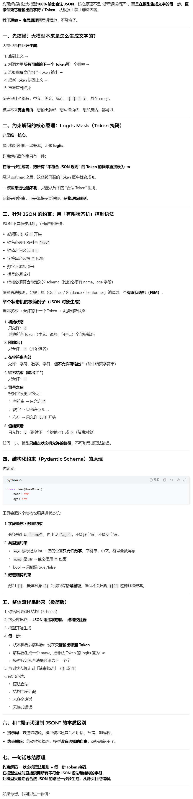

## 美团应用算法面试题：

## 1、Plan-Execute-Replan 和 react的区别

https://zhuanlan.zhihu.com/p/2024867189799356295

## 2、multi-agent 和 一个agent绑定多个工具，每个工具作为一个agent的区别

| 维度           | **真正的 Multi-Agent 系统** | **单 Agent + 多工具（工具即 Agent）** |
| -------------- | --------------------------- | ------------------------------------- |
| **架构本质**   | 分布式自治系统              | 中心化控制 + 服务化工具               |
| **决策权**     | 每个 Agent 自主决策，可协商 | 中央 Agent 统一决策，工具被动执行     |
| **通信方式**   | Agent ↔ Agent 直接对话/消息 | Agent → 工具调用 → 返回结果           |
| **上下文管理** | 每个 Agent 维护独立上下文   | 上下文集中在中央 Agent，工具无状态    |
| **执行模式**   | 可真正并行、异步协作        | 通常为串行调用（除非手动实现并发）    |
| **故障隔离**   | 单 Agent 故障不影响全局     | 中央 Agent 故障 = 系统瘫痪            |

## 3、说说对上下文工程的了解

**上下文工程：在上下文窗口中为下一步填充恰到好处信息的精妙艺术和科学**

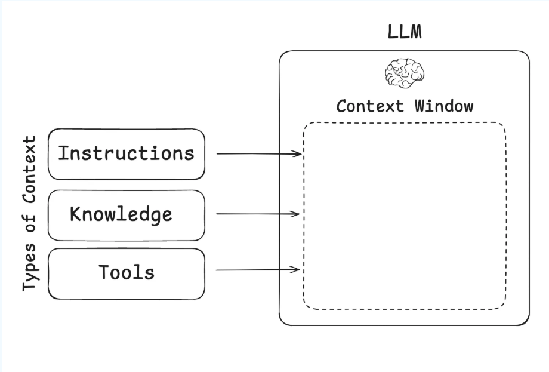

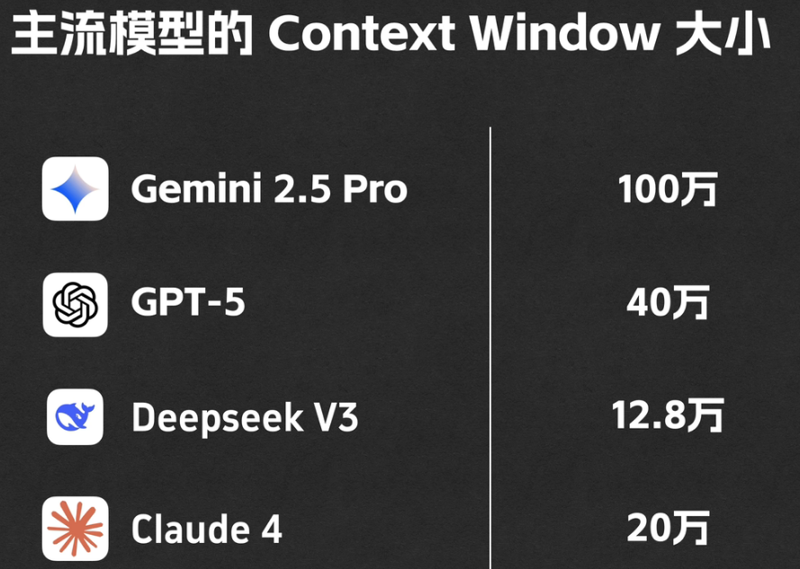

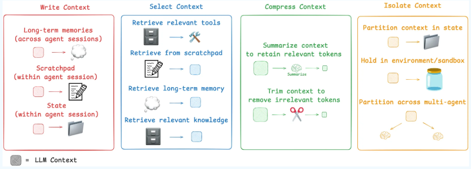

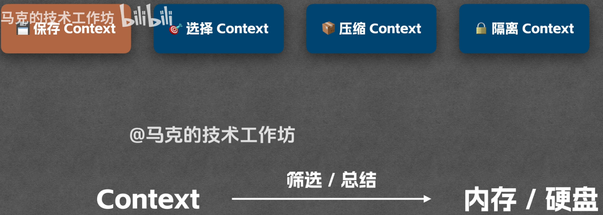

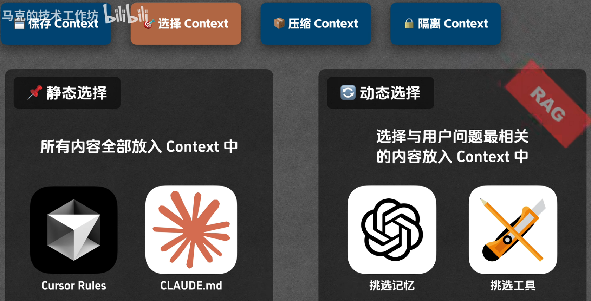

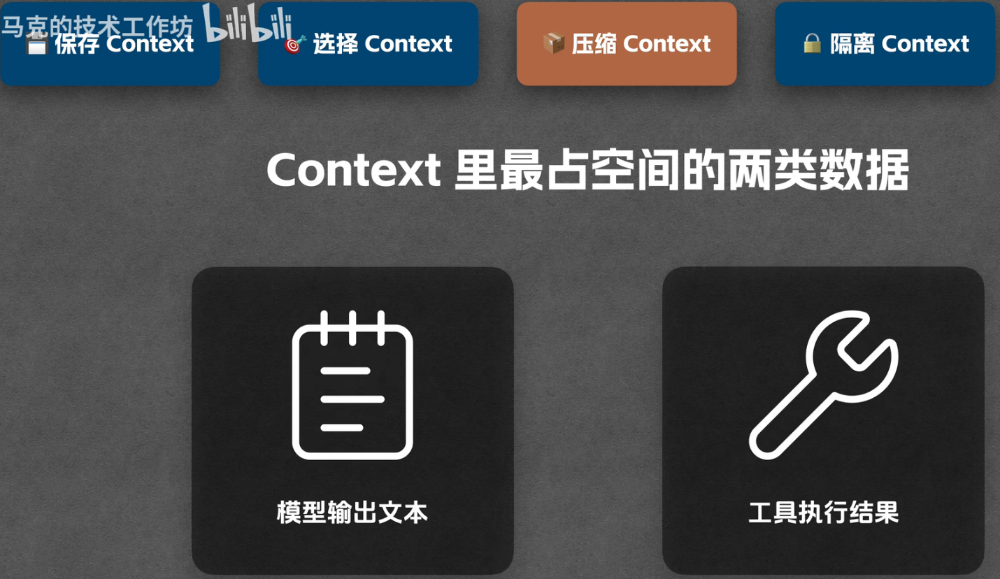

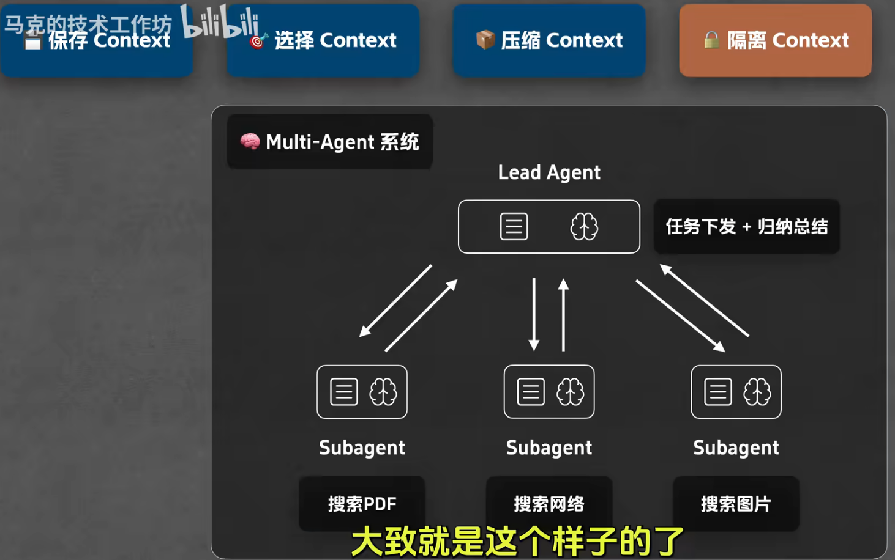


## 4、说说reward hacking 的表现是什么？怎么缓解？


## 5、Claude Code 源码分析


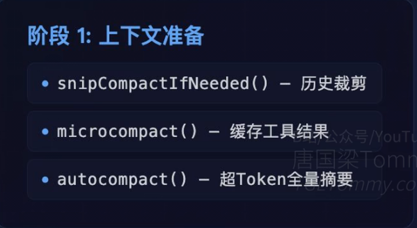

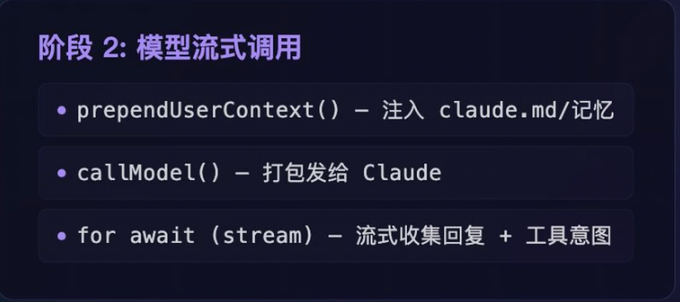

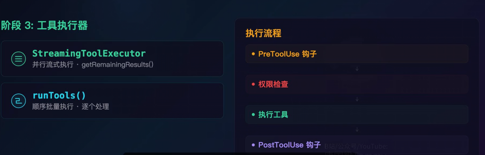

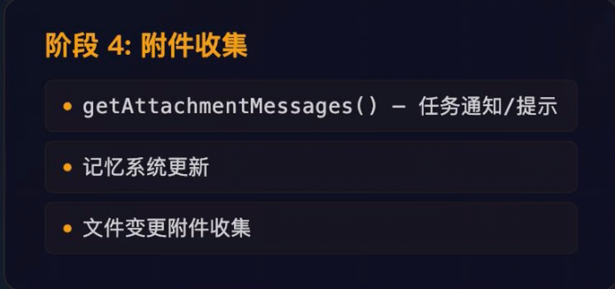

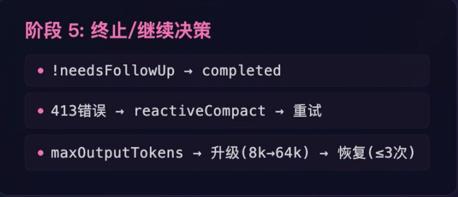

缓存

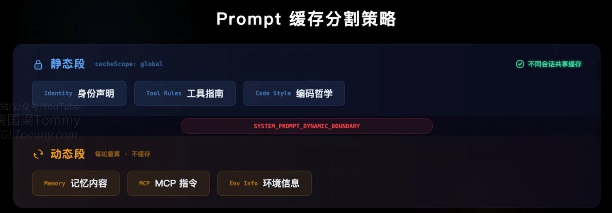

## 上下文压缩

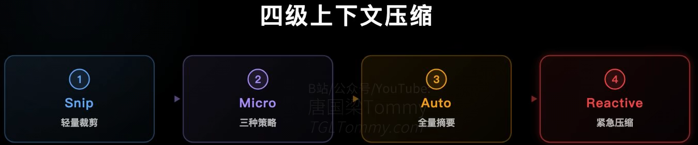


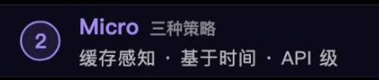

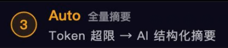

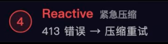

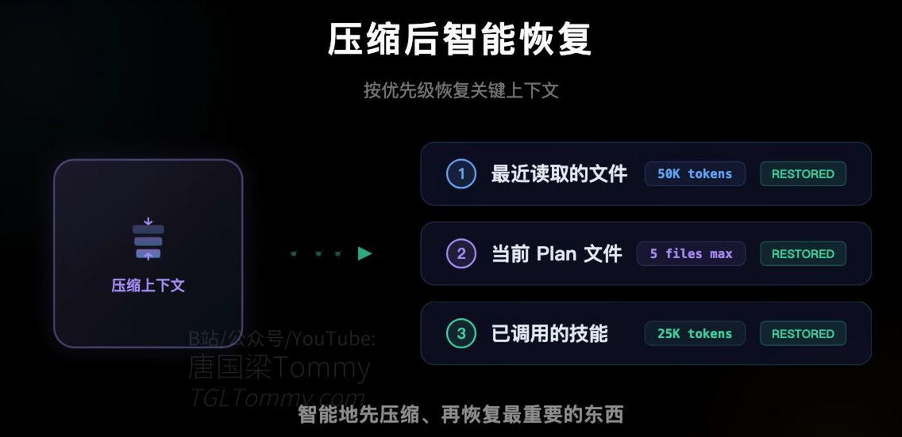
